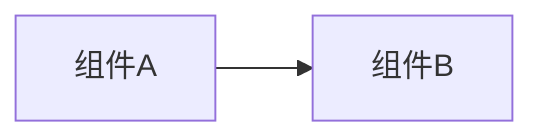

# K8s Code 教程章节写作规范（给章节作者）

> 写每一章前必读。目标是让所有章节读起来像同一个人写的。

## 结构模板

每章固定结构（从上到下）：

1. **标题**：`# NN 章节主题`（不带副标题噱头）
2. **页眉引用块**：
   ```
   > 属于 K8s Code 教程 · 第 NN 篇
   > 上一篇：[NN-1 标题](./NN-1-标题)　下一篇：[NN+1 标题](./NN+1-标题)
   ```
   （首页/末章按实际调整；用 `./文件名` 相对链接，文件名与创建的文件一致）
3. **开头引入**：1-2 段口语化说明"这一章解决什么问题"，尽量用比喻（如"临时工""总机""监工"），延续仓库 S7 文档风格。
4. **正文小节**：`## 1. xxx` 起，用代码块、表格、mermaid 图穿插。
5. **每章至少 1 个 mermaid 图**（流程/结构/状态图均可），语法：

````markdown

````

6. **练习小节**：`## 练习`——给 1-3 道动手题，写明代码位置（`code/k8s/...`）与运行命令（`go test` / `kubectl apply` / `go run`）。
7. **面试追问**：`## 面试追问`——3-5 个问题，每题带 1-2 句答案要点（模仿 S7 面试题集的三层追问风格）。
8. **串起来**：`## 串起来`——1 段总结本章 + 预告下一章。

## 语言与风格

- 全中文，口语化但专业；用"你"称呼读者。
- 比喻优先：Pod=临时工/合租房，Service=前台总机，Ingress=前台接待，Controller=监工，etcd=账本，kubelet=驻场管家。
- 代码注释用中文。
- 命令给完整可复制版本，注释说明预期输出。
- 涉及概念时与仓库现有文档互链（`/后端技术栈强化/07-k8s/架构与核心对象` 等），不重复讲原理。

## 引用代码的路径约定

所有代码路径以仓库根为基准写：`code/k8s/manifests/02_pod/xxx.yaml`、`code/k8s/client/01_connect`、`code/k8s/controller/counter-controller`、`code/k8s/operator`、`code/k8s/scheduler-demo`。文档里用行内代码（backtick）标路径。

## 长度

正文 200-450 行 markdown 为佳，最多不超过 600 行。信息密度优先，不注水。
