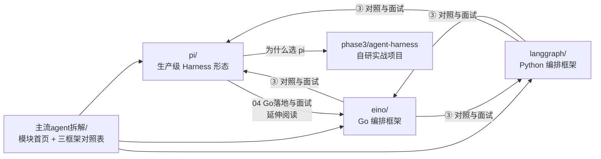

# 主流 Agent 拆解模块 Plan

## 架构概览

本模块是**纯文档模块**，无代码组件。架构 = 信息架构 + 站点配置。三个组成部分：

1. **新模块目录** `docs/主流agent拆解/`：模块首页 + 三个框架子目录（pi / eino / langgraph），每个框架一组拆解文档
2. **站点配置** `docs/.vitepress/config.mts`：顶部导航新增入口、新模块侧边栏、移除 phase3 中的 pi 条目
3. **存量内容迁移**：`docs/phase3/pi-harness/` 5 篇文档原样迁入（仅修链接），`docs/phase3/index.md` 移除 pi 条目

## 核心「数据结构」= 每篇文档的统一模板

### 拆解文档模板（F6，Eino/LangGraph 每篇强制遵循）

```markdown
# [标题]

> 这篇讲什么（1-2 句）。读完你能回答：[问题 1]？[问题 2]？[问题 3]？

## 正文小节（每个核心概念一节，统一三段式）
### N. [概念名]
**没有它会怎样**：（问题先行：没有这个机制，系统会出什么问题）
**方案**：（框架怎么解决的，核心思想一句话 + 展开）
**图解/示例**：（mermaid 图 或 ≤15 行最小代码片段）
**一句话记住**：（加粗的一句口诀）

---
## 速记卡
（表格或列表，30 秒复习完本篇）
```

### 模块首页结构（`主流agent拆解/index.md`）

1. 模块定位：为什么拆这三个框架（一个生产级 Harness + 一个 Go 编排框架 + 一个 Python 编排框架，正好覆盖「产品形态 / Go 落地 / 业界主流」三个视角）
2. 三框架横向对照表：语言、定位、编排范式、状态管理、持久化、流式、扩展机制、适用场景
3. 导航卡片：每个框架列出篇目 + 面试价值
4. 推荐阅读顺序：pi（建立 Harness 全景）→ Eino（Go 落地）→ LangGraph（业界对照）；或按面试准备时间给出快路径

## 模块设计

### ① pi 拆解（迁移，正文零重写）

**职责：** 生产级 Agent Harness 的完整落地形态样本
**文件：** `主流agent拆解/pi/` 下 5 篇，文件名保持原样

| 原路径 | 新路径 | 改动 |
|--------|--------|------|
| `phase3/pi-harness/index.md` | `主流agent拆解/pi/index.md` | 修内部链接（4 处篇目导航）；「为什么选 pi」表格中对 agent-harness 的引用保持不变 |
| `phase3/pi-harness/核心机制.md` | `主流agent拆解/pi/核心机制.md` | 若有 `/phase3/pi-harness/` 自引用则替换 |
| `phase3/pi-harness/LLM抽象层.md` | 同上 | 同上 |
| `phase3/pi-harness/工程化落地.md` | 同上 | 同上 |
| `phase3/pi-harness/Go落地与面试.md` | 同上 | 同上；文末可顺链到 Eino 拆解（新增一行「延伸阅读」） |

**依赖：** 无（最先做）

### ② Eino 拆解（新增 3 篇）

**职责：** 讲透 CloudWeGo Eino 的核心概念——Go 语言 LLM 应用编排框架，与目标岗位技术栈直接匹配
**文件：**

| 文件 | 内容要点 |
|------|---------|
| `主流agent拆解/eino/index.md`（① 全景图） | Eino 是什么、解决什么问题（Go 生态缺统一 LLM 编排抽象）；核心概念一张图：Component（ChatModel/Tool/Retriever…）→ Chain/Graph（编排）→ Callbacks（横切）；与「手写 goroutine+channel」对比的价值；快速上手 15 行代码 |
| `主流agent拆解/eino/核心机制.md`（②） | 四个机制，每个按模板三段式：1) Component 抽象与类型安全（问题：多模型多工具怎么统一接口）2) Graph 编排与状态流转（问题：分支/循环/并行怎么表达；StateGraph + AddNode/AddEdge/AddBranch）3) 流式处理四大范式（问题：一个节点流式、下游非流式怎么办；Stream/Collect/Transform/Concat 自动转换）4) Callbacks 横切（问题：日志/埋点/trace 怎么不侵入业务；OnStart/OnEnd/OnError 时机注入）+ ReAct Agent 怎么由上述积木拼出 |
| `主流agent拆解/eino/对照与面试.md`（③） | Eino vs pi vs LangGraph 对照表；Eino 与字节技术栈关联（CloudWeGo 生态：Kitex/Hertz）；面试速答 5-8 条（「Eino 的 Graph 和 LangGraph 的图有什么区别」「流式自动转换怎么实现的」）；速记卡 |

**事实核实清单（动笔前 web_search 确认）：** compose 包 API（NewStateGraph/AddChatModelNode 等签名）、流式转换机制官方表述、eino-ext 生态现状、当前主版本号

### ③ LangGraph 拆解（新增 3 篇）

**职责：** 讲透 LangGraph 核心概念——Python 生态最主流 Agent 编排框架，面试高频对照对象
**文件：**

| 文件 | 内容要点 |
|------|---------|
| `主流agent拆解/langgraph/index.md`（① 全景图） | LangGraph 是什么、与 LangChain 的关系（Expression Language 的局限 → 图）；核心概念一张图：StateGraph / Node / Edge / START·END / Reducer / Checkpointer；15 行最小 Agent 示例 |
| `主流agent拆解/langgraph/核心机制.md`（②） | 四个机制：1) 图模型与 Pregel 执行（问题：agent 需要循环，DAG 不够；Super-step 怎么跑）2) State 与 Reducer（问题：多节点并行写同一字段怎么办；add_messages 为什么这样设计）3) Checkpointer 持久化与断点续跑（问题：崩溃恢复/会话记忆；thread_id + checkpoint）4) Interrupt 与人机协作（问题：危险操作要人工确认；interrupt → resume） |
| `主流agent拆解/langgraph/对照与面试.md`（③） | LangGraph vs Eino vs pi 对照表；「用 Go 思维理解 LangGraph」（Pregel super-step ≈ 轮次调度、Reducer ≈ 合并策略、Checkpointer ≈ event-sourcing）；面试速答 5-8 条；速记卡 |

**事实核实清单：** StateGraph API（add_node/add_edge/add_conditional_edges/compile）、Pregel 执行模型官方描述、checkpointer 生态（MemorySaver/SqliteSaver/PostgresSaver）、interrupt API 现状

### ④ 站点配置与链接治理

**职责：** 导航/侧边栏/索引页的一致性
**改动点：**

1. `config.mts` nav：「项目实战」下拉移除 `pi 开源 Harness 拆解`；新增顶级项：
   ```
   { text: '主流 Agent 拆解', items: [
     { text: '拆解总览', link: '/主流agent拆解/' },
     { text: 'pi · 开源 Agent Harness', link: '/主流agent拆解/pi/' },
     { text: 'Eino · Go 编排框架', link: '/主流agent拆解/eino/' },
     { text: 'LangGraph · Python 编排框架', link: '/主流agent拆解/langgraph/' }
   ]}
   ```
2. `config.mts` sidebar：删除 `'/phase3/pi-harness/'` 分组；新增 `'/主流agent拆解/'` 分组（三个框架各一个 collapsed 分组 + 底部「相关」组链接 phase3 实战项目）；`'/phase3/agent-harness/'` 与 `'/phase3/docs-rag/'` 分组的「相关」列表中如有 pi 链接则更新
3. `phase3/index.md`：移除 pi 拆解条目，文末加一行指向新模块
4. `路线专题/04-简历项目改造与面试实战.md`：纯文本提及 pi-harness（3 处，无链接），将措辞更新为「主流 Agent 拆解 · pi」保持指引有效
5. 全站 grep 兜底：`grep -rn "phase3/pi-harness"` 必须为空

## 模块交互（内容层面的交叉引用网）



交叉引用集中在各框架的「对照与面试」篇和模块首页，正文篇保持自洽可独立阅读（无负担：不按顺序读也能懂）。

## 文件组织

```
docs/
├── 主流agent拆解/                    # 新建
│   ├── index.md                     # 模块首页：定位 + 对照表 + 导航 + 阅读顺序
│   ├── pi/                          # 迁移自 phase3/pi-harness/
│   │   ├── index.md                 #   项目全景（修链接）
│   │   ├── 核心机制.md              #   01 Agent Loop
│   │   ├── LLM抽象层.md             #   02
│   │   ├── 工程化落地.md            #   03
│   │   └── Go落地与面试.md          #   04（末尾加 Eino 延伸阅读）
│   ├── eino/                        # 新增
│   │   ├── index.md                 #   ① 全景图
│   │   ├── 核心机制.md              #   ② 四大机制
│   │   └── 对照与面试.md            #   ③ 对照 + 面试速答 + 速记卡
│   └── langgraph/                   # 新增
│       ├── index.md                 #   ① 全景图
│       ├── 核心机制.md              #   ② 四大机制
│       └── 对照与面试.md            #   ③ 对照 + 面试速答 + 速记卡
├── phase3/
│   ├── index.md                     # 修改：移除 pi 条目
│   └── pi-harness/                  # 删除（整体迁走）
└── .vitepress/config.mts            # 修改：nav + sidebar
```

## 技术决策

| 决策点 | 选择 | 理由 |
|--------|------|------|
| 顶层目录命名 | `主流agent拆解`（中文） | 与 `路线专题`、`导师学习路径` 等现有顶层中文目录一致；URL 可读性好 |
| 框架子目录 | 英文小写 `pi/` `eino/` `langgraph/` | URL 稳定、输入方便；篇名保留中文与现站风格一致 |
| pi 迁移方式 | `git mv` 保留历史 | 正文零重写是 spec 约束，保留 git 历史便于追溯 |
| 篇数结构 | pi 5 篇不动；Eino/LangGraph 各 3 篇 | 已批准的 spec 决策（精简三篇制）；pi 已存在且质量达标，重写违反 YAGNI |
| Eino/LangGraph 篇内结构 | 每个概念「问题→方案→图解→一句话记住」 | 「吃透核心概念」的关键：先理解为什么存在，再看怎么做 |
| 事实准确性保障 | 动笔前对两框架各做一次 web_search 核实 API 与术语 | Eino v0.x API 迭代快、LangGraph interrupt API 近年有变更，凭记忆写易出错（N3） |
| 旧路径处理 | 不做重定向，靠全站链接清理 + 构建死链校验 | VitePress 静态站无原生 redirect；AC2/AC5 已覆盖无死链验证 |
| 写作顺序 | pi 迁移先行，Eino 次之，LangGraph 最后 | Eino 与 Go/岗位最相关优先完成；LangGraph 的对照篇可引用已完成的 Eino 篇 |
