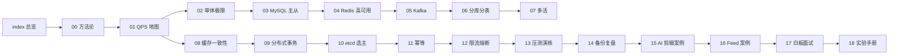

# 架构师修炼栏目 Plan

> 依据：`spec.md`。本文档定义栏目结构、篇章依赖、代码层与站点集成方式。

## 架构概览

栏目 = **文档层（docs/架构师修炼/）+ 代码层（code/architect/）+ 站点集成（config.mts / index.md）**。

```
docs/架构师修炼/
├── index.md                                 # 栏目总览：A1~A5 能力阶梯、六道坎、学习地图、里程碑 M1~M6
├── 00-架构师思维与设计方法论.md              # A 方法论：五步法 / 估算公式 / 选型矩阵 / 白板模板
├── 01-QPS分级与架构演进地图.md               # A 方法论：六道坎 + 跨量级做法总表 + 触发指标 + 数据分级
├── 02-单体架构的极限与分层.md                # B 坎0→1：四个天花板 / Go 优化 / 压测拐点
├── 03-MySQL主从与读写分离落地.md             # B 坎1→2：binlog+GTID+半同步 / 延迟治理 / 读路由
├── 04-Redis高可用与缓存体系落地.md           # B 坎2→3：PSYNC / 哨兵 vs Cluster / 缓存体系
├── 05-Kafka削峰与可靠投递落地.md             # B 坎3：acks+ISR / rebalance / 积压
├── 06-分库分表与在线迁移双写.md              # B 坎3→4：分片键 / 全局 ID / 迁移六步法
├── 07-多活容灾与全球化架构.md                # B 坎4→5：单元化 / 冲突合并 / RTO-RPO / 成本
├── 08-缓存与DB一致性落地.md                  # C 一致性：Cache Aside 各变体的失败窗口
├── 09-分布式事务与最终一致落地.md            # C 一致性：2PC/TCC/Saga/本地消息表选型
├── 10-etcd与Raft选主租约落地.md              # C 一致性：Lease/Watch/Txn + fencing 防双写
├── 11-幂等去重与ExactlyOnce.md               # C 一致性：至少一次 + 消费幂等 + 对账
├── 12-限流熔断降级与背压.md                  # D 稳定性：算法 / 自适应 / 熔断 / 背压
├── 13-容量规划压测与故障演练.md              # D 稳定性：容量水位 / 全链路压测 / Chaos 剧本
├── 14-备份恢复与故障复盘.md                  # D 稳定性：RPO-RTO / SLO / 复盘模板
├── 15-案例-AI剪辑任务平台架构.md             # E 实战：贴合目标岗位（GPU 排队 / 回调风暴 / 成本）
├── 16-案例-Feed与社区互动架构.md             # E 实战：推拉结合 / 计数 / 热点
├── 17-面试-白板架构设计与追问链.md           # E 实战：7 步答题 + 6 道题 + 10 类追问模板
├── 18-实验手册-Go落地实验.md                 # E 实战：15 个可复现实验 + 简历写法
└── _meta/                                   # spec/plan/task/checklist（不参与导航）
```

```
code/architect/
├── docker-compose.yml               # MySQL 主从 / Redis 主从+哨兵 / etcd 三节点 / Kafka（+cluster profile）
├── conf/mysql/master.cnf            # GTID + ROW + 半同步 + sync_binlog=1
├── conf/mysql/replica.cnf           # 并行复制 LOGICAL_CLOCK + super_read_only
├── conf/mysql/master-init.sql       # repl 账号 + account/big_table/迁移库
├── conf/redis/sentinel.conf         # 哨兵模板（__PORT__ 占位）
├── scripts/init-replication.sh      # GTID 自动定位建立主从
└── README.md                        # 端口表 / 配置要点 / 故障注入速查 / 记录模板
```

## 篇章依赖关系



- **A → B**：先有量级坐标系，才知道每一步该不该做。
- **B → C**：演进过程中引入的每个组件都带来一致性缺口，C 集中回答「缺口怎么兜」。
- **C → D**：兜底手段需要稳定性工程承接（限流保护、演练、复盘）。
- **D → E**：案例与面试收口，实验手册提供"做过"的证据。

## 关键技术决策

| 决策 | 选择 | 理由 |
|------|------|------|
| 栏目命名 | `架构师修炼` | 与「后端技术栈强化」并列，突出能力培养而非组件罗列 |
| 主线组织方式 | **QPS 六道坎**（<100 / 1k / 1w / 10w / 100w / 1000w） | 直接回应用户「不同 QPS 下架构设计不同」的诉求，且可量化（每坎给触发指标） |
| 一致性章节的组织 | 按**组件维度**拆 4 篇（缓存/事务/选主/幂等），而非按理论维度 | 用户诉求是"真实场景怎么处理"，组件维度更贴近面试追问 |
| 每篇必备「故障与一致性边界」 | 强制 | 这是「背过」与「做过」的分水岭，也是 A5 级的验收点 |
| 实验环境 | 独立 `code/architect/` 而非复用 `code/backend/` | backend 编排是单实例（无主从、无哨兵、无 etcd 集群），无法复现主从/切换类现象；独立编排避免破坏既有实验 |
| MySQL 半同步插件 | cnf 里 `plugin-load-add` 并在 README 给 SQL 兜底 | 8.0 镜像插件名与 8.4 不同，需给出降级路径 |
| 站点集成 | 新增 nav 项 + 独立 sidebar | 19 篇体量足够独立成栏，不挤占「后端技术栈强化」侧边栏 |
| 既有文件改动 | 仅追加（`后端技术栈强化/index.md` 入口与 backlog、`docs/index.md` 卡片与顺序、根 README 一行） | 满足 N3 不破坏既有站点 |

## 风险与对策

| 风险 | 对策 |
|------|------|
| 与 S1/S2/S3/S8 内容重复 | 写作规范强制「原理只链接」，每篇开头声明「原理见 XX」 |
| 篇章过多导致维护成本 | 统一模板 + 统一导航块 + `_meta` 记录设计意图 |
| 参数失真（版本差异） | 参数均标注组件与版本语境（MySQL 8.0 / Redis 7 / Kafka 3.7 / etcd 3.5），并给「验证方式」 |
| 编排在本机拉镜像慢 | README 给出「只起需要的服务」的最小命令 |
