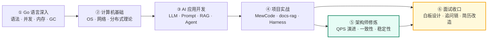

<div align="center">


# GoCampus

**从 Go 语言深入到 AI Agent 落地，再到分布式架构设计的一站式学习工程**

按「阶段计划 → 原理详解 → 可运行代码 → 动手实验 → 面试实战」闭环组织，<br />
261 篇文档 · 114 道带测试的练习 · 12 个内容栏目 · 一套可跑的中间件实验环境。

[](docs/index.md)
[](code/README.md)
[](code/README.md)
[](code/go.mod)
[](package.json)
[](docs/.vitepress/config.mts)

[文档站首页](docs/index.md) · [学习计划](docs/学习计划安排/总体规划.md) · [架构师修炼](docs/架构师修炼/index.md) · [项目实战](docs/phase3/index.md) · [代码练习](docs/练习指南.md)

</div>

---

## 这是什么

一个**有明确靶心**的学习仓库：目标是拿到 **Agent 开发实习生（AI 剪辑）· 剪映 CapCut** 的 offer，主线语言是 **Go**。

它和「收藏夹里的教程合集」有三点不同：

| | 一般教程仓库 | GoCampus |
| --- | --- | --- |
| **知识从哪来** | 零散文章堆叠 | 按 **阶段 → 栏目 → 篇章** 三级组织，每篇都有前置/产出/验收动作 |
| **怎么验证学会** | 读完就算 | 每篇配 **可运行的练习或实验**（`go test` 判定 / Docker 编排实操） |
| **离面试多远** | 差一层 | 每篇都有 **面试追问链 + 自测清单**，并单独有[白板架构面试实战](docs/架构师修炼/17-面试-白板架构设计与追问链.md)与[模拟面试脚本](docs/架构师修炼/17-面试-白板架构设计与追问链.md) |

---

## 内容地图

| 栏目 | 规模 | 解决什么问题 | 入口 |
| --- | --- | --- | --- |
| 🧭 **学习计划安排** | 4 篇 | 时间怎么排、每阶段学到什么程度 | [总体规划](docs/学习计划安排/总体规划.md) |
| 🐹 **第一阶段 · Go 语言深入** | 10 篇 | Slice/Map/Interface/String 内存布局、函数调用栈、内存分配、GC、GMP、并发、Context | [知识点总览](docs/第一阶段-知识点详解.md) |
| 🧱 **第二阶段 · 计算机基础** | 3 篇 | 操作系统、计算机网络、分布式系统面试详解 | [分布式系统](docs/第二阶段-知识详解/分布式系统面试详解.md) |
| 🏗️ **后端技术栈强化** | 61 篇 | S1 MySQL → S2 Redis → S3 Kafka → S4 微服务 → S5 高并发场景 → S6 Agent Backend → S7 K8s → S8 分布式 → S9 对象存储 → S10 Milvus | [模块总览](docs/后端技术栈强化/index.md) |
| 🏛️ **架构师修炼** ⭐ | 20 篇 | **QPS 六道坎驱动的架构演进**：不同量级下 Redis/MySQL/Kafka/etcd 的落地参数、一致性设计、故障兜底 + 15 个可复现实验 | [栏目总览](docs/架构师修炼/index.md) |
| ☸️ **K8s Code 教程** | 15 篇 | 从「会用 kubectl」到「能手写 Controller / Operator」，配 client-go 实战代码 | [教程首页](docs/k8s-code教程/index.md) |
| 🧠 **导师学习路径** | 11 篇 | RAG → Prompt → Function Calling/MCP → ReAct → Multi-Agent → 记忆评测 → Diffusion/推理优化/微调 | [总览](docs/导师学习路径/index.md) |
| 🧩 **主流 Agent 拆解** | 12 篇 | 拆 pi / Eino / LangGraph 的架构、核心机制与可借鉴设计 | [拆解总览](docs/主流agent拆解/index.md) |
| 🚀 **项目实战** | 32 篇 | MewCode 终端 Agent、RAG 文档问答、AI Agent Harness | [第三阶段总览](docs/phase3/index.md) |
| 🎯 **路线专题** | 5 篇 | 30 天冲刺：算法、后端基础、大模型与 Agent、简历与面试 | [专题总览](docs/路线专题/index.md) |
| 🧪 **习题集和答案** | 75 页 | 由代码练习自动生成（`npm run docs:sync-exercises`），文档与代码永不脱节 | [习题集](docs/习题集和答案/index.md) |
| ⭐ **代码练习指南** | — | 做题流程、判题脚本、练习与文档的对应关系 | [练习指南](docs/练习指南.md) |

> 全部文档共约 **6.7 万行 Markdown**，含 **322 张 mermaid 流程图**与 **1000+ 张对照表**；文档站支持本地全文搜索、暗色模式、图片放大与评论。

---

## 学习主线



| 阶段 | 主题 | 目标 | 配套代码 |
| --- | --- | --- | --- |
| 一 | Go 语言深入 | 语法精通、并发模型、标准库与工程化 | `code/phase1/`（34 道） |
| 二 | 计算机基础强化 | 数据结构与算法、操作系统、网络 | `code/phase2/`（25 道） |
| 三 | AI 应用开发基础 | LLM API、Prompt 工程、RAG、Agent 架构 | `code/phase3/` |
| 四 | 后端技术栈强化 | MySQL/Redis/Kafka/微服务/K8s/Milvus | `code/backend/`（39 道，需 Docker） |
| 五 | **架构师修炼** | 从单体到百万 QPS 的演进决策与故障兜底 | [`code/architect/`](code/architect/README.md)（可跑中间件集群） |
| 加分 | K8s 编程 | client-go、Informer、手写控制器与 CRD/Operator | `code/k8s/`（5 道，可选 minikube） |

---

## 仓库结构

```
GoCampus/
├── docs/                          # VitePress 文档站（261 篇）
│   ├── 学习计划安排/               # 四阶段总体规划与周计划
│   ├── 第一阶段-知识详解/           # Go 底层原理（含内存布局、GC、GMP）
│   ├── 第二阶段-知识详解/           # OS / 网络 / 分布式
│   ├── 后端技术栈强化/              # S1~S10 组件原理与面试题集
│   ├── 架构师修炼/ ⭐               # 架构演进 · 一致性 · 稳定性 · 案例 · 实验
│   ├── k8s-code教程/               # K8s 编程教程（YAML → client-go → Operator）
│   ├── 导师学习路径/                # RAG / Agent / 多模态 知识地图
│   ├── 主流agent拆解/               # pi · Eino · LangGraph 源码级拆解
│   ├── phase3/                     # 项目实战文档
│   ├── 路线专题/                    # 30 天冲刺路线
│   ├── 习题集和答案/                # 自动生成，与代码同步
│   ├── .vitepress/                 # 站点配置、mermaid、主题与本地搜索
│   └── index.md                    # 首页
├── code/                          # 全部代码（644 个 Go 文件 / 194 个测试）
│   ├── phase1/  phase2/  phase3/   # 三阶段练习
│   ├── route/                      # 路线专题实战代码
│   ├── backend/                    # 后端技术栈实验（docker-compose 起中间件）
│   ├── architect/ ⭐                # 架构实验环境（MySQL 主从 / Redis 哨兵 / etcd 集群 / Kafka）
│   ├── k8s/                        # K8s manifests + client-go 代码
│   └── scripts/judge.sh            # 一键判题（统计通过率）
├── projects/                      # 独立实战项目（EasyCoding、docs-rag）
├── scripts/                       # 文档生成脚本（练习 → 文档）
└── package.json                   # 文档站构建/开发脚本
```

---

## 快速开始

### ① 读文档（VitePress 站点）

```bash
npm install
npm run docs:dev        # http://127.0.0.1:5173
npm run docs:build      # 产出静态站点到 docs/.vitepress/dist
```

### ② 做练习（Go，逐题判定）

```bash
cd code
go test ./...                       # 跑全部练习
cd phase1/01_slice/01_deep_copy     # 单题：读 README → 补 solution.go → 验证
go test -v
bash scripts/judge.sh               # 统计整体完成情况
```

### ③ 起中间件做后端实验（MySQL / Redis / Kafka / MinIO）

```bash
cd code/backend
docker compose up -d                # 起中间件
go test ./...                       # 依赖中间件的实验（如 02-redis、03-kafka）
```

### ④ 跑架构师实验环境（主从 / 哨兵 / etcd 集群）

```bash
cd code/architect
docker compose up -d                # MySQL 主从 · Redis 主从+三哨兵 · etcd 三节点 · Kafka
bash scripts/init-replication.sh    # 一键建立 GTID 主从复制
docker kill -s KILL arch-mysql-master   # 亲手制造主库宕机，观察丢数据窗口
```

> 实验清单与预期现象见 [18 实验手册：Go 落地实验](docs/架构师修炼/18-实验手册-Go落地实验.md)；故障注入速查见 [`code/architect/README.md`](code/architect/README.md)。

---

## 代码练习体系

每道练习都是**同一套结构**，读完文档立刻能验证：

```
NN_topic/
├── README.md          题目 · 考点 · 难度 · 环境准备 · 提示
├── solution.go        待填空（panic("not implemented")）
├── solution_test.go   测试用例
└── answer/answer.go   参考答案
```

| 模块 | 练习数 | 依赖 |
| --- | --- | --- |
| `phase1` Go 语言深入 | 34 | 无 |
| `phase2` 数据结构与算法 | 25 | 无 |
| `route` 路线专题实战 | 11 | 部分需中间件 |
| `backend` 后端技术栈 | 39 | Docker（MySQL/Redis/Kafka/MinIO/Milvus） |
| `k8s` Kubernetes 编程 | 5 | 纯 Go 模拟，可选 minikube |

练习完成后执行 `bash scripts/judge.sh` 得到通过率；`npm run docs:sync-exercises` 会把练习自动同步成站点里的习题页（75 页），**保证文档与代码永不脱节**。

---

## 重点栏目

<details open>
<summary><b>🏛️ 架构师修炼 —— 从单体到百万 QPS（本仓库最硬核的栏目）</b></summary>

不教「组件是什么」（那是[后端技术栈强化](docs/后端技术栈强化/index.md)的活），只练**架构判断力**：

- **能力阶梯 A1→A5**：会用 → 懂原理 → **会算量** → **会选型** → **会演进与兜底**，每级有可验证行为与里程碑 M1~M6。
- **六道坎坐标系**：`<100 / 1k / 1w / 10w / 100w / 1000w` QPS 各自的瓶颈、架构形态、触发指标与成本；附「同一件事在六个量级下的做法」总表。
- **真实落地参数**：MySQL 半同步的超时静默降级、Redis `min-replicas-to-write` 防丢写、Kafka `acks=all` + `min.insync.replicas`、etcd Lease + **fencing token 防双写**。
- **一致性专题**：缓存与 DB 一致性的失败窗口、分布式事务选型矩阵、幂等与 Exactly-Once 的真实边界。
- **每个组件都有「故障与一致性边界」表**：挂了 → 现象 → 降级 → **丢数据的窗口在哪** → 靠对账如何发现。
- **15 个可复现实验**：[实验手册](docs/架构师修炼/18-实验手册-Go落地实验.md) + [`code/architect/`](code/architect/README.md)，亲手制造主从延迟、哨兵丢写、缓存雪崩打挂 DB、Kafka 丢消息与重复消费、etcd 假死双写、不停机迁移校验。

推荐顺序：[00 方法论](docs/架构师修炼/00-架构师思维与设计方法论.md) → [01 QPS 地图](docs/架构师修炼/01-QPS分级与架构演进地图.md) → 演进六阶段（02~07）→ 一致性（08~11）→ 稳定性（12~14）→ 案例（15~16）→ [17 白板面试](docs/架构师修炼/17-面试-白板架构设计与追问链.md) → [18 实验](docs/架构师修炼/18-实验手册-Go落地实验.md)。

</details>

<details>
<summary><b>☸️ K8s Code 教程 —— 从「会用 K8s」到「能写 K8s」</b></summary>

环境 → 核心对象 YAML → client-go CRUD/Watch → Informer 与 Workqueue → **手写 Controller** → CRD/Operator → 调度器/网络/存储深入 → 排障 → 面试题集。配套 `code/k8s/` 可运行代码，可直接对着本机 minikube 实操。

入口：[教程首页](docs/k8s-code教程/index.md)
</details>

<details>
<summary><b>🧩 主流 Agent 拆解 —— 看别人怎么做工程</b></summary>

对 **pi**（开源 Agent Harness）、**Eino**（Go 编排框架）、**LangGraph**（Python 编排框架）做「全景图 → 核心机制 → 对照与面试」三段式拆解，提炼可迁移的架构决策。

入口：[拆解总览](docs/主流agent拆解/index.md)
</details>

<details>
<summary><b>🧠 导师学习路径 —— RAG 与 Agent 知识地图</b></summary>

把原始提纲提炼为 10 章：RAG 原理 → Prompt 工程 → Function Calling/MCP → ReAct → Multi-Agent → 记忆与评测 → 文生视频与 Diffusion → LLM 推理优化 → 训练与微调 → 技术栈速通。每章含知识点提炼、mermaid 流程图、带答案的面试问答与自测清单。

入口：[总览与章节安排](docs/导师学习路径/index.md)
</details>

---

## 技术栈与工程化

| 层 | 选型 |
| --- | --- |
| 文档站 | VitePress 1.6 + `vitepress-plugin-mermaid` + 本地全文搜索 + 暗色模式 |
| 主题增强 | Artalk 评论（环境变量注入，未配置自动关闭）、Viewer.js 图片放大 |
| 内容规范 | 中文正文 + mermaid 流程图 + 对照表 + 「面试追问链 / 自测清单」收口 |
| 代码 | Go 1.22 / 1.25（分模块 `go.mod`），标准库优先，实验代码贴近真实 SDK |
| 实验环境 | Docker Compose（MySQL / Redis / Kafka / MinIO / Milvus / etcd） |
| 自动化 | `docs:sync-exercises` 练习→文档同步、`scripts/judge.sh` 判题、`docs:build` 死链校验 |

---

## 路线图

- [x] 三阶段学习计划与 Go 底层原理详解
- [x] 后端技术栈强化 S1~S10（含面试题集与配套实验）
- [x] K8s Code 编程教程（含 client-go / Controller / Operator）
- [x] 路由专题 30 天冲刺与简历/面试实战
- [x] **架构师修炼栏目**：QPS 演进地图 + 一致性专题 + 稳定性工程 + 案例 + 15 个实验 + `code/architect/` 实验环境
- [ ] 架构实验环境端到端实测：把 15 个实验的实测数字（丢数据条数、切换耗时、拐点 QPS）回填进文档
- [ ] 分库分表迁移与分布式事务的完整可运行项目（从实验升级为项目）
- [ ] [02_map/04_blocking_map：阻塞 Map](https://github.com/Bin-hy/go-campus/tree/main/code/phase1/02_map/04_blocking_map)

---

## 写作与提交约定

- **文档**：中文；流程图一律用 mermaid；原理与「怎么落地」分开写，不重复堆砌。
- **新代码提交**：涉及练习答案时，**先提交 `solution.go` 骨架，随后将该文件加入忽略**（`skip-worktree` / `.gitignore`），避免个人答案污染仓库。
- **交叉引用**：栏目内用相对链接，跨栏目用站点绝对路径（构建时校验死链）。

---

<div align="center">

**持续学习，持续构建。**

本仓库为个人学习工程，内容用于知识梳理与面试准备。

</div>
