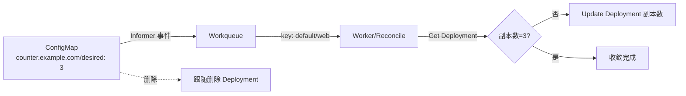

# 手写 Controller：counter-controller

> 本目录是教程第 09 章"手写 Controller 实战"的完整代码。它不是练习骨架，而是**可以直接运行的真实控制器**。

## 它做什么

监听 namespace 内**带注解 `counter.example.com/desired` 的 ConfigMap**，确保**同名 Deployment 的副本数**等于注解值：



## 架构（与 K8s 官方控制器一致）

| 组件 | 作用 | 代码位置 |
|------|------|---------|
| SharedInformer | 监听 ConfigMap，先 List 全量缓存再 Watch 增量 | `NewController` |
| Workqueue | 缓冲事件 key（`namespace/name`），去重 + 限速重试 | `workqueue.NewRateLimitingQueue` |
| Worker | 循环 `Get → Reconcile → Done`，失败 `AddRateLimited` | `runWorker` / `processNextItem` |
| Reconcile | 对比期望（注解值）vs 实际（Deployment 副本数），有差距就 Update | `reconcile` |

## 运行测试（无需集群）

```bash
cd code/k8s/controller/counter-controller
go test -v
```

测试用 fake clientset 覆盖 5 个场景：创建 Deployment / 收敛副本数 / 无注解忽略 / 跟随删除 / 非法注解报错。

## 真集群实操（核心体验）

```bash
cd code/k8s/controller/counter-controller

# 1. 终端 A：启动控制器
go run .

# 2. 终端 B：创建带注解的 ConfigMap
kubectl apply -f ../../manifests/09_controller/cm-web.yaml

# 3. 观察控制器自动创建 Deployment 并设副本数为 3
kubectl get deploy web -w

# 4. 改注解为 5，观察控制器把副本数收敛到 5
kubectl annotate cm web counter.example.com/desired=5 --overwrite
kubectl get deploy web -w

# 5. 删除 ConfigMap，观察控制器跟随删除 Deployment
kubectl delete cm web
kubectl get deploy web    # 应显示 NotFound
```

## 面试要点（读完能答追问）

1. **为什么事件回调只 `Add(key)` 而不直接干活？** 回调串行执行，直接干活会阻塞后续事件；用队列解耦后，同一个 key 的多次事件会去重。
2. **为什么 Reconcile 要幂等？** 同 key 可能被处理多次（重试、多 worker），reconcile 必须"结果一样"，所以每次都是"读现状 → 算差距 → 补差距"。
3. **`AddRateLimited` 和 `Add` 的区别？** 前者记录失败次数按指数退避重试，防雪崩。
4. **为什么创建/更新后不立即 requeue？** 本次动作完成后，下一次状态变化会再触发事件；informer 的 Watch 会兜底（除非事件丢失，此时靠 `WaitForCacheSync` + resync 保证最终一致）。
