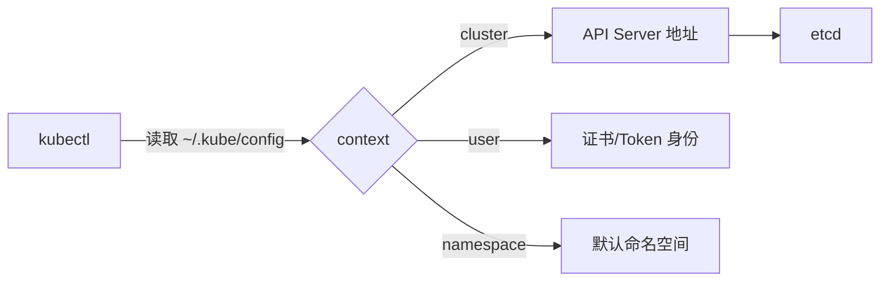
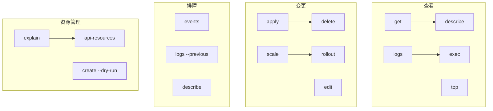

# 01 环境准备与 kubectl 速查

> 属于 K8s Code 教程 · 第一篇
> 下一篇：[02 Pod 与容器生命周期](./02-Pod与容器生命周期)

动手写 K8s 之前，先确认手里有把趁手的"瑞士军刀"：**kubectl 能连上集群、你能解释清楚自己在连谁**。这一篇的目标很朴素——跑完下面的命令，你对自己的集群状态了如指掌，并且掌握 kubectl 的"命令分类思维"（以后遇到不认识的资源，也能举一反三）。

## 1. 核对集群状态

本教程默认你用 **minikube 单节点集群**。三连检查：

```bash
# 1) 控制面可达
kubectl cluster-info
# 输出应包含 Kubernetes control plane is running at https://...

# 2) 节点 Ready
kubectl get nodes -o wide
# NAME       STATUS   ROLES           VERSION
# minikube   Ready    control-plane   v1.35.1

# 3) 控制面组件健康
kubectl get pods -n kube-system
# coredns / etcd / kube-apiserver / kube-controller-manager / kube-proxy / kube-scheduler 应全部 Running
```

看到 6 个控制面组件都 Running，你的"容器操作系统"就绪了。这 6 个组件是 K8s 的大脑，之前 S7 理论篇讲过：**API Server 是唯一入口，etcd 是账本，Scheduler 找机器，Controller Manager 是监工，kubelet 是驻场管家，kube-proxy 管流量**。

## 2. kubeconfig：你在以谁的身份说话

kubectl 通过 `~/.kube/config` 决定"连哪个集群、以什么身份"。看三件事：

```bash
kubectl config view            # 查看完整配置
kubectl config get-contexts    # 列出所有 context
kubectl config current-context # 当前用的是哪个
```



**context = cluster + user + namespace 的三元组**。为什么要有 context？因为你可能同时维护开发/测试/生产三个集群，context 就是"快捷切换"：`kubectl config use-context minikube`。每个 context 里还能预设默认 namespace，省得每条命令都加 `-n`。

::: danger 生产警示
`kubectl config current-context` 是排查"我到底在操作哪个集群"的第一命令。多集群环境下误操作生产集群是最高频事故，养成切换后立刻 `get nodes` 确认的习惯。
:::

## 3. kubectl 命令分类思维

kubectl 命令多，但按"用途"分只有五类，记住这个框架就抓住了主干：



| 类 | 命令 | 一句话 |
|----|------|--------|
| 查看 | `get` | 列表式看资源（`-o wide` 更多列，`-o yaml` 看完整定义） |
| 查看 | `describe` | 看单个资源的详细事件/状态（排障主力） |
| 查看 | `logs` / `exec` | 看日志 / 进容器执行命令 |
| 变更 | `apply` | 声明式应用（推荐，和 YAML 对齐） |
| 变更 | `delete` | 删除（`-f` 按文件，`-l` 按标签） |
| 变更 | `scale` / `rollout` | 扩缩容 / 发布管理 |
| 排障 | `get events` | 集群事件流（排障第一现场） |
| 元数据 | `explain` | 查某个字段的 schema（写 YAML 的字典） |

## 4. 高频命令速查

```bash
# ---- 查看 ----
kubectl get pods                          # 默认 namespace
kubectl get pods -n kube-system           # 指定 namespace
kubectl get pods -A                       # 所有 namespace
kubectl get pods -o wide                  # 加节点 IP 信息
kubectl get pods -l app=nginx             # 按标签过滤
kubectl get deploy,svc,cm,secret          # 一次看多种资源
kubectl describe pod <name>               # 详情 + 事件
kubectl logs <pod>                        # 日志
kubectl logs <pod> -c <container>         # 多容器 Pod 指定容器
kubectl logs <pod> --previous             # 上次崩溃的日志（排障神器）
kubectl exec -it <pod> -- sh              # 进容器

# ---- 变更 ----
kubectl apply -f xxx.yaml                 # 声明式应用
kubectl delete -f xxx.yaml                # 按文件删
kubectl delete pod <name> --force --grace-period=0   # 强删（慎用）
kubectl scale deploy/nginx --replicas=5   # 扩缩容
kubectl rollout status deploy/nginx       # 等发布完成
kubectl rollout undo deploy/nginx         # 回滚

# ---- 输出格式 ----
kubectl get pods -o jsonpath='{.items[*].metadata.name}'
kubectl get pods -o custom-columns=NAME:.metadata.name,IP:.status.podIP
```

## 5. 写 YAML 的字典：kubectl explain

不背字段，用 `explain` 现场查：

```bash
kubectl explain pod.spec.containers
kubectl explain pod.spec.containers.resources
kubectl explain deployment.spec.strategy
```

`explain` 会显示字段类型、是否必填、默认值——这就是你手写 YAML 的"字典"。配合 `kubectl create <resource> --dry-run=client -o yaml` 可以先让 kubectl 生成骨架再改。

## 6. 快速自检

1. `kubectl config current-context` 输出什么？为什么它很重要？
2. 为什么排障第一件事是 `kubectl get events` 而不是 `kubectl get pods`？
3. `kubectl explain pod.spec.containers.ports` 显示 containerPort 是必填吗？

---

## 串起来

这一篇你建立了三个习惯：**连之前先确认 context，看资源用 get，查细节用 describe/explain**。下一篇进入第一个要亲手写的对象——**Pod**：它是 K8s 的最小调度单位，探针、生命周期、initContainer 全都围绕它展开。先把 `kubectl get pods -A` 跑通，下一篇的 YAML 才有落点。

> 下一章：[02 Pod 与容器生命周期](./02-Pod与容器生命周期)
