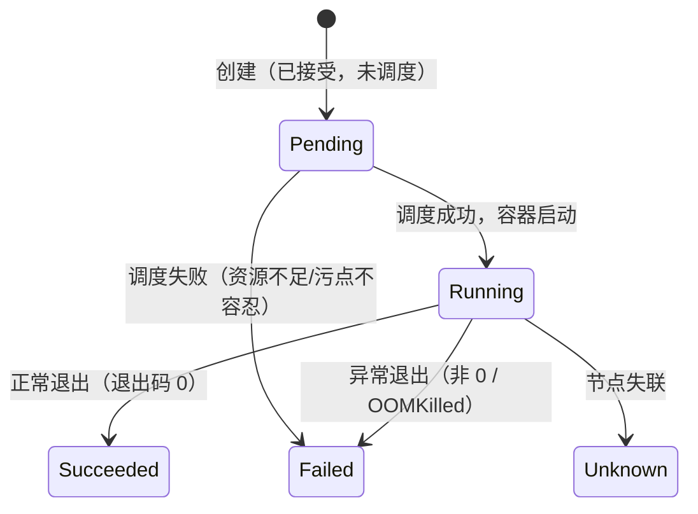

# 02 Pod 与容器生命周期

> 属于 K8s Code 教程 · 第 02 篇
> 上一篇：[01 环境准备与 kubectl 速查](./01-环境准备与kubectl速查)　下一篇：[03 Deployment 与滚动发布](./03-Deployment与滚动发布)

K8s 的最小调度单位不是容器，而是 **Pod**。这一章你亲手写出第一个 Pod：认识 YAML 的骨架、生命周期、三种探针和 initContainer，并学会用 kubectl 观察它的"一生"。

## 1. 第一个 Pod：YAML 骨架

```yaml
# code/k8s/manifests/02_pod/pod-basic.yaml
apiVersion: v1          # 核心资源组的版本
kind: Pod               # 资源类型
metadata:
  name: hello-nginx     # 名字（同一 namespace 内唯一）
  labels:
    app: hello          # 标签：K8s 用它做选择（后面 Service 全靠它）
spec:
  containers:
    - name: nginx
      image: nginx:1.27 # 镜像（不要用 latest，生产不可复现）
      ports:
        - containerPort: 80
```

动手：

```bash
kubectl apply -f code/k8s/manifests/02_pod/pod-basic.yaml
kubectl get pod hello-nginx -o wide     # 看状态与 IP
kubectl describe pod hello-nginx        # 看事件（Events 段）
kubectl logs hello-nginx                # 看日志
kubectl exec -it hello-nginx -- ls /usr/share/nginx/html
kubectl delete -f code/k8s/manifests/02_pod/pod-basic.yaml
```

**重点：`metadata.labels` 不是装饰**。Deployment、Service、HPA 全部靠 label selector 找到"我要管的那些 Pod"。给 Pod 打错标签 = 失联。

## 2. 生命周期：Pending → Running → Succeeded/Failed



`kubectl get pod` 的 STATUS 列就是生命周期状态的快照：

| 状态 | 含义 | 常见原因 |
|------|------|---------|
| `Pending` | 已创建未调度/未启动 | 资源不够、镜像拉取中 |
| `ContainerCreating` | 容器启动中 | 拉镜像慢 |
| `Running` | 运行中 | 正常 |
| `CrashLoopBackOff` | 反复启动又崩溃 | 启动失败、探针不过、OOM |
| `Succeeded` | 正常结束 | Job 完成 |
| `Failed` | 异常结束 | 非 0 退出 |

**排查口诀：状态不对先 `describe`，容器崩了先 `logs --previous`。**

## 3. 三种探针：怎么判断容器"好没好"

```yaml
# code/k8s/manifests/02_pod/pod-probe.yaml（节选）
readinessProbe:   # 就绪：能接流量了吗？（不行就摘流量，不重启）
  httpGet: { path: /healthz, port: 80 }
livenessProbe:    # 存活：还活着吗？（死了就重启）
  httpGet: { path: /healthz, port: 80 }
  failureThreshold: 3
startupProbe:     # 启动：慢启动保护（期间不执行 liveness）
  httpGet: { path: /healthz, port: 80 }
```

| 探针 | 回答的问题 | 失败动作 | 类比 |
|------|-----------|---------|------|
| liveness | 进程还活着吗？ | 重启容器 | 心电监护 |
| readiness | 能接收流量吗？ | 从 Service 摘除 | 挂"暂停营业"牌 |
| startup | 启动完成了吗？ | 延长检查期 | 开机自检 |

三种实现方式：`httpGet`（请求路径）、`tcpSocket`（连端口）、`exec`（执行命令看退出码）。

::: tip 为什么滚动更新必须 readiness？
新 Pod 没就绪就接流量 = 502。readiness 失败会自动从 Service 摘除，发布流程才敢"先起新、再删旧"。
:::

## 4. initContainer：主容器启动前的"准备工作"

```yaml
# code/k8s/manifests/02_pod/pod-init.yaml
initContainers:   # 串行执行，全部成功后主容器才启动
  - name: fetch-data
    image: busybox:1.36
    command: ["sh", "-c", "echo downloading... && sleep 3 && echo done > /data/ready.txt"]
```

典型用途：等依赖就绪（数据库）、下载数据、初始化权限、预热缓存。**失败会重启 initContainer，主容器永不启动**，直到 init 全部成功。

## 5. 多容器：什么时候一个 Pod 放多个容器

同 Pod 容器共享网络（同一 IP/端口空间）和存储卷，适合"强耦合、同生共死"：主服务 + 日志采集 sidecar、主服务 + 本地代理。**没强耦合就别硬塞**，各自独立 Deployment 才是默认。

## 练习

1. 用 `kubectl explain pod.spec.containers.resources` 查字段，给 hello-nginx 加上 `requests`/`limits`。
2. apply `pod-probe.yaml` 后 `kubectl get pod probe-demo`，观察 READY 列变成 `1/1` 的过程（探针要周期探测）。
3. 改 `pod-probe.yaml` 的 readiness 路径为 `/nonexist`，apply 后观察 READY 变成 `0/1`——这就是"就绪失败摘流量"的现场。
4. apply `pod-init.yaml`，`kubectl logs init-demo -c fetch-data` 看 init 容器日志，`kubectl logs init-demo` 看主容器读到 `ready.txt`。

## 面试追问

1. **Pod 里多个容器怎么互相访问？** 共享 localhost（同一网络命名空间），端口不能冲突。
2. **liveness 探针一直失败会怎样？** 容器被 kill 重启，重启次数累积，超过阈值进入 CrashLoopBackOff。
3. **为什么 readiness 失败不重启？** 可能是依赖下游暂不可用，重启没用；摘流量等它恢复更合理。
4. **initContainer 卡住会怎样？** 主容器一直不启动，Pod 停在 Pending/Init 状态，排障看 init 容器日志。

---

## 串起来

你写出了第一个 Pod，看懂了它的状态机、探针和 init 流程。但**直接 apply Pod 没有自愈能力**——它挂了没人补。下一篇用 **Deployment** 把"副本数恒定 + 滚动发布"交给控制器，这才是生产日常。
