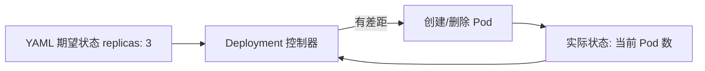
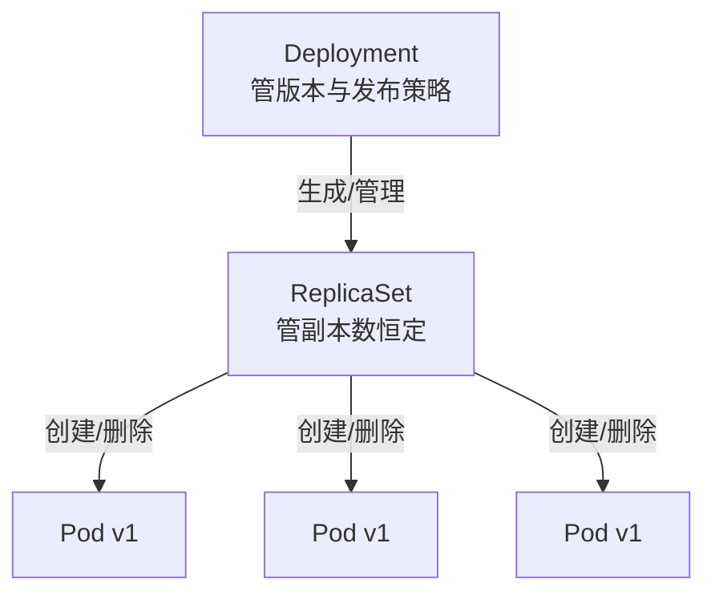
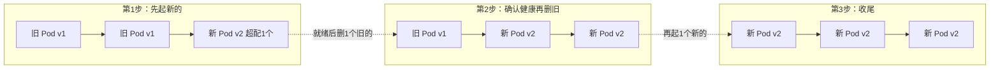

# 03 Deployment 与滚动发布

> 属于 K8s Code 教程 · 第 03 篇
> 上一篇：[02 Pod 与容器生命周期](./02-Pod与容器生命周期)　下一篇：[04 Service、Ingress 与 DNS](./04-Service-Ingress与DNS)

上一章你亲手 apply 了一个 Pod，也看懂了它的一生。但有个问题你肯定想到了：**那个 Pod 半夜崩了，谁来补？** 没人——裸 Pod 是"临时工"，挂了就挂了，没有老板盯着补人。这一章引入真正的"老板"——**Deployment**：它管副本数量恒定、管版本滚动发布、管一键回滚，是生产环境里唯一该用的工作负载。做完这一章，你的服务才算真正"有了自我修复能力"。

## 1. 声明式自愈：把"我要什么"写进 YAML

直接 apply 一个 Pod 的问题，不是它本身会挂，而是**挂了没人管**。Deployment 解决这个问题靠的是**声明式**：你在 YAML 里写下"我要 3 个副本"，控制器（Controller Manager 里的 Deployment/ReplicaSet 控制器）就日夜不停地对比"期望状态（3 个）"和"实际状态（当前几个）"，有差距就补，没有差距就继续盯：



> 控制循环的完整原理见仓库 S7 文档 [调度与控制器](../后端技术栈强化/07-k8s/调度与控制器)，这里不重复讲，只记住一句话：**期望状态来自 YAML，实际状态来自集群，控制器负责让两者对齐，循环永不停机**。

## 2. 三层管理结构：Deployment → ReplicaSet → Pod

Deployment 不直接管 Pod，中间隔着一层 **ReplicaSet**：



三层各司其职：

| 层 | 管什么 | 类比 |
|----|--------|------|
| Deployment | 版本、发布策略、回滚 | 店长：定目标、管排班表 |
| ReplicaSet | 副本数恒定（自愈） | 领班：点人头，少了就招 |
| Pod | 真正跑容器 | 临时工：干活的 |

为什么中间要多一层 ReplicaSet？因为**发布新版本时要留下"旧版本快照"**。每次改镜像重新 apply，Deployment 会新建一个 ReplicaSet 跑新镜像，旧 ReplicaSet 先留着不删——这就是回滚的资本（第 6 节细讲）。

## 3. 第一个 Deployment：给 nginx 配个"老板"

```yaml
# code/k8s/manifests/03_deployment/deploy-basic.yaml
apiVersion: apps/v1          # Deployment 属于 apps 组
kind: Deployment
metadata:
  name: nginx-deploy         # 部署名
  labels:
    app: nginx
spec:
  replicas: 3                # 期望副本数：3
  selector:
    matchLabels:
      app: nginx             # 挑选"归我管"的 Pod（必须匹配 template 的 labels）
  template:                  # Pod 模板：Deployment 用这个模板造 Pod
    metadata:
      labels:
        app: nginx
    spec:
      containers:
        - name: nginx
          image: nginx:1.27  # 固定版本，不用 latest（生产不可复现）
          ports:
            - containerPort: 80
          resources:         # requests=调度入场券，limits=使用上限（S7 讲过）
            requests:
              cpu: 100m
              memory: 64Mi
            limits:
              cpu: 200m
              memory: 128Mi
```

动手：

```bash
kubectl apply -f code/k8s/manifests/03_deployment/deploy-basic.yaml
# deployment.apps/nginx-deploy created

kubectl get deploy,rs,pods
# NAME           READY   UP-TO-DATE   AVAILABLE   AGE
# nginx-deploy   3/3     3            3           20s
# NAME                      DESIRED   CURRENT   READY   AGE
# nginx-deploy-7d8b9c6d5f   3         3         3       20s
# NAME                             READY   STATUS    RESTARTS   AGE
# nginx-deploy-7d8b9c6d5f-abc12    1/1     Running   0          20s
# nginx-deploy-7d8b9c6d5f-def34    1/1     Running   0          20s
# nginx-deploy-7d8b9c6d5f-ghi56    1/1     Running   0          20s
```

注意三个名字的层级关系：Deployment `nginx-deploy` → ReplicaSet `nginx-deploy-7d8b9c6d5f` → Pod `nginx-deploy-7d8b9c6d5f-abc12`，层层加前缀，一眼看出从属。

**自愈现场**：亲手杀一批 Pod 看看谁在补：

```bash
kubectl delete pod -l app=nginx
# pod "nginx-deploy-7d8b9c6d5f-abc12" deleted
# pod "nginx-deploy-7d8b9c6d5f-def34" deleted
# pod "nginx-deploy-7d8b9c6d5f-ghi56" deleted

kubectl get pods
# 一瞬间会看到旧 Pod 在 Terminating、新 Pod 在 ContainerCreating
# 几秒后回到 3/3 Running，但名字后缀全变了
```

删 3 个补 3 个——**副本数恒定**是 ReplicaSet 的职责，"监工清点人数，少了就招"，这就是自愈。

## 4. 滚动更新：先起新、确认健康、再删旧

副本数恒定解决了，下一个问题：**升级怎么不宕机？** 全删再全建 = 服务中断。K8s 默认策略 `RollingUpdate`（滚动更新）的做法是"**先起新的、确认健康、再删旧的**"，新旧交替推进：



滚动节奏由 `strategy.rollingUpdate` 里两个参数控制：

| 参数 | 含义 | 典型值 |
|------|------|--------|
| `maxUnavailable` | 更新中最多允许几个旧实例不可用（可整数或百分比） | `0`：旧实例一个都不能先停（最稳） |
| `maxSurge` | 更新中最多允许超配几个新实例 | `1`：每次多起 1 个，省资源 |

看发布版清单（先盯着 strategy 段）：

```yaml
# code/k8s/manifests/03_deployment/deploy-rollout.yaml
apiVersion: apps/v1
kind: Deployment
metadata:
  name: nginx-rollout
  labels:
    app: nginx-rollout
spec:
  replicas: 4
  selector:
    matchLabels:
      app: nginx-rollout
  strategy:                     # 发布策略
    type: RollingUpdate
    rollingUpdate:
      maxUnavailable: 0         # 全程不宕机：旧的先不删
      maxSurge: 1               # 最多超配 1 个新实例
  template:
    metadata:
      labels:
        app: nginx-rollout
    spec:
      containers:
        - name: nginx
          image: nginx:1.27
          ports:
            - containerPort: 80
          readinessProbe:       # 新 Pod 就绪才接流量（第 2 章讲过）
            httpGet:
              path: /
              port: 80
            initialDelaySeconds: 2
            periodSeconds: 3
```

`maxUnavailable: 0` + `maxSurge: 1` 是最稳的组合：**永远先多起 1 个新的，等它 readiness 通过（READY 变 1/1）再删 1 个旧的，如此交替**。代价是发布期间峰值多占一点资源，换来全程无 502。

::: tip 为什么滚动更新必须 readiness？
新 Pod 没就绪就接流量 = 502。readiness 失败会自动把 Pod 从 Endpoints 摘除（下一章讲），发布流程才敢"先起新、再删旧"。
:::

## 5. 发布实操：set image 触发滚动

```bash
kubectl apply -f code/k8s/manifests/03_deployment/deploy-rollout.yaml
# deployment.apps/nginx-rollout created

# 改镜像：把 nginx 容器升到 1.28（触发滚动更新）
kubectl set image deploy/nginx-rollout nginx=nginx:1.28
# deployment.apps/nginx-rollout image updated

# 盯发布进度（未完成前会阻塞）
kubectl rollout status deploy/nginx-rollout
# Waiting for deployment "nginx-rollout" rollout to finish: 0 out of 4 new replicas have been updated...
# Waiting for deployment "nginx-rollout" rollout to finish: 1 out of 4 new replicas have been updated...
# deployment "nginx-rollout" successfully rolled out
```

**观察新旧 ReplicaSet 此消彼长**——这是理解滚动的核心命令：

```bash
kubectl get rs
# NAME                        DESIRED   CURRENT   READY   AGE
# nginx-rollout-6f7c8d9e10    4         4         4       1m   ← 新 RS（v1.28）
# nginx-rollout-5a6b7c8d9e    0         0         0       5m   ← 旧 RS（v1.27）留着回滚

kubectl get pods -l app=nginx-rollout
# 名字前缀全部变成新 RS 的哈希：nginx-rollout-6f7c8d9e10-xxxxx
```

滚动期间新 RS 的副本从 0 涨到 4，旧 RS 从 4 降到 0，中间有一段**新旧共存**——这就是"不宕机"的直观证据。

## 6. 回滚：一条命令回到旧版本

新版本有 bug？不用改镜像重新发，K8s 直接"换回旧 ReplicaSet"：

```bash
kubectl rollout undo deploy/nginx-rollout
# deployment.apps/nginx-rollout rolled back

kubectl rollout status deploy/nginx-rollout
# deployment "nginx-rollout" successfully rolled out

kubectl get rs
# 旧 RS（v1.27）又变回 4/4，新 RS 降到 0
```

**回滚的原理**：还记得第 2 节说的"旧 ReplicaSet 留着不删"吗？`rollout undo` 就是把 Deployment 的 Pod 模板**指回旧 ReplicaSet 的模板**——Deployment 控制器发现模板变了，就按同样的滚动逻辑把流量迁回去。所以：

- 每次发布 = 一个修订版本（revision），用 `kubectl rollout history deploy/nginx-rollout` 查看历史；
- `kubectl rollout undo deploy/nginx-rollout --to-revision=1` 可回滚到指定版本。

## 7. 发布节奏控制：pause/resume 与 Canary 思路

**pause/resume**：发布中途暂停，先验证一部分再放量：

```bash
kubectl rollout pause deploy/nginx-rollout   # 暂停：新 Pod 就绪后不再推进
kubectl rollout resume deploy/nginx-rollout  # 恢复：继续滚动
```

暂停时滚动停在"新旧共存"状态，适合灰度一小撮、看看日志再决定。

**Canary（金丝雀）发布思路**：K8s 原生 Deployment 做的是滚动发布，不是严格意义的金丝雀（金丝雀 = 先放 5%~10% 流量给新版本，验证后再全量）。生产上想玩 Canary，常见做法：

1. **两个 Deployment 共用一个 Service**：`nginx-stable`（v1.27，9 副本）+ `nginx-canary`（v1.28，1 副本），Service 的 selector 同时匹配两者，流量天然按副本数比例（9:1）分配；
2. 验证通过，把 stable 也升到 v1.28，删掉 canary；
3. 更精细的按 Header/Cookie 分流，需要 Service Mesh（Istio/Linkerd）或 Argo Rollouts——先理解"比例放量"的思想即可。

## 练习

1. `kubectl apply -f code/k8s/manifests/03_deployment/deploy-rollout.yaml`，然后 `kubectl set image deploy/nginx-rollout nginx=nginx:1.28`，用 `kubectl rollout status deploy/nginx-rollout` 盯完整滚动；另开一个终端 `kubectl get rs -w`，观察新旧 RS 数量此消彼长。
2. 发布完成后 `kubectl rollout undo deploy/nginx-rollout` 回滚，再 `kubectl get rs` 确认 v1.27 的 RS 回到 4/4。
3. `kubectl rollout history deploy/nginx-rollout` 看修订历史，再用 `kubectl rollout undo deploy/nginx-rollout --to-revision=1` 回指定版本。
4. 自己验证 `kubectl scale deploy/nginx-deploy --replicas=5` 扩到 5 个副本——注意 scale 只改副本数、不触发滚动（模板没变）。

## 面试追问

1. **滚动更新如何保证不宕机？** 先起新、等 readiness 通过、再删旧，新旧交替推进；配合 `maxUnavailable: 0` 保证旧实例一个都不先停。
2. **maxUnavailable: 0 与 maxSurge 的含义？** maxUnavailable 是"最多允许几个旧实例不可用"（0=旧的全不能停，最稳）；maxSurge 是"最多超配几个新实例"（1=每次只多起 1 个，省资源），两者共同决定滚动节奏。
3. **回滚的原理？** 每次发布生成新 ReplicaSet、旧 RS 保留；`rollout undo` 把 Pod 模板指回旧 RS 的模板，Deployment 按滚动逻辑迁回——所以回滚本身也是一次滚动。
4. **为什么生产不用裸 ReplicaSet？** ReplicaSet 只管副本数恒定，没有版本管理、没有发布策略、没有回滚；Deployment 是它的"完整版老板"，生产一律用 Deployment。

---

## 串起来

这一章你让 Pod 有了老板：**Deployment 管版本，ReplicaSet 盯数量，滚动更新不宕机，undo 一键回滚**。但还剩一个大问题：Pod 的 IP 每次重建都会变，客户端总不能每次改配置——**流量怎么稳定地找到"活着的 Pod"？** 下一章上 Service：给易变的 Pod 一个固定的门牌号，外加 Ingress 七层路由和 CoreDNS 服务发现。

> 下一章：[04 Service、Ingress 与 DNS](./04-Service-Ingress与DNS)
