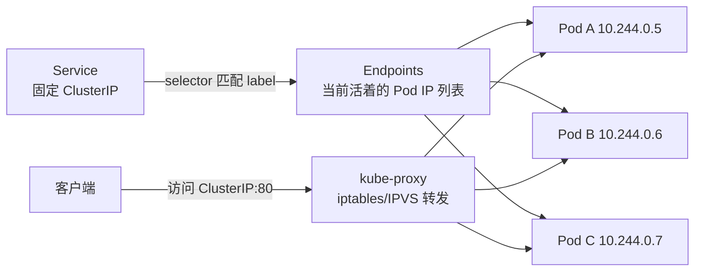
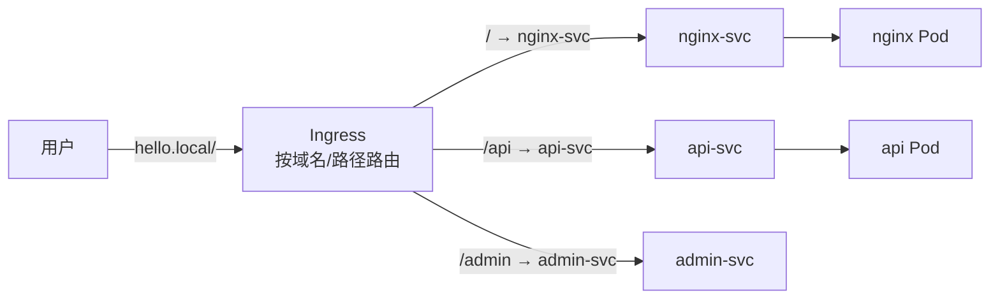
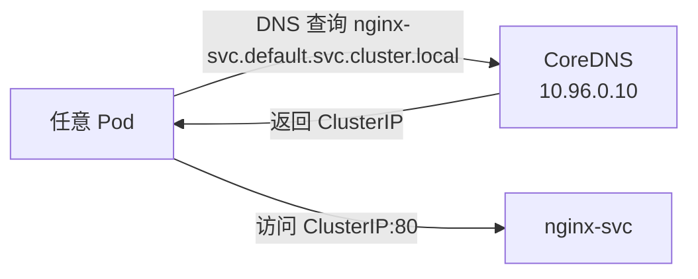

# 04 Service、Ingress 与 DNS

> 属于 K8s Code 教程 · 第 04 篇
> 上一篇：[03 Deployment 与滚动发布](./03-Deployment与滚动发布)　下一篇：[05 配置与存储：ConfigMap、Secret、PV](./05-配置与存储-ConfigMap-Secret-PV)

上一章你有了 Deployment，Pod 挂了会自动补。但还有一个"阴魂不散"的问题：**Pod 是临时工，IP 是租的**——每次重建，IP 就换一个。客户端总不能每次重建都改配置吧？这一章解决"流量怎么稳定地找到活着的 Pod"：**Service 给易变的 Pod 一个固定的门牌号，Ingress 在七层按域名路由，CoreDNS 让服务名直接当地址用**。做完这一章，你的服务就真正"可以被访问"了。

## 1. 为什么需要 Service

Pod 的 IP 有两个致命特点：

1. **不稳定**：删了重建就换 IP（上一章你亲手杀过 Pod，名字后缀全变了）；
2. **多副本**：3 个副本 3 个 IP，客户端到底连哪个？

K8s 的答案是 **Service**——一个**稳定不动的虚拟 IP（ClusterIP）+ 端口**，它自己从不消失，背后动态绑定"当前活着的 Pod"。

打个比方：**Service 是公司的前台总机，Pod 是分机。客户永远只拨总机号码，总机再转接到现在在岗的分机**。分机换了人（Pod 重建）不影响客户。

## 2. Service 原理：selector → Endpoints → kube-proxy

Service 找到 Pod 靠三件套：



流程拆开看：

1. **selector**：Service 用 `spec.selector`（label 选择器）声明"我要管哪些 Pod"——和 Deployment 的 selector 是同一套机制；
2. **Endpoints**：K8s 持续扫描，把"匹配 selector 且 READY 的 Pod IP"写进 Endpoints 列表。**Pod 挂了自动剔除，新 Pod 起来自动加入**，客户端完全无感；
3. **kube-proxy**：每个 Node 上的 kube-proxy 把 Service 的规则翻译成 iptables/IPVS 规则，流量打到任意 Node 都能被转发到某个存活 Pod。

> 网络模型与转发细节见仓库 S7 文档 [网络与存储](../后端技术栈强化/07-k8s/网络与存储)，这里只记三句话：**selector 负责找，Endpoints 负责记账，kube-proxy 负责转发**。

## 3. 类型一：ClusterIP——集群内虚拟 IP

```yaml
# code/k8s/manifests/04_service/svc-clusterip.yaml
apiVersion: v1
kind: Service
metadata:
  name: nginx-svc
spec:
  selector:
    app: nginx              # 挑出带 app: nginx 标签的 Pod（上一章的 nginx-deploy 正好匹配）
  ports:
    - port: 80              # Service 端口：集群内访问用这个
      targetPort: 80        # 转发目标：Pod 的容器端口
  type: ClusterIP           # 默认类型，集群内虚拟 IP
```

实操（先确保第 3 章的 `nginx-deploy` 还在，不在就重新 `kubectl apply -f code/k8s/manifests/03_deployment/deploy-basic.yaml`）：

```bash
kubectl apply -f code/k8s/manifests/04_service/svc-clusterip.yaml
# service/nginx-svc created

kubectl get svc nginx-svc
# NAME        TYPE        CLUSTER-IP      EXTERNAL-IP   PORT(S)   AGE
# nginx-svc   ClusterIP   10.108.159.66   <none>        80/TCP    8s
```

看 `CLUSTER-IP` 那列——**10.108.159.66 是虚拟 IP，不是任何一台机器的真实 IP**。从集群内任意 Pod 访问它都能到 nginx：

```bash
# 起一个临时 busybox 进集群内验证
kubectl run curl-test --image=busybox:1.36 --rm -it -- sh
# 进入容器后执行（换成你刚才看到的 ClusterIP）：
wget -qO- http://10.108.159.66
# 输出 nginx 的欢迎页 HTML 即成功
```

ClusterIP 只在集群内可达，外部访问不到——这是默认，也是服务间调用的正确姿势。

## 4. 类型二：NodePort——把端口开在 Node 上

要让集群外也能访问，用 NodePort：**每个 Node 上都开一个固定端口（30000-32767）**，流量进 Node 端口 → 转发给 Service → 转发给 Pod：

```yaml
# code/k8s/manifests/04_service/svc-nodeport.yaml
apiVersion: v1
kind: Service
metadata:
  name: nginx-nodeport
spec:
  selector:
    app: nginx
  ports:
    - port: 80              # 集群内访问端口
      targetPort: 80        # Pod 容器端口
      nodePort: 30080       # 每个 Node 上开的固定端口（30000-32767）
  type: NodePort
```

```bash
kubectl apply -f code/k8s/manifests/04_service/svc-nodeport.yaml
# service/nginx-nodeport created

kubectl get svc nginx-nodeport
# NAME             TYPE       CLUSTER-IP      EXTERNAL-IP   PORT(S)        AGE
# nginx-nodeport   NodePort   10.100.98.215   <none>        80:30080/TCP   5s

# 拿到 Node 的 IP（minikube 用 minikube ip）
minikube ip
# 192.168.49.2

# 本地直接 curl：nodeIP:30080
curl http://192.168.49.2:30080
# 输出 nginx 欢迎页 HTML
```

注意 `PORT(S)` 列变成 `80:30080/TCP`：**集群内走 80，集群外走 30080**。NodePort 是"简单对外暴露"的手段，适合测试，生产一般不直接用它对外。

## 5. 三种类型怎么选

| 类型 | 访问范围 | 原理 | 场景 |
|------|---------|------|------|
| **ClusterIP** | 集群内 | 虚拟 IP，kube-proxy 转发 | 服务间调用（默认，最常用） |
| **NodePort** | 集群外 | 每个 Node 开固定端口（30000-32767） | 测试、简单暴露 |
| **LoadBalancer** | 公网 | 云厂商 LB 挂到 NodePort 背后 | 生产对外入口 |

LoadBalancer 在本地 minikube 上要 `minikube tunnel` 才能拿到外部 IP，原理上它就是在 NodePort 外面再包一层云负载均衡：**云 LB → NodePort → ClusterIP → Pod**。生产云环境（AWS/GCP/阿里云）常用它做入口。

## 6. Headless Service：不要总机，直接给分机列表

默认 Service 给你一个虚拟 IP 当"总机"。但有些场景（数据库主从、有状态应用、需要拿到每个 Pod 的真实 IP 直连）不想要总机，只想要一份**实时更新的 Pod IP 列表**——把 `clusterIP: None` 就是 Headless Service：

```yaml
apiVersion: v1
kind: Service
metadata:
  name: nginx-headless
spec:
  clusterIP: None        # 不分配虚拟 IP
  selector:
    app: nginx
  ports:
    - port: 80
```

Headless 的 Service 没有 ClusterIP，DNS 解析会直接返回**所有匹配 Pod 的 IP 列表**（而不是一个虚拟 IP）。配合 StatefulSet 时每个 Pod 还有固定的主机名（`pod-0.svc`、`pod-1.svc`），这就是数据库类应用"按编号找节点"的基础。日常业务几乎用不到，知道存在即可。

## 7. 排障：看 Endpoints 怎么"记账"

Service 转发的依据是 Endpoints，所以**流量不通先看 Endpoints 里有没有人**：

```bash
kubectl get endpoints nginx-svc
# NAME        ENDPOINTS                        AGE
# nginx-svc   10.244.0.5:80,10.244.0.6:80,10.244.0.7:80   1m

# 杀掉全部 Pod，看 Endpoints 立刻清空
kubectl delete pod -l app=nginx
kubectl get endpoints nginx-svc
# NAME        ENDPOINTS   AGE
# nginx-svc   <none>      2m
```

Endpoints 是**实时记账**的：Pod 进入 Running 且 readiness 通过 → 记入；Pod 挂掉或就绪失败 → 剔除。上一章滚动更新期间新旧 Pod 交替，Endpoints 也在跟着变——这也是为什么滚动更新要求新 Pod 必须过 readiness：**没过 readiness 的 Pod 根本不会进 Endpoints，也就不会接流量**。

## 8. Ingress：七层的"前台接待"

Service 是四层（IP + 端口），它不认域名、不认路径。**Ingress 是七层**，按"域名 + 路径"把请求路由到不同的 Service——一个入口，多个服务：



比喻：**Service 是前台总机（只认电话号码），Ingress 是前台接待（听你报部门/姓名再转接）**。注意：Ingress 不是独立运行的进程，它需要**控制器**（NGINX Ingress Controller、Traefik 等）来落地——Ingress 资源是"规则声明"，Ingress Controller 才是真正干活的路由进程。

```yaml
# code/k8s/manifests/04_service/ingress-basic.yaml
apiVersion: networking.k8s.io/v1
kind: Ingress
metadata:
  name: nginx-ingress
spec:
  rules:
    - host: hello.local          # 域名
      http:
        paths:
          - path: /              # 路径
            pathType: Prefix
            backend:
              service:
                name: nginx-svc  # 转发给哪个 Service
                port:
                  number: 80
```

minikube 实操（需要先装 Ingress 控制器插件）：

```bash
minikube addons enable ingress
# 等待 ingress-nginx 命名空间里的控制器 Pod 就绪：
kubectl get pods -n ingress-nginx

kubectl apply -f code/k8s/manifests/04_service/ingress-basic.yaml
# ingress.networking.k8s.io/nginx-ingress created

# 本地访问时把域名指到 minikube（写 /etc/hosts 或 curl -H 头）
curl -H "Host: hello.local" http://192.168.49.2
# 输出 nginx 欢迎页 HTML（请求按 Host 头路由到 nginx-svc）
```

::: danger 常见误区
本地没装 Ingress 控制器时，`kubectl get ingress` 能看到规则但访问不通——**Ingress 只是声明，真正转发靠 Ingress Controller**，这是面试和排障时最常踩的坑。
:::

## 9. CoreDNS：服务名即服务发现

还记得第 3 节你手写 `10.108.159.66` 去访问吗？这太蠢了——IP 是虚拟的，随时可能变。K8s 内置 CoreDNS，**每个 Service 自动获得一个域名**，格式固定：

```
服务名.命名空间.svc.cluster.local
```

比如 `nginx-svc.default.svc.cluster.local`。在集群内直接用服务名访问：

```bash
kubectl run curl-test --image=busybox:1.36 --rm -it -- sh
# 进入容器后：
wget -qO- http://nginx-svc.default.svc.cluster.local
# 输出 nginx 欢迎页 HTML

# 也可以只用短名：同命名空间下省略后缀
wget -qO- http://nginx-svc
```



这就是微服务篇说的"服务注册发现"在 K8s 里的落地：**Service + CoreDNS = 现成的注册发现**。服务实例增删、IP 变化，调用方完全无感——只要服务名不变，就永远找得到。

## 练习

1. 部署 `code/k8s/manifests/03_deployment/deploy-basic.yaml` + `code/k8s/manifests/04_service/svc-clusterip.yaml`，用临时 busybox 验证集群内 `wget http://nginx-svc` 能拿到欢迎页。
2. 再 apply `svc-nodeport.yaml`，本地 `curl http://$(minikube ip):30080` 验证外网访问；然后 `kubectl delete pod -l app=nginx` 杀掉全部 Pod，`kubectl get endpoints nginx-svc` 观察列表清空、Pod 重建后列表自动恢复——把"Endpoints 随 Pod 变化"看进眼睛里。
3. 进阶：`minikube addons enable ingress` 后 apply `ingress-basic.yaml`，用 `curl -H "Host: hello.local" http://$(minikube ip)` 验证七层路由。

## 面试追问

1. **Service 怎么找到 Pod？** selector 用 label 匹配 Pod，匹配且 readiness 通过的 Pod IP 写进 Endpoints，kube-proxy 按 Endpoints 转发。
2. **Pod 挂了流量怎么办？** Endpoints 实时剔除故障 Pod，新请求只转给存活 Pod；配合 Deployment 自愈补上新 Pod 后自动加回 Endpoints，客户端无感。
3. **ClusterIP 是真实 IP 吗？** 不是，是虚拟 IP（不绑定任何网卡）；流量到达任意 Node 后由 kube-proxy 翻译成 iptables/IPVS 规则转发到真实 Pod IP。
4. **Ingress 和 Service 的区别？** Service 是四层（IP+端口）转发；Ingress 是七层（域名+路径）路由，且需要 Ingress Controller 才能真正转发——Service 是 Ingress 的后端。
5. **服务名解析的完整 FQDN？** `服务名.命名空间.svc.cluster.local`，同命名空间可省略后缀直接用短名。

---

## 串起来

这一章打通了"访问"链路：**Service 给易变的 Pod 固定门牌（ClusterIP/NodePort/LoadBalancer），Endpoints 实时记账，Ingress 按域名路由，CoreDNS 让服务名即地址**。你的服务现在能找得到、进得来了。但还差最后一块拼图：**配置（环境变量、连接串）和持久化数据（数据库文件）放哪？** 镜像里写死配置是最蠢的做法——下一章讲 ConfigMap、Secret 和 PV/PVC：把配置和数据从镜像里"抽出来"。

> 下一章：[05 配置与存储：ConfigMap、Secret、PV](./05-配置与存储-ConfigMap-Secret-PV)
