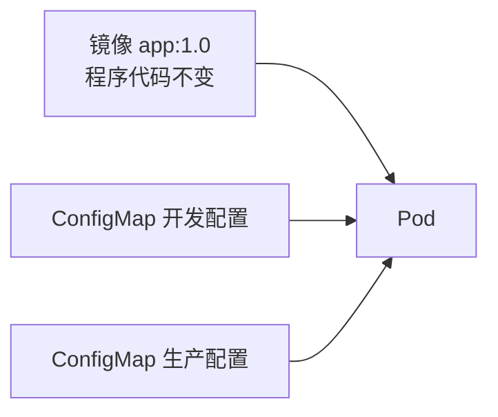
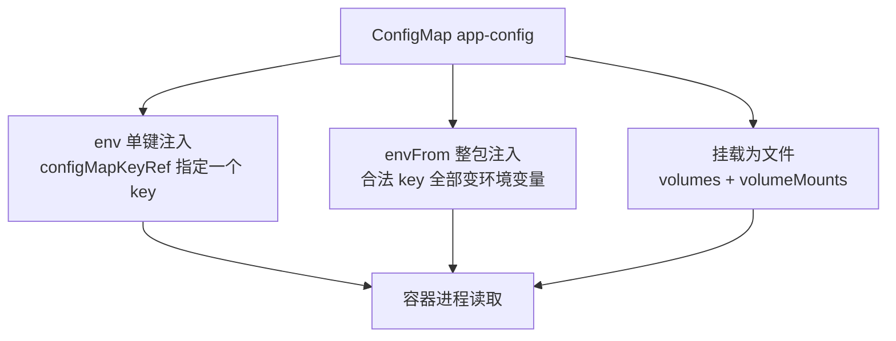
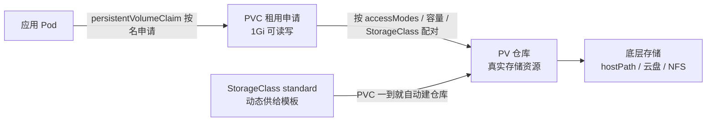

# 05 配置与存储：ConfigMap/Secret/PV

> 属于 K8s Code 教程 · 第 05 篇
> 上一篇：[04 Service/Ingress/DNS](./04-Service-Ingress与DNS)　下一篇：[06 资源管理与 HPA/Job](./06-资源管理与HPA-Job)

前四章你布置的都是"无状态"的活儿：Pod 删了重建，IP 换一个，容器里的数据全部蒸发。这一章解决两件大事——**配置**：同一份镜像怎么在不同环境用不同配置；**数据**：Pod 是"临时工"，数据怎么住进"仓库"、不随 Pod 消失。

## 1. 为什么配置要"抽出来"

先想一个扎心场景：你的服务要连数据库，开发环境连 `127.0.0.1:3306`，生产要连 `db-prod.internal:3306`，密码还不一样。如果配置写死在镜像里，就得为每个环境重新构建一个镜像——三个环境三个镜像，构建、推送、版本管理全是噩梦。

K8s 的答案是**镜像与配置分离**：镜像只负责"程序长什么样"（不变），配置由 ConfigMap/Secret 提供（随环境变）：



同一个镜像挂不同的 ConfigMap 就是不同的环境，**改配置不用重新构建镜像、不用重新发布**。原理层面的意义在 [网络与存储](/后端技术栈强化/07-k8s/网络与存储) 里讲过（"把配置从镜像里抽出来"），这一章只讲怎么写、怎么注入、怎么验。

## 2. ConfigMap：普通配置的"抽屉"

ConfigMap 就是一堆键值对，还能存整份文件内容：

```yaml
# code/k8s/manifests/05_config_storage/cm-app.yaml
apiVersion: v1
kind: ConfigMap
metadata:
  name: app-config
data:
  APP_ENV: "production"      # 普通键值对
  LOG_LEVEL: "info"
  config.yaml: |             # 多行文本，可以是一整份配置文件
    server:
      port: 8080
    feature:
      newHome: true
```

注意 `data` 里的每个 key 都是字符串，多行内容用 `|` 块。`config.yaml` 这个 key 是"以文件形式挂载"的伏笔——后面挂载时它会变成一个真正的文件。

## 3. 三种注入方式

ConfigMap 有且仅有三种方式进入容器（都是把配置"塞进" Pod）：



动手实操，直接 apply 全套（ConfigMap + Secret + 消费它们的 Pod）：

```bash
# 一次性应用三个配置类资源
kubectl apply -f code/k8s/manifests/05_config_storage/cm-app.yaml
kubectl apply -f code/k8s/manifests/05_config_storage/secret-app.yaml
kubectl apply -f code/k8s/manifests/05_config_storage/pod-config-consumer.yaml

kubectl get cm,secret,pod
# NAME                 DATA   AGE
# configmap/app-config 3      6s
# secret/app-secret    2      6s
# NAME              READY   STATUS    RESTARTS   AGE
# pod/config-consumer 1/1   Running   0          6s
```

消费 Pod 的 YAML 同时演示了三种方式（重点看注释）：

```yaml
# code/k8s/manifests/05_config_storage/pod-config-consumer.yaml
apiVersion: v1
kind: Pod
metadata:
  name: config-consumer
spec:
  containers:
    - name: app
      image: busybox:1.36
      command: ["sh", "-c", "env | grep APP_ && cat /etc/config/config.yaml && sleep 3600"]
      env:
        # 方式一：env 单键注入，精确取 ConfigMap 里某一个 key
        - name: APP_ENV
          valueFrom:
            configMapKeyRef:
              name: app-config
              key: APP_ENV
        # Secret 的注入方式完全一样，只是换成 secretKeyRef
        - name: DB_PASSWORD
          valueFrom:
            secretKeyRef:
              name: app-secret
              key: DB_PASSWORD
      envFrom:
        # 方式二：整包注入，ConfigMap 所有合法 key 全变成环境变量
        - configMapRef:
            name: app-config
      volumeMounts:
        # 方式三：挂载为文件，容器里出现 /etc/config/config.yaml
        - name: config-vol
          mountPath: /etc/config
          readOnly: true
  volumes:
    - name: config-vol
      configMap:
        name: app-config
```

看预期输出：

```bash
# 看 Pod 启动时打印了什么（env | grep APP_ 只匹配 APP_ENV）
kubectl logs config-consumer
# APP_ENV=production
# server:
#   port: 8080
# feature:
#   newHome: true

# 进容器逐个验证三种注入
kubectl exec -it config-consumer -- env | grep -E 'APP_|LOG_|DB_'
# APP_ENV=production                  <- env 单键注入
# LOG_LEVEL=info                      <- envFrom 整包注入
# DB_PASSWORD=s3cret-passw0rd         <- secretKeyRef 注入

kubectl exec -it config-consumer -- cat /etc/config/config.yaml
# server:
#   port: 8080
# feature:
#   newHome: true
```

::: tip 环境变量名有"法定字符"限制
envFrom 整包注入时，key 必须是合法的环境变量名（字母/数字/下划线）。`config.yaml` 带点号不是合法环境变量名，会被 K8s 跳过并产生一条 `invalid keys skipped` 事件——所以整包注入只看到 `APP_ENV`/`LOG_LEVEL`，而 `config.yaml` 只能走"挂载为文件"这条路。三种方式按需组合，并不互斥。
:::

## 4. Secret：穿了马甲的 ConfigMap

Secret 长得和 ConfigMap 几乎一样，区别只在语义与存储形态：**它专放敏感信息，值会被 base64 编码**（注意：是编码，不是加密）：

```yaml
# code/k8s/manifests/05_config_storage/secret-app.yaml
apiVersion: v1
kind: Secret
metadata:
  name: app-secret
type: Opaque              # 通用类型；还有 tls / dockerconfigjson 等
stringData:               # stringData 里直接写明文，K8s 自动帮你 base64
  DB_PASSWORD: "s3cret-passw0rd"
  API_KEY: "sk-abc123"
```

```bash
# 用 -o yaml 看存储形态：值变成 base64 了
kubectl get secret app-secret -o yaml
# data:
#   API_KEY: c2stYWJjMTIz
#   DB_PASSWORD: czNjcmV0LXBhc3N3MHJk
```

| 维度 | ConfigMap | Secret |
|------|-----------|--------|
| 用途 | 非敏感配置（URL、开关、日志级别） | 敏感信息（密码、Token、证书） |
| 存储形态 | 明文 | base64 编码 |
| 典型注入 | env / envFrom / 挂载文件 | 挂载文件为主，env 少用（避免进环境变量泄露） |
| 安全程度 | 都不安全，见下 | base64 可逆，见下 |

::: danger Secret 不是保险箱
`kubectl get secret -o yaml` 拿到谁都能 decode，etcd 里默认也是明文存储。**base64 只是编码不是加密**。生产环境要么开启 etcd 加密，要么用外部密钥管理（云厂商 KMS / Vault / External Secrets Operator）——第 12 章还会深入。
:::

## 5. PV/PVC/StorageClass：临时工的仓库

配置解决了，还剩数据。Pod 是"临时工"，容器是"工位上的水杯"——人走了杯子就扔。要让数据活下来，得住进"仓库"。K8s 的仓库体系是三层抽象：



- **PV（PersistentVolume）**：管理员准备的"仓库"，是真实存储资源的抽象。
- **PVC（PersistentVolumeClaim）**：应用提交的"租用申请"，声明"我要 1Gi、单节点读写"。
- **StorageClass**："自动盖仓库"的模板——PVC 一申请，按模板立刻动态创建 PV。生产最常用，你根本不用手写 PV。

minikube 自带一个默认 StorageClass（名字叫 `standard`），所以本实验的 PVC 连 `storageClassName` 都不用写：

```bash
kubectl get storageclass
# NAME       PROVISIONER                RECLAIMPOLICY   VOLUMEBINDINGMODE
# standard   k8s.io/minikube-hostpath   Delete          Immediate
```

::: tip 为什么 PVC 不指定 StorageClass 也行？
K8s 有"默认 StorageClass"机制：集群里恰好有一个被注解为 default 的 StorageClass 时，PVC 不写 `storageClassName` 就自动用它。云上生产同样适用——你只声明"我要多大"，具体用哪种云盘由集群决定，应用不用关心。
:::

## 6. 持久化实操：写数据 → 删 Pod → 数据还在

```yaml
# code/k8s/manifests/05_config_storage/pvc-data.yaml
apiVersion: v1
kind: PersistentVolumeClaim
metadata:
  name: data-pvc
spec:
  accessModes:
    - ReadWriteOnce          # 单节点可读写（多节点共享用 ReadWriteMany）
  resources:
    requests:
      storage: 1Gi
```

```bash
# 申请 PVC + 挂它的 Pod（Pod 启动时往 /data 写一个文件）
kubectl apply -f code/k8s/manifests/05_config_storage/pvc-data.yaml
kubectl apply -f code/k8s/manifests/05_config_storage/pod-pvc-consumer.yaml

kubectl get pvc
# NAME       STATUS   VOLUME                                     CAPACITY   ACCESS MODES   STORAGECLASS
# data-pvc   Bound    pvc-7f2a9c2e-xxx                           1Gi        RWO            standard

# STATUS 变成 Bound = 配对成功；PV 也被动态创建出来了
kubectl get pv
# NAME                                       CAPACITY   ACCESS MODES   RECLAIM POLICY   STATUS   CLAIM
# pvc-7f2a9c2e-xxx                           1Gi        RWO            Delete           Bound    default/data-pvc

# 进容器确认启动时写入的文件
kubectl exec -it pvc-consumer -- cat /data/hello.txt
# persistent data
```

关键验证来了——**删掉 Pod，PVC 和 PV 不动**（它们不是 Pod 的附属品），数据还在：

```bash
# 先在 Pod 里"后来"写一个文件 keep.txt（注意：这不是启动命令写的）
kubectl exec -it pvc-consumer -- sh -c "echo keep-me > /data/keep.txt"

kubectl delete pod pvc-consumer
kubectl get pvc        # 还在，Status 仍是 Bound
# NAME       STATUS   VOLUME        ...   STORAGECLASS
# data-pvc   Bound    pvc-7f2a9...        standard

# 重新创建 Pod（同一个 PVC），"后来"写的文件完好无损
kubectl apply -f code/k8s/manifests/05_config_storage/pod-pvc-consumer.yaml
kubectl exec -it pvc-consumer -- cat /data/keep.txt
# keep-me     <- 重建后还在！这才是持久化的铁证
```

这就是"持久化"：**数据住仓库（PV），Pod 只是临时来取用**。对比第 02 章多容器共享卷——那是 Pod 内部的 `emptyDir`，Pod 一删目录就没了；PVC 是跨 Pod 生命周期的：

| 对比 | emptyDir | PVC |
|------|----------|-----|
| 生命周期 | 随 Pod，Pod 删除即清空 | 独立于 Pod，Pod 重建数据仍在 |
| 典型用途 | 缓存、临时交换、sidecar 共享 | 数据库、文件上传、有状态服务 |
| 存储位置 | 节点本地磁盘 | 后端存储（hostPath / 云盘 / NFS） |

## 练习

1. 把 `code/k8s/manifests/05_config_storage/` 下 5 个 YAML 全部 apply，然后：
   - `kubectl logs config-consumer` 看 `APP_ENV` 和 `config.yaml` 内容；
   - `kubectl exec -it config-consumer -- env | grep DB_` 验证 Secret 注入；
   - `kubectl exec -it config-consumer -- ls /etc/config` 看挂载文件列表。
2. 把 `cm-app.yaml` 的 `LOG_LEVEL` 改成 `debug` 重新 apply，然后删除并重建 `config-consumer`，`kubectl exec -it config-consumer -- env | grep LOG_LEVEL` 应看到 `debug`——体会"env 注入的配置，必须重建 Pod 才生效"。
3. 持久化验证：删掉 `pvc-consumer` 再 apply 重建，确认 `/data/keep.txt` 还在；再删除 PVC 本身（`kubectl delete pvc data-pvc`），观察 PV 也随之消失（`standard` 的回收策略是 Delete，PV 和底层数据一起被回收）。
4. 看一个"反面教材"：`kubectl get events | grep -i invalid`，找到 envFrom 跳过 `config.yaml` 的那条事件。

## 面试追问

1. **Secret 真的安全吗？** 不安全。base64 只是编码不是加密，`echo c2stYWJjMTIz | base64 -d` 一秒还原；etcd 里默认明文。生产用 etcd 加密、云 KMS、Vault / External Secrets 这类方案。
2. **ConfigMap 更新后容器内文件何时生效？** 挂载文件由 kubelet 定期同步（分钟级延迟），会自动更新；通过 env/envFrom 注入的环境变量**不会**自动更新，必须重建 Pod（滚动重启）。所以"改配置要重启"是常态，除非应用自己监听文件热加载。
3. **PV 和 PVC 怎么配对？** 按三条件匹配：PVC 的 `accessModes` 要被 PV 满足（RWO/RWX）、PVC 的 `requests.storage` ≤ PV 容量、`storageClassName` 一致（都不写则用默认 SC）；且 PV 必须处于 `Available` 状态。绑定后 PVC 显示 `Bound`，并且是"一对一"占用。
4. **emptyDir 与 PVC 的区别？** 生命周期不同：emptyDir 随 Pod 生灭，Pod 删了数据就没了，适合缓存/临时数据；PVC 背后是独立的持久卷，Pod 重建后数据还在，适合有状态数据。代价是 PVC 需要底层存储和回收策略管理。

---

## 串起来

这一章你把"配置"和"数据"两件无状态应用的大麻烦解决了：**配置用 ConfigMap/Secret 抽出来、三种方式注进去；数据用 PVC 申请、PV 提供、StorageClass 动态供给，删 Pod 不删数据**。但资源是有限的——你的服务撑得住多大流量？谁来决定扩几个副本？下一章讲 **requests/limits、QoS 和 HPA**，让副本数自己跟着负载走，再顺手把一次性任务（Job）和定时任务（CronJob）收进工具箱。

> 下一章：[06 资源管理与 HPA/Job](./06-资源管理与HPA-Job)
