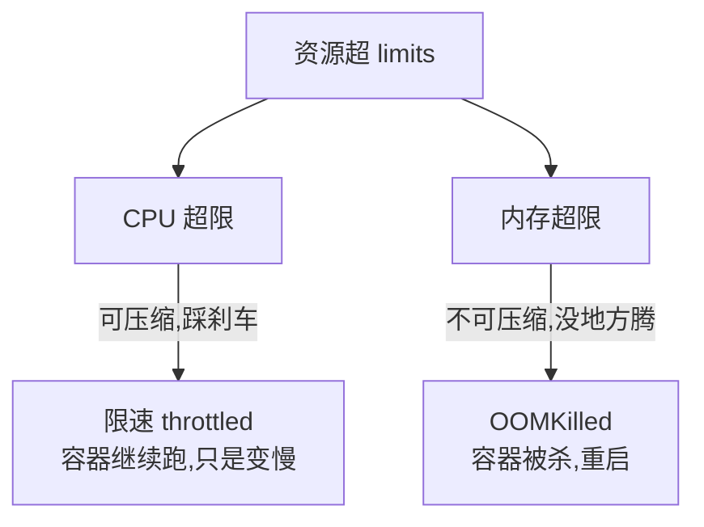
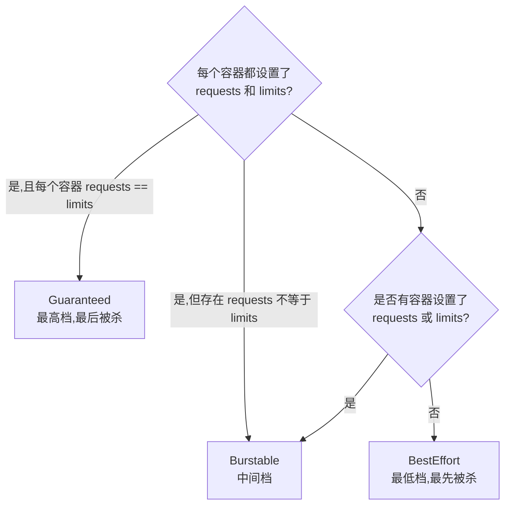

# 06 资源管理与 HPA/Job

> 属于 K8s Code 教程 · 第 06 篇
> 上一篇：[05 配置与存储：ConfigMap/Secret/PV](./05-配置与存储-ConfigMap-Secret-PV)　下一篇：[07 client-go：连接与 CRUD](./07-client-go编程-连接与CRUD)

前五章布置的活儿都是"长期值班"：Deployment 守着副本数，Service 守着流量。这一章回答三个问题：**每个 Pod 能要多少资源、抢不到时怎么办（requests/limits/QoS）**；**负载高了谁来自动加人手（HPA）**；**一次性任务和定时任务怎么写（Job/CronJob）**。

## 1. requests vs limits：入场券 vs 封顶线

给容器配资源，核心是两个字段：

- **requests**：最少要这么多——是**调度依据**。Scheduler 找节点时，按节点上所有 Pod 的 requests 之和算"还剩多少"，你申请 100m 就占 100m 的份额（[调度与控制器](/后端技术栈强化/07-k8s/调度与控制器) 里的"入场券"）。
- **limits**：最多只能用这么多——是**使用上限**。超过就动手（CPU 限速 / 内存杀掉），由节点上的 cgroup 强制。

```yaml
# code/k8s/manifests/06_hpa_job/deploy-cpu-burner.yaml（节选）
resources:
  requests:          # 调度依据：节点至少要"留"这么多
    cpu: 100m        # 100m = 0.1 核
    memory: 64Mi
  limits:            # 使用上限：最多只能用这么多
    cpu: 500m        # 0.5 核，超过会被限速
    memory: 128Mi    # 超过会被 OOMKilled
```

| 维度 | requests | limits |
|------|----------|--------|
| 谁看它 | Scheduler（调度）、HPA（算利用率） | kubelet（cgroup 强制） |
| 设高了 | 节点资源被高估，Pod 挤不进去、浪费 | 上限太高，节点可能被打爆 |
| 设低了 | 调度到挤爆的节点，运行时抢不到 | 容器随时可能被限速/被杀 |
| 不设 | 默认 0，变 BestEffort，最先被牺牲 | 无上限，可能吃光整台机器 |

## 2. CPU 和内存超限，后果完全不同

这是 K8s 里最经典的"一题两答"：

- **CPU 是可压缩资源**：超 limits 只是**限速**（throttle）。容器还在跑，只是被"踩了刹车"——调度器按比例扣它的 CPU 时间，进程变慢，但不会死。
- **内存是不可压缩资源**：超 limits 就是 **OOMKilled**。内存没法"限速"（你没法让一个进程把已分配的内存还回去慢慢用），kubelet 只能把它杀掉，容器重启，Pod 状态显示 `OOMKilled`。



比喻：CPU 超限是高速公路上被限速 80（车还在开），内存超限是油箱见底直接熄火拖走。

## 3. QoS 三档：K8s 决定先杀谁

节点内存不够时（内存压力），总得有人被杀。谁先死？K8s 按 Pod 的 **QoS 等级**排序——对资源"承诺"越少的越先死：



- **Guaranteed**：所有容器 requests == limits（且都设了）。相当于"全额预定了房间"。
- **Burstable**：至少设了 requests 或 limits，但不是每个容器都全等。相当于"订了房但可能加床"。
- **BestEffort**：一个都没设。相当于"来了就睡大厅"——节点缺资源时最先被清场。

对照我们后面要用的 cpu-burner：`requests(100m/64Mi)` ≠ `limits(500m/128Mi)`，所以它是 **Burstable**。

::: danger OOM 优先级实战意义
内存压力下，kubelet 的杀进程顺序大致是：**BestEffort 先死 → Burstable 里超限的 → Burstable 里没超限的 → Guaranteed 最后**。所以关键业务一定要配齐 requests/limits 并尽量相等（Guaranteed），才不会被"误伤"。
:::

## 4. 先装"体重秤"：metrics-server 与 kubectl top

要看资源实际用量、要让 HPA 工作，集群得先有指标来源。minikube 自带指标插件，一行开启：

```bash
# 开启 metrics-server（首次需等 1-2 分钟；生产集群通常已部署）
minikube addons enable metrics-server
kubectl get pods -n kube-system -l k8s-app=metrics-server
# NAME                              READY   STATUS    RESTARTS   AGE
# metrics-server-7b6d4f6b7d-xxxxx   1/1     Running   0          80s

# 节点层面：CPU/内存实际用量
kubectl top nodes
# NAME       CPU(cores)   CPU%   MEMORY(bytes)   MEMORY%
# minikube   352m         17%    780Mi           20%

# Pod 层面
kubectl top pods -A
# NAMESPACE   NAME                            CPU(cores)   MEMORY(bytes)
# default     cpu-burner-5b7c9f8d6c-xxxxx     496m          3Mi
```

注意 `kubectl top` 的 CPU% 是按 **实际用量 / 该 Pod 的 requests** 算的，不是 / limits——这个口径和 HPA 一模一样，先记住。

## 5. HPA：自动扩缩容的监工

Deployment 管"副本数恒定"，HPA（Horizontal Pod Autoscaler）管"副本数跟着负载变"。原理还是那个控制循环（[调度与控制器](/后端技术栈强化/07-k8s/调度与控制器) 讲过控制器模式），只是期望值变成了"算出来的"：

```mermaid
flowchart LR
    MS[metrics-server<br/>采集各 Pod CPU 用量] -->|周期性拉取| HPA[HPA 控制器<br/>autoscaling/v2]
    HPA -->|期望副本 = ceil(当前副本 × 当前利用率 ÷ 目标利用率)| DEP[Deployment]
    DEP -->|更新 replicas| RS[ReplicaSet 调副本]
    RS --> PODS[Pod 增减]
    PODS -->|利用率回落| HPA
```

核心公式（背下来，面试常问）：

```
期望副本数 = ceil(当前副本数 × 当前平均利用率 ÷ 目标利用率)
```

例：当前 1 个 Pod 的实际用量被 limits 卡在 500m，而 requests 只有 100m，利用率 = 500m ÷ 100m = 500%，目标 50% → `ceil(1 × 500% ÷ 50%) = 10`，被 `maxReplicas` 截断为 5。

实操（先用前面的 cpu-burner 制造 CPU 压力）：

```yaml
# code/k8s/manifests/06_hpa_job/hpa-cpu.yaml
apiVersion: autoscaling/v2
kind: HorizontalPodAutoscaler
metadata:
  name: cpu-burner-hpa
spec:
  scaleTargetRef:        # 管谁：管这个 Deployment
    apiVersion: apps/v1
    kind: Deployment
    name: cpu-burner
  minReplicas: 1         # 最低 1 个
  maxReplicas: 5         # 最高 5 个
  metrics:
    - type: Resource
      resource:
        name: cpu
        target:
          type: Utilization        # 按"利用率"算（实际用量 / requests）
          averageUtilization: 50   # 目标 50%
```

```bash
kubectl apply -f code/k8s/manifests/06_hpa_job/deploy-cpu-burner.yaml
kubectl apply -f code/k8s/manifests/06_hpa_job/hpa-cpu.yaml

kubectl get hpa -w        # -w 持续观察，几秒内副本数就会被顶上去
# NAME             REFERENCE              TARGETS   MINPODS   MAXPODS   REPLICAS   AGE
# cpu-burner-hpa   Deployment/cpu-burner  500%/50%  1         5         5          90s
#                   ↑当前利用率(实际/requests)         ↑最大    ↑实际副本数(已拉满)

kubectl get pods -l app=cpu-burner        # 看扩容结果：5 个副本
# NAME                          READY   STATUS    RESTARTS   AGE
# cpu-burner-5b7c9f8d6c-xxxxx   1/1     Running   0          2m
# cpu-burner-5b7c9f8d6c-yyyyy   1/1     Running   0          85s
# ...（一共 5 个）

kubectl describe hpa cpu-burner-hpa       # 看 HPA 的计算过程（Events 里有每次扩容记录）

# 顺便验证 QoS：cpu-burner 是 Burstable（requests ≠ limits）
kubectl get pod -l app=cpu-burner -o jsonpath='{.items[0].status.qosClass}'
# Burstable
```

::: tip 扩得快、缩得慢
HPA 扩容几乎是立即的，但**缩容有冷却**：默认指标稳定 5 分钟（`--horizontal-pod-autoscaler-downscale-stabilization`）才动手，防止副本数"过山车"。实验里想立刻清理，直接 `kubectl delete deploy cpu-burner`（target 没了，副本数不再有意义）。
:::

## 6. Job：跑完就走的任务

Deployment/Pod 是"长跑选手"，**Job 是"短跑选手"**：跑完（Pod 成功退出）就算完成，不再保活。经典场景：数据迁移、批量计算、一次性初始化。

```yaml
# code/k8s/manifests/06_hpa_job/job-pi.yaml
apiVersion: batch/v1
kind: Job
metadata:
  name: pi-job
spec:
  template:
    spec:
      containers:
        - name: pi
          image: perl:5.40
          command: ["perl", "-Mbignum=bpi", "-wle", "print bpi(2000)"]   # 算圆周率 2000 位
      restartPolicy: Never     # Job 的 Pod 只允许 Never 或 OnFailure
  backoffLimit: 4              # 失败最多重试 4 次（指数退避）
```

```bash
kubectl apply -f code/k8s/manifests/06_hpa_job/job-pi.yaml
kubectl get job
# NAME     COMPLETIONS   DURATION   AGE
# pi-job   1/1           11s        20s        # 1/1 = 成功 1 次 / 需要成功 1 次

# 看圆周率输出（两种等价写法）
kubectl logs job/pi-job
# 3.14159265358979323846264338327950288419716939937510...（2000 位）

kubectl logs -l job-name=pi-job    # 或按标签找 Pod 看日志

kubectl get pods -l job-name=pi-job
# NAME                READY   STATUS      RESTARTS   AGE
# pi-job-xxxxx        0/1     Completed   0          30s    # 状态是 Completed，不是 Running
```

Job 的两个并行参数（本实验用默认值 1，生产常用）：

| 参数 | 含义 | 默认 |
|------|------|------|
| `parallelism` | 同时最多几个 Pod 并行跑 | 1 |
| `completions` | 总共需要成功几次才算完成 | 1 |

```yaml
# 示例（讲解用，本次不 apply）：6 个任务、3 个并发
spec:
  parallelism: 3
  completions: 6
```

失败重试的完整链路：容器退出非 0 → 因为 `restartPolicy: Never`，kubelet 不重启容器 → **Job 控制器重建一个全新的 Pod** → 再失败继续重建，最多 `backoffLimit` 次（默认 6），且重试间隔指数退避（10s、20s、40s……上限 6 分钟）→ 超过 backoffLimit，Job 标记 Failed。

## 7. CronJob：定时的 Job

CronJob 就是"闹钟 + Job"：到点自动创建 Job。

```yaml
# code/k8s/manifests/06_hpa_job/cronjob-hello.yaml
apiVersion: batch/v1
kind: CronJob
metadata:
  name: hello-cron
spec:
  schedule: "*/1 * * * *"    # 标准 5 段 cron 表达式：每分钟一次
  jobTemplate:
    spec:
      template:
        spec:
          containers:
            - name: hello
              image: busybox:1.36
              command: ["sh", "-c", "date; echo hello from cron"]
          restartPolicy: OnFailure   # CronJob 里的 Job 常用 OnFailure
```

```bash
kubectl apply -f code/k8s/manifests/06_hpa_job/cronjob-hello.yaml
kubectl get cronjob
# NAME         SCHEDULE      SUSPEND   ACTIVE   LAST SCHEDULE
# hello-cron   */1 * * * *   False     0        9s

kubectl get jobs -w           # 每分钟冒出一个新 Job：hello-cron-<时间戳>
# NAME                  COMPLETIONS   DURATION   AGE
# hello-cron-28774000   1/1           1s         8s
# hello-cron-28774001   1/1           1s         60s

kubectl logs -l job-name=hello-cron-28774000   # 看某一次的日志（job-name 标签定位）
# Sun Aug 18 12:00:01 UTC 2025
# hello from cron

# 实验结束，清理本章所有资源
kubectl delete -f code/k8s/manifests/06_hpa_job/
```

## 练习

1. 先 `minikube addons enable metrics-server`，确认 `kubectl top nodes` 有输出。
2. apply `deploy-cpu-burner.yaml` + `hpa-cpu.yaml`，`kubectl get hpa -w` 观察副本数从 1 涨到 5（死循环 Pod 把利用率顶到 500%）；`kubectl get pods -l app=cpu-burner` 确认 5 个副本；`kubectl get pod -l app=cpu-burner -o jsonpath='{.items[0].status.qosClass}'` 验证 QoS 是 Burstable。
3. apply `job-pi.yaml`，等 `kubectl get job` 显示 `1/1`，`kubectl logs job/pi-job` 看到 2000 位圆周率。
4. apply `cronjob-hello.yaml`，`kubectl get jobs -w` 连续看两分钟，确认每分钟产生一个新 Job，并 `kubectl logs -l job-name=...` 看输出。
5. 口头解释题：三个 Pod 的 QoS 分别是 Guaranteed / Burstable / BestEffort，节点内存告急时 kubelet 按什么顺序杀？为什么 BestEffort 最先死？（提示：它对资源的"承诺"最低，杀它代价最小。）

## 面试追问

1. **内存超 limits 为什么被杀而不是限速？** 内存是不可压缩资源：进程已分配的内存没法"按比例收回"继续跑，唯一选择是杀进程释放内存；CPU 是可压缩资源，超限可以限速（throttle），容器只是变慢不死。
2. **requests 设高了/低了各有什么后果？** 设高：调度时高估需求，节点"看着满"实则空闲，浪费资源、Pod 排队挤不进来；设低：调度到拥挤节点，运行时 CPU 抢不到、内存可能被 OOM，还容易因节点超卖拖累邻居。
3. **HPA 为什么看 requests 而不是实际用量？** 两个原因：① 利用率 = 实际用量 / requests，用 requests 做分母是"容量视角"——你申请多少就按多少算水位，跨 Pod 可比；② 与调度口径一致，避免"实际用量低但节点很挤"的误判。这也是为什么 HPA 调优第一件事是调 requests，而不是调 limits。
4. **Job 失败重试机制？** `restartPolicy: Never` 时 kubelet 不重启容器，由 Job 控制器重建新 Pod，总次数受 `backoffLimit`（默认 6）限制、间隔指数退避；`restartPolicy: OnFailure` 则由 kubelet 在同一 Pod 内重启容器。完成判定：`completions` 个 Pod 成功即 Succeeded。

---

## 串起来

这一章你搞定了资源三件套：**requests 定入场券、limits 定封顶线、QoS 定谁先死**；又让副本数自己跟着负载跑（HPA），还学会了跑一次性任务（Job）和定时任务（CronJob）。到这里，"用 kubectl 指挥集群"的部分告一段落——接下来是分水岭：**从命令行切换到 Go 代码**。下一章用 client-go 连接集群、做增删改查，那是你手写 Controller 的第一块砖。

> 下一章：[07 client-go：连接与 CRUD](./07-client-go编程-连接与CRUD)
