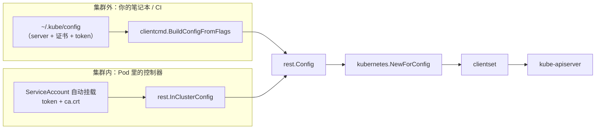
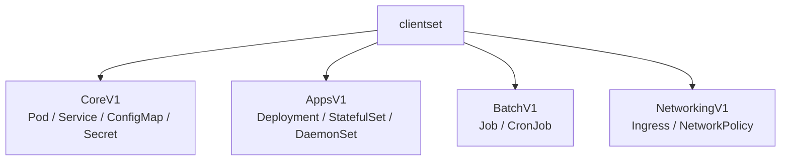

# 07 client-go 编程：连接与 CRUD

> 属于 K8s Code 教程 · 第 07 篇
> 上一篇：[06 资源管理与 HPA/Job](./06-资源管理与HPA-Job)　下一篇：[08 client-go：Informer 与 Workqueue](./08-client-go编程-Informer与Workqueue)

前六章你都在用 kubectl 指挥集群：apply、get、scale……kubectl 是"手动挡"，每个命令都得你亲手敲。这一章开始换挡：**用 Go 程序连上集群，对资源增删改查**。从这一章起，你不再是"操作员"，而是"集群的程序员"——写监控工具、写巡检脚本、甚至写控制器，都从连接集群开始。

## 1. 为什么 Go 工程师要会 client-go

把 K8s 想成一个"操作系统"：

- **etcd 是账本**：所有状态都存在里面（记忆中枢）；
- **kube-apiserver 是系统调用入口**：所有读写都必须经过它（内核接口）；
- **Pod / Deployment 是进程和服务**：跑在这个"操作系统"上的程序；
- **kubectl 是命令行**：人肉敲命令（shell）；
- **client-go 就是 SDK**：让你用 Go 代码调这个"操作系统"的 API。

kubectl 能干的，client-go 都能干；kubectl 干不了的——**自动盯着、自动补救、按规则批量处理**——只有代码能干。这就是"可编程的操作系统"的含义：集群的行为可以用代码定制。

你会 client-go 之后能做的事：

| 场景 | 例子 |
|------|------|
| 运维工具 | 批量巡检、按 label 清理资源、定时备份 |
| 业务平台 | 内部发布平台、CI/CD 插件、Job 调度平台 |
| 控制器 / Operator | 监听资源变化自动补偿（第 09、10 章） |
| 基础设施 | 自定义调度器、准入控制器、网络插件 |

> kubectl 本身也是 Go 写的，底层大量复用 client-go。会了 client-go，等于看懂了 K8s 官方工具的"引擎"。

## 2. 两种连接方式：集群外 kubeconfig vs 集群内 InCluster

client-go 连接集群，本质是：**拿到一个 `rest.Config`（服务器地址 + 认证信息），交给 `kubernetes.NewForConfig` 生成 clientset**。而 `rest.Config` 的来源有两种：



**集群外：kubeconfig**。就是你 `~/.kube/config` 里那份文件，包含 server 地址、CA 证书、client 证书/token 和 context 信息（第 01 章讲过）。代码：

```go
// code/k8s/client/01_connect/answer/answer.go（节选）
kubeconfig := os.Getenv("KUBECONFIG")            // 环境变量优先
if kubeconfig == "" {
    kubeconfig = clientcmd.RecommendedHomeFile   // 兜底：~/.kube/config
}
config, err := clientcmd.BuildConfigFromFlags("", kubeconfig) // 第一个参数 master URL，留空
if err != nil {
    return nil, err
}
client, err := kubernetes.NewForConfig(config)   // rest.Config -> clientset
```

**集群内：`rest.InClusterConfig`**。当你的程序作为 Pod 跑在集群里时（比如一个控制器），K8s 会自动给 Pod 挂一个 ServiceAccount，把 token 和 CA 证书放到固定路径。InClusterConfig 就是读这些东西，无需任何配置文件：

```go
// 只在 Pod 内部运行时调用
config, err := rest.InClusterConfig() // 自动读 ServiceAccount 的 token + ca.crt
if err != nil {
    return nil, err
}
client, err := kubernetes.NewForConfig(config)
```

两者对照：

| 维度 | kubeconfig | InClusterConfig |
|------|-----------|-----------------|
| 使用位置 | 集群外（笔记本 / CI） | 集群内（Pod） |
| 认证来源 | 配置文件显式指定 | ServiceAccount 自动挂载 |
| 适用场景 | 命令行工具、本地调试 | 控制器、Operator、Pod 内工具 |
| 集群外调用 | 正常 | 直接报错（读不到挂载文件） |

::: tip 两种都支持的通用写法
先试 `InClusterConfig`，失败再退回 kubeconfig。controller-runtime 的配置加载就是这么做的（第 10 章会见到）：

```go
config, err := rest.InClusterConfig()
if err != nil {
    config, err = clientcmd.BuildConfigFromFlags("", clientcmd.RecommendedHomeFile)
}
```
:::

## 3. clientset：分层结构的"客户端总机"

clientset 把 API 按 **group（组）/ version（版本）** 组织成一棵树，你从树根往下走就能到达任何资源：



调用链固定三步：**`client.<组版本>().<资源>(<namespace>)` → 动作（Create / Get / ...）**：

```go
client.CoreV1().Pods(ns).List(ctx, opts)                    // 核心组：Pod
client.AppsV1().Deployments(ns).Create(ctx, d, opts)        // apps 组：Deployment
client.BatchV1().Jobs(ns).Get(ctx, name, opts)              // batch 组：Job
client.CoreV1().Services(ns).Update(ctx, s, opts)           // 核心组：Service
```

| 前缀 | group/version | 管哪些资源 |
|------|--------------|-----------|
| `client.CoreV1()` | core/v1（没有 group 名） | Pod、Service、ConfigMap、Secret、Node、Namespace |
| `client.AppsV1()` | apps/v1 | Deployment、StatefulSet、DaemonSet、ReplicaSet |
| `client.BatchV1()` | batch/v1 | Job、CronJob |
| `client.NetworkingV1()` | networking.k8s.io/v1 | Ingress、NetworkPolicy |

这套 API 就是你在第 01 章见过的 `apiVersion: apps/v1` 的 Go 侧映射——**YAML 里写什么，Go 里就调什么**。

## 4. 练习 1：连上集群，列出 Pod

代码在 `code/k8s/client/01_connect`，目录结构就是本教程的标准练习结构：

```
01_connect/
├── solution.go        # 带 TODO 的骨架（你要填的）
├── solution_test.go   # 测试（fake clientset，无需集群）
├── main.go            # 真集群入口：go run . [namespace]
├── answer/answer.go   # 参考答案（自包含，可独立编译对照）
└── README.md          # 题目与命令
```

`solution.go` 里有两个函数要你实现：

```go
// BuildClient 从默认 kubeconfig（~/.kube/config）构建 clientset。
// 提示：clientcmd.BuildConfigFromFlags("", clientcmd.RecommendedHomeFile)
func BuildClient() (*kubernetes.Clientset, error) {
    // TODO: 实现你的代码
    panic("not implemented")
}

// ListPodNames 列出指定 namespace 下所有 Pod 的名字。
// 提示：client.CoreV1().Pods(namespace).List(ctx, metav1.ListOptions{})
func ListPodNames(ctx context.Context, client kubernetes.Interface, namespace string) ([]string, error) {
    // TODO: 实现你的代码
    panic("not implemented")
}
```

参考答案（`answer/answer.go`）长这样：

```go
// BuildClient 从 kubeconfig 构建 clientset（KUBECONFIG 优先，默认 ~/.kube/config）
func BuildClient() (*kubernetes.Clientset, error) {
    kubeconfig := os.Getenv("KUBECONFIG")
    if kubeconfig == "" {
        kubeconfig = clientcmd.RecommendedHomeFile
    }
    config, err := clientcmd.BuildConfigFromFlags("", kubeconfig)
    if err != nil {
        return nil, err
    }
    return kubernetes.NewForConfig(config)
}

// ListPodNames 列出指定 namespace 的 Pod 名
func ListPodNames(ctx context.Context, client kubernetes.Interface, namespace string) ([]string, error) {
    pods, err := client.CoreV1().Pods(namespace).List(ctx, metav1.ListOptions{})
    if err != nil {
        return nil, err
    }
    names := make([]string, 0, len(pods.Items))
    for _, p := range pods.Items {
        names = append(names, p.Name) // 只要名字
    }
    return names, nil
}
```

注意两点：一是 `BuildConfigFromFlags` 的第一个参数是 master URL，留空串，第二个才是 kubeconfig 路径；二是 `ListPodNames` 接收的是 `kubernetes.Interface` 接口而不是具体类型——**测试时换 fake、真集群换 clientset，函数完全不用改**，这是写可测试代码的关键习惯。

先跑测试（**不需要集群**，用的是 fake clientset，见第 7 节）：

```bash
# 第一次拉依赖：本机 proxy.golang.org 可能超时，务必先设置
export GOPROXY=https://goproxy.cn,direct

cd code/k8s/client/01_connect
go test -v
```

```text
=== RUN   TestListPodNames
    solution_test.go:28: 命名空间过滤验证通过
--- PASS: TestListPodNames (0.00s)
PASS
ok  	gocampus/k8s/client/01_connect	0.02s
```

测试通过后，连真集群（默认是你的 minikube）：

```bash
cd code/k8s/client/01_connect
go run .              # 不带参数 = 列出 default namespace
go run . kube-system  # 列出 kube-system（控制面组件所在地）
```

```text
namespace=kube-system 共有 7 个 Pod:
 - coredns-7db6d6c5d9-xxxxx
 - etcd-minikube
 - kube-apiserver-minikube
 - kube-controller-manager-minikube
 - kube-proxy-xxxxx
 - kube-scheduler-minikube
 - storage-provisioner
```

看到 coredns、etcd、kube-apiserver 这些名字，说明你的 Go 程序已经**用代码**连上了集群——这是从"kubectl 用户"到"集群程序员"的第一行代码。（minikube 比标准集群多一个 `storage-provisioner`，是它内置的动态存储供给组件。）

## 5. typed client 的五个基本操作

有了 clientset，对任何资源都是同一套五个动作（与 REST 语义一一对应）：

| 动作 | 方法 | HTTP | 语义 |
|------|------|------|------|
| 创建 | `Create(ctx, obj, opts)` | POST | 资源不存在才能建 |
| 读取 | `Get(ctx, name, opts)` | GET | 按名字取单个 |
| 更新 | `Update(ctx, obj, opts)` | PUT | **整对象替换** |
| 删除 | `Delete(ctx, name, opts)` | DELETE | 删对象（可指定优雅退出宽限期） |
| 列表 | `List(ctx, opts)` | GET | 取一批（可按 label / field 过滤） |

**为什么 Update 前要先 Get？** 这是新手最容易踩的坑：`Update` 是"整对象替换"，apiserver 会用对象里的 `resourceVersion` 做**乐观锁**——如果提交的版本比 etcd 里的旧，直接返回 409 冲突。所以正确姿势是：

```go
// 错误：自己拼一个只有名字的对象去 Update，resourceVersion 为空 → 大概率被拒
// 正确：先 Get 拿到最新对象（含 resourceVersion），改字段，再 Update
deploy, err := client.AppsV1().Deployments(ns).Get(ctx, name, metav1.GetOptions{})
if err != nil {
    return nil, err
}
deploy.Spec.Replicas = &replicas       // 只改想改的字段
return client.AppsV1().Deployments(ns).Update(ctx, deploy, metav1.UpdateOptions{})
```

client-go **不会**帮你自动 Get。生产环境更常用 `Patch`（局部更新）：只提交变化的部分，不依赖先读后写，并发也更安全——练习 2 的答案先走 Get + Update，是为了让你把语义彻底搞明白。

## 6. 练习 2：用 Go 给集群创建 Deployment

代码在 `code/k8s/client/02_crud`，四个函数对应增删改查，`solution.go` 的 TODO 分别是：

```go
// CreateDeployment 创建一个 2 副本、镜像 nginx:1.27 的 Deployment
// 提示：构造 appsv1.Deployment，调用 client.AppsV1().Deployments(ns).Create
func CreateDeployment(ctx context.Context, client kubernetes.Interface, ns, name string) (*appsv1.Deployment, error)

// ScaleDeployment 把 Deployment 的副本数改为 replicas，并返回更新后的对象
// 提示：先 Get，改 Spec.Replicas，再 Update
func ScaleDeployment(ctx context.Context, client kubernetes.Interface, ns, name string, replicas int32) (*appsv1.Deployment, error)

// DeleteDeployment 删除 Deployment，gracePeriod=0（立即删除）
func DeleteDeployment(ctx context.Context, client kubernetes.Interface, ns, name string) error

// ListDeployments 列出 namespace 下所有 Deployment 的名字
func ListDeployments(ctx context.Context, client kubernetes.Interface, ns string) ([]string, error)
```

创建是最有含金量的一步——`appsv1.Deployment` 是个深层嵌套的结构体，你得亲手把 YAML 翻译成 Go：

```go
// answer/answer.go：CreateDeployment
deploy := &appsv1.Deployment{
    ObjectMeta: metav1.ObjectMeta{
        Name:      name,
        Namespace: ns,
        Labels:    map[string]string{"app": name}, // 对象本身的标签
    },
    Spec: appsv1.DeploymentSpec{
        Replicas: ptr.To(int32(2)), // k8s.io/utils/ptr：指针字段的便捷写法
        Selector: &metav1.LabelSelector{
            MatchLabels: map[string]string{"app": name}, // 选哪些 Pod
        },
        Template: corev1.PodTemplateSpec{
            ObjectMeta: metav1.ObjectMeta{
                Labels: map[string]string{"app": name}, // Pod 模板的标签
            },
            Spec: corev1.PodSpec{
                Containers: []corev1.Container{
                    {
                        Name:  "nginx",
                        Image: "nginx:1.27",
                        Ports: []corev1.ContainerPort{{ContainerPort: 80}},
                    },
                },
            },
        },
    },
}
return client.AppsV1().Deployments(ns).Create(ctx, deploy, metav1.CreateOptions{})
```

::: warning selector 必须匹配 template labels
`spec.selector` 是 Deployment 找"自己的 Pod"的依据，必须和 `template` 里的 labels 一致，否则 apiserver 直接拒绝（ValidationError）。这是 YAML 时代就讲过的规则，换成 Go 也一样逃不掉。
:::

删改两个函数：

```go
// ScaleDeployment：Get → 改副本数 → Update
deploy, err := client.AppsV1().Deployments(ns).Get(ctx, name, metav1.GetOptions{})
if err != nil {
    return nil, err
}
deploy.Spec.Replicas = &replicas
return client.AppsV1().Deployments(ns).Update(ctx, deploy, metav1.UpdateOptions{})

// DeleteDeployment：GracePeriodSeconds=0 → 立即删除，不等优雅退出
return client.AppsV1().Deployments(ns).Delete(ctx, name,
    metav1.DeleteOptions{GracePeriodSeconds: ptr.To(int64(0))})
```

先测试，再上真集群完整走一遍：

```bash
cd code/k8s/client/02_crud
go test -v
```

```text
=== RUN   TestCreateAndListDeployment
--- PASS: TestCreateAndListDeployment
=== RUN   TestScaleDeployment
--- PASS: TestScaleDeployment
=== RUN   TestDeleteDeployment
--- PASS: TestDeleteDeployment
PASS
ok  	gocampus/k8s/client/02_crud	0.03s
```

```bash
cd code/k8s/client/02_crud
go run . create        # 创建 Deployment web（2 副本）
go run . list          # 列出 -> [web]
go run . scale 5       # 扩到 5 副本
kubectl get deploy,rs,pods -l app=web   # 看看控制器自动补 Pod
go run . delete        # 删除
```

```text
$ go run . create
已创建 Deployment web，副本数 2
$ go run . list
namespace=default 的 Deployment: [web]
$ go run . scale 5
已扩缩容到 5 副本
$ kubectl get deploy,rs,pods -l app=web
NAME   READY   UP-TO-DATE   AVAILABLE   AGE
web    5/5     5            5           30s
$ go run . delete
已删除
```

注意 `scale 5` 之后 `kubectl get` 看到 5 个 Pod READY——**补 Pod 的不是你的代码，是集群里的 Deployment 控制器**。你的代码只负责"改期望状态"，控制器负责"让现实对齐期望"。这个"声明式"分工，正是下一章 Informer 的主角。

## 7. fake clientset：没有集群也能写测试

刚才两次 `go test` 都没有连集群，靠的是 **fake clientset**（`k8s.io/client-go/kubernetes/fake`）：它在内存里实现了一整套 clientset 行为，不碰任何网络。

```go
// solution_test.go（01_connect）：fake 里预置 3 个 Pod
client := fake.NewSimpleClientset(
    &corev1.Pod{ObjectMeta: metav1.ObjectMeta{Name: "pod-a", Namespace: "default"}},
    &corev1.Pod{ObjectMeta: metav1.ObjectMeta{Name: "pod-b", Namespace: "default"}},
    &corev1.Pod{ObjectMeta: metav1.ObjectMeta{Name: "pod-c", Namespace: "kube-system"}},
)
got, err := ListPodNames(context.Background(), client, "default")
// want = ["pod-a", "pod-b"]：命名空间过滤是否正确，一条测试就验完
```

fake 的价值：

- **CI 友好**：测试不需要 minikube，跑得快、可重复；
- **行为可控**：预置对象、模拟错误都容易，真集群反而难造；
- **逼你写可测试代码**：函数签名收 `kubernetes.Interface` 接口，fake 和真 clientset 无缝互换（第 4 节 `ListPodNames` 的签名就是这么设计的）。

正因为接口设计得好，你的业务逻辑可以在 fake 上写完，再一键换真集群验证——这就是"先测逻辑，再上真集群"。

## 练习

1. 完成 `code/k8s/client/01_connect/solution.go` 的 `BuildClient` 和 `ListPodNames`，`go test -v` 通过后 `go run . kube-system` 连真集群，确认能看到控制面 Pod。
2. 完成 `code/k8s/client/02_crud/solution.go` 的四个函数，`go test -v` 通过后按 `create → list → scale 5 → delete` 完整跑一遍，中间用 `kubectl get deploy,rs,pods -l app=web` 观察控制器补 Pod。
3. 加分题：把 `CreateDeployment` 里的 `Selector` 删掉跑一次，观察 apiserver 的报错（ValidationError），记住"selector 必须匹配 template labels"。
4. 加分题：给 `ListDeployments` 加 label selector 过滤（`metav1.ListOptions{LabelSelector: "app=web"}`），体会 List 的过滤能力。

## 面试追问

1. **InClusterConfig 和 kubeconfig 有什么区别？** InClusterConfig 只能在 Pod 内用：自动读 ServiceAccount 挂载的 token / CA，集群外调用直接报错；kubeconfig 用于集群外显式指定 server 和认证。通用写法：先试 InClusterConfig，失败退回 kubeconfig。
2. **typed client 和 dynamic client 的区别？** typed client 每种资源有强类型方法和编译期检查，好用但每种资源都要生成代码；dynamic client 把对象当 `unstructured`（map）处理，运行时才知道类型，适合 CRD 等未知资源。日常首选 typed，写通用工具才用 dynamic。
3. **为什么 Update 前要先 Get？** Update 是整对象替换，靠 `resourceVersion` 乐观锁：必须提交最新版本，否则 409 冲突。client-go 不自动帮你 Get。生产更推荐 Patch 做局部更新，并发安全、流量小。
4. **fake clientset 的价值是什么？** 内存实现整套 API，测试不用集群、CI 可跑、可预置对象模拟错误；配合"函数签名收接口"的习惯，逻辑写完先 fake 验证，再一键切真集群。

---

## 串起来

这一章你学会了用 client-go 主动"问"集群：连接、List、Get、Create、Update、Delete。但**只靠 CRUD 写不出控制器**——Deployment 控制器不可能每秒钟轮询一次"Pod 够不够"。真正的控制器要"听"：集群一有变化就立刻知道。下一章讲 client-go 的监听三件套：**Watch 事件流 → SharedInformer 本地缓存 → Workqueue 解耦消费**，那是所有 K8s 控制器的标准骨架。
