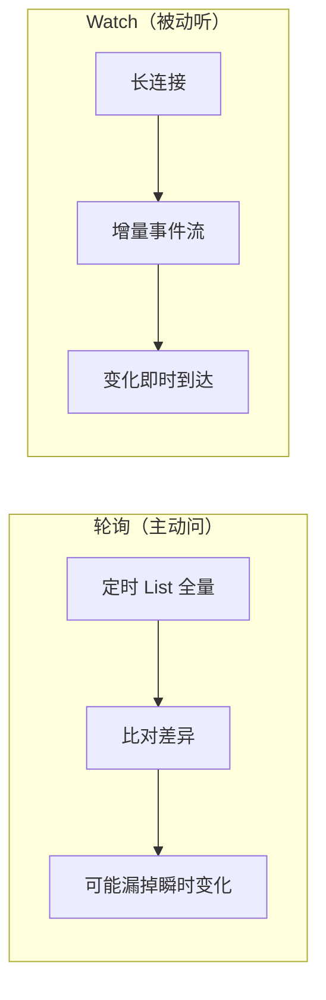
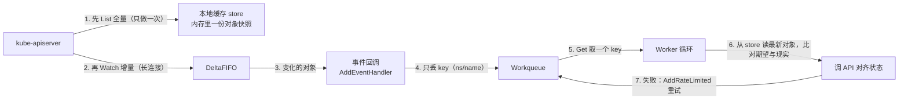
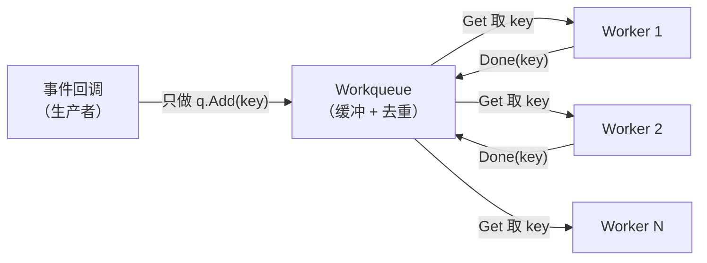

# 08 client-go 编程：Informer 与 Workqueue

> 属于 K8s Code 教程 · 第 08 篇
> 上一篇：[07 client-go：连接与 CRUD](./07-client-go编程-连接与CRUD)　下一篇：[09 手写 Controller](./09-手写Controller实战)

上一章的 CRUD 是"你问它答"：想了解状态就主动 List 一次。但控制器不能靠问——Deployment 控制器要在 Pod 挂掉的**第一时间**补一个新的，而不是等你的定时器。这一章讲"听"：**Watch 事件流 → SharedInformer 本地缓存 → Workqueue 解耦消费**。学完这一章，你手里就有一副控制器的骨架了。

## 1. 为什么轮询不行：Watch 才是声明式

最朴素的监听方案是轮询：每 5 秒 List 一次全量，比对前后差异。三个硬伤：

| 问题 | 说明 |
|------|------|
| 延迟 | 事件发生后最多要等一个周期才被发现（5s 轮询 = 平均 2.5s 延迟） |
| 浪费 | 每次都拉全量对象，集群越大越浪费 |
| 窗口期 | 轮询间隙里"发生又恢复"的变化（如瞬时失败）根本看不见 |



Watch 是**长连接 + 增量推送**：kube-apiserver 把资源变化实时推给你。它是"事件驱动"的，和 K8s 的声明式模型（[S7 理论文档](/后端技术栈强化/07-k8s/架构与核心对象)）天生一对——**你不用问，集群主动告诉你**。

## 2. 事件流：ADDED / MODIFIED / DELETED

Watch 推给你的事件基本就三种（另有一个 `ERROR` 兜底）：

| 事件 | 含义 | 类比 |
|------|------|------|
| `ADDED` | 对象被创建 | 新同事入职 |
| `MODIFIED` | 对象被更新（含状态变化） | 同事改工位 |
| `DELETED` | 对象被删除 | 同事离职 |
| `ERROR` | 连接异常（如 resourceVersion 过期） | 通讯中断 |

练习 3（`code/k8s/client/03_watch`）就是围绕这三种事件练手的：`solution.go` 里三个小函数把原始事件转成带中文说明的结构体：

```go
// ClassifyEvent：把原始事件名归类（大小写不敏感）
func ClassifyEvent(raw string) EventType {
    switch strings.ToUpper(raw) {   // "modified" -> "MODIFIED"
    case "ADDED":
        return EventAdded
    case "MODIFIED":
        return EventModified
    case "DELETED":
        return EventDeleted
    default:
        return EventType(raw)       // 未知的照原样返回
    }
}

// DescribeEvent：给每种事件一句中文说明
func DescribeEvent(e EventType) string {
    switch e {
    case EventAdded:    return "新 Pod 加入"
    case EventModified: return "Pod 配置/状态变化"
    case EventDeleted:  return "Pod 消失"
    default:            return "未知事件"
    }
}

// Summarize：把原始事件列表转成带说明的 PodEvent 列表
func Summarize(events []string) []PodEvent {
    out := make([]PodEvent, 0, len(events))
    for _, raw := range events {
        parts := strings.SplitN(raw, " ", 2) // "ADDED pod-1" -> ["ADDED", "pod-1"]
        typ := ClassifyEvent(parts[0])
        pod := ""
        if len(parts) > 1 {
            pod = parts[1]
        }
        out = append(out, PodEvent{Type: typ, Pod: pod, Reason: DescribeEvent(typ)})
    }
    return out
}
```

跑测试（纯函数，无需集群）：

```bash
cd code/k8s/client/03_watch
go test -v
```

```text
=== RUN   TestClassifyEvent
    solution_test.go:19: 事件分类验证通过
=== RUN   TestDescribeEvent
    solution_test.go:26: 事件说明验证通过
=== RUN   TestSummarize
    solution_test.go:39: 事件汇总验证通过
--- PASS: TestClassifyEvent (0.00s)
--- PASS: TestDescribeEvent (0.00s)
--- PASS: TestSummarize (0.00s)
PASS
ok  	gocampus/k8s/client/03_watch	0.02s
```

## 3. SharedInformer：先 List 全量，再 Watch 增量

直接开一个 Watch 连接有三个坑：**断线会漏事件、没有全量快照、多个消费者各开各的连接**。SharedInformer 的答案：



流程拆开看：

1. **先 List 全量进本地缓存**：启动时拉一次所有 Pod，存进内存 store。之后任何时候想读对象，直接读缓存，不用再打 API；
2. **再 Watch 增量**：新变化通过长连接推送，更新缓存并触发回调；
3. **断线自动重连**：连接断了 informer 会重新 List（或按断点续传），**不丢事件**——因为缓存是全量的，最坏情况重新全量同步一遍；
4. **Shared 的含义**：多个消费者（多个控制器）共享**同一个 informer 实例**，List / Watch 只做一次，省流量省内存。

构建 informer 用的是 informers 工厂（`solution.go` 的 `BuildInformer`）：

```go
func BuildInformer(client kubernetes.Interface, namespace string) (cache.SharedIndexInformer, error) {
    factory := informers.NewSharedInformerFactoryWithOptions(
        client,
        30*time.Second,                     // resync 周期（第 6 节讲）
        informers.WithNamespace(namespace), // 只监听指定 namespace
    )
    return factory.Core().V1().Pods().Informer(), nil // 拿到 Pod 的 informer
}
```

注册事件回调 + 启动，就是 `main.go` 干的事：

```go
informer.AddEventHandler(cache.ResourceEventHandlerFuncs{
    AddFunc: func(obj interface{}) {
        pod := obj.(*corev1.Pod)
        fmt.Printf("[%s] Added    %s/%s\n", time.Now().Format("15:04:05"), pod.Namespace, pod.Name)
    },
    UpdateFunc: func(old, new interface{}) {
        pod := new.(*corev1.Pod)
        fmt.Printf("[%s] Modified %s/%s phase=%s\n", time.Now().Format("15:04:05"),
            pod.Namespace, pod.Name, pod.Status.Phase)
    },
    DeleteFunc: func(obj interface{}) {
        // 删除事件可能拿到"墓碑"（tombstone）：对象已被清理只剩壳，要解包
        pod, ok := obj.(*corev1.Pod)
        if !ok {
            if tombstone, ok := obj.(cache.DeletedFinalStateUnknown); ok {
                pod, _ = tombstone.Obj.(*corev1.Pod)
            }
        }
        if pod != nil {
            fmt.Printf("[%s] Deleted  %s/%s\n", time.Now().Format("15:04:05"), pod.Namespace, pod.Name)
        }
    },
})
informer.Run(ctx.Done()) // 阻塞，直到 Ctrl+C 取消 ctx
```

## 4. 真集群演示：让 Pod 事件在你眼前流动

监听代码就绪，现在开两个终端，亲手"制造"事件：

```bash
# 终端 1：监听 default 的 Pod 事件（第一次拉依赖先设置代理）
export GOPROXY=https://goproxy.cn,direct
cd code/k8s/client/03_watch
go run .
```

```text
监听 namespace=default 的 Pod 事件，Ctrl+C 退出
```

```bash
# 终端 2：制造一个 Pod，再删掉它
kubectl run tmp --image=nginx:1.27
kubectl delete pod tmp
```

回到终端 1，你会看到事件一条条流出来：

```text
[10:12:05] Added    default/tmp
[10:12:07] Modified default/tmp phase=Pending
[10:12:09] Modified default/tmp phase=Running
[10:12:31] Deleted  default/tmp
```

`kubectl run` 创建一个 Pod → 一个 `Added`；Pod 从 Pending 走到 Running 是状态变化 → 两个 `Modified`；`kubectl delete` → 一个 `Deleted`。**你什么都没轮询，变化自己找上门**——这就是 Watch 的魔力，也是"监听"第一次从概念变成眼前的事实。

## 5. 回调里不干活：只把 key 丢进 Workqueue

看到上面 main.go 的回调了吗？它只 `fmt.Printf`，没干正事。真实控制器里，回调**绝不直接干活**，只做一件事：`q.Add(key)`。为什么？

| 直接干活的三个问题 | Workqueue 的答案 |
|-------------------|-----------------|
| **阻塞**：informer 事件处理是串行的，一个慢任务卡住，后面所有事件排队等 | 回调只入队、立即返回，不阻塞事件流 |
| **重复**：同 key 的 Added + Modified 会触发两遍处理 | workqueue 对相同 key **去重**，只排一次 |
| **无重试**：处理失败没有任何补偿机制 | 失败 `AddRateLimited`，按指数退避重新入队 |

key 的约定格式是 **`namespace/name`**（如 `default/tmp`）——一个字符串，既能定位对象，又天然去重。整个模式是经典的生产者-消费者：



## 6. Workqueue：Get / Done / AddRateLimited

`k8s.io/client-go/util/workqueue` 提供的接口就三个核心方法：

```go
q.Add("default/tmp")       // 入队（相同 key 只排一次）
item, shutdown := q.Get()  // 取一个；阻塞直到有货或 ShutDown
// ... 干活 ...
q.Done(item)               // 归还：标记这个 key 处理完了
q.AddRateLimited(item)     // 失败：按指数退避再入队（10ms→20ms→40ms…封顶 1000s）
```

练习 4（`code/k8s/client/04_workqueue`）就是把这个模式亲手写一遍。`solution.go` 里要用标准库实现一个最小队列（`Queue` 接口，模拟 workqueue 语义），再写 worker 循环：

```go
// StartWorkers：启动 n 个 worker，并发消费队列里的 key
func StartWorkers(ctx context.Context, q Queue, n int, fn ProcessFunc, wg *sync.WaitGroup) {
    for i := 0; i < n; i++ {
        wg.Add(1)
        go func(workerID int) {
            defer wg.Done()
            wait.UntilWithContext(ctx, func(ctx context.Context) { // 每轮循环：取一个 key 处理
                item, shutdown := q.Get()   // 取一个 key（阻塞）
                if shutdown {
                    return
                }
                if err := fn(item); err != nil {
                    fmt.Printf("worker%d 处理 %q 失败: %v，重新入队\n", workerID, item, err)
                    q.Add(item)             // 失败：重新入队（RateLimiting 的简化版）
                }
                q.Done(item)                // 处理完必须 Done，否则 key 一直"占用"
            }, time.Second)
        }(i)
    }
}

// RunWorker：启动 workers 并阻塞等待全部退出
func RunWorker(ctx context.Context, q Queue, n int, fn ProcessFunc) {
    var wg sync.WaitGroup
    StartWorkers(ctx, q, n, fn, &wg)
    wg.Wait()
}
```

三个最容易写错的细节：**`Done` 必须调用**（否则 key 永远算"处理中"，去重机制会被破坏）；**失败要重新入队**（否则失败的任务就丢了）；**`Get` 返回的 `shutdown` 要检查**（队列关闭后要退出循环，而不是死等）。

参考答案（`answer/answer.go`）更进一步：用**真实的** `workqueue.RateLimitingQueue` 通过一个 adapter 满足 `Queue` 接口，让你看到"模拟队列"和"生产队列"的无缝切换：

```go
// answer/answer.go（节选）：真实 workqueue 用法
q := workqueue.NewRateLimitingQueue(workqueue.DefaultControllerRateLimiter())
q.Add("default/nginx-1")      // 入队
item, shutdown := q.Get()     // 取一个
// ... 干活 ...
q.Done(item)                  // 归还
q.AddRateLimited(item)        // 失败：限速重试
```

先跑测试。重点看第二个用例 `TestWorkersRetryOnError`——它专门验证**"失败自动重试"**：

```bash
cd code/k8s/client/04_workqueue
go test -v
```

```text
=== RUN   TestWorkersProcessAllItems
    solution_test.go:99: 并发 worker 全部处理完成验证通过
--- PASS: TestWorkersProcessAllItems (0.11s)
=== RUN   TestWorkersRetryOnError
    solution_test.go:123: 失败重试验证通过
--- PASS: TestWorkersRetryOnError (0.10s)
PASS
ok  	gocampus/k8s/client/04_workqueue	0.32s
```

`TestWorkersRetryOnError` 的机制：入队一个 `"bad"`，处理函数前两次故意返回错误 → worker 把它重新 `Add` → 第三次成功。断言 `attempts == 3`、`adds = 1(初始) + 2(重试) = 3`、`dones = 3`——**失败的任务被重试到成功，一个都没丢**。

再跑 main.go 看并发效果（2 个 worker 抢 3 个 key）：

```bash
cd code/k8s/client/04_workqueue
go run .
```

```text
处理 default/nginx-2
处理 default/nginx-1
处理 default/nginx-3
（3 个 key 全部处理完，程序继续挂着等 Ctrl+C 退出）
```

顺序不固定——2 个 worker 并发消费，谁抢到谁处理。这正是 workqueue 模式的意义：**回调不阻塞 + 多个 worker 并行**，处理能力可以水平扩展。

## 7. 幕后：DeltaFIFO 是什么

你可能在 informer 的 mermaid 图里注意到 `DeltaFIFO` 这个名字。一句话版：**它是 informer 内部的"事件暂存队列"，把 Watch 来的变化按对象打包（如 `Added default/tmp`），同对象的多次变化会合并，控制器从这里 pop 出"最新差异"再同步**。`FIFO` 指先进先出，`Delta` 指"差异"。

你平时写控制器**不需要直接碰它**——用 informer 工厂 + `AddEventHandler` 就够了。但面试时知道它能回答"事件去哪了"：Watch → DeltaFIFO → 事件回调 → Workqueue，一条链上各司其职。

## 练习

1. 完成 `code/k8s/client/03_watch/solution.go` 的四个函数，`go test -v` 通过后 `go run .` 连真集群，另开终端 `kubectl run tmp --image=nginx:1.27` 和 `kubectl delete pod tmp`，观察 Added / Modified / Deleted 三条事件。
2. 完成 `code/k8s/client/04_workqueue/solution.go` 的 `StartWorkers` 和 `RunWorker`，`go test -v` 全绿；重点跑 `go test -v -run TestWorkersRetryOnError`，确认"失败自动重试"（最终尝试 3 次）。
3. 动手改：把 `04_workqueue/main.go` 的处理函数改成"第一个 key 返回 error"，观察 `重新入队` 的日志，体会重试机制。
4. 加分题：把 03_watch 的 `AddFunc` 改成 `q.Add(pod.Namespace + "/" + pod.Name)`（配合第 6 节的 workqueue），让 informer 和 workqueue 第一次"牵手"。

## 面试追问

1. **Informer 相比直接 Watch 解决了什么问题？** 三个：断线重连会漏事件（先 List 全量进缓存再 Watch 增量，断了重连不丢）；不用每次自己全量 List（缓存常驻内存，读对象不打 API）；同 key 多次事件要自己合并（回调 + workqueue 去重）。Shared 还让多个消费者复用同一个 informer。
2. **为什么事件回调里不直接干活？** 回调串行执行，直接干活会阻塞整个事件流；同 key 多次事件会重复干活；失败没有重试。丢 key 进 workqueue：解耦、去重、可重试、可并发。
3. **AddRateLimited 和 Add 的区别？** Add 立即入队（新事件）；AddRateLimited 按失败次数指数退避后入队（10ms→20ms→…→1000s 封顶），防止处理失败时风暴式重试。另有 AddAfter 做固定延迟。
4. **resync 的作用是什么？** informer 周期性（如 30s）把本地缓存的对象"重新广播"一遍 Modified 事件，给"漏处理 / 处理失败"兜底：哪怕事件丢了，周期性对账也能自愈。注意 resync 不重新请求 apiserver，只是重放缓存。

---

## 串起来

这一章你拿到了控制器最关键的两块拼图：**Informer 负责"感知变化"（Watch + 缓存 + 事件回调），Workqueue 负责"稳定消费"（去重 + 并发 + 重试）**。但它们是分开的零件，还没有变成一台机器。下一章把它们拼成一个完整闭环：**手写 Controller**——informer 事件入队 → worker 取出 → 从缓存读最新对象 → 调 API 对齐期望与现实，跑在真集群里，让一个 Deployment 从 1 副本自动补到 3 副本。
