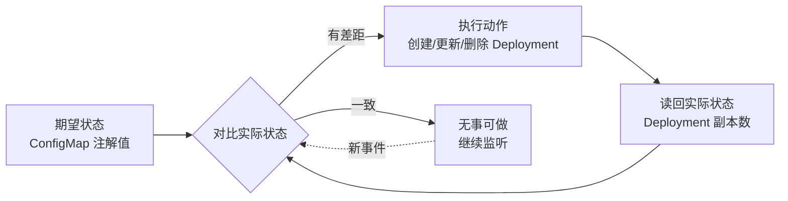
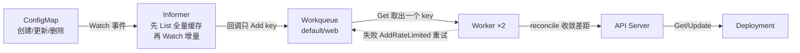

# 09 手写 Controller 实战

> 属于 K8s Code 教程 · 第 09 篇
> 上一篇：[08 client-go 编程：Informer 与 Workqueue](./08-client-go编程-Informer与Workqueue)　下一篇：[10 CRD 与 Operator 开发](./10-CRD与Operator开发)

上一章你拿到了 Informer（监听变化）和 Workqueue（排队去重）这两个零件，但它们只是零件。这一章把它们拧成一台真正的机器：**手写一个跑在真集群上的最小控制器**。它不依赖任何框架，Informer → Workqueue → Worker → Reconcile 四件套全部手搓。你会亲眼看到，一个 Go 程序如何像监工一样，把"期望状态"一点一点收敛成"实际状态"——这就是 K8s 自愈能力的源代码。

代码在 `code/k8s/controller/counter-controller/`，先 `go test` 再上真集群，全程可复现。

## 1. 控制器模式回顾：监工怎么盯"数量对不对"

K8s 所有控制器的内核是同一个循环，原理在 [S7 的《调度与控制器》](/后端技术栈强化/07-k8s/调度与控制器) 讲过，这里只快速回顾，因为本章的代码就是它的逐行实现：



- **期望状态**：ConfigMap 上的注解 `counter.example.com/desired`（比如 `"3"`）；
- **实际状态**：同名 Deployment 的 `spec.replicas`；
- **动作**：实际 ≠ 期望就 Create/Update，主资源被删就跟随着删；
- **循环**：永不停机。哪怕一切正常，控制器也一直盯着，随时准备处理下一次变化。

对比 07 章你写的 CRUD 程序：那是"你去调它一次"，控制器是"它自己永远在跑"。**同样的 client-go 代码，从函数变成循环，就从工具变成了控制器。**

## 2. 架构四件套：Informer → Workqueue → Worker → Reconcile

counter-controller 的架构和 K8s 官方控制器一模一样，一条数据流贯穿四个组件：



| 组件 | 作用 | 代码位置 |
|------|------|---------|
| SharedInformer | 监听 ConfigMap，先 List 全量进本地缓存，再 Watch 增量 | `NewController` 里的 `factory` |
| Workqueue | 缓冲事件 key（`namespace/name` 字符串），去重 + 限速重试 | `workqueue.NewRateLimitingQueue(...)` |
| Worker | 循环 `Get → reconcile → Done`，失败 `AddRateLimited` | `runWorker` / `processNextItem` |
| Reconcile | 对比期望（注解值）vs 实际（Deployment 副本数），有差距就补 | `reconcile` |

### 为什么事件回调只 `Add(key)`，绝不直接干活？

这是整个架构最核心的一个设计决定，三个理由：

1. **回调是串行执行的**。事件回调跑在 informer 的同一个 goroutine 上，你在回调里直接创建 Deployment，就是在阻塞"所有后续事件"的处理——一个慢操作让整个集群的变更通知排队。
2. **队列天然去重**。同一个 key 一秒钟被触发 10 次事件，Workqueue 里只有一条；worker 处理完这条再处理下一条，重复事件直接合并。
3. **事件会过期，状态不会**。回调里不携带业务快照，只丢一个 key；reconcile 时永远**重新读取当前状态**。所以即使某个事件处理晚了，拿到的也是最新状态——这就是为什么"丢了事件也不怕"。

::: tip 记住这句话
事件回调是"传话的"，不是"干活的"。传话 O(1)，干活交给 worker。
:::

## 3. Reconcile 为什么必须幂等

同一个 key 会被反复处理，这是常态而不是事故：

- 失败了要重试（`AddRateLimited`）；
- 多 worker 并发时，两个 worker 可能同时拿到相邻的 key；
- informer 每 30 秒 resync 一次，会重新把所有对象"重放"一遍（你可以在 `NewController` 里看到 `30*time.Second`）。

所以 reconcile 必须**幂等**：输入相同的 key，无论执行多少次，结果都一样，且没有累积副作用。

counter-controller 的写法天然满足：每次都"读现状 → 算差距 → 补差距"，**差距为零就什么都不做**。跑一次和跑一百次，集群状态一样。

反例看一眼就懂：如果不先 `Get` Deployment 就直接 `Create`，第二次 reconcile 就会拿到 `AlreadyExists` 冲突——这正是"非幂等"的代价。

## 4. WaitForCacheSync：为什么必须先等缓存同步

`Run` 里的这段代码，是所有控制器的标准开场：

```go
go c.informer.Run(ctx.Done())
// 等待本地缓存同步完成，避免"缓存还没建好就开始 Reconcile"
if !cache.WaitForCacheSync(ctx.Done(), c.informer.HasSynced) {
	return fmt.Errorf("等待 informer 缓存同步超时")
}
```

Informer 启动后的完整流程是：**先 List 全量 → 把对象灌进本地缓存 → 从 List 的 resourceVersion 开始 Watch 增量**。`WaitForCacheSync` 就是等第二步完成。

如果不等就开始 Reconcile 会怎样？缓存还是空的，所有对象看起来都"不存在"——控制器会基于错误的信息做错误的动作。而且从"进程启动"到"List 完成"之间发生的变化，只有缓存就绪后才能通过 Watch 接住。**同步门是"不丢事件、不做瞎动作"的保证**。

（本 demo 的 reconcile 为了教学直接读 API Server，而标准控制器读的是 informer 本地缓存——读缓存更快、不压 apiserver，但前提就是缓存已同步，所以这道门是标配。）

## 5. 失败重试：AddRateLimited 与指数退避

worker 处理失败的路径在 `processNextItem`：

```go
if err := c.reconcile(ctx, key.(string)); err != nil {
	// 失败：限速重试（指数退避）
	c.workqueue.AddRateLimited(key)
	fmt.Printf("reconcile %q 失败: %v\n", key, err)
	return true
}
c.workqueue.Forget(key)
```

三个方法的分工：

| 方法 | 行为 | 什么时候用 |
|------|------|-----------|
| `Add(key)` | 立即入队重试 | 事件来了，正常入队 |
| `AddRateLimited(key)` | 按失败次数指数退避（5ms → 10ms → 20ms … 上限 1000s），还有全局令牌桶限速 | reconcile 报错后 |
| `Forget(key)` | 清除该 key 的重试计数 | reconcile 成功后 |

为什么失败不能只 `Add`？想象 API Server 正在抖动，100 个 key 全部失败——如果立即重试，就是 100 倍的放大攻击，把故障雪球越滚越大。指数退避让"失败的 key 越退越慢"，同时全局限速兜底，系统才不会在故障时自爆。

别忘了 `defer c.workqueue.Done(key)`：它标记"这个 key 处理完了"，队列才能再次处理它。漏掉 `Done` 是最经典的控制器 bug。

## 6. 跟随删除：主资源没了，从资源也别留

reconcile 的开头就是"跟随删除"的实现：

```go
cm, err := c.client.CoreV1().ConfigMaps(namespace).Get(ctx, name, metav1.GetOptions{})
if errors.IsNotFound(err) {
	// ConfigMap 被删了 → 也把 Deployment 删掉（跟随删除）
	return c.client.AppsV1().Deployments(namespace).Delete(ctx, name, metav1.DeleteOptions{})
}
```

链路是这样的：`kubectl delete cm web` → informer 的 `DeleteFunc` 触发 → 丢 key 进队列 → worker 调 reconcile → 读 ConfigMap 得到 `NotFound` → 删除同名 Deployment。**主资源消失，控制器负责把从资源一起带走**，这就是"跟随删除"。

顺带铺垫一个后面章节的概念：**finalizer**。我们的跟随删除是控制器"业务代码里主动删"，而 finalizer 是平台级的"删除前钩子"：对象带着 finalizer 时，apiserver 不会真的删它，而是把它停在 `Terminating` 状态，等控制器完成清理（比如回收云资源、通知外部系统）后移除 finalizer，对象才消失。生产级 Operator 处理"删除前必须做点什么"的场景，靠的就是 finalizer——这章先知道有这回事，后面遇到 `Terminating` 卡住时你就能想起它。

## 7. 逐段拆 main.go

代码在 `code/k8s/controller/counter-controller/main.go`，四个关键函数逐个看。

### 7.1 NewController：组装零件，注册回调

```go
// Controller 控制器的核心结构：client + informer + workqueue。
type Controller struct {
	client    kubernetes.Interface
	informer  cache.SharedIndexInformer
	workqueue workqueue.RateLimitingInterface
}

// NewController 组装 informer 与 workqueue，注册事件回调。
func NewController(client kubernetes.Interface, namespace string) *Controller {
	factory := informers.NewSharedInformerFactoryWithOptions(client, 30*time.Second,
		informers.WithNamespace(namespace))          // 只监听指定 namespace
	informer := factory.Core().V1().ConfigMaps().Informer()

	c := &Controller{
		client:    client,
		informer:  informer,
		workqueue: workqueue.NewRateLimitingQueue(workqueue.DefaultControllerRateLimiter()),
	}

	// 事件回调只做一件事：把 key 丢进队列（namespace/name）
	_, _ = informer.AddEventHandler(cache.ResourceEventHandlerFuncs{
		AddFunc: func(obj interface{}) {
			key, err := cache.MetaNamespaceKeyFunc(obj)
			if err == nil {
				c.workqueue.Add(key)
			}
		},
		UpdateFunc: func(old, new interface{}) {
			key, err := cache.MetaNamespaceKeyFunc(new)
			if err == nil {
				c.workqueue.Add(key)
			}
		},
		DeleteFunc: func(obj interface{}) {
			key, err := cache.DeletionHandlingMetaNamespaceKeyFunc(obj)
			if err == nil {
				c.workqueue.Add(key)
			}
		},
	})
	return c
}
```

三个细节值得停下来看：

- **`30*time.Second`**：resync 周期。每 30 秒 informer 把所有对象重放一遍，即使 Watch 丢过事件也能兜底；
- **`WithNamespace(namespace)`**：只监听一个 namespace，demo 简单，生产里常用全量 + label selector；
- **`DeletionHandlingMetaNamespaceKeyFunc`**：删除事件拿到的是 tombstone（墓碑对象），这个函数负责从墓碑里还原出 key，防止取 key 时 panic。

### 7.2 Run：启动 informer 与 worker

```go
// Run 启动 informer 与 workers，阻塞直到 ctx 取消。
func (c *Controller) Run(ctx context.Context, workers int) error {
	defer c.workqueue.ShutDown()

	go c.informer.Run(ctx.Done())
	// 等待本地缓存同步完成，避免"缓存还没建好就开始 Reconcile"
	if !cache.WaitForCacheSync(ctx.Done(), c.informer.HasSynced) {
		return fmt.Errorf("等待 informer 缓存同步超时")
	}

	var wg sync.WaitGroup
	for i := 0; i < workers; i++ {
		wg.Add(1)
		go func() {
			defer wg.Done()
			wait.UntilWithContext(ctx, c.runWorker, time.Second)
		}()
	}
	<-ctx.Done()
	wg.Wait()
	return nil
}
```

- 先启动 informer，过同步门，再拉起 N 个 worker（`main` 里传了 `2`）；
- `wait.UntilWithContext` 让 worker 循环永不退出，`ctx` 取消时才停；
- `main()` 里用 `signal.Notify` 捕获 Ctrl+C（SIGINT/SIGTERM），取消 ctx，实现优雅退出。

### 7.3 processNextItem：队列消费者的标准骨架

```go
func (c *Controller) processNextItem(ctx context.Context) bool {
	key, shutdown := c.workqueue.Get()
	if shutdown {
		return false
	}
	defer c.workqueue.Done(key)

	if err := c.reconcile(ctx, key.(string)); err != nil {
		// 失败：限速重试（指数退避）
		c.workqueue.AddRateLimited(key)
		fmt.Printf("reconcile %q 失败: %v\n", key, err)
		return true
	}
	c.workqueue.Forget(key)
	return true
}
```

这就是第 2 节那张数据流图的"消费者"半环：`Get`（取出一个 key）→ `reconcile`（干活）→ `Done`（释放）→ 失败 `AddRateLimited` / 成功 `Forget` → 继续下一个。**这个骨架值得背下来**，K8s 官方 controller 的 worker 长这样，你以后写任何控制器都用得上。

### 7.4 reconcile：收敛差距的核心

```go
func (c *Controller) reconcile(ctx context.Context, key string) error {
	namespace, name, err := cache.SplitMetaNamespaceKey(key)
	if err != nil {
		return err
	}

	cm, err := c.client.CoreV1().ConfigMaps(namespace).Get(ctx, name, metav1.GetOptions{})
	if errors.IsNotFound(err) {
		// ConfigMap 被删了 → 也把 Deployment 删掉（跟随删除）
		return c.client.AppsV1().Deployments(namespace).Delete(ctx, name, metav1.DeleteOptions{})
	}
	if err != nil {
		return err
	}

	// 没有注解 → 忽略
	raw, ok := cm.Annotations[annotationKey]
	if !ok {
		return nil
	}
	desired, err := strconv.Atoi(strings.TrimSpace(raw))
	if err != nil {
		return fmt.Errorf("注解 %s=%q 不是合法数字", annotationKey, raw)
	}

	deploy, err := c.client.AppsV1().Deployments(namespace).Get(ctx, name, metav1.GetOptions{})
	if errors.IsNotFound(err) {
		// Deployment 不存在 → 创建
		_, err = c.client.AppsV1().Deployments(namespace).Create(ctx,
			appsv1Deployment(namespace, name, int32(desired)), metav1.CreateOptions{})
		return err
	}
	if err != nil {
		return err
	}

	// 副本数一致 → 无需动作（收敛完成）
	if deploy.Spec.Replicas != nil && int(*deploy.Spec.Replicas) == desired {
		return nil
	}
	deploy.Spec.Replicas = int32Ptr(int32(desired))
	_, err = c.client.AppsV1().Deployments(namespace).Update(ctx, deploy, metav1.UpdateOptions{})
	return err
}
```

整个函数就是一个"读现状 → 算差距 → 补差距"的分支决策表：

| 条件 | 动作 |
|------|------|
| ConfigMap 不存在 | 删除同名 Deployment（跟随删除） |
| ConfigMap 没有注解 | 忽略，什么都不做 |
| 注解不是数字 | 返回错误 → 触发限速重试 |
| Deployment 不存在 | 用 `appsv1Deployment` 创建（副本数 = 注解值） |
| 副本数一致 | 什么都不做（收敛完成，幂等） |
| 副本数不一致 | 更新副本数 |

Deployment 的构造在 `code/k8s/controller/counter-controller/helpers.go` 里（`appsv1Deployment`）：标签 `app: <name>` + `managed-by: counter-controller`，Selector 匹配 `app: <name>`，模板是 `nginx:1.27`。注意 **Selector 一旦创建就不能改**（immutable），所以它是创建时定死的。

## 8. main_test.go：五个场景一次验证

测试在 `code/k8s/controller/counter-controller/main_test.go`，用的是 `k8s.io/client-go/kubernetes/fake` 的 **fake clientset**——纯内存模拟 API Server，不连任何集群。测试策略是"只测 reconcile 这一个纯函数"：不启动 informer、不连集群，直接构造 `Controller{client: fake}` 调 `reconcile`。

```bash
cd code/k8s/controller/counter-controller
go test -v
```

5 个用例覆盖了 reconcile 的所有分支：

| 测试函数 | 场景 | 验证点 |
|---------|------|--------|
| `TestReconcileCreateDeployment` | 注解 `3`，Deployment 不存在 | 创建了同名 Deployment，副本数 = 3 |
| `TestReconcileScaleToMatch` | 注解 `5`，但已有 2 副本的 Deployment | 副本数被收敛到 5 |
| `TestReconcileNoAnnotationIgnored` | ConfigMap 没有注解 | 不创建 Deployment |
| `TestReconcileDeleteFollows` | ConfigMap 不存在 | 同名 Deployment 被跟随删除 |
| `TestReconcileInvalidAnnotation` | 注解是 `not-a-number` | reconcile 返回错误（触发限速重试） |

这种"把核心逻辑写成纯函数 + fake client 测试"的套路，是控制器工程化的基础：**能单测的逻辑绝不依赖真集群**。

## 9. 真集群实操：亲眼看见收敛

前提：minikube 已启动（`kubectl get nodes` 看到 Ready）。全程两个终端。

**终端 A**（从仓库根目录）：

```bash
cd code/k8s/controller/counter-controller
go run .        # 启动控制器，监听 default namespace
```

预期输出：

```
counter-controller 启动，监听 namespace=default 的 ConfigMap 注解 counter.example.com/desired
```

**终端 B**：

```bash
# 1. 创建带注解的 ConfigMap（desired=3）
kubectl apply -f code/k8s/manifests/09_controller/cm-web.yaml
# 预期: configmap/web created

# 2. 观察控制器自动创建 Deployment 并设副本数为 3
kubectl get deploy web -w
# 预期: READY 从 0/3 逐渐变成 3/3

# 3. 把注解改成 5，观察副本数收敛
kubectl annotate cm web counter.example.com/desired=5 --overwrite
# 预期: configmap/web annotated
kubectl get deploy web -w
# 预期: READY 从 3/3 变成 5/5（中间可能短暂 4/5）

# 4. 删除 ConfigMap，观察跟随删除
kubectl delete cm web
# 预期: configmap "web" deleted
kubectl get deploy web
# 预期: Error from server (NotFound): deployments.apps "web" not found
```

注意控制器只在启动和出错时打印日志，成功收敛靠 `kubectl` 观察——这也符合控制器的性格：**安静地干活，把差距抹平。**

## 练习

1. **先跑测试**：`cd code/k8s/controller/counter-controller && go test -v`，确认 5 个用例全过。失败时看 `t.Log` 的输出定位。
2. **再跑真集群**：按第 9 节完整走一遍 apply → annotate → delete，观察三次收敛（建 3 副本 → 改 5 副本 → 跟随删除）。
3. **加个"数据变更打印日志"**：在 `reconcile` 里拿到 `cm` 之后加几行，把 `cm.Data` 打印出来：

```go
// 练习：每次 reconcile 打印 ConfigMap 的数据内容
if app := cm.Data["app"]; app != "" {
	fmt.Printf("ConfigMap %s/%s 的数据: %s\n", namespace, name, app)
}
```

   apply 之后 `kubectl edit cm web` 改 `data.app` 的值保存，观察终端 A 是否打印出新数据。想想：为什么"只改 data 不改注解"也能触发 reconcile？（提示：任何字段变化都会触发 UpdateFunc。）

## 面试追问

1. **为什么事件回调不能直接干活？** 回调在 informer 的共享 goroutine 上串行执行，直接干活会阻塞所有后续事件；队列解耦后入队是 O(1)，还能去重、削峰，且 reconcile 总是重读当前状态，事件旧了也无所谓。
2. **Reconcile 为什么必须幂等？** 同一个 key 会被重试、多 worker 并发、resync 反复处理；必须"结果一样"。收敛式写法（读现状→算差距→补差距，无差距不动）天然幂等。
3. **AddRateLimited 和 Add 的区别？** Add 立即入队；AddRateLimited 带指数退避（5ms 起、上限 1000s）和全局限速，失败风暴时不雪崩；Forget 在成功后清掉重试计数。
4. **WaitForCacheSync 的作用？** 等 informer 首次 List 完成、本地缓存就绪再启动 worker；否则缓存是空的，控制器会基于错误信息做动作，且 List 到 Watch 之间的事件可能丢。
5. **控制器崩溃重启后会怎样？为什么能自愈？** 重启后 informer 重新 List 全量并重建缓存，初始 List 会为每个已存在的对象触发一次 AddFunc——所有 key 重新入队、全部重新 reconcile，任何遗留的差距都被重新收敛。控制器本身无状态，状态全在 apiserver/etcd，所以崩溃 = 重来一遍，而不是丢状态。

---

## 串起来

这一章你手搓了 K8s 控制器的完整骨架：Informer 监听、Workqueue 排队、Worker 循环、Reconcile 收敛，并见证了它在真集群上把"ConfigMap 注解"变成"Deployment 副本数"。但还差最后一环：**期望状态目前用注解字符串表达，又丑又不安全**——没有类型校验、没有 schema、`kubectl get` 都不认识它。下一篇用 **CRD 把自定义对象变成一等公民**，再用 controller-runtime 写一个真正的 Operator：WebApp 资源 + 自动管理 Deployment + 状态回写。
