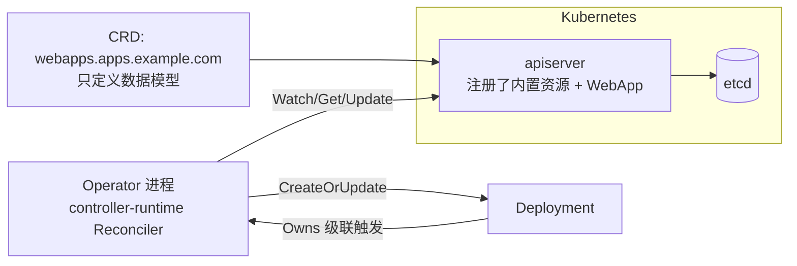

# 10 CRD 与 Operator 开发

> 属于 K8s Code 教程 · 第 10 篇
> 上一篇：[09 手写 Controller 实战](./09-手写Controller实战)　下一篇：[11 调度器深入](./11-调度器深入)

上一章我们用 ConfigMap 注解表达"期望状态"，那是把自定义业务对象硬塞进内置资源的**野路子**：注解是字符串，没类型校验，`kubectl get` 也不认识它。这一章升级为正道：**CRD（CustomResourceDefinition）把业务对象变成 K8s 的一等公民，controller-runtime 让你用最少的代码写出生产级 Operator**。你会亲手造出一个 `WebApp` 资源，并让一个 Operator 替它管理 Deployment、回写状态。

代码在 `code/k8s/operator/`，不用 kubebuilder 脚手架，Reconciler 全部手写——先看懂本质，再去用脚手架。

## 1. 为什么需要 CRD：K8s 的 API 是可扩展的

K8s 的核心是一套"资源 REST API"：`Pod`、`Deployment`、`ConfigMap` 这些内置类型，本质是 apiserver 里注册好的一种种对象，存进 etcd。问题来了：**业务想要自己的对象怎么办？**

- 09 章的做法：塞进 ConfigMap 注解——没有 schema、没有校验、没有类型安全；
- CRD 的做法：告诉 apiserver"我要注册一种新资源"，从此它和 `Deployment` 平起平坐。

CRD 本身**不含任何逻辑**，它只是登记一种新资源类型的"数据模型"。真正干活的是配套的**控制器（Controller）**。两者合起来就叫 **Operator**：

```
CRD（声明"WebApp 长什么样"） + 控制器（声明"WebApp 被创建后该干什么"） = Operator
```



类比：CRD 是"岗位说明书"（这个岗位叫 WebApp，有什么字段），Operator 是"这个岗位的员工"（WebApp 一入职，就替它把 Deployment 安排妥当）。

## 2. CRD 声明要素：逐字段拆 crd-webapp.yaml

```yaml
# code/k8s/manifests/10_crd/crd-webapp.yaml
apiVersion: apiextensions.k8s.io/v1   # CRD 自己的 API 版本
kind: CustomResourceDefinition
metadata:
  name: webapps.apps.example.com      # 必须是 "复数.组名"，全局唯一
spec:
  group: apps.example.com             # API 组：资源的"域名"
  names:
    kind: WebApp                      # Go 类型名 / YAML 里的 kind
    listKind: WebAppList
    plural: webapps                   # REST 路径 / kubectl 用复数
    singular: webapp
    shortNames:
      - wa                           # kubectl get wa 也能用
  scope: Namespaced                   # 资源是命名空间级的（还有 Cluster 级）
  versions:
    - name: v1
      served: true                    # 这个版本对外提供服务（可多个并存）
      storage: true                   # 只有一个是存储版本（写进 etcd 的格式）
      # 声明 schema：spec 必填 replicas 与 image，status 放实际副本数
      schema:
        openAPIV3Schema:
          type: object
          properties:
            spec:
              type: object
              required: ["replicas", "image"]
              properties:
                replicas:
                  type: integer
                  minimum: 1
                image:
                  type: string
            status:
              type: object
              properties:
                readyReplicas:
                  type: integer
      # 开启 status 子资源：允许控制器单独更新 status
      subresources:
        status: {}
```

每个字段都对应一个真实约束，逐个说：

| 字段 | 含义 | 为什么重要 |
|------|------|-----------|
| `metadata.name` | `复数.组`（如 `webapps.apps.example.com`） | CRD 的对象名就是这么约定的，全局唯一 |
| `spec.group` | API 组，如 `apps.example.com` | 相当于资源的"域名"，避免和别人的资源撞名 |
| `spec.names` | kind / plural / singular / shortNames | 决定 YAML 写 `kind: WebApp`、命令写 `kubectl get webapps` 或 `kubectl get wa` |
| `spec.scope` | `Namespaced` 或 `Cluster` | 资源是按 namespace 隔离，还是集群全局一份 |
| `versions[].name` | 版本号，如 `v1` | 多版本并存时，`served` 决定谁能用，`storage` 决定存哪种格式（永远只有一个 storage） |
| `versions[].schema` | OpenAPI v3 结构 | apiserver 用它做**校验**：`replicas` 必须填、必须是整数、最小 1。填错直接拒绝，不再靠控制器兜底 |
| `versions[].subresources.status` | 开启 status 子资源 | 第 5 节细讲：让控制器能独立更新 status |

apply 之后，这个类型立刻变成真实的 API 端点：

```bash
kubectl apply -f code/k8s/manifests/10_crd/crd-webapp.yaml
# 预期: customresourcedefinition.apiextensions.k8s.io/webapps.apps.example.com created

kubectl get crd | grep webapp
# 预期: webapps.apps.example.com   2025-xx-xxTxx:xx:xxZ

kubectl get wa            # shortNames 生效
# 预期: No resources found（还没有实例）
```

试试校验能力：把 `replicas` 写成字符串或 `0`，apply 会被 apiserver 直接拒绝——这就是 schema 的价值，比 09 章的"字符串注解 + 控制器里手工解析"安全一个量级。

## 3. controller-runtime 架构：Manager 是总管家

上一章的四件套（Informer / Workqueue / Worker / Reconcile）你还得手搓，这一章换 `sigs.k8s.io/controller-runtime`，**四件套全部由框架生成**，你只需要写两样东西：Reconciler 和注册规则。

```mermaid
flowchart LR
    CR[WebApp 自定义资源<br/>apps.example.com/v1] -->|For: 主资源变化触发| MGR[Manager<br/>缓存 + client + 事件队列]
    MGR --> R[Reconciler<br/>你的业务逻辑]
    R -->|CreateOrUpdate| D[Deployment]
    D -->|Owns: 自己管的资源变化<br/>级联触发| MGR
    R -->|Status().Update| CR
```

| 组件 | 职责 | 对应代码 |
|------|------|---------|
| `Manager` | 总管家：持有 scheme、缓存（Informer）、client（读缓存、写 apiserver）、优雅退出 | `ctrl.NewManager(...)` |
| `For(&WebApp{})` | 声明"WebApp 是主资源"，它的任何变化都会触发 Reconcile | `SetupWithManager` |
| `Owns(&Deployment{})` | 声明"本控制器创建的 Deployment 也归我管"，它们变化同样触发 Reconcile | `SetupWithManager` |
| `Reconciler` | 你只实现一个 `Reconcile(ctx, req)` 方法，入参只有 `req.NamespacedName` | `WebAppReconciler` |

注意一个和 09 章的巨大差别：**你不再手动碰队列**。框架把事件处理成一个个 `reconcile.Request`（里面只有一个 `NamespacedName`，即 `namespace/name`），失败自动重试、成功自动 Forget——09 章手搓的 `processNextItem`，到这里变成框架内建行为。

## 4. CreateOrUpdate：声明式"补差距"的一行实现

09 章你手写了 `Get → IsNotFound → Create / 判等 → Update`，这一章框架给了一行等价物：

```go
// main.go 第 2 段：构造期望 Deployment，交给 CreateOrUpdate 收敛
deploy := &appsv1.Deployment{ObjectMeta: metav1.ObjectMeta{Name: wa.Name, Namespace: wa.Namespace}}
result, err := controllerutil.CreateOrUpdate(ctx, r.Client, deploy, func() error {
	deploy.Labels = map[string]string{"app": wa.Name, "managed-by": "webapp-operator"}
	deploy.Spec = appsv1.DeploymentSpec{
		Replicas: &wa.Spec.Replicas,
		Selector: &metav1.LabelSelector{MatchLabels: map[string]string{"app": wa.Name}},
		Template: corev1.PodTemplateSpec{
			ObjectMeta: metav1.ObjectMeta{Labels: map[string]string{"app": wa.Name}},
			Spec: corev1.PodSpec{
				Containers: []corev1.Container{
					{Name: "app", Image: wa.Spec.Image},
				},
			},
		},
	}
	return nil
})
```

语义拆开就是 09 章 reconcile 的"补差距"逻辑：

1. 先 `Get`：Deployment 不存在 → 用当前内容 `Create`；
2. 存在 → 先执行你的 mutate 函数（把期望 Spec 写进去），再 `Update`；
3. 返回值 `result` 告诉你这次是 `created` 还是 `updated`（或 `unchanged`），日志里可以直接打印。

**幂等性**：每次 Reconcile 跑出来的结果一致——存在就更新成期望值，不存在就创建，差距为零时框架检测到无变化就不发 Update。而且冲突处理（比如 Deployment 被别的东西改了）由框架内部用 Patch 语义自动重试，不用你写。

::: tip 声明式 vs 命令式
你从不写"创建"或"更新"的 if 分支，只写"期望长什么样"。**把期望值写对，剩下的交给循环**——这就是声明式，也是 09 章那个监工循环的框架化封装。
:::

## 5. status 子资源：谁有权写"实际状态"

CRD 里 `subresources.status: {}` 那一行，开启了一个隐藏 API 端点 `/status`。它的意义在于**权限隔离**：

- 普通用户 `apply` 只能写 `spec`，写 `status` 会被 apiserver 拒绝（或忽略）；
- 只有控制器能通过 `r.Status().Update(...)` 写 `status`。

为什么这样设计？想想 WebApp 的 `readyReplicas`：它是**实际状态**，只能由控制器观察 Deployment 后回写。如果用户 apply 时手滑把 `readyReplicas: 99` 写进去，或者两个控制器互相覆盖，状态就失真了。把 spec（期望，用户写）和 status（实际，控制器写）分成两个通道，互不干扰：

```go
// main.go 第 3 段：回写 status
ready := deploy.Status.ReadyReplicas        // 实际 Deployment 的就绪副本数
if wa.Status.ReadyReplicas != ready {       // 有变化才写，避免无意义 Update
	wa.Status.ReadyReplicas = ready
	if err := r.Status().Update(ctx, &wa); err != nil {
		return reconcile.Result{}, err
	}
}
```

这也是"控制器闭环"的最后一块：**期望（spec）→ 动作（Deployment）→ 观测（readyReplicas）→ 回写（status）→ 用户看到状态**。

## 6. OwnerReference 与级联清理

`Owns(&appsv1.Deployment{})` 不只帮你监听，它还做了一件关键的事：**创建 Deployment 时自动给它打上 `ownerReferences`，指向 WebApp**。

```yaml
# 实际集群里 Deployment 的 metadata 会长这样（省略版）
metadata:
  ownerReferences:
    - apiVersion: apps.example.com/v1
      kind: WebApp
      name: myapp
      uid: xxxx-xxxx
```

有了这层引用，删除就变成了平台级行为：**`kubectl delete webapp myapp` 时，apiserver 的 GC（Garbage Collector）控制器看到 owner 被删，自动把 Deployment 一起删掉**——即使你的 Operator 进程当时没在运行。

对比 09 章的"跟随删除"：

| | 09 章 client-go 控制器 | 本章 controller-runtime |
|---|---|---|
| 删除机制 | 业务代码里主动删（靠事件驱动） | OwnerReference + 平台 GC（声明式） |
| Operator 不在线时 | 从资源遗留 | GC 依然会清理 |
| 额外能力 | 无 | 级联策略可配（foreground/background/orphan） |

这就是"平台能力"和"业务逻辑"的分工：**级联清理是 K8s 平台的职责，别自己重造**。

## 7. 代码讲解

### 7.1 Reconcile 三段式

`code/k8s/operator/main.go` 的 `Reconcile` 只有三段，对应闭环的三个环节：

```go
// Reconcile 核心逻辑：WebApp → 期望 Deployment；Deployment 变化 → 回写 status。
func (r *WebAppReconciler) Reconcile(ctx context.Context, req reconcile.Request) (reconcile.Result, error) {
	logger := log.FromContext(ctx)
	logger.Info("reconcile", "webapp", req.NamespacedName)

	// 1. 读取 WebApp；不存在说明被删了，无需动作
	var wa webappv1.WebApp
	if err := r.Get(ctx, req.NamespacedName, &wa); err != nil {
		return reconcile.Result{}, client.IgnoreNotFound(err)
	}

	// 2. 构造期望 Deployment（复用 reconcile 模式：读现状 → 算差距 → 补差距）
	deploy := &appsv1.Deployment{ObjectMeta: metav1.ObjectMeta{Name: wa.Name, Namespace: wa.Namespace}}
	result, err := controllerutil.CreateOrUpdate(ctx, r.Client, deploy, func() error {
		deploy.Labels = map[string]string{"app": wa.Name, "managed-by": "webapp-operator"}
		deploy.Spec = appsv1.DeploymentSpec{
			Replicas: &wa.Spec.Replicas,
			Selector: &metav1.LabelSelector{MatchLabels: map[string]string{"app": wa.Name}},
			Template: corev1.PodTemplateSpec{
				ObjectMeta: metav1.ObjectMeta{Labels: map[string]string{"app": wa.Name}},
				Spec: corev1.PodSpec{
					Containers: []corev1.Container{
						{Name: "app", Image: wa.Spec.Image},
					},
				},
			},
		}
		return nil
	})
	if err != nil {
		return reconcile.Result{}, err
	}
	logger.Info("deployment reconciled", "op", result)

	// 3. 回写 status（读取实际 Deployment 的 readyReplicas）
	ready := deploy.Status.ReadyReplicas
	if wa.Status.ReadyReplicas != ready {
		wa.Status.ReadyReplicas = ready
		if err := r.Status().Update(ctx, &wa); err != nil {
			return reconcile.Result{}, err
		}
	}
	return reconcile.Result{}, nil
}
```

| 段 | 干什么 | 对应闭环环节 |
|----|--------|------------|
| 第 1 段 | 读 WebApp；`IgnoreNotFound` 把"对象已删"当成正常情况（无需动作） | 读期望 |
| 第 2 段 | `CreateOrUpdate` 收敛 Deployment（创建/更新/无变化） | 补差距 |
| 第 3 段 | 观察实际副本数，回写 `status.readyReplicas` | 观测与回写 |

注册规则在 `SetupWithManager`，两行搞定，框架替你生成 Informer + Workqueue + 重试：

```go
// SetupWithManager 注册：监听 WebApp 变更 + 自己创建的 Deployment 变更（级联触发）。
func (r *WebAppReconciler) SetupWithManager(mgr manager.Manager) error {
	return ctrl.NewControllerManagedBy(mgr).
		For(&webappv1.WebApp{}).
		Owns(&appsv1.Deployment{}).
		Complete(r)
}
```

### 7.2 webapp_types.go：手写类型三件套

Go 类型定义在 `code/k8s/operator/api/v1/webapp_types.go`，它必须和 CRD 的 schema 一一对应：

```go
// WebAppSpec WebApp 的期望状态。
type WebAppSpec struct {
	Replicas int32  `json:"replicas"`   // 期望副本数
	Image    string `json:"image"`      // 容器镜像
}

// WebAppStatus WebApp 的实际状态。
type WebAppStatus struct {
	ReadyReplicas int32 `json:"readyReplicas,omitempty"` // 当前就绪副本数（由控制器回写）
}

// WebApp 是 CRD apps.example.com 的 Go 表示。
type WebApp struct {
	metav1.TypeMeta   `json:",inline"`
	metav1.ObjectMeta `json:"metadata,omitempty"`
	Spec   WebAppSpec   `json:"spec,omitempty"`
	Status WebAppStatus `json:"status,omitempty"`
}
```

除结构体之外还有两样"必须手写"的样板，理解它们为什么存在：

- **`DeepCopyObject` / `DeepCopy`**：Informer 的本地缓存被多个 goroutine 共享，缓存里的对象**不能直接改**（会数据竞争）。任何拿到对象后想改一改再写回的操作，都得先深拷贝。所以每个类型都要实现深拷贝。这里手写是因为我们没上 kubebuilder 的代码生成器，生产项目里这堆代码是 `controller-gen` 自动生成的。
- **`AddToScheme`**：client-go 靠 scheme 把 Go 类型和 API 的 `group/version/kind` 对应起来，才能序列化/反序列化。不注册，controller-runtime 的 client 就不认识 `WebApp`。`main.go` 的 `init()` 里把内置类型和我们的类型都注册进 scheme：

```go
var scheme = runtime.NewScheme()

func init() {
	utilruntime.Must(clientgoscheme.AddToScheme(scheme)) // 内置资源（Pod/Deployment...）
	utilruntime.Must(webappv1.AddToScheme(scheme))       // 我们的 WebApp
}
```

### 7.3 与 09 章 client-go 控制器的差异

| 维度 | 09 章 client-go 控制器 | 本章 controller-runtime |
|------|----------------------|------------------------|
| 监听对象 | 手动建 Informer + Workqueue + 回调 | `For` / `Owns` 声明式注册，框架生成 |
| 收敛动作 | 手写 `Get → IsNotFound → Create/Update` | `CreateOrUpdate` 一行搞定 |
| 更新冲突 | 直接 `Update`，冲突要自己处理 | 框架内部自动处理（Patch 语义 + 重试） |
| 重试机制 | 自己 `AddRateLimited` | 框架内建（返回 error 就重试） |
| 状态回写 | 没有（demo 没做 status） | `Status().Update` + status 子资源 |
| 级联清理 | 业务代码"跟随删除" | OwnerReference + 平台 GC |
| 适合场景 | 理解原理、轻量单资源 | 生产 Operator、多资源编排 |

一句话总结：**09 章教你怎么造轮子，这一章教你怎么用轮子**。两个都会，面试和工程都稳。

## 8. 真集群实操

前提：minikube 在跑。全程两个终端，从仓库根目录开始。

**终端 A：先装 CRD 和示例资源，再启动 operator**

```bash
# 1. 安装 CRD（注册 WebApp 类型）
kubectl apply -f code/k8s/manifests/10_crd/crd-webapp.yaml
# 预期: customresourcedefinition.apiextensions.k8s.io/webapps.apps.example.com created

# 2. 创建一个 WebApp 实例（replicas: 3, image: nginx:1.27）
kubectl apply -f code/k8s/manifests/10_crd/webapp-sample.yaml
# 预期: webapp.apps.example.com/myapp created

# 3. 启动 operator（本机跑，等价于集群内运行）
cd code/k8s/operator
go run .
# 预期: webapp-operator 启动（先 apply CRD 和 WebApp 再运行）
#       然后不断打印 reconcile 日志（INFO reconcile webapp=default/myapp 等）
```

**终端 B：观察收敛**

```bash
# 4. 观察 WebApp 和它管理的 Deployment
kubectl get webapp,deploy -w
# 预期: WebApp 行出现（NAME / AGE）；
#       deployment.apps/myapp 被自动创建，READY 从 0/3 变成 3/3
# （webapp 默认只显示 NAME/AGE，状态要看 yaml，见第 6 步）

# 5. 把副本数改成 5，观察 Deployment 自动收敛
kubectl patch webapp myapp --type=merge -p '{"spec":{"replicas":5}}'
# 预期: webapp.apps.example.com/myapp patched
kubectl get deploy myapp -w
# 预期: READY 从 3/3 变成 5/5

# 6. 看 status 回写
kubectl get webapp myapp -o yaml
# 预期: 末尾出现
#   status:
#     readyReplicas: 5
```

验证完清理现场（顺便观察级联删除）：

```bash
kubectl delete webapp myapp
kubectl get deploy myapp        # 预期: NotFound（OwnerReference 级联 GC）
```

## 练习

1. **编译检查**：`cd code/k8s && go build ./operator/...`，通过即证明类型定义、scheme 注册、controller-runtime 调用全部正确。
2. **跑通演示**：按第 8 节完整走一遍，重点确认 `status.readyReplicas` 的回写和删除时的级联清理。
3. **改镜像观察更新**：在 operator 运行中执行

```bash
kubectl patch webapp myapp --type=merge -p '{"spec":{"image":"nginx:1.28"}}'
kubectl get deploy myapp -o wide   # 观察镜像字段变化
```

   观察 Deployment 的镜像被更新、Pod 滚动发布。想想：这次动作来自哪条链路？（提示：WebApp 变化触发 For 的 Reconcile → CreateOrUpdate 的 mutate 把新 image 写进 Deployment → Deployment 自己滚动更新。）

## 面试追问

1. **为什么 CRD 要声明 status 子资源？** 把"期望（spec）"和"实际（status）"分成两个写通道：普通用户只能写 spec，控制器只能通过 `/status` 端点写 status，防止互相覆盖；也是 apiserver 校验与后续权限控制的边界。
2. **Owns 与手动 Watch 的区别？** Owns 自动给资源打 OwnerReference、只关心"自己创建的"资源，删除时平台 GC 级联清理；手动 Watch 要自己过滤、自己维护 owner 关系。
3. **CreateOrUpdate 如何保证幂等？** 先 Get：不存在则 Create，存在则先 mutate 再 Update；每次运行结果一致，差距为零就不发 Update；冲突由框架内部用 Patch 语义自动处理。
4. **Operator 与普通脚本的本质区别？** 脚本是"一次性、命令式"；Operator 是"声明式 + 事件驱动 + 持续控制循环 + 自动重试 + 状态闭环"，天然自愈——崩了重启后重新收敛，不依赖人肉补跑。
5. **kubebuilder 脚手架解决了什么问题？** 全部样板代码：类型 DeepCopy、AddToScheme、CRD YAML 生成（controller-gen）、RBAC 注解、envtest 测试框架、多版本转换。手写版让你理解本质，生产用脚手架省时间、少出错。

---

## 串起来

这一章你打通了"自定义资源 + 控制器"的完整闭环：CRD 定义数据模型，controller-runtime 生成控制循环，CreateOrUpdate 收敛差距，status 回写状态，OwnerReference 兜底清理。到现在，K8s 里任何"业务对象"你都能编程化地管理了。但还有一个环节一直没讲透：**Pod 到底被调度到哪台机器？** 下一篇深入调度器——过滤与打分、亲和性、污点与容忍，以及如何用代码模拟一套调度打分逻辑。
