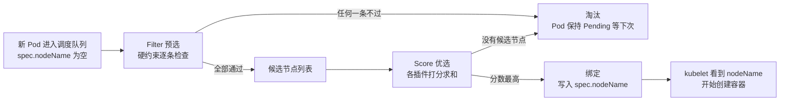

# 11 调度器深入

> 属于 K8s Code 教程 · 第 11 篇
> 上一篇：[10 CRD 与 Operator 开发](./10-CRD与Operator开发)　下一篇：[12 网络与安全深入](./12-网络与安全深入)

第 02 章你见过 STATUS 列的 `Pending`——Pod 被创建了，但一直没启动。谁在决定"它住哪台机器"？答案是 **kube-scheduler（调度器）**，K8s 的"分房系统"。这一章把它彻底拆开：两阶段调度（过滤 + 打分）、亲和性、污点与容忍，最后用 Go 手搓一个迷你调度器，让"调度"从黑盒变成你亲手写过的代码。

原理层面，[调度与控制器](/后端技术栈强化/07-k8s/调度与控制器)已经画过"过滤 + 打分"的轮廓，这一章进到细节：每个插件叫什么、每条规则怎么判、代码怎么模拟，以及真集群里怎么用 YAML 指挥调度器。

## 1. 调度两阶段：先过滤，再打分

kube-scheduler 通过 Informer 盯着 etcd，凡是 `spec.nodeName` 为空的 Pod（还没定住处）都会进调度队列。对每个 Pod，它走两个阶段：



| 阶段 | 别名 | 回答的问题 | 性质 |
|------|------|-----------|------|
| Filter | 预选（Predicates） | 这台机器**够不够格**？ | 硬约束，一票否决 |
| Score | 优选（Priorities） | 够格的机器里**哪台最好**？ | 软偏好，择优录取 |

记住一个原则：**先过滤保证"能住"，再打分保证"住得好"**。打分永远只发生在合格者之间。

## 2. 预选：四条"入场资格"硬规则

预选插件有十几个，全部并行跑，**任何一条不满足就直接淘汰**。最常考的四条：

1. **资源 fit**：节点剩余可分配资源 ≥ Pod 的 `requests`（CPU/内存/GPU 等）。
2. **端口不冲突**：节点上已被占用的 `hostPort`/端口不能重复分配。
3. **污点容忍**：节点打了 taint，Pod 必须有对应的 toleration 才进得来。
4. **选择器满足**：`nodeSelector`、`nodeAffinity` 的 required 条件、Pod 亲和/反亲和的 required 条件必须成立。

这四条的共同点：**不满足就是不行**，没有商量余地——就像租房，房东要求"不养宠物"，你带只猫去谈价格没有意义。

## 3. 优选：给候选节点打分

通过预选后，调度器对每个候选节点跑打分插件，每个插件输出 0–100 分，加权求和，**最高分胜出**（同分随机选一个）。常见打分插件：

| 插件 | 偏好 | 直觉 |
|------|------|------|
| `NodeResourcesLeastAllocated`（LeastRequested） | 剩余资源越多分越高 | 把新 Pod 摊到最闲的机器 |
| `NodeResourcesBalancedAllocated` | CPU/内存占用比例越接近分越高 | 防止节点"偏科" |
| `NodeAffinity`（preferred 版本） | 命中软亲和加分 | "尽量"去某类节点 |
| `ImageLocality` | 节点本地已有镜像加分 | 省一次拉镜像 |
| `PodTopologySpread` | 跨拓扑域打散副本 | 别让 Pod 扎堆一台 |

打个比方：预选是"及格线"，优选是"择优"——都是 60 分以上的考生，谁综合分高谁录取。

## 4. nodeSelector 与 nodeAffinity：两张"选座券"

`nodeSelector` 是最古老的选节点方式：**只能做"标签等于某值"**，想表达"不是 A 也不是 B"就无能为力。`nodeAffinity` 是它的升级版，支持 `In`/`NotIn`/`Exists`/`DoesNotExist`/`Gt`/`Lt` 六种运算符，还分硬性/软性两档。

| 能力 | nodeSelector | nodeAffinity |
|------|-------------|--------------|
| 匹配方式 | 仅 key=value 相等 | In/NotIn/Exists/Gt/Lt 等 |
| 硬性要求（required） | 天然是硬性的 | `requiredDuringSchedulingIgnoredDuringExecution` |
| 软偏好（preferred） | 不支持 | `preferredDuringSchedulingIgnoredDuringExecution` |
| 语法 | `spec.nodeSelector` | `spec.affinity.nodeAffinity` |

```yaml
# code/k8s/manifests/11_scheduler/pod-nodeaffinity.yaml
apiVersion: v1
kind: Pod
metadata:
  name: with-nodeaffinity
spec:
  containers:
    - name: app
      image: nginx:1.27
  affinity:
    nodeAffinity:
      requiredDuringSchedulingIgnoredDuringExecution:  # 硬性：调度时必须满足
        nodeSelectorTerms:
          - matchExpressions:
              - key: kubernetes.io/hostname   # 节点的主机名标签
                operator: In
                values:
                  - minikube                  # 只允许住进名为 minikube 的节点
```

注意命名里那段 `IgnoredDuringExecution`：意思是"调度时强制执行，运行中不再理会"——节点标签后来变了，也不会把已经住下的 Pod 赶走。**K8s 大多数策略都是"只约束进场，不约束在场"**，这个思路贯穿亲和、污点整章。

## 5. Pod 亲和 / 反亲和：与谁挨着、与谁不挨着

节点亲和管的是"节点长什么样"，Pod 亲和管的是"**别的 Pod 住在哪**"——依据是目标 Pod 的标签，还要求一个 `topologyKey`（在哪个拓扑域里算"挨着"，比如 `kubernetes.io/hostname` 表示同节点才算挨着）。

```yaml
# 结构示意（节选，完整文件见 code/k8s/manifests/11_scheduler/）
affinity:
  podAffinity:        # 亲和：想和谁挨着（比如缓存 Pod 想和计算 Pod 同节点）
    requiredDuringSchedulingIgnoredDuringExecution:
      - labelSelector:
          matchLabels: { app: cache }
        topologyKey: kubernetes.io/hostname
  podAntiAffinity:    # 反亲和：不想和谁挨着（比如高可用副本要分散）
    preferredDuringSchedulingIgnoredDuringExecution:
      - weight: 100
        podAffinityTerm:
          labelSelector:
            matchLabels: { app: web }
          topologyKey: kubernetes.io/hostname
```

典型用法：**反亲和做高可用**（副本别挤一台机器）、**亲和做数据局部性**（计算靠数据近一点）。同样分 required（硬性）和 preferred（软性）两档。

## 6. 污点与容忍：给节点"挂牌"

污点（taint）是**打在节点上的标记**，用来拒绝大多数 Pod；容忍（toleration）是 **Pod 的声明**："这个标记我受得了"。一挂一忍，配合生效。污点有三个效果（effect）：

| 效果 | 含义 | 对已有 Pod |
|------|------|-----------|
| `NoSchedule` | 新 Pod 不允许调度上来 | 不驱逐 |
| `PreferNoSchedule` | 尽量不调度，实在没地方才来 | 不驱逐 |
| `NoExecute` | 新 Pod 不允许，**已有且不容忍的 Pod 立刻被驱逐** | 驱逐 |

```yaml
# code/k8s/manifests/11_scheduler/pod-gpu-toleration.yaml
apiVersion: v1
kind: Pod
metadata:
  name: gpu-workload
spec:
  containers:
    - name: app
      image: nginx:1.27
  # 模拟"AI 推理 Pod"：容忍 GPU 专用节点的污点
  tolerations:
    - key: "gpu"          # 只容忍 key 为 gpu 的污点
      operator: "Exists"  # Exists：key 在就行，不关心 value
      effect: "NoSchedule"  # 只匹配 NoSchedule 效果的污点
  nodeSelector:
    gpu: "true"           # 配合标签：还要节点有 gpu=true 才去
```

打污点 / 去污点的命令（去污点在 key=value:effect 后加一个 `-`）：

```bash
kubectl taint nodes minikube gpu=true:NoSchedule    # 打上：普通 Pod 进不来了
kubectl taint nodes minikube gpu=true:NoSchedule-   # 去掉：恢复通行
kubectl describe node minikube | grep -i taint      # 查看当前污点
```

再复习一遍第 02 章的比喻：**节点是"合租房"，污点等于房东挂的"只租给 GPU 租户"的牌子，容忍就是你出示的租客证明**。`NoExecute` 更狠——牌子一挂，已经住着的不符合条件的立刻搬走。

## 7. requests 是"入场券"，不是"饭量"

预选看的是 **requests**，不是实际用量：调度器按"每个 Pod 最少要这么多"来预留，保证同节点所有 Pod 的 requests 之和不超节点容量。

- **requests 设高了**：节点明明很闲，Pod 却进不去（资源被"虚占"），利用率低、费钱。
- **requests 设低了**：调度时容易通过，运行起来大家抢 CPU、内存超卖，严重的被 OOM 杀掉。
- 打分插件通常按"节点剩余可分配 − 新 Pod requests"来算，所以 requests 也悄悄影响**落点**。

一句话记住：**requests 是调度时的"入场券"，limits 是运行时的"饭量上限"**。调参是 K8s 运维日常，详情见[调度与控制器](/后端技术栈强化/07-k8s/调度与控制器)。

## 8. 调度器扩展点：scheduler framework 一览

K8s 1.19 之后调度器重构为 **scheduler framework**：整个调度过程被切成十几个"扩展点（extension points）"，插件可以挂在任意扩展点上，官方插件和你的自定义插件地位平等。主流程对应的扩展点：

| 扩展点 | 阶段 | 干的事 |
|--------|------|--------|
| `QueueSort` | 队列 | 决定下一个调度的 Pod 是谁 |
| `PreFilter` / `Filter` / `PostFilter` | 预选 | 硬约束检查；失败可进 PostFilter 找"替补方案"（如抢占） |
| `PreScore` / `Score` / `NormalizeScore` | 优选 | 打分与归一化 |
| `Reserve` / `Permit` | 预绑定 | 预留资源；等待批准（如配额） |
| `PreBind` / `Bind` / `PostBind` | 绑定 | 写 `spec.nodeName` 并收尾 |

想写自定义调度器，就是往这些点上挂自己的插件（kube-scheduler 用 `--config` 加载）。这一章我们先不写真实插件，用 Go 模拟最核心的两个点：Filter 和 Score。

## 9. 代码讲解：手搓一个迷你调度器

代码在 `code/k8s/scheduler-demo/`：`solution.go` 是带 TODO 的骨架（练习时填），`answer/answer.go` 是参考答案，`solution_test.go` 是测试。先看参考答案的三个函数：

```go
// code/k8s/scheduler-demo/answer/answer.go
// Filter 过滤：资源够 + GPU 要求 + 污点容忍，三条硬约束。
func Filter(pod Pod, nodes []Node) []Node {
	out := make([]Node, 0, len(nodes))
	for _, n := range nodes {
		if n.CPU < pod.NeedCPU || n.Memory < pod.NeedMem {
			continue // 资源不够，淘汰
		}
		if pod.NeedGPU && !n.GPUCapable {
			continue // 要 GPU 但节点没有，淘汰
		}
		if n.HasTaint && !pod.Tolerates {
			continue // 节点有污点且 Pod 不容忍，淘汰
		}
		out = append(out, n) // 三条都过，进候选
	}
	return out
}

// Score 打分：剩余资源越多分越高（CPU 权重 1，内存权重按 1Mi=1 分），加偏好分。
func Score(candidates []Node) *Node {
	if len(candidates) == 0 {
		return nil // 候选为空：没得选
	}
	best := &candidates[0]
	bestScore := int64(-1)
	for i := range candidates {
		n := &candidates[i]
		score := n.CPU + n.Memory + n.PreferredScore // 剩余 CPU + 剩余内存 + 偏好加分
		if score > bestScore {
			best = n        // 分数更高，换人
			bestScore = score
		}
	}
	return best
}

// Schedule 完整调度：Filter → Score，先过滤再打分。
func Schedule(pod Pod, nodes []Node) *Node {
	return Score(Filter(pod, nodes))
}
```

`solution.go` 里同样的函数体是 `panic("not implemented")`，等你填。三个函数和真实 kube-scheduler 的对应关系（也是 `README.md` 里的考点表）：

| 模拟 | 真实 kube-scheduler |
|------|---------------------|
| Filter | 预选阶段（Predicates）：NodeResourcesFit、NodeSelector、TaintToleration… |
| Score | 优选阶段（Priorities）：LeastRequestedPriority、NodeAffinity、ImageLocality… |
| Schedule | 选定 Node 后写入 `spec.nodeName`，kubelet 看到后创建容器 |

`solution_test.go` 用六组测试把两阶段的边界都盖住了：

| 测试 | 场景 | 期望结果 |
|------|------|---------|
| TestFilterResource | small 节点资源不够 | 只剩 big |
| TestFilterGPU | 要 GPU 的 Pod | 只剩 gpu-node |
| TestFilterTaint | 有污点节点 | 不容忍则排除，容忍则全保留 |
| TestScorePrefersRichNode | poor vs rich | 选资源多 + 偏好分高的 rich |
| TestScoreEmpty | 空候选 | 返回 nil |
| TestScheduleEndToEnd | 三种节点混合 | 端到端选到 gpu-node |

## 10. 实操：让 Pod 去"想去的机器"

**实验 A：节点亲和，把 Pod 绑到 minikube**

```bash
kubectl apply -f code/k8s/manifests/11_scheduler/pod-nodeaffinity.yaml
kubectl get pod with-nodeaffinity -o wide   # 预期：节点列显示 minikube
kubectl get nodes --show-labels | grep hostname  # 确认节点上有 kubernetes.io/hostname=minikube 标签
kubectl delete -f code/k8s/manifests/11_scheduler/pod-nodeaffinity.yaml
```

**实验 B：污点实验，挂牌 → 拒之门外 → 摘牌**

```bash
# 1) 给节点贴 GPU 标签并打污点
kubectl label nodes minikube gpu=true
kubectl taint nodes minikube gpu=true:NoSchedule

# 2) 容忍的 Pod（有 toleration + nodeSelector）→ 能调度
kubectl apply -f code/k8s/manifests/11_scheduler/pod-gpu-toleration.yaml
kubectl get pod gpu-workload -o wide        # 预期：Running，节点 minikube

# 3) 不容忍的普通 Pod → Pending
kubectl run no-toleration --image=nginx:1.27
kubectl get pod no-toleration               # 预期：Pending
kubectl describe pod no-toleration          # 看 Events：有 0/1 nodes are available 的报错

# 4) 摘掉污点 → 普通 Pod 立刻被调度
kubectl taint nodes minikube gpu=true:NoSchedule-
kubectl get pod no-toleration -o wide       # 预期：Pending → ContainerCreating → Running

# 5) 清理
kubectl delete pod gpu-workload no-toleration
kubectl label nodes minikube gpu-           # 去掉标签（key 后加 - 表示删除）
```

`describe` 里 Events 段会写清楚被哪个插件拦的（比如 `didn't match taint`、`Insufficient cpu`）——这是排障的第一现场。

**实验 C：跑通迷你调度器**

```bash
cd code/k8s/scheduler-demo
go test -v      # 预期：6 个测试全部 PASS（先抄 answer 思路或自己实现）
```

## 练习

1. 完成 `code/k8s/scheduler-demo/solution.go` 的 `Filter`/`Score`/`Schedule`，`go test -v` 全绿后对照 `answer/answer.go`。
2. 给 minikube 打污点再删掉，完整观察"普通 Pod 进不去 → 摘牌后进入"的过程，并用 `kubectl describe pod` 记录 Pending 时的 Events。
3. 挑战：给 `Node` 结构体加一个 `Disk int64` 字段，在 `Filter` 里加一条磁盘硬约束，再自己写一个测试用例验证。

## 面试追问

1. **为什么先过滤再打分，而不是直接打分？** 打分是软偏好，可能把 Pod 送到不满足硬约束的节点（资源不够、不容忍污点），必须先过滤保证"能住"再择优。
2. **requests 高估 / 低估的后果？** 高估：节点明明有富余，Pod 却进不去，资源浪费；低估：调度容易过，运行时超卖、CPU 争抢、可能被 OOM 杀掉。
3. **NoSchedule 与 NoExecute 的区别？** NoSchedule 只挡新来的；NoExecute 既挡新的，又驱逐已在该节点且不容忍的 Pod。
4. **Pod 一直 Pending，怎么排查？** `kubectl describe pod` 看 Events 段：`Insufficient cpu/memory` 是资源不够，`didn't match taint` 是污点，`0/1 nodes are available` 多半是亲和/反亲和或资源问题；再配合 `kubectl get nodes` 确认节点状态。

---

## 串起来

这一章把"分房"讲透了：调度器先过滤后打分，亲和性管"想住哪"，污点容忍管"谁能住"，requests 是入场券，而 `scheduler-demo` 让你亲手写了一遍这套逻辑。但 Pod 住下之后呢？它的 IP 说变就变，流量怎么找到它？谁能访问集群资源？下一篇进入**网络与安全深入**：网络模型、Service 底层的 kube-proxy、NetworkPolicy 和 RBAC。
