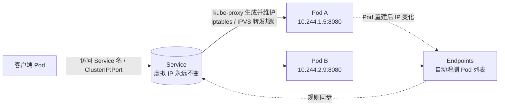
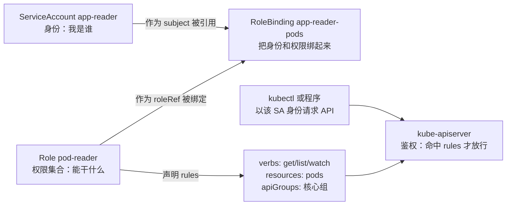

# 12 网络与安全深入

> 属于 K8s Code 教程 · 第 12 篇
> 上一篇：[11 调度器深入](./11-调度器深入)　下一篇：[13 故障排查与生产实践](./13-故障排查与生产实践)

上一章解决了"Pod 住哪台机器"，这一章解决两个更贴近生产的问题：**Pod 之间流量怎么走**（网络模型 + Service 底层），以及**谁能对集群干什么**（NetworkPolicy + RBAC）。打个比方：网络是"路"，安全是"门禁"——路修得再宽，门禁管不住坏人也没用。

原理细节在[网络与存储](/后端技术栈强化/07-k8s/网络与存储)讲过，这一章我们把"Service 背后的 kube-proxy""NetworkPolicy 的拒绝模型""RBAC 三件套"落到实处，用真实 YAML 和命令验证。

## 1. 网络模型：每个 Pod 一个唯一 IP，直连不绕路

K8s 对网络有一条硬性要求：**每个 Pod 有集群内唯一 IP，Pod 之间直接互通（不经过 NAT），节点也能访问 Pod**。这个"虚拟大内网"由 **CNI 插件**实现：

- **Flannel**：VXLAN 隧道封装，简单易用。
- **Calico**：BGP 路由，性能好，还实现了 NetworkPolicy（网络策略）。
- **Cilium**：基于 eBPF，性能和可观测性更强。

但注意：Pod 是"临时工"，被删重建 IP 就换。**网络模型的稳定 IP 解决不了"流量怎么找到活着的 Pod"**——这就是 Service 出场的理由。

## 2. Service 底层：kube-proxy 在干什么

Service 本身只是个 API 对象，有一个固定的虚拟 IP（ClusterIP）。真正干活的是**每个节点上的 kube-proxy**：它盯着 Service 和 Endpoints 的变化，把规则写进内核的 **iptables** 或 **IPVS**，流量到达任意节点，都能按规则转发到目标 Pod：



iptables 和 IPVS 是两种落地方式，面试高频对比：

| 维度 | iptables | IPVS |
|------|----------|------|
| 原理 | 规则链，按顺序逐条匹配 | 内核哈希表，O(1) 查表 |
| 负载均衡 | 只支持随机（statistic 模块近似） | rr / wrr / lc / wlc 等算法 |
| 服务数量多时 | 规则膨胀，匹配变慢 | 性能平稳 |
| 默认 | 多数发行版默认 | 需 kube-proxy 模式显式开启（`--proxy-mode=ipvs`） |

一句话：**小集群 iptables 够用，大集群上千个 Service 就换 IPVS**。想动手验证 Service 转发，回到第 04 章的命令即可。

## 3. NetworkPolicy：从"默认放行"到"显式拒绝"

先记一条 K8s 网络默认模型：**没有任何 NetworkPolicy 时，所有 Pod 之间全放行**（跟防火墙"默认拒绝"相反）。一旦某个 Pod 被 NetworkPolicy 选中，**只有规则明确允许的流量才能进/出**，其余全部拒绝。

```yaml
# code/k8s/manifests/12_network/networkpolicy-allow-frontend.yaml
apiVersion: networking.k8s.io/v1
kind: NetworkPolicy
metadata:
  name: allow-frontend-only
  namespace: default
spec:
  podSelector:              # 选目标：这条策略管的是哪些 Pod
    matchLabels:
      app: backend          # 凡是 app=backend 的 Pod，从此不再默认放行
  policyTypes:
    - Ingress               # 只声明"入口"维度（还有 Egress，管出口）
  ingress:                  # 允许进来的规则（多条规则是"或"关系）
    - from:                 # 来源：谁可以访问
        - podSelector:      # 来源也是按 Pod 标签选
            matchLabels:
              role: frontend
      ports:                # 允许的端口
        - protocol: TCP
          port: 8080        # 只放行 frontend → backend 的 8080
```

语义拆解：**"只允许 `role: frontend` 的 Pod 访问 `app: backend` 的 8080 端口"**——其他 Pod、其他端口、非 8080 的请求，全部被策略挡下。Ingress 规则里的 `from` 还支持 `namespaceSelector`（按命名空间选）和 `ipBlock`（按网段选），组合起来能做出很细的隔离。

::: warning minikube 与 NetworkPolicy
NetworkPolicy 不是 CNI 自带的，**需要支持它的 CNI 插件（如 Calico、Cilium）**。minikube 默认 docker 驱动装的是基础网络插件，**不保证 NetworkPolicy 生效**——策略 apply 可能不报错但实际不拦截（静默失效）。确认方法：

```bash
# 1) 看 kube-system 里有没有 calico/cilium 这类插件
kubectl get pods -n kube-system | grep -E 'calico|cilium|weave'
# 2) 若没有，用 Calico 重新起集群（注意会重置集群）
minikube start --cni=calico
```

本章的策略演示按"**需要支持 NetworkPolicy 的 CNI（如 Calico）**"的环境执行；只装了默认网络时，可先跳过流量验证部分。
:::

## 4. ServiceAccount / RBAC：谁能碰集群

网络策略管"Pod 之间能不能通"，**RBAC（基于角色的访问控制）管"谁（身份）能对集群资源做什么操作"**。三个对象组成一套：



- **ServiceAccount（SA）**：Pod 里的"身份证"，Pod 用它向 apiserver 认证。
- **Role**：一个命名空间内的权限集合，声明"能对哪些资源做哪些动词"。
- **RoleBinding**：把"某个 SA（subject）"和"某个 Role（roleRef）"绑定，权限才生效。

对应的 YAML 是 `rbac-app-reader.yaml`，一个文件三段，正好是三件套：

```yaml
# code/k8s/manifests/12_network/rbac-app-reader.yaml
apiVersion: v1
kind: ServiceAccount
metadata:
  name: app-reader          # 身份：app-reader
  namespace: default
---
apiVersion: rbac.authorization.k8s.io/v1
kind: Role
metadata:
  name: pod-reader          # 角色：pod-reader
  namespace: default
rules:
  - apiGroups: [""]         # 空字符串 = 核心组（v1 里的 pods/services 等）
    resources: ["pods"]     # 资源：只能碰 pods
    verbs: ["get", "list", "watch"]   # 动词：只读，不能写
---
apiVersion: rbac.authorization.k8s.io/v1
kind: RoleBinding
metadata:
  name: app-reader-pods     # 绑定：把 app-reader 绑到 pod-reader
  namespace: default
subjects:
  - kind: ServiceAccount
    name: app-reader
    namespace: default
roleRef:                    # 只允许绑 Role 或 ClusterRole
  kind: Role
  name: pod-reader
  apiGroup: rbac.authorization.k8s.io
```

**授权模型就是 `verbs × resources × apiGroups` 的笛卡尔积**：请求进来，apiserver 检查"你是谁（SA）→ 绑了哪些 Role → Role 里有没有覆盖这次请求的动词 + 资源 + 组"，全部命中才放行。常用动词和资源：

| 维度 | 取值举例 |
|------|---------|
| verbs | `get`（读单个）/ `list`（列全部）/ `watch`（监听）/ `create` / `update` / `patch` / `delete` / `deletecollection` |
| resources | `pods`、`deployments`、`services`、`configmaps`、`secrets`、`events` 等 |
| apiGroups | `""`（核心组）、`apps`、`networking.k8s.io`、`rbac.authorization.k8s.io` 等 |

**最小权限原则**：给每个 SA 只配它业务真正需要的动词和资源——比如上面的 `app-reader` 只能 `get/list/watch pods`，不能删 Pod、不能读 Secret。权限给多了，一个 Pod 被攻破，攻击者拿到的是整个集群。

**Role 与 ClusterRole 的区别**（面试常考）：

| | Role | ClusterRole |
|--|------|-------------|
| 作用范围 | 单个命名空间 | 整个集群（不限命名空间） |
| 典型用途 | 应用日常操作权限 | 节点管理、PV、所有命名空间的资源 |
| 绑定对象 | RoleBinding | RoleBinding（限命名空间）/ ClusterRoleBinding（全局） |

## 5. Secret：最容易翻车的敏感信息

Secret 用来存密码、Token、证书，但**它只是 base64 编码，不是加密**——任何能读 etcd 或能 get Secret 的人都等于拿到明文。几个生产必知的安全点：

1. **base64 ≠ 加密**：`echo -n 'hunter2' | base64` 谁都能解，Secret 不是保险箱。
2. **etcd 里默认明文存储**：生产环境要开 etcd 的 encryption at rest，否则备份文件泄露 = 密码泄露。
3. **别进 git**：YAML 里写死 Secret 再提交，等于把密码公开；用外部密钥管理（KMS / Sealed Secrets）替换。
4. **SA 的 token 会随 Pod 自动注入**：默认挂载在 `/var/run/secrets/kubernetes.io/serviceaccount/token`（新版是短期的 projected token），谁 `kubectl exec` 进你的 Pod 就能读到它——**偷到 token = 用这个 SA 的身份调用 apiserver = 偷到它的全部权限**。所以第 4 节的"最小权限"不只是规矩，是防 token 泄露的最后一道墙。
5. **权限隔离**：谁需要读 Secret 才给谁 `get secrets`，别顺手给 `list/watch` 全部。

## 6. 实操

**实验 A：RBAC 三件套 + --as 模拟身份**

```bash
# 1) 应用三件套
kubectl apply -f code/k8s/manifests/12_network/rbac-app-reader.yaml

# 2) 用 --as 模拟 app-reader 这个 SA 的身份去问"我能不能……"（预期输出都是 yes）
kubectl auth can-i --as=system:serviceaccount:default:app-reader get pods
kubectl auth can-i --as=system:serviceaccount:default:app-reader list pods
kubectl auth can-i --as=system:serviceaccount:default:app-reader watch pods

# 3) 越权操作 → 预期输出 no（只读角色干不了写操作）
kubectl auth can-i --as=system:serviceaccount:default:app-reader delete pods
kubectl auth can-i --as=system:serviceaccount:default:app-reader get deployments

# 4) 看该身份全部权限清单
kubectl auth can-i --list --as=system:serviceaccount:default:app-reader

# 5) 验证完清理
kubectl delete -f code/k8s/manifests/12_network/rbac-app-reader.yaml
```

`--as` 是**模拟（impersonation）**：不真创建 Pod，直接以该身份问 apiserver 鉴权结果，是验证 RBAC 最快的方式；你也可以 `kubectl run --serviceaccount=app-reader ...` 让 Pod 真的带着这个身份跑。

**实验 B：NetworkPolicy（需支持 NetworkPolicy 的 CNI，如 Calico）**

```bash
# 0) 先按第 3 节确认 CNI 支持；不支持则跳过本实验，只做 apply 验证语法（策略不会实际拦截）

# 1) 起三个 Pod：backend（目标，用 python 起 8080 端口 HTTP 服务）、frontend（放行来源）、outsider（无关来源）
kubectl run backend  --image=python:3.12-alpine --labels=app=backend -- sh -c 'python -m http.server 8080'
kubectl run frontend --image=busybox:1.36 --labels=role=frontend -- sh -c 'sleep 3600'
kubectl run outsider --image=busybox:1.36 --labels=role=outsider -- sh -c 'sleep 3600'
kubectl get pods -w    # 等三个 Pod 都 Running

# 2) 应用策略：只允许 frontend 访问 backend 的 8080
kubectl apply -f code/k8s/manifests/12_network/networkpolicy-allow-frontend.yaml

# 3) 从 frontend 访问 backend:8080 → 预期：通（wget 能拿到 HTTP 200）
kubectl exec frontend -- wget -qO- -T 3 http://backend:8080 | head -3

# 4) 从 outsider 访问 backend:8080 → 预期：超时（策略拦截，wget 报错退出）
kubectl exec outsider -- wget -qO- -T 3 http://backend:8080 | head -3

# 5) 清理
kubectl delete pod backend frontend outsider
kubectl delete -f code/k8s/manifests/12_network/networkpolicy-allow-frontend.yaml
```

## 练习

1. 完成实验 A 的 RBAC 验证：把 `rbac-app-reader.yaml` 里 Role 的 verbs 加上 `delete` 再 apply，重新 `kubectl auth can-i --as=... delete pods`，观察结果从 `no` 变 `yes`——体会"权限是逐条声明的"。
2. 给 NetworkPolicy 加一条"**拒绝所有**"规则再验证：新建 `deny-all.yaml`，把 `ingress` 留空（`policyTypes: [Ingress]` 且不写任何 `ingress` 条目），apply 到 `app: backend` 的 Pod 上，再从任何 Pod 访问它——预期全被拒；回想一下为什么"无策略全放行"而"空 ingress 全拒绝"。
3. 思考题：`roleRef` 一旦绑定就不能改（只能删了重建 RoleBinding），为什么 K8s 要这样设计？提示：防止绕过 RBAC 的变更审计。

## 面试追问

1. **Service 的 iptables 与 IPVS 区别？** iptables 是链式顺序匹配，规则多了变慢，负载均衡算法有限；IPVS 是内核哈希表，O(1) 查表，支持 rr/wrr/lc 等算法，适合大集群。
2. **NetworkPolicy 的默认策略是什么？** 没有任何策略时全放行；一旦某个 Pod 被策略选中，只有明确允许的流量能进出，其余默认拒绝——所以"无策略"和"空 ingress 策略"是两个极端。
3. **RBAC 的 Role 与 ClusterRole 区别？** Role 只作用于单个命名空间，ClusterRole 作用于整个集群；ClusterRole 还能被 RoleBinding 引用，从而"只借用它的一部分权限到某命名空间"。
4. **为什么 SA 的 token 是敏感信息？** 它自动挂载进每个 Pod，等于该 SA 身份的"钥匙"，偷到 token 就能以这个 SA 的权限调用 apiserver；权限越大、泄露后果越严重，所以必须最小权限 + 保护 etcd。

---

## 串起来

这一章把"路"和"门禁"都补上了：网络模型让每个 Pod 有唯一 IP，Service 靠 kube-proxy（iptables/IPVS）给易变的 Pod 一个稳定门牌，NetworkPolicy 在网络层做显式拒绝，RBAC 三件套在 API 层管最小权限，Secret 的坑也给你标了出来。到这儿，K8s 的调度、网络、安全三大块都齐了——但生产里永远有意外：Pod 起不来、流量不通、节点 NotReady，怎么办？下一篇进入**故障排查与生产实践**：把常见事故变成可复制的排查剧本。
