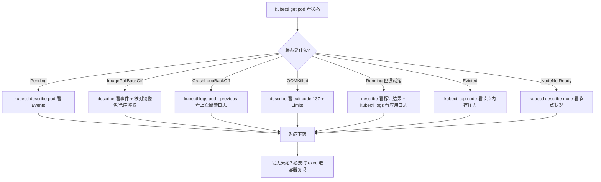
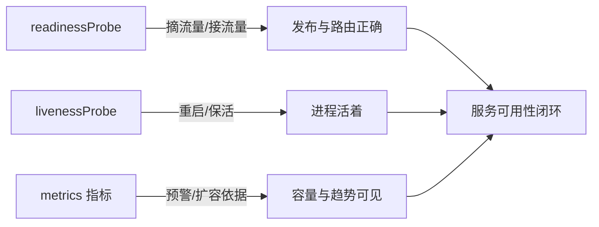

# 13 故障排查与生产实践

> 属于 K8s Code 教程 · 第 13 篇
> 上一篇：[12 网络与安全深入](./12-网络与安全深入)　下一篇：[14 面试题集](./14-面试题集)

前 12 章你学会了一个个对象怎么"正确地写"，这一章解决"写错了/跑崩了怎么办"。排障不是玄学，是**按顺序看证据**：K8s 把状态、事件、日志全摆在你面前，你要做的只是按流程读。这一章给你一套方法论、七份故障剧本、一个优雅退出模板，最后聊聊生产可观测性——把"能跑"升级成"能救"。

## 1. 排障方法论：get → describe → logs → exec

遇到 Pod 有问题，别急着进容器乱敲命令，先按下面的流程走，90% 的问题三步内定位：



四步各回答一个问题：

| 步骤 | 命令 | 回答的问题 |
|------|------|-----------|
| ① 看状态 | `kubectl get pod -o wide` | 现在处于哪个生命周期状态？在哪个节点？重启了几次？ |
| ② 看事件 | `kubectl describe pod <name>` | 调度器/kubelet 最近做了什么？失败原因直接写在 Events 里 |
| ③ 看日志 | `kubectl logs <name> --previous` | 崩溃那一刻应用自己说了什么？ |
| ④ 进容器 | `kubectl exec -it <name> -- sh` | 现场复现：进程在不在、端口通不通、文件在不在 |

::: tip 为什么顺序不能乱
`describe` 的事件里有时间戳和操作者（Scheduler、kubelet、Kubelet 探针），先读它等于先看"目击者证词"；日志是"当事人自述"，放在第二步；`exec` 是"现场勘察"，有破坏现场的风险（改文件、杀进程），**最后才用**。
:::

## 2. 七份故障剧本：症状 → 排查 → 根因 → 解法

生产故障翻来覆去就是这几个剧本。先看总览表，再逐个展开：

| 剧本 | 一句话症状 | 头号嫌疑 |
|------|-----------|---------|
| CrashLoopBackOff | 启动即崩、反复重启 | 启动命令错、探针误杀、OOM |
| ImagePullBackOff | 镜像拉不下来 | 镜像名拼错、私有仓库没鉴权 |
| Pending | 一直不调度 | 节点资源不足、污点不容忍 |
| OOMKilled | 秒崩、exit 137 | 内存超 limits |
| Evicted | 被驱逐 | 节点磁盘/内存压力 |
| NodeNotReady | 整节点失联 | 节点宕机、kubelet 挂了 |
| 探针失败 | Running 但不就绪/被重启 | 探针路径错、依赖没起来 |

### 剧本 ①：CrashLoopBackOff（最高频）

- **症状**：`kubectl get pod` 显示 `CrashLoopBackOff`，RESTARTS 列不断上涨。
- **排查命令**：`kubectl logs <pod> --previous`（看上次崩溃的日志，当前容器可能已经退出了）；再 `kubectl describe pod <pod>` 看退出码。
- **根因**：启动命令写错/镜像里没有该入口、探针把好容器误杀、内存直接爆掉。
- **解法**：按日志对症改；若日志正常却仍重启，重点查 liveness 探针——`failureThreshold: 3` 连续失败三次就 kill，慢启动应用没配 startupProbe 极易被误杀。

### 剧本 ②：ImagePullBackOff

- **症状**：状态停在 `ImagePullBackOff` 或 `ErrImagePull`。
- **排查命令**：`kubectl describe pod <pod>`，Events 里会写 `Failed to pull image "xxx": ...`。
- **根因**：镜像名/标签拼错（如 `ngin`）、私有仓库没配 imagePullSecret、镜像不存在或 tag 不存在。
- **解法**：先 `docker pull` 本地验证镜像名对不对；私有仓库补 `imagePullSecrets`（Secret 的创建见第 05 章）；修完 `kubectl delete pod` 让它重建（Deployment 场景可 `kubectl rollout restart`）。

### 剧本 ③：Pending（调度不上去）

- **症状**：一直 `Pending`，没有任何容器被创建。
- **排查命令**：`kubectl describe pod <pod>` 看 Events——调度器会直说 `0/1 nodes are available: insufficient cpu, ...`。
- **根因**：节点资源不够（requests 总和超节点可分配量）、污点不容忍、节点选择器/亲和性不满足。
- **解法**：扩节点；或调小 requests；或加 toleration。判断资源够不够用第 4 节的 `kubectl top node`。

### 剧本 ④：OOMKilled

- **症状**：容器秒崩，`describe` 里 `Last State: Terminated, Reason: OOMKilled, Exit Code: 137`。
- **排查命令**：`kubectl describe pod` 看 `Limits` 和退出码 137；`kubectl top pod` 看峰值用量。
- **根因**：内存使用超过容器 limits，内核 OOM killer 直接杀进程。Go 服务常见：没设 `GOMEMLIMIT`，Go 运行时以为内存充足不触发 GC，一路涨破 limits。
- **解法**：调大 limits 或优化内存；Go 服务设 `GOMEMLIMIT` 为 limits 的 70~80%（原理见 S7 [高可用与故障排查](/后端技术栈强化/07-k8s/高可用与故障排查)）。

### 剧本 ⑤：Evicted

- **症状**：状态 `Evicted`，`describe` 事件写 `The node was low on resource: memory/disk`。
- **排查命令**：`kubectl top node`、`kubectl describe node` 看节点压力；`df -h` 进节点查磁盘。
- **根因**：节点资源紧张，kubelet 按 QoS 优先级驱逐 Pod（BestEffort 最先被赶走）。
- **解法**：给重要负载配 requests/limits（QoS 至少 Guaranteed/Burstable），加节点或清理资源，必要时用 PodDisruptionBudget 保护关键服务。

### 剧本 ⑥：NodeNotReady

- **症状**：`kubectl get nodes` 显示 `NotReady`，上面所有 Pod 处于 Unknown 或被驱逐。
- **排查命令**：`kubectl describe node <node>` 看 Conditions；SSH 上节点查 kubelet 状态 `systemctl status kubelet`。
- **根因**：节点宕机/网络分区、kubelet 崩溃、磁盘满（kubelet 会主动上报 NotReady）。
- **解法**：修节点；同时确认被驱逐 Pod 的副本在其他节点补齐了（这正是 Deployment 多副本的意义）。

### 剧本 ⑦：探针失败

- **症状**：`Running` 但 READY 列是 `0/1`（readiness 失败），或健康但被反复重启（liveness 失败）。
- **排查命令**：`kubectl describe pod` 的 Events 会写 `Readiness probe failed: HTTP probe failed with statuscode: 404`；再 `kubectl logs` 看应用侧。
- **根因**：探针路径写错、应用依赖的下游没就绪、探针超时设太短。
- **解法**：对照 `code/k8s/manifests/02_pod/pod-probe.yaml` 检查探针参数——注意 `initialDelaySeconds` 要给足（慢启动），`periodSeconds` 别太激进，`timeoutSeconds` 默认 1 秒对慢接口不够。改完重点验证：readiness 失败是"摘流量"而不是重启，这才是期望行为。

::: tip 一句话记住每个剧本的入口命令
崩了看 `logs --previous`，不调度看 `describe` 的 Events，被杀了看退出码，被赶走看节点资源，节点挂了看节点状态，READY 不对看探针事件。
:::

## 3. 优雅退出：让容器"体面地死"

K8s 要删除或重启一个容器时，流程是：**kubelet 发 SIGTERM → 等 `terminationGracePeriodSeconds`（默认 30 秒）→ 超时发 SIGKILL 强杀**。如果你的应用不处理 SIGTERM，等于放弃这 30 秒，直接走到被 SIGKILL——存量请求被掐断、数据没落盘、连接不关闭。

**为什么容器收到 SIGTERM 要尽快退出？** 因为 K8s 默认只等 30 秒，而它要删的往往不止你一个 Pod：滚动更新、节点驱逐、缩容都是批量操作，每个 Pod 磨蹭 30 秒，发布就卡住了。所以规范是：**收到 SIGTERM 后停止接新请求、把存量请求处理完（几秒内），然后立刻退出**，别死等满 grace 期。

Go 服务标准写法（`signal.NotifyContext` + `http.Server.Shutdown`）：

```go
// code/k8s/production/graceful-shutdown/main.go（本章练习，自写后再对照）
package main

import (
	"context"
	"errors"
	"fmt"
	"log"
	"net/http"
	"os"
	"os/signal"
	"syscall"
	"time"
)

func main() {
	// 1. 监听 SIGINT / SIGTERM：收到任一信号，ctx 自动取消
	ctx, stop := signal.NotifyContext(context.Background(), syscall.SIGINT, syscall.SIGTERM)
	defer stop()

	mux := http.NewServeMux()
	mux.HandleFunc("/", func(w http.ResponseWriter, r *http.Request) {
		// 模拟耗时请求：sleep 3 秒再返回，用于验证优雅退出
		time.Sleep(3 * time.Second)
		fmt.Fprintln(w, "hello, graceful")
	})

	srv := &http.Server{Addr: ":8080", Handler: mux}

	// 2. HTTP 服务放 goroutine 里跑，不阻塞主流程
	go func() {
		log.Println("listening on :8080")
		if err := srv.ListenAndServe(); err != nil && !errors.Is(err, http.ErrServerClosed) {
			log.Fatalf("listen: %v", err)
		}
	}()

	// 3. 主流程阻塞等信号：kubectl delete / 滚动更新 / 驱逐时，kubelet 都会发 SIGTERM
	<-ctx.Done()
	log.Println("收到 SIGTERM，开始优雅退出（最多等 10 秒）...")

	// 4. Shutdown：停止接收新连接，等存量请求处理完；超时则强制关闭
	shutdownCtx, cancel := context.WithTimeout(context.Background(), 10*time.Second)
	defer cancel()
	if err := srv.Shutdown(shutdownCtx); err != nil {
		log.Printf("优雅退出超时，强制关闭: %v", err)
	}
	log.Println("存量请求处理完毕，进程退出")
}
```

两个要点：

- **`Shutdown` 只关 HTTP**：数据库连接、消息队列等资源要在收到信号后自己关闭（把清理逻辑放在 `<-ctx.Done()` 之后）。
- **grace 期配合**：K8s 默认 30 秒宽限，你的 Shutdown 超时设 10 秒绰绰有余；如果业务需要更久（如长任务），在 Pod spec 里调大：

```yaml
terminationGracePeriodSeconds: 60   # 默认 30 秒，给长任务加宽限
```

第 10 章 Operator 里 `signal.NotifyContext` 的用法（`code/k8s/operator/main.go`）和这里是同一套模式——信号处理是每个生产级 Go 服务的必修课。

## 4. 资源请求与实际用量：别只配不看

requests/limits 配了不等于万事大吉——**配得过高浪费钱，配得过低天天 OOM**。观察实际用量用 `kubectl top`（依赖 metrics-server，见第 6 节）：

```bash
kubectl top node              # 每个节点的 CPU/内存用量与可分配量
kubectl top pod               # 每个 Pod 当前实际用量
kubectl top pod <name> --containers   # 按容器看，定位是哪个容器在吃内存
```

典型排障用法：Pod Pending 显示节点资源不足时，用 `kubectl top node` 确认是"真不够"还是"requests 虚高"；OOMKilled 时用 `kubectl top pod` 看峰值，决定是调 limits 还是优化代码。**生产建议：requests 设稳态水位（比实际用量略高留余量），limits 设峰值上限，中间差就是突发缓冲**。

## 5. 事件与日志：把现场证据看全

`kubectl get events` 能看到整个 namespace 的近期事件，比逐个 describe 更快；排序用 `--sort-by`：

```bash
kubectl get events --sort-by='.lastTimestamp'        # 按时间升序
kubectl get events --sort-by='.count'                # 按次数（高频失败一眼可见）
kubectl get events --field-selector involvedObject.name=<pod名>   # 只看某个对象
```

日志侧的三个坑：

```bash
kubectl logs <pod>                    # 当前容器日志
kubectl logs <pod> --previous         # 上次崩溃容器的日志（CrashLoop 必用！）
kubectl logs <pod> -c <container> -f  # 多容器 Pod 指定容器 + 跟随输出
```

::: warning 为什么 `--previous` 是 CrashLoop 的第一命令
CrashLoopBackOff 时容器一直重启，当前日志几乎为空或只有"启动失败"的尾巴，真正的崩溃原因在上一个实例的日志里。不写 `--previous`，你看到的永远是"同一个错误"。
:::

## 6. 可观测性简介：metrics-server 与 Prometheus

排障是"事后救火"，可观测性是"事前预警"。K8s 生态的观察体系分三层：

| 层 | 工具 | 回答的问题 |
|----|------|-----------|
| 指标 | metrics-server（基础）、Prometheus（完整方案） | 用量多少、趋势如何 |
| 日志 | 容器 stdout + 采集（如 Loki/EFK） | 发生了什么 |
| 追踪 | OpenTelemetry/Jaeger | 一次请求经过了哪些服务 |

- **metrics-server**：只采集 CPU/内存，给 `kubectl top` 和 HPA 用，轻量、无存储。minikube 可用 `minikube addons enable metrics-server` 开启。
- **Prometheus**：完整指标体系（Pod 数、QPS、延迟、错误率），核心是 **pull 模型 + 指标查询语言 PromQL**，配 Alertmanager 做告警，是生产监控的事实标准。

最后回答"为什么生产要 liveness/readiness/metrics 三件套"：



- **readiness** 管"流量该不该进"（可用性），**liveness** 管"进程该不该活"（自愈），**metrics** 管"会不会出问题"（预警）——三者缺一不可：只有 liveness 没有 readiness，发布时流量打到没就绪的 Pod 上；只有探针没有 metrics，问题永远等用户投诉才知道。

## 练习

1. **制造 ImagePullBackOff**：把 `code/k8s/manifests/02_pod/pod-basic.yaml` 的镜像改成 `nginx:9.99`（不存在的 tag），apply 后按剧本 ② 排查，直到说出根因并修好。
2. **制造探针失败**：把 `code/k8s/manifests/02_pod/pod-probe.yaml` 的 readiness 路径改成 `/nonexist`，apply 后观察 READY 变成 `0/1`，再用 `kubectl describe` 看探针事件，解释"为什么容器没被重启"。
3. **制造 CrashLoopBackOff**：写一个启动即 `exit 1` 的容器（镜像 `busybox:1.36`，command 用 `sh -c "exit 1"`），用 `logs --previous` 和 describe 完成排查。
4. **写优雅退出并验证**：在 `code/k8s/production/graceful-shutdown/` 实现 `main.go`（用 `signal.NotifyContext` + `srv.Shutdown`），`go run .` 后另开终端 `kill -TERM <pid>`，观察"存量请求处理完才退出"；再用 `go build` + Dockerfile 打成镜像跑在 minikube 里，`kubectl delete pod` 看日志确认收到 SIGTERM 后优雅退出（没被 SIGKILL）。
5. **看用量**：开启 metrics-server 后 `kubectl top node`、`kubectl top pod`，对比你各 Pod 的 requests 与真实用量，找出最浪费的一台。

## 面试追问

1. **Pod 一直 Pending 怎么排查？** `kubectl describe pod` 看 Events 里调度器的失败原因：`insufficient cpu/memory` 是资源不够，`untolerated taint` 是污点问题；再配合 `kubectl top node` 判断是真不够还是 requests 虚高。
2. **CrashLoopBackOff 与 ImagePullBackOff 的区别？** 前者是"镜像拉下来了但容器启动即崩溃"，看 `logs --previous`；后者是"镜像根本拉不下来"，看 describe 的拉取事件，检查镜像名与仓库鉴权。
3. **OOMKilled 怎么定位？** 看 `describe` 的 `Exit Code: 137` 和 `Reason: OOMKilled`，确认 Limits 与 `kubectl top pod` 的峰值，判断是调 limits 还是优化内存（Go 服务查 GOMEMLIMIT）。
4. **优雅退出没生效会怎样？** 应用不处理 SIGTERM 就等满 `terminationGracePeriodSeconds`（默认 30 秒）被 SIGKILL——滚动更新变慢、存量请求被掐断、数据可能没落盘；批量操作时整个发布被拖垮。
5. **为什么生产要 liveness/readiness/metrics 三件套？** liveness 保进程活着、readiness 保证流量只进健康 Pod（发布不宕机）、metrics 让容量和趋势可见（预警 + HPA 依据），缺任何一个都只能"事后救火"。

---

## 串起来

这一章你拿到了生产环境的最后一块拼图：**排障有流程（get → describe → logs → exec），故障有剧本（七种状态七条路），退出要优雅（SIGTERM 处理），用量要观察（kubectl top），健康要三件套（探针 + 指标）**。从第 01 章的 kubectl 到第 10 章的 Operator，你写过的所有对象现在都有了"坏了怎么救"的答案。下一章是收口篇：把前面 13 章浓缩成 20 道面试题，每题练到能连续追问三层——那是你走上考场的最后一步。
