# K8s Code 编程教程

> 目标：把 K8s 从"会用 kubectl"提升到 **"能编程、能手写 Controller/Operator"** 的大师级水平。
> 与 [S7 K8s 理论文档](/后端技术栈强化/07-k8s/架构与核心对象) 互补：那边讲"为什么"，这里讲"**怎么写、怎么跑、怎么验**"。

## 你需要什么

- 本机已装：Go 1.26+、Docker、kubectl、minikube（本教程默认你有一个**正在运行的 minikube 单节点集群**，K8s v1.35 左右）。
- 检查环境：

```bash
kubectl cluster-info     # 控制面可达
kubectl get nodes        # 节点 Ready
go version               # Go 1.26+
```

::: tip 关于 Go 模块下载
本机 `proxy.golang.org` 可能超时，拉取 client-go 时请使用 `GOPROXY=https://goproxy.cn,direct`：

```bash
export GOPROXY=https://goproxy.cn,direct
```
:::

## 学习路线

```mermaid
flowchart LR
    A[01 环境与 kubectl] --> B[02 Pod 与生命周期]
    B --> C[03 Deployment 滚动发布]
    C --> D[04 Service/Ingress/DNS]
    D --> E[05 配置与存储]
    E --> F[06 资源管理与 HPA/Job]
    F --> G[07 client-go 连接与 CRUD]
    G --> H[08 Informer 与 Workqueue]
    H --> I[09 手写 Controller]
    I --> J[10 CRD 与 Operator]
    F -.-> K[11 调度器深入]
    K --> L[12 网络与安全]
    L --> M[13 故障排查与生产]
    M --> N[14 面试题集]
    J --> M
    style A fill:#e6fcf5,stroke:#087f5b
    style G fill:#fff9db,stroke:#f59f00
    style I fill:#fff9db,stroke:#f59f00
    style J fill:#fff9db,stroke:#f59f00
    style N fill:#ffe3e3,stroke:#c92a2a
```



> 07-10 是"**从会用变成会写**"的分水岭（黄色），04-06 偏对象实操，11-13 是深入与排障，14 用于面试收口。

## 章节导航

| 章 | 主题 | 代码位置 | 本章产出 |
|----|------|---------|---------|
| [01 环境准备与 kubectl 速查](./01-环境准备与kubectl速查) | kubeconfig/context/常用命令 | — | 集群状态核对能力 |
| [02 Pod 与容器生命周期](./02-Pod与容器生命周期) | 探针/initContainer/生命周期 | `code/k8s/manifests/02_pod/` | 写出带探针的 Pod |
| [03 Deployment 与滚动发布](./03-Deployment与滚动发布) | ReplicaSet/滚动更新/回滚 | `code/k8s/manifests/03_deployment/` | 发布不宕机 |
| [04 Service/Ingress/DNS](./04-Service-Ingress与DNS) | ClusterIP/NodePort/Ingress | `code/k8s/manifests/04_service/` | 流量路由 |
| [05 配置与存储](./05-配置与存储-ConfigMap-Secret-PV) | ConfigMap/Secret/PV/PVC | `code/k8s/manifests/05_config_storage/` | 配置与持久化 |
| [06 资源管理与 HPA/Job](./06-资源管理与HPA-Job) | requests/limits/QoS/HPA/Job | `code/k8s/manifests/06_hpa_job/` | 自动扩缩容 |
| [07 client-go：连接与 CRUD](./07-client-go编程-连接与CRUD) | typed client 增删改查 | `code/k8s/client/01_connect` `02_crud` | 用 Go 操作集群 |
| [08 client-go：Informer 与 Workqueue](./08-client-go编程-Informer与Workqueue) | Watch/Informer/Workqueue | `code/k8s/client/03_watch` `04_workqueue` | 事件驱动编程 |
| [09 手写 Controller](./09-手写Controller实战) | Informer+Workqueue+Reconcile | `code/k8s/controller/counter-controller` | 真集群最小控制器 |
| [10 CRD 与 Operator](./10-CRD与Operator开发) | CRD/controller-runtime Reconciler | `code/k8s/operator/` | 自定义资源+控制循环 |
| [11 调度器深入](./11-调度器深入) | 过滤/打分/亲和性/污点容忍 | `code/k8s/manifests/11_scheduler/` `scheduler-demo` | 解释 Pod 去哪台机器 |
| [12 网络与安全深入](./12-网络与安全深入) | NetworkPolicy/RBAC/SA | `code/k8s/manifests/12_network/` | 最小权限 |
| [13 故障排查与生产实践](./13-故障排查与生产实践) | 排障剧本/优雅退出/可观测性 | 各章 manifests | 快速破案 |
| [14 面试题集](./14-面试题集) | 15+ 高频题 | — | 面试收口 |

## 使用方法

1. **每章先读概念 + 看图**（mermaid），再**动手 apply / go run / go test**。
2. 代码练习沿用仓库惯例：`solution.go` 是带 TODO 的骨架，`answer/answer.go` 是参考答案，先自己写再对照。
3. 连集群的代码（07/09 章）直接 `go run` 对着你的 minikube 跑；模拟类练习（workqueue/调度打分）`go test` 即可。
4. 学完 07-10，你就完成了"从会用 kubectl 到能写控制器"的跃迁——这在简历和面试里都是硬通货。

```bash
# 全部代码验证
cd code/k8s
go build ./...
go test ./...          # 模拟类练习
```
