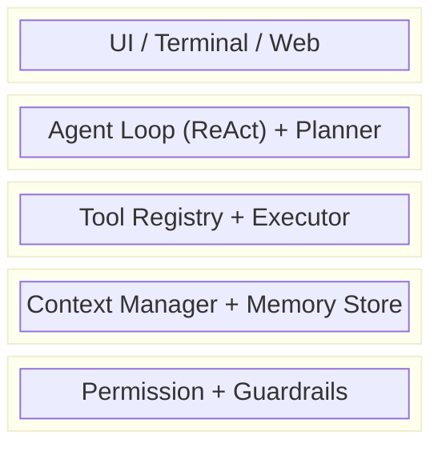
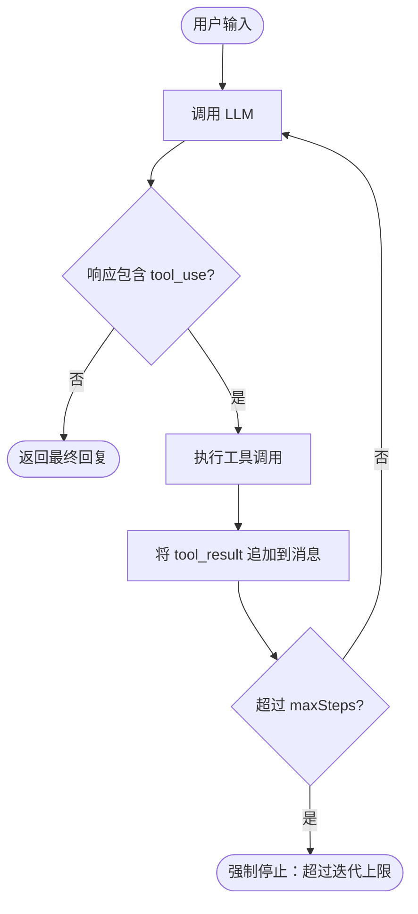
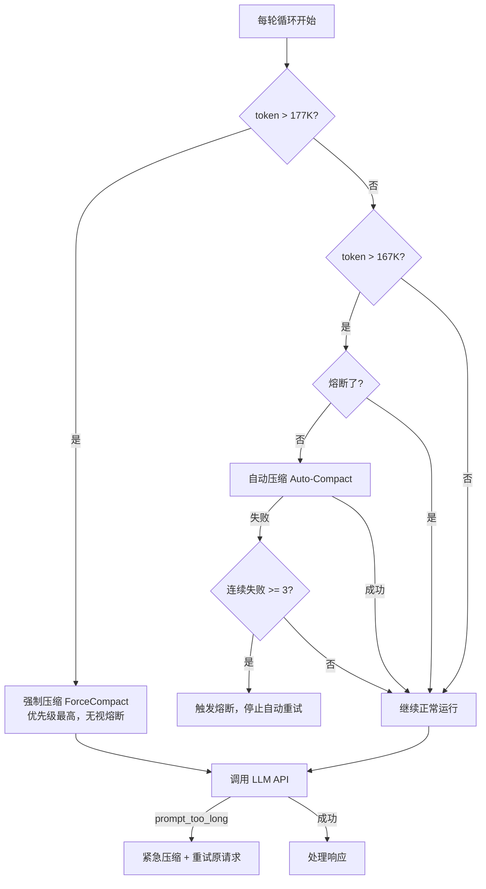
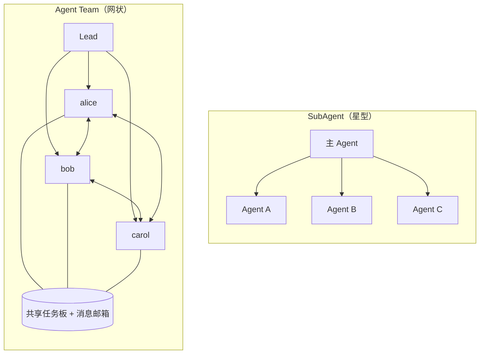
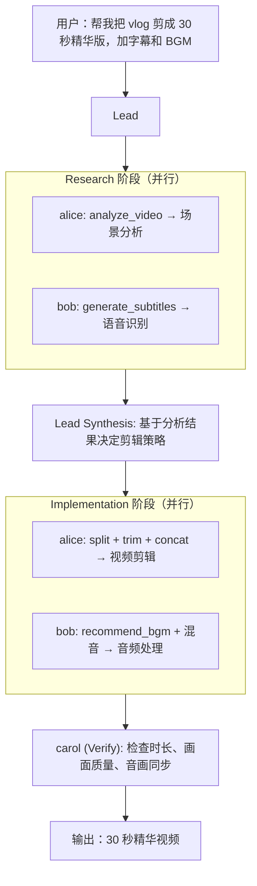
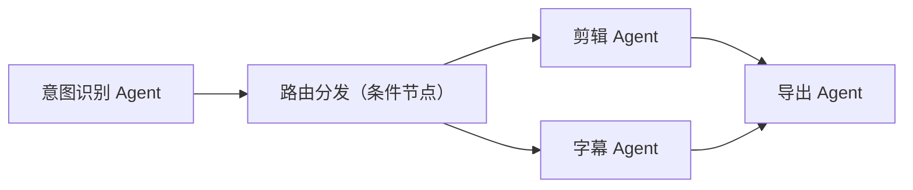
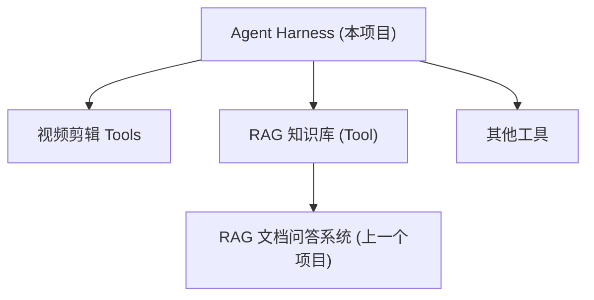

# AI Agent Harness — 学习笔记

## 一、什么是 Coding Agent

### 从一个场景说起

你刚接手一个新项目，老板让你「把用户认证从 Session 换成 JWT」。你的工作流程：

```
读代码 → 理解 → 做决策 → 写代码 → 看结果 → 调整 → 再来一轮
```

这是一个**带反馈的循环**——每做一步，都根据上一步的结果决定下一步。

如果有个 AI 也能跑这个循环呢？你只说一句话，它自己翻代码、自己读文件、自己写代码、自己跑测试、自己根据报错修改。**这就是 Coding Agent。**

### Agent 的本质：四要素缺一不可

抛开花哨的定义，Agent 和普通聊天机器人的核心区别就两个字：**自主**。

Anthropic 的定义：
> Agent 就是 LLM 在循环中根据环境反馈自主使用工具的系统。

拆开来看：

| 要素 | 作用 | 缺了会怎样 |
|------|------|-----------|
| **LLM** | 大脑，负责理解和推理 | 没有理解能力，变成死板脚本 |
| **工具** | 手脚，能读写文件、执行命令 | 空想家，什么都做不了 |
| **循环** | 持续驱动，做完一步再下一步 | 只能做一步就停，碰到意外就傻了 |
| **反馈** | 感知结果，知道做对没有 | 闭着眼开车，不知道对错 |

### 为什么 Coding Agent 是最好的学习沙盘

代码有一个巨大优势：**可以自动验证**。

- 编译器：过了就是过了，没过就是没过
- 测试框架：绿了就是绿了，红了就是红了
- Agent 可以**自己验证自己的输出**

写代码本身就是「写 → 运行 → 看报错 → 修改 → 再运行」的循环，跟 Agent 的核心循环完美契合。在这个场景下学到的架构思维，可以迁移到任何 Agent 场景（包括视频剪辑）。

### 五层架构

一个 Coding Agent 的模块组织：



每层只管自己的事，通过接口通信。交互层不需要知道 LLM 怎么调用，工具层不需要关心界面怎么渲染，安全层贯穿所有操作但不干预具体逻辑。

---

## 二、Agent Loop 与 ReAct 范式

### 2.1 问题：Agent 还不会「自己干活」

你让 Agent 「写一个 HTTP 服务器，编译一下，确保没报错」——这需要 5、6 步操作。但如果没有 Agent Loop，模型返回一个 tool_use，你执行完返回 tool_result，模型给一个最终回复，**结束**。它不会自动往下走。

就好比你请了一个实习生，他确实会写代码、会跑命令，但每做完一步就停下来看着你等你说「继续」。

**Agent Loop 就是让模型学会「自己干活」的那个机制。** 核心就是一个 while 循环加几次 API 调用。

### 2.2 ReAct：想一步做一步

ReAct（Reasoning + Acting）由 Yao et al. (2022) 提出，核心思想：让 LLM **交替**进行推理和行动。

```
Think: 用户想写 HTTP 服务器，先看看项目里有哪些文件。
Act:   Glob(pattern="**/*")
Observe: main.go, handler.go, go.mod

Think: 已经有 handler.go 了，看看现有路由怎么组织的。
Act:   ReadFile(path="handler.go")
Observe: func handleHealth(w http.ResponseWriter, r *http.Request) { ... }

Think: 用 net/http，加新路由就行。改完编译看看。
Act:   EditFile(path="handler.go", ...)
Observe: 文件修改成功
Act:   Bash(command="go build ./...")
Observe: exit code: 0
```

关键洞察：**Claude API 的消息结构天然支持 ReAct**——Think 就是 assistant 的 text，Act 就是 tool_use，Observe 就是 tool_result。不需要发明新格式。

### 2.3 范式对比

| 范式 | 核心思路 | 优点 | 局限 |
|------|----------|------|------|
| Chain-of-Thought | 只推理，不行动 | 推理质量高 | 无法与环境交互 |
| Act-only | 只行动，不推理 | 执行快 | 盲目调工具，容易出错 |
| **ReAct** | **推理与行动交替** | **两全其美** | 每轮都要一次 LLM 调用 |
| Plan-then-Execute | 先出完整计划再执行 | 全局规划好 | 计划可能过时 |

对 Coding Agent 来说，ReAct 是最自然的选择——写代码本来就是边想边做的。

### 2.4 Agent Loop 状态机



### 2.5 Agent Loop 核心实现

```go
func (a *Agent) RunLoop(ctx context.Context, input string) (<-chan AgentEvent, error) {
    events := make(chan AgentEvent, 64)
    
    go func() {
        defer close(events)
        messages := []Message{{Role: "user", Content: input}}
        
        for step := 0; step < a.maxSteps; step++ {
            // 检查取消信号
            select {
            case <-ctx.Done():
                events <- AgentEvent{Type: "error", Data: "cancelled"}
                return
            default:
            }
            
            // 调用 LLM
            response, err := a.llm.Chat(ctx, a.systemPrompt, messages, a.tools)
            if err != nil {
                if isPromptTooLong(err) {
                    a.compactContext(ctx, messages) // 紧急压缩
                    continue
                }
                events <- AgentEvent{Type: "error", Data: err.Error()}
                return
            }
            
            // 状态机判断：继续 or 终止
            if len(response.ToolCalls) == 0 {
                events <- AgentEvent{Type: "loop_complete", Data: response.Content}
                return // 模型认为任务完成
            }
            
            // 执行工具调用（分批：并发安全的并行，不安全的串行）
            messages = append(messages, response.ToAssistantMessage())
            batches := partitionToolCalls(response.ToolCalls, a.registry)
            for _, batch := range batches {
                results := a.executeBatch(ctx, batch)
                for _, r := range results {
                    events <- AgentEvent{Type: "tool_result", Data: r}
                }
                messages = append(messages, resultsToMessage(results))
            }
            
            events <- AgentEvent{Type: "turn_complete", Data: step}
        }
        
        events <- AgentEvent{Type: "error", Data: "max steps exceeded"}
    }()
    
    return events, nil
}
```

### 2.6 四种停止条件（缺一不可）

| 条件 | 触发方式 | 作用 |
|------|----------|------|
| 模型主动完成 | `stop_reason == end_turn` 且无 tool_use | 最理想的结束 |
| 迭代上限 | 超过 maxSteps（如 50） | 安全网，防无意义循环 |
| 用户取消 | Go: `ctx.Done()`；TS: `AbortController` | 用户主动中断 |
| 异常状态 | 工具不存在/禁用 | 返回错误让模型调整 |

**一个停不下来的 Agent 比没有 Agent 更可怕。**

### 2.7 AgentEvent 事件流：Agent 和 UI 解耦

Agent Loop 可能跑几秒到几分钟，采用「事件流」模式而非同步返回：

| 事件类型 | 含义 | 携带数据 |
|----------|------|----------|
| `stream_text` | 模型正在输出的文字增量 | 一小段文本 |
| `tool_use` | 模型请求调用工具 | 工具名、输入、请求 ID |
| `tool_result` | 工具执行完成 | 结果、是否出错、耗时 |
| `turn_complete` | 一轮 LLM 调用完成 | 当前轮次序号 |
| `loop_complete` | 整个循环结束 | 总轮次 |
| `usage` | Token 用量更新 | 累计输入/输出 token |
| `error` | 发生错误 | 错误信息 |

```go
// Go 的事件流：channel
for event := range agent.RunLoop(ctx, userInput) {
    switch event.Type {
    case "stream_text":
        ui.AppendText(event.Data)
    case "tool_use":
        ui.ShowToolCall(event.Data)
    case "tool_result":
        ui.ShowResult(event.Data)
    case "loop_complete":
        ui.Finish()
    }
}
```

**Agent 不知道 UI 的存在，UI 不知道 Agent 内部跑了几轮循环。** 你可以把 UI 换成 Web 界面或纯 JSON 输出，Agent 一行代码不用改。

### 2.8 工具执行的分批逻辑

模型一次可能返回多个工具调用（比如同时 ReadFile 三个文件）。按 `isConcurrencySafe` 声明做分批：

```go
func partitionToolCalls(calls []ToolCall, registry *Registry) []Batch {
    var batches []Batch
    for _, tc := range calls {
        tool := registry.Get(tc.Name)
        safe := tool != nil && tool.IsConcurrencySafe(tc.Input)
        
        if safe && len(batches) > 0 && batches[len(batches)-1].Concurrent {
            batches[len(batches)-1].Calls = append(batches[len(batches)-1].Calls, tc)
        } else {
            batches = append(batches, Batch{Concurrent: safe, Calls: []ToolCall{tc}})
        }
    }
    return batches
}
```

例：模型返回 `[Read, Read, Edit, Read, Read]` → 分成三批：
- `[Read, Read]` 并发执行
- `[Edit]` 串行执行
- `[Read, Read]` 并发执行

三个 ReadFile 同时跑比排队快三倍，同时写操作自动隔离到串行批次。

---

## 三、Tool System 设计

### 3.1 Tool 的定义

Tool 是 Agent 能够调用的外部能力单元。每个 Tool 需要：
1. **名称** — 唯一标识
2. **描述** — LLM 用来理解何时调用
3. **参数 Schema** — JSON Schema 格式，LLM 用来构造参数
4. **执行函数** — 实际逻辑
5. **并发安全声明** — 是否可以和其他工具并行执行

```go
type Tool interface {
    Name() string
    Description() string
    Schema() json.RawMessage
    Execute(ctx context.Context, args json.RawMessage) (string, error)
    IsConcurrencySafe(args json.RawMessage) bool
}
```

### 3.2 Tool Registry

```go
type Registry struct {
    mu    sync.RWMutex
    tools map[string]Tool
}

func (r *Registry) Register(tool Tool) error {
    r.mu.Lock()
    defer r.mu.Unlock()
    if _, exists := r.tools[tool.Name()]; exists {
        return fmt.Errorf("tool %q already registered", tool.Name())
    }
    r.tools[tool.Name()] = tool
    return nil
}

func (r *Registry) Execute(ctx context.Context, name string, args json.RawMessage) (string, error) {
    r.mu.RLock()
    tool, exists := r.tools[name]
    r.mu.RUnlock()
    if !exists {
        return "", fmt.Errorf("unknown tool: %s", name)
    }
    
    // 带超时执行
    ctx, cancel := context.WithTimeout(ctx, 30*time.Second)
    defer cancel()
    
    return tool.Execute(ctx, args)
}
```

### 3.3 视频剪辑场景的 Tools

| Tool 名称 | 功能 | 并发安全 | 说明 |
|-----------|------|----------|------|
| `analyze_video` | 分析视频内容、场景、人物 | ✅ | 只读操作 |
| `split_scenes` | 按场景边界切割视频 | ❌ | 写文件 |
| `generate_subtitles` | 语音识别生成字幕 | ✅ | 只读+生成 |
| `recommend_bgm` | 根据视频情绪推荐 BGM | ✅ | 只读查询 |
| `trim_video` | 裁剪视频指定片段 | ❌ | 写文件 |
| `concat_videos` | 拼接多段视频 | ❌ | 写文件 |
| `add_effects` | 添加滤镜/特效 | ❌ | 写文件 |
| `export_video` | 导出最终视频 | ❌ | 写文件 |
| `rag_query` | 查询知识库 | ✅ | 复用 RAG 项目 |

---

## 四、上下文压缩与 Token 管理

> 架构定位：记忆层的**上下文管理组件**。它让 Agent 能在有限的 Token 窗口内长时间工作。

### 4.1 问题本质：Agent 越跑越慢

Claude API 是**无状态**的——每一轮请求都必须把完整对话历史发过去。Token 数量随对话轮次**线性增长**：

```
第 1 轮:  ~1,000 input tokens
第 5 轮:  ~20,000 input tokens
第 10 轮: ~60,000 input tokens
第 20 轮: ~150,000 input tokens  ← 逼近 200K 上限
```

一个 1000 行源文件 ≈ 15,000 tokens。读 10 个文件就是 15 万。**一旦撞上限，API 报错，Agent 瘫痪。**

### 4.2 Token 花在哪了

| 消息类型 | 典型 Token 量 | 占比 |
|----------|---------------|------|
| 固定开销（角色设定、工具描述） | 5,000 - 15,000 | ~10% |
| 用户输入 | 50 - 500 | ~1% |
| AI 文字回复 | 200 - 2,000 | ~3% |
| 工具调用请求 | 50 - 200 | ~1% |
| **工具结果（文件内容）** | **5,000 - 20,000** | **~55%** |
| 工具结果（命令输出） | 500 - 5,000 | ~20% |
| 工具结果（搜索结果） | 500 - 3,000 | ~10% |

**关键洞察**：
- 工具结果占 ~85% 的 Token 消耗
- 很多工具结果「保质期」很短——第 3 轮读的文件，第 5 轮已经被改了，旧版本还占着预算
- **压缩从工具结果下手，用户对话着重保留**

### 4.3 两层压缩：能轻则轻

| 层级 | 手段 | 信息损失 | API 开销 | 触发条件 |
|------|------|----------|----------|----------|
| **第 1 层** | 大结果存磁盘 | 几乎为零 | 零 | 单条工具结果 > 50K 字符 |
| **第 2 层** | 摘要旧消息 + 保留近期原文 | 中 | 高（一次 API） | token 逼近窗口上限 |

设计哲学：**能轻则轻。** 轻量手段能扛住的，绝不动用昂贵的全量摘要。

### 4.4 第 1 层：大结果存磁盘

核心原则：**所有处理发生在工具结果进入对话历史之前。** 写入即终态。

#### 单条超限（> 50K 字符）

```go
func (cm *ContextManager) ProcessResult(result ToolResult) ToolResult {
    if len(result.Content) <= singleLimit { // 50,000 chars
        return result
    }
    // 存盘 + 只留预览
    path := cm.persistToDisk(result)
    preview := result.Content[:2048]
    return ToolResult{
        Content: fmt.Sprintf("<persisted-output>\n输出太大（%dKB），完整内容已保存到：\n%s\n\n预览（前2KB）：\n%s\n</persisted-output>",
            len(result.Content)/1024, path, preview),
    }
}
```

**为什么几乎零损失？** 完整结果还在磁盘上，模型用 ReadFile 读回即可。

**闭环问题**：读回的内容一样大 → 再被溢写 → 永远看不到全文。解决：**溢写文件的读回结果直接放行，不做溢写。**

#### 聚合限制（一轮所有结果合计 > 200K 字符）

```go
func (cm *ContextManager) ProcessBatchResults(results []ToolResult) []ToolResult {
    total := sumCharCount(results)
    if total <= aggregateLimit { // 200,000 chars
        return results
    }
    sort.Slice(results, func(i, j int) bool {
        return len(results[i].Content) > len(results[j].Content)
    })
    for i := range results {
        if total <= aggregateLimit { break }
        total -= len(results[i].Content)
        results[i] = cm.ProcessResult(results[i]) // 存盘最大的
    }
    return results
}
```

#### 写入即终态 → Prompt Cache 友好

Prompt Cache 要求消息前缀**逐字节一致**才能命中。如果每轮都改写历史消息，Cache 命中率归零。「写入即终态」让前缀天然稳定——不需要额外维护。

### 4.5 第 2 层：Auto-Compact（全量摘要兜底）

#### 触发阈值

```
上下文窗口               200,000
 - 预留给摘要输出         - 20,000    (摘要本身占空间)
= 有效窗口              180,000
 - 安全余量              - 13,000    (两次检查间的盲区)
= 自动压缩阈值          167,000
```

**为什么是固定值不是百分比？** Buffer 保护的是「单轮波动」——一次 ReadFile 不管窗口是 200K 还是 1M 都是 ~15K token。固定 33K buffer 在任何窗口大小下都够挡 1-2 次大文件：

```
1M 窗口：1,000,000 - 20,000 - 13,000 = 967,000 (阈值)
```

#### 摘要 Prompt：9 段结构化输出

```
1. 主要请求和意图        用户到底想做什么
2. 关键技术概念          讨论过的重要技术点
3. 文件和代码段          涉及哪些文件，关键代码片段保留
4. 错误和修复            遇到了什么错，怎么解决的
5. 问题解决过程          解决问题的思路和方法
6. 所有用户消息          用户说过的话（尽量原文保留！）
7. 待办任务              还没完成的事
8. 当前工作              最近在做什么（要最详细）
9. 可能的下一步          接下来打算做什么
```

**第 6 条为什么原文保留？** 用户说「不要用 `interface{}`，用 `any`」，摘要成「用户偏好现代语法」，模型下次可能给出 `type any = interface{}`——不是用户想要的。原文才能准确传达意图。

#### 两阶段生成

Prompt 要求 LLM 先产出 `<analysis>` 草稿块梳理思路，然后产出正式 `<summary>` 块。**最终只保留 summary，analysis 丢弃。** 实验发现这能显著提升摘要质量。

#### 压缩后恢复

不是把整段对话都换成摘要：
- 较早消息 → 摘要
- **近期约 1 万 token 或至少 5 条消息 → 一字不改保留**
- 不从中间切断 tool_use 和 tool_result 的配对

恢复时附加：
- 最近访问的文件（最多 5 个，每个最多 5,000 Token）
- 会话记录路径（防止模型编造细节）

### 4.6 多层防线全景



```go
func (a *Agent) checkAndCompact(ctx context.Context) {
    tokenCount := a.estimateTokens()
    
    // 防线 1: 强制压缩线（优先级最高）
    if tokenCount > a.effectiveWindow-3000 {
        a.forceCompact(ctx)
        return
    }
    // 防线 2: 自动压缩
    if tokenCount > a.compactThreshold && !a.circuitBroken {
        if err := a.autoCompact(ctx); err != nil {
            a.compactFailures++
            if a.compactFailures >= 3 {
                a.circuitBroken = true
            }
        }
    }
}

// 防线 3: API 返回 prompt_too_long 时
func (a *Agent) handlePromptTooLong(ctx context.Context, originalReq Request) (*Response, error) {
    a.forceCompact(ctx)
    return a.llm.Chat(ctx, originalReq) // 压缩后重试
}
```

### 4.7 视频剪辑 Agent 中的应用

| 场景 | Token 消耗 | 压缩策略 |
|------|-----------|----------|
| `analyze_video` 返回帧级分析 | 30K - 80K | 第 1 层存盘 |
| `split_scenes` 时间码列表 | 2K - 5K | 不触发 |
| `generate_subtitles` 完整 SRT | 10K - 50K | 可能第 1 层 |
| 多轮剪辑迭代 | 累积 100K+ | 第 2 层压缩 |

**设计启示**：视频分析类工具天然产生大结果，Tool 接口应返回**结构化摘要**而非原始数据，从源头减压。

---

## 五、Guardrails（安全护栏）

### 5.1 为什么需要

Agent 拥有执行真实操作的能力——必须有安全边界：

1. **输入护栏**：过滤恶意/注入 prompt
2. **输出护栏**：检查生成内容是否合规
3. **执行护栏**：限制工具调用权限、频率
4. **Token 预算**：防止无限循环消耗

### 5.2 权限系统设计

不是简单的 allow/deny，而是三级权限矩阵：

| 操作类型 | Default 模式 | Plan 模式 |
|----------|-------------|-----------|
| 读文件 | allow | allow |
| 写文件 | ask（需确认） | ask |
| 执行命令 | ask | ask |
| Plan 文件 | ask | allow（自动放行） |

### 5.3 Plan Mode：只想不做

有时候你不想让 Agent 直接动手。Plan Mode 通过 **Prompt 指令约束模型行为**，而不是粗暴地禁用工具：

```
Plan mode is active. 你不能执行任何修改操作。
唯一可以写入的是 plan file。

你的工作流程：
1. 用 ReadFile、Grep、Glob、Bash（只读命令）探索代码
2. 分析用户需求，设计实现方案
3. 把计划写入 plan file
4. 等待用户确认后再执行
```

为什么不直接禁用写工具？因为 Agent 在规划阶段经常需要 `Bash` 跑只读命令（`grep -r "TODO" .`、`find . -name "*.go"`）。如果把 Bash 整个禁掉，探索操作全做不了。

### 5.4 循环检测

```go
type LoopDetector struct {
    history []ToolCallRecord
    window  int // 检查最近 N 次调用
}

func (d *LoopDetector) IsLooping(call ToolCall) bool {
    // 连续 3 次调用相同 Tool + 相同参数 → 判定循环
    recent := d.history[max(0, len(d.history)-d.window):]
    sameCount := 0
    for _, h := range recent {
        if h.Name == call.Name && h.ArgsHash == hashArgs(call.Args) {
            sameCount++
        }
    }
    return sameCount >= 3
}
```

---

## 六、多 Agent 协作

### 6.1 从 SubAgent 到 Agent Team

**SubAgent**（星型拓扑）：主 Agent 在中心，子 Agent 在周围。所有通信经过主 Agent。适合明确的一次性子任务。

**Agent Team**（网状结构）：队员有自己的上下文，可以直接给其他队员发消息。适合需要协作的持续性工作。



### 6.2 协调机制：共享工具取代调度器

与 AutoGen/CrewAI 的「中心化编排」不同，MewCode 的设计是把协调能力做成**工具**注入队员：

```go
// 队员额外注册的协调工具
TaskCreate    // 创建任务
TaskGet       // 查看任务详情
TaskList      // 列出所有任务
TaskUpdate    // 更新状态（含依赖字段 addBlocks/addBlockedBy）
SendMessage   // 给其他队员发消息
```

**设计哲学**：框架不裁判，只提供基础设施。谁做什么由 LLM 自己看共享任务列表和消息判断。代价是行为可预测性弱一些；收益是新增协作模式只需要加工具，不用动调度器。

### 6.3 Coordinator Mode

当任务复杂、队员数量多时，Lead 一心二用会出问题。Coordinator Mode 收窄 Lead 的工具集：

```go
var coordinatorTools = []string{
    "Agent",          // 派新队员
    "SendMessage",    // 续用已有队员
    "TaskStop",       // 中止派错方向的队员
    "SyntheticOutput",// 结构化交付结果
    "TeamDelete",     // 拆掉团队
}
```

**划线标准不是「读写」而是「会不会把大段内容灌进 Lead 上下文」。** ReadFile、Grep、Bash 都在线外——需要看代码就派队员去看，队员把结论带回来。

### 6.4 四阶段工作流

| 阶段 | 执行者 | 目的 |
|------|--------|------|
| **Research** | 队员（可并行） | 调查代码库、定位文件 |
| **Synthesis** | Lead coordinator | 阅读结果，撰写实施规格 |
| **Implementation** | 队员 | 按规格修改代码 |
| **Verification** | 队员 | 测试改动是否正确 |

关键：**Synthesis 阶段 Lead 不能把理解能力委托出去。** 正确做法是 Lead 自己理解后给出具体指令：

```go
// ❌ 反面模式
Agent(prompt: "基于你的调研结果，修复认证 bug")

// ✅ 正确模式
Agent(prompt: "修复 src/auth/validate.go:42 的空指针。Session 的 User 字段在过期但 token 仍缓存时为 nil。在访问 user.ID 前加空值检查，nil 时返回 401。")
```

### 6.5 视频剪辑场景的多 Agent 应用



---

## 七、CloudWeGo Eino 框架要点

Eino 是字节跳动开源的 Go 语言 LLM/AI 应用开发框架，直接对标目标岗位技术栈。

### 7.1 核心抽象

| 概念 | 说明 | 对应本项目 |
|------|------|-----------|
| **ChatModel** | LLM 通信抽象 | LLM Interface 层 |
| **ToolsNode** | 工具执行节点 | Tool Executor |
| **Chain** | 顺序组合多个组件 | 简单管线 |
| **Graph** | DAG 图编排 | 多 Agent 编排 |
| **Flow** | 预构建的常用模式 | ReAct Agent |
| **Callback** | 生命周期钩子 | Observability |

### 7.2 Eino 的 ReAct Agent

```go
agent, _ := react.NewAgent(ctx, &react.AgentConfig{
    Model: chatModel,
    Tools: []tool.BaseTool{
        analyzeVideoTool,
        splitScenesTool,
        generateSubtitlesTool,
    },
    MaxSteps:        10,
    MessageModifier: systemPrompt,
})

result, _ := agent.Generate(ctx, []*schema.Message{
    schema.UserMessage("帮我把这段视频剪成30秒的精华版"),
})
```

### 7.3 Graph 编排（多 Agent）



---

## 八、与 RAG 项目的关系



RAG 系统在 Agent 视角下是一个 **Tool**：Agent 需要查询剪辑最佳实践时 → 调用 `rag_query` → RAG 执行检索+生成 → Agent 根据知识继续规划。

---

## 九、面试要点

### 核心问题

1. **「Agent 和普通聊天机器人的区别？」**
   - 四要素：LLM + 工具 + 循环 + 反馈，关键词是**自主**
   - 聊天机器人是一问一答；Agent 是给目标自己想办法完成

2. **「为什么用 Go 不用 Python？」**
   - goroutine + channel 天然适合多 Tool 并行和事件流
   - 字节内部 Eino 框架证明 Go 在 AI 应用层可行
   - 单二进制部署，类型安全减少运行时错误

3. **「Agent 死循环怎么办？」**
   - 四种停止条件缺一不可
   - 多层防线：迭代上限 + Token 预算 + 循环检测 + 熔断机制
   - context.WithTimeout 控制全链路超时

4. **「上下文窗口不够用怎么办？」**
   - 两层压缩：大结果存盘（零成本）+ Auto-Compact（全量摘要兜底）
   - 写入即终态对 Prompt Cache 友好
   - Token 花费分析：工具结果占 85%，从这里下手

5. **「多 Agent 怎么协调？」**
   - 协调能力做成工具而非调度器
   - SharedTask + SendMessage + Worktree 隔离
   - Coordinator Mode：Lead 只调度不写代码，防冲突

6. **「Tool 调用失败怎么处理？」**
   - 错误作为 Observation 反馈给 LLM，让其决策重试/换工具/回复用户
   - 分批执行：并发安全的并行，不安全的串行
   - 指数退避重试 + 降级策略

---

## 十、学习路径

```
Week 1: 基础概念 + Agent Loop
         ├── 理解 Agent 四要素和 ReAct 范式
         ├── 实现最小 Agent Loop（while + API call）
         ├── 四种停止条件 + AgentEvent 事件流
         └── 集成 OpenAI Function Calling

Week 2: Tool System + 分批执行
         ├── Tool 接口 + Registry + 并发安全声明
         ├── partitionToolCalls 分批逻辑
         ├── 实现 4-5 个视频剪辑模拟 Tool
         └── errgroup 并发执行

Week 3: 上下文管理 + Guardrails
         ├── 第 1 层：大结果存磁盘（单条 + 聚合）
         ├── 第 2 层：Auto-Compact（阈值 + 摘要 Prompt）
         ├── 多层防线：自动 → 熔断 → 强制 → 紧急
         └── 权限矩阵 + Plan Mode + 循环检测

Week 4: 工程化 + 多 Agent
         ├── OpenTelemetry 全链路追踪
         ├── HTTP 服务 + SSE 流式输出
         ├── SubAgent + Agent Team 基础
         ├── RAG Tool 接入
         └── 端到端评估
```
