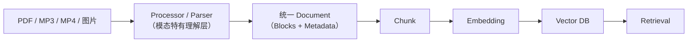
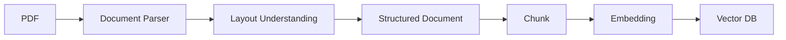
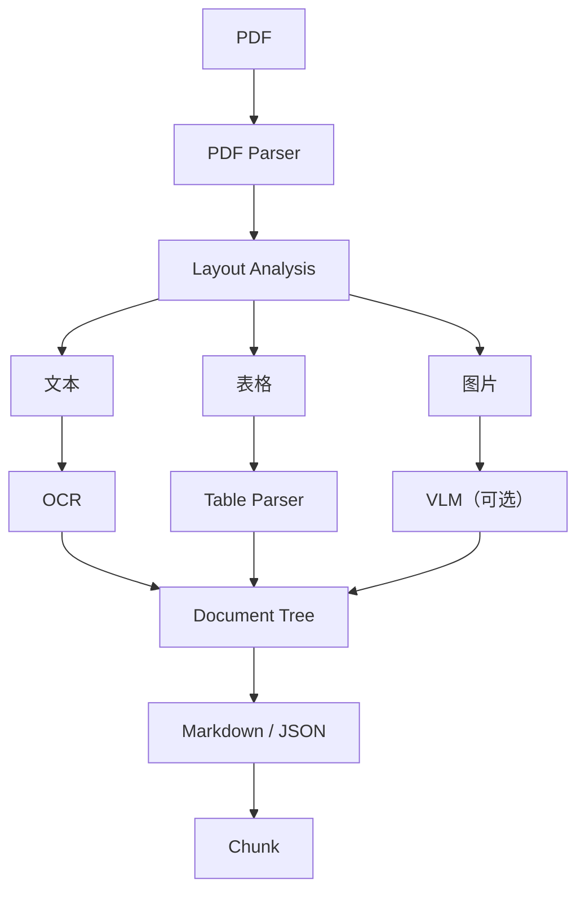
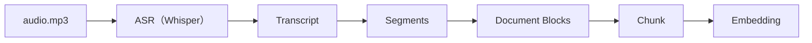
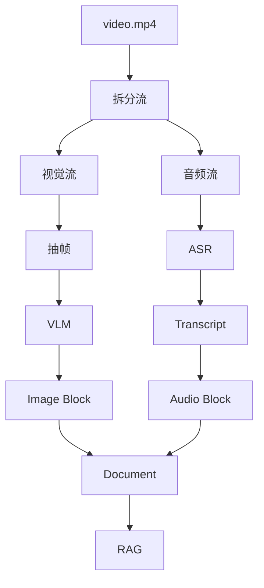
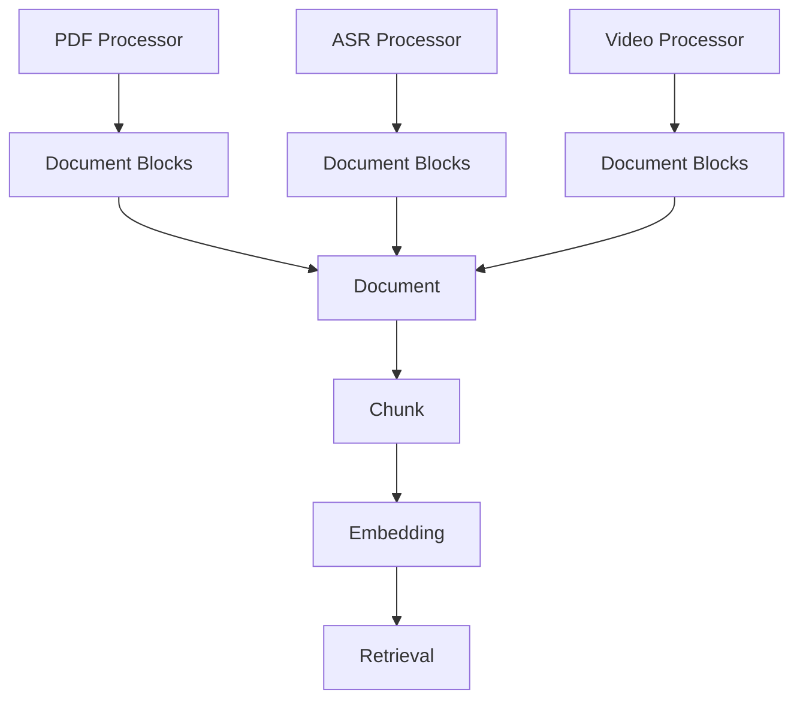

# 多模态文档处理逻辑（PDF / 音频 / 视频 RAG）

> 本文整理自 BinRAG 项目调研开源 RAG 生态时对 PDF、音频、视频处理逻辑的学习记录。
> 配套阅读：[RAG 学习笔记](/phase3/docs-rag/学习笔记)、[项目设计](/phase3/docs-rag/项目设计)、[Rag 的 13 种分块策略](/phase3/docs-rag/Rag的13种分块策略)。

---

## 一、总览：为什么开源 RAG 不直接丢原始文件给 LLM？

> **核心结论：主流开源 RAG 项目不会直接把原始文件丢给 LLM，而是先通过 Processor / Parser 将不同类型数据转换为统一的结构化知识单元（Document / Node / Block），然后进入统一的 Chunk → Embedding → Retrieval 流程。**

不同模态的差异，主要体现在 **Processor 如何理解原始数据**：



- PDF 的 Processor 负责**恢复文档结构**（标题、表格、图片、布局）；
- 音频的 Processor 负责 **ASR 转写 + 时间戳**；
- 视频的 Processor 负责**拆视觉流 + 拆音频流，再按时间轴重组**。

一旦变成统一的 Document / Block，下游的 Chunk、Embedding、Retrieval 对三种模态就完全无感知了。

---

## 二、PDF RAG 的处理逻辑

代表项目：**Docling**、**LlamaIndex**、**Unstructured**。

### 2.1 从"提取文本"到"恢复结构"

早期方案（简单粗暴）：

```text
PDF → pdftotext → 纯文本 → chunk
```

**问题：** 丢失标题层级、丢失表格、丢失图片、丢失布局。检索"第五章讲了什么"、"这张表里的数据"时全部失效。

现代 PDF RAG：



### 2.2 Docling 类项目处理方式

核心思想：

> PDF → 中间文档结构 → Markdown / JSON → RAG



**Docling 输出不是普通字符串。** 一份含标题、表格、图片的 PDF 会被解析成结构化的 Block 序列：

```json
{ "type": "heading", "content": "第1章 Redis架构" }
{ "type": "table",   "content": "节点 | 端口" }
{
  "type": "picture",
  "metadata": { "page": 3 }
}
```

之后每个 Block 进入统一的 `Block → Chunk → Embedding`。

### 2.3 PDF 项目的核心思想

> **PDF Processor 的职责是恢复文档结构，而不是回答问题。**

它负责：文本提取、标题识别、表格恢复、图片定位、OCR、页面结构。

它**不负责**：Chunk、Retrieval、Answer。

> 设计要点：表格为什么值得单独处理？因为表格是**行 × 列的结构化信息**，直接压成一行文本会破坏单元格之间的对应关系；Table Parser（如 Table Transformer）会把它转成 Markdown 表格或 JSON，保证检索到的表格内容仍然可读。图片则需要 VLM 生成文字描述，否则图像本身无法被文本 Embedding 模型检索。

---

## 三、音频 RAG 的处理逻辑

代表项目：**Whisper**、**LlamaIndex Audio RAG**、**LangChain Audio Loader**。

### 3.1 音频先转文本

目前绝大部分 RAG 的向量模型是 **Text Embedding**，所以音频必须先转文本：



### 3.2 ASR 输出不是简单字符串

**错误做法：** 只保留转写文本，丢失时间信息。

```text
今天讨论Redis缓存   ← 丢了"什么时候说的"
```

**现代系统：** 转写片段携带时间戳：

```json
{
  "text":  "今天讨论Redis缓存",
  "start": 120.5,
  "end":   130.8
}
```

**为什么必须保留时间？** 因为用户会问：

> "这个会议什么时候讨论 Redis？"

答案不只是一段文本，而是定位：

```text
meeting.mp3  →  02:00 - 02:10
```

时间戳让答案**可回溯到原始媒体**，这是音频 RAG 与文档 RAG 最大的差异点。

### 3.3 Audio Segment Block

Audio Processor 输出的 Block：

```json
{
  "type": "audio_segment",
  "content": "介绍Redis持久化机制",
  "metadata": {
    "start_ms": 12000,
    "end_ms":   18000
  }
}
```

之后：

```text
AudioSegment → Chunk → Embedding
```

> 设计要点：Chunk 边界尽量对齐 Segment 边界（不要把一个 Segment 拦腰切断），保证"检索到一个 Chunk = 检索到一段完整的话"。未来的 speaker diarization（说话人分离）也会作为 metadata 挂到 Segment 上。

### 3.4 音频项目的核心思想

> **ASR 是理解层，时间戳是检索层。**

必须保留：

- **时间**（start / end）
- **来源**（哪个文件、哪个会议）
- **speaker**（未来扩展）

---

## 四、视频 RAG 的处理逻辑

代表项目：**LlamaIndex Video RAG**、**VideoDB**、多模态 RAG 项目。

> **核心结论：视频 RAG 本质是 Audio RAG + Image RAG 的组合。**



### 4.1 为什么视频必须拆开？

视频同时包含两类信息，处理方式完全不同：

| 信息 | 内容举例 | 理解手段 |
| ---- | ------- | ------- |
| 视觉信息 | 代码截图、架构图、产品操作画面 | VLM（图像 → 文字描述） |
| 音频信息 | 老师讲解、会议内容、操作说明 | ASR（语音 → 转写文本） |

### 4.2 视频抽帧方式

开源项目通常**不是逐帧处理**（成本爆炸），而是两阶段：

**第一阶段：固定间隔抽帧**，例如每 10 秒一帧：

```text
00:00   00:10   00:20   ...
```

**第二阶段：场景检测（Scene Detection）**，按画面切换切分：

```text
教学视频:
00:00  老师头像
05:00  PPT
20:00  代码
→  Scene1 / Scene2 / Scene3
```

场景检测比固定间隔更聪明：同一场景内的帧信息冗余，按场景抽帧能让每个 Visual Block 对应一段**语义完整**的画面。

### 4.3 视频视觉 Block

抽帧得到 `frame_001.jpg`，交给 VLM 生成描述：

```json
{
  "type": "video_frame_description",
  "content": "展示Deployment配置",
  "metadata": {
    "timestamp": 120000,
    "video": "k8s.mp4"
  }
}
```

### 4.4 视频音频 Block

音频轨走 ASR，输出与纯音频 RAG 相同的 Segment Block：

```json
{
  "type": "audio_segment",
  "content": "下面介绍Deployment滚动更新",
  "metadata": {
    "start": 118000,
    "end":   130000
  }
}
```

### 4.5 通过时间轴重组 Video Document

视觉 Block 和音频 Block 靠 **timestamp 对齐**，组合成同一个 Video Document：

```json
{
  "type": "video_document",
  "blocks": [
    { "type": "video_frame_description", "timestamp": 100,    "content": "展示架构图" },
    { "type": "audio_segment",           "timestamp": "105-120", "content": "这里介绍组件关系" }
  ]
}
```

然后统一 `Chunk → Embedding → Vector DB`。

> 设计要点：**时间戳就是视频 RAG 的"页码"**。检索命中的 Block 带上 timestamp，前端就能直接跳转到视频对应位置播放——这与 PDF 检索返回页码、音频检索返回时间段是同一个设计逻辑。

---

## 五、三个领域的统一抽象

实际上三种模态最后都收敛到同一形态：



### 原则 1：Processor 不负责 RAG

```text
错误：PDF Processor 解析 → chunk → embedding → 存储   ← 职责混杂
正确：Processor 只负责理解，下游统一走 RAG 管线       ← 单一职责
```

### 原则 2：尽量转成统一结构

| 模态 | Block 类型 |
| ---- | ---------- |
| PDF | Paragraph Block / Table Block / Image Block |
| 音频 | AudioSegment Block |
| 视频 | VideoFrame Block + AudioSegment Block |

### 原则 3：Metadata 非常重要

| 模态 | 关键 metadata |
| ---- | ------------- |
| PDF | `page: 3` |
| 音频 | `start: 10000, end: 20000` |
| 视频 | `timestamp: 120000` |

**为什么？** 因为 RAG 最终需要**引用**——答案必须能指回原始出处（页码 / 时间段 / 视频位置），否则无法验证、无法溯源。

---

## 六、对应 BinRAG 的设计映射

你的设计管线：

```text
loader → Processor → Document { Blocks, Metadata } → Chunk → Embedding → Qdrant
```

与开源项目对应关系：

| 类型 | 开源项目处理方式 | BinRAG 方案 |
| ---- | -------------- | ----------- |
| PDF | Layout → Structured Document | Loader Block |
| 图片 | VLM → Description Block | ImageProcessor |
| 音频 | ASR → Segment Block | AudioProcessor |
| 视频 | Frame + ASR → Blocks | VideoProcessor |

---

## 一句话总结

> **PDF RAG 的核心是恢复文档结构；Audio RAG 的核心是 ASR + 时间戳；Video RAG 的核心是拆分视觉流和音频流，再通过时间轴重新组织成可检索 Block。三者最终都会归一到 Document → Chunk → Embedding → Retrieval 这一条链路。**
