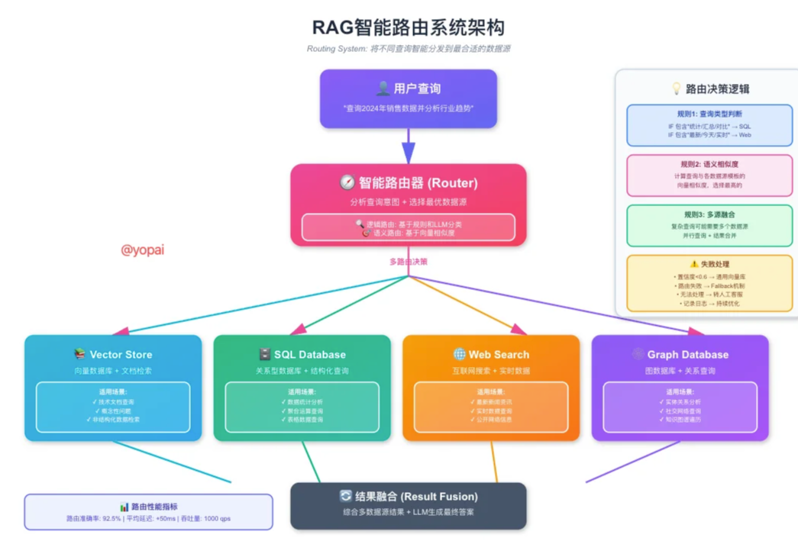
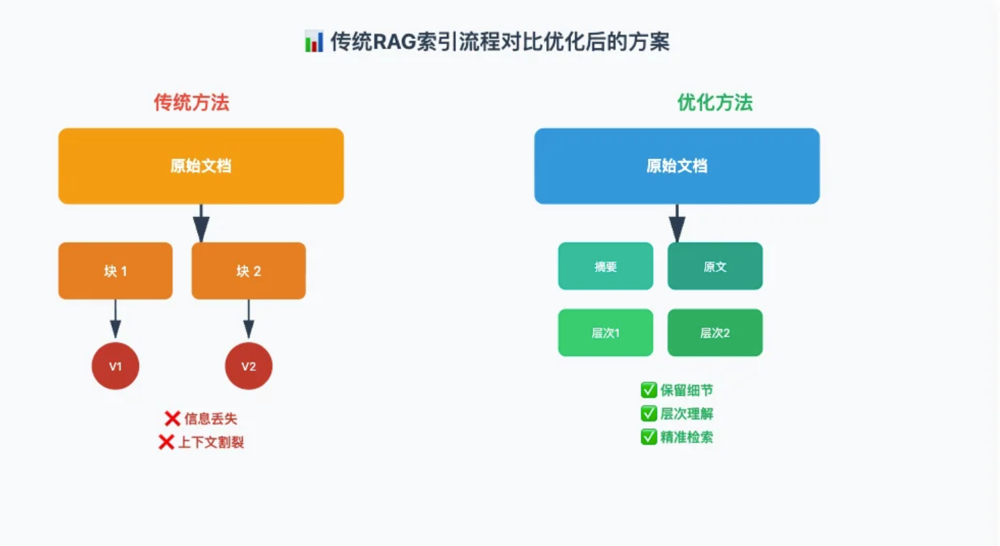
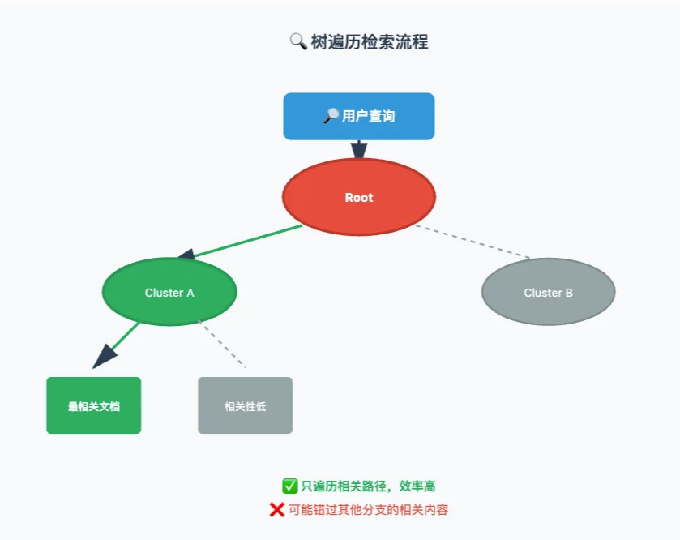

# RAG 学习笔记

## 索引构建 详细流程

### step1： 数据获取
输入： 原始文档 例如：PDF、DOCX、 HTML、 TXT 等

读取文档内容

### step2： 文档预处理
清洗：去除特殊字符、多余空格、页眉页脚
转化： HTML -> 纯文本， PDF -> 文本
规范化： 统一格式，编码（UTF-8）


### step3: 文档分块（chunking） 🌟核心步骤
原始长文档  按照分块策略 拆分成 多个 合适大小的 chunks

### step4: 向量化（Embedding）
模型：text-embedding 
转化： chunks分块内容 -> 向量
（语义相似的文本，其向量距离越近）

### step5 存储到向量数据库
落库到 向量数据库

## Retrieval （检索 | 召回）

用户查询

### step1 将用户输入的 查询 文本 使用相同的 Embedding 模型进行向量化

### step2 向量相似度搜索

比较 "查询Embedding" 与向量数据库中的向量 进行余弦相似度 计算

Top-K： 返回前 k 个最相似的模型

相似度 阈值：≧ 0.7
混合搜索： 向量搜索 + 关键词检索（BM25、Elastic Search）

### step3： 返回 Top-K 检索结果
将检索的内容喂给 大模型，让他了解 对应知识点。 结合知识点去做回答。

### step4: 重排序
初步检索后，用更精细的模型重新进行排序，提高精度

> 对检索结果进行打分 ： query、 candidate_docs
> 按照分数排序

## 答案生成流程

### step1 构建 Prompt
系统提示词： 你是一个xxxx助手。请基于以下参考资料回答用户问题。

参考资料（context）：
[文档1]：xxx
[文档2]：xxx
[文档3]：xxx

用户问题： "xxx"

### step2 LLM 生成答案
使用大模型生成答案

### step3: 答案后处理

添加引用来源 ： 给答案加上来源链接
安全检查（敏感词过滤）： 检查答案是否有违禁词 ，有违禁词 返回拒绝回答
格式美化 （Markdown | HTML）

### step4: 生成效果评估
RAG 系统的生成质量评估需要考虑准确性、相关性和忠诚度等多个维度，确保模型生成的答案既准确 又能体现 检索到的上下文信息。

---

# 优化策略

## Multi Query - 多查询策略
核心： 一个问题，多种提问方法。

### 工作流程

1. 输入原始问题： 用户问 "用python 如何处理json数据？"
2. 使用 LLM 生成多个 查询query：
Query1: "python 解析json的方法"
Query2: "如何在python中读取json文件"
Query3: "python json模块使用教程"
Query4: "python处理json格式数据的最佳实践"

3. 并行检索： 用这4个 query 查询同时去向量数据库检索
4. 结果合并：将4次检索的结果 进行： 去重复、 排序，得到最终结果。

优势：
1. 提高召回率： 不同表达方式能匹配到更多相关文档
2. 覆盖多角度： 从不同角度理解同一个问题
3. 鲁棒性强： 即使某个查询效果不好，其他的查询也可以补救

### Multi Query 多查询策略架构图


## RAG-Fusion - 多查询结果融合策略
核心： RAG-Fusion是Multi Query的 进化版，不仅生成多个查询，还使用了 **倒数排序融合（Reciprocal Rank Fusion, RRF）** 算法来合并结果。

简单来说： 不是 粗暴的把结果对在一起，而是给每个结果科学打分，让 **真正重要的文档** 排在前面。

什么是 RRF？
多个查询结果中 按照重复出现次数 进行降序。

### 工作流程
RAG-Fusion 工作流程
1. 生成多个查询 （和 Multi Query 一样）
2. 并行检索 （和 Multi Query 一样）
3. 使用 **RRF 算法** 融合结果 进行排序
4. 返回重新排序后的 **Top-K文档**

### RAG-Fusion 架构图 - RRF倒数排序融合


### 为什么RRF有效？
位置敏感： 排名越靠前，分数增益越大
频率奖励： 出现次数多的文档会累积更高分数
公平性： 不依赖原始相似度分数，避免不同模型打分偏差
鲁棒性： 即使某个查询效果差，也不会严重影响整体查询效果


## Decomposition - 问题分解策略
核心思想：

**把一个复杂问题拆解成多个简单的字问题，逐个击破**

### 为什么需要问题分解？
需求是 **复合型问题**，包含多个信息需求。

### 工作流程

1. 原始问题
2. LLM 分解为字问题
3. 并行检索每个字问题
4. 获得每个字问题的答案
5. LLM 综合所有子答案，生成最终回答

### Decomposition 问题分解策略架构图


### 三种常见的分解策略
1. 顺序分解 （Sequential Decomposition）

适合场景： 问题之间有先后依赖关系。
例如： "如何训练一个 GPT 模型 并部署到生产环境" 

可以被拆分成：
准备训练数据 -> 选择模型架构 -> 模型评估 -> 模型优化 -> 部署上线

即： **每一步的答案作为下一步的输入 或 参考**

2. 并行分解 （Parallel Decomposition）

适合场景： 字问题之间相互独立

这些字问题可以 **同时检索**，提高效率。

3. 层次分解 （Hierarchical Decomposition）

适合场景： 问题有多个层级。

例如： "如何设计一个系统"

第一层分解：
- 数据层
- 算法层
- 工厂层

第二层分解：
- 数据层 -> 数据采集、数据清洗、特征工程
- 算法层 -> 召回算法、排序算法、实时更新
- 工程层 -> 系统架构、性能优化、监控告警

### 优势分析
1. 精准检索： 每个字问题更聚焦，检索准确度提升
2. 结构化回答： 答案有条理，逻辑更清晰
3. 覆盖更全面： 不会遗漏关键信息点
4. 减轻 LLM 负担： 分而治之， 每次生产任务更简单
5. 可并行处理： 对于独立的字问题，可以并行检索加速

### 注意事项
不是所有问题都需要分解！

**适合分解的问题：**
- 包含多个独立信息需求
- 需要对比分析
- 需要多步骤解答
- 问题比较复杂抽象

**不适合分解的问题**
- 简单的事实查询
- 单一明确的问题
- 定义类问题

**分解力度要适中**


## Step Back 问答回退策略

### 什么是Step Back？
想象一下，你在图书馆找书，直接冲过去问管理员:"2023年10月发布的那个新的React框架叫什么?"管理员一脸懵逼。但如果你先退一步问:"最近有哪些新的React框架?"然后再缩小范围，是不是容易多了?

**Step Back Prompting** 就是这个道理——不直接回答具体问题，而是先生成一个更抽象、更通用的"回退问题"，从更高层次理解用户意图，然后再回答原问题。

### 工作流程


整个流程分 3步 走

1. 抽象化（Abstraction）

原问题:特斯拉Model3在2023年Q4的销量是多少?

Step Back回退问题:特斯拉Model3历年的销量趋势是怎样的?

2. 检索（Retrieval） 用回退问题去检索，能获取更广泛、更有上下文的信息。

3. 推理（Reasoning）结合会退问题的答案和原问题，生产更准确的答案。


### 实际效果对比

| 方法 | 问题 | 答案准确度|
|:---: | :---: | :---: |
| 直接 RAG | "2023年美国有多少位总统出生在美国?" | 漏掉罗斯福 |
| Step Back RAG | 先问"美国历任总统的出生地信息" | 100%准确|

### 适合场景

非常适合：
- 需要多部推理的复杂问题
- 时间序列相关查询 （"最近"、"历年"、"趋势"）
- 需要理解高层概念的问题

不太合适：
- 简单事实查询
- 需要事时数据的场景
- 计算密集型任务

## HyDE （假设性文档潜入）

### 核心思想

1. 让 LLM 先 “编” 一个假的答案（可能会有错误，但也没关系）
2. 将 这个假的答案转换成向量
3. 用 这个向量 去搜索 真实文档

因为答案与答案之间的相似度，远高于问题和答案之间的相似度

### 工作流程图


### 问题的本质
传统的RAG 有一个致命的缺陷： **查询-文档不对称**

```
用户问题:Milvus是什么?[向量维度:1536]

文档内容:Milvus是一个开源向量数据库，专为AI应用设计，支持十亿级向量的毫秒级检索...[向量维度:1536]
```

看起来很美好?NO!问题在于:
- 问题通常很短(3-10个词)
- 文档内容很长(几百个词)
- 语义空间分布差异巨大
就像你拿着一张小纸条去图书馆找整本书，匹配度天然就低。

### HyDE 如何解决？

```python
from langchain.llms import OpenAI
from langchain.embeddings import OpenAIEmbeddings
from langchain.chains import HypotheticalDocumentEmbedder
from langchain.vectorstores import FAISStrom
#Step1:初始化组件
llm = OpenAI(temperature=0.7)base_embeddings = OpenAIEmbeddings ()
#Step 2:创建HyDE嵌入器
hyde_prompt_template="""请写一段文本来回答以下问题。即使不确定，也请尽可能详细地生成一个假设性的答案。
问题:{question}假设性文档:"""

hyde_embeddings = HypotheticalDocumentEmbedder.from_llm(
    llm=ltm,
    base_embeddings=base_embeddings,
    prompt_key="web_search" #使用预定义模板
)

#Step 3:构建向量库(使用HyDE嵌入
documents = [
    "Milvus是一个云端向量数据库，用于大规模向量存储和检索。",
    "COVID-19疫情显著影响了心理健康，增加了抑郁和焦虑。人类使用火已有大约80万年的历史。"
]
vectorstore = FAISS.from_texts (documents, hyde_embeddings)
#Step 4:查询 (HyDE会目动生成假设文档)
query ="什么是Milvus?"
results = vectorstore.similarity_search(query, k=3)

for i, doc in enumerate(results):
    print(f"结果{i+1}: {doc.page_content}")
```

### 伪代码

```python
class HyDERetriever:
    def generate_hypothetical_document(self, query, num_docs=3):
        """生成多个假设性文档"""
        prompt=f"""根据问题生成一个详细的假设性回答。即使不确定，也要写得像真实文档一样。问题:{query} 假设性回答:"""

    def get_embedding(self, text):
        """获取文本嵌入"""
    
    def add_documents(self, documents):
        """添加文档到知识库"""
    
    def retrieve(self, query, top_k=5):
        """使用HyDE检索"""
        # 1. 生成假设性 文档
        hypo_docs = self.generate_hypothetical_document(query, num_docs=3)
        # 2. 对假设文档做嵌入并平均
        hypo_embeddings = [self.get_embedding(doc) for doc in hypo_docs]
        avg_hypo_embeddings = ...

        # 3. 计算与真实文档的相似度
        similarities = [for doc_emb in slef.doc_embeddings]

        # 4. 返回 Top-k 结果

```

### 优缺点分析
优点：
- 零样本性能强:不需要标注数据
- 语义对齐好:答案-答案匹配比问题-答案匹配更准
- 跨域泛化:在不同领域都表现不错

局限：
- 依赖LLM知识:如果LLM对该领域一无所知，生成的假设文档就是垃圾
- 计算成本高:需要额外调用LLM生成假设文档(通常生成3-5个)
- 时延增加:增加了一个LLM调用环节，响应时间约+200-500ms

### 最佳实践建议
1. 混合使用： 对简单查询用传统检索，复杂查询才用 HyDE
2. 缓存假设文档： 相似问题可以服用之前生成的假设文档
3. 调整生成数量： 通常3-5个假设文档效果最好，太多了反而分散
4. 领域适配：针对特定领域微调Prompt模板

# 路由优化和问题构建策略

## Routing（路由）：智能流量调度

### 什么是RAG路由？
路由(Routing)本质上是一个分类问题:给定用户查询，决定该用哪个数据源、用哪种检索策略、甚至用哪个LLM模型来处理。



### 路由的2种核心方式

1. 逻辑路由（Logical Routing）
基于规则和查询结构分析来决定路由。


2. 语义路由（Semantic Routing）
基于查询的语义相似度来路由，更加灵活智能。

### 完整的路由系统架构
数据源可能如下：
- vector_store 向量数据库连接
- sql_ db SQL数据库连接
- graph_db 图数据库
- web_search 网络搜索接口

1. step1： LLM 分析查询复杂度：
```
Prompt： 分析以下查询的复杂度和所需数据源：
查询：{query}
返回 JSON 格式：
{
    {
        "complexity": "simple | medium | complex",
        "required_sources": ["source1","source2",...],
        "reasoning": "分析理由"
    }
}
```

2. step2: 并行查询多个数据源
3. step3: 融合查询结果


### 路由决策树可视化（Routing Decision Tree）


### 最佳实践建议
1. 路由粒度控制
- 5-20个主题 最合适
- 太少：路由不够精细
- 太多：主题重叠，维护困难

2. 添加fallback机制
当无法确定是哪个主题时的兜底策略

3. A｜B测试路由策略
其中50%用户用新路由，50%用旧路由

收集指标对比

## Query Construction（查询构建）：说数据库的语言
###核心挑战
用户说人话，数据库说 “方言”

- 关系型数据库 -> SQL
- 图数据库 ->Cypher
- 向量数据库 + 元数据  -> 结构化过滤

**Query Construction的任务**：把自然语言转化为数据库能理解的语言。


### 方法1: Text-to-SQL（自查询检索器）
伪代码
```python
# 场景： 向量库中存储了大量文档，每个文档有机构化的元数据

# step1 : 定义文档元数据结构

metadata_field_info = [
    AttributeInfo(
        name="author",
        description="文档作者的名字",
        trpe="string"
    ),
        AttributeInfo(
        name="publish_date",
        description="文档发布日期，格式：YYY-MM-DD",
        trpe="string"
    ),
        AttributeInfo(
        name="category",
        description="文档类别",
        trpe="string or list[string]"
    ),
        AttributeInfo(
        name="rating",
        description="文档评分，1-5分",
        trpe="intger"
    ),
]

# 文档内容描述
document_content_description = "xxxx"

# step2: 创建自查检索器

# step3: 使用自然语言查询

```

完整的 Text-to-SQL实现
```python
from langchain.utilities import SQLDatabasefrom
from langchain_experimental.sql import SQLDatabaseChain
#连接数据库
db = SQLDatabase.from_uri("sqlite:///company.db")
#创建SQL链
sql_chain = SQLDatabaseChain.from_llm(llm=ChatOpenAI (model="gpt-4", temperature=0),db=db,
verbose=True,use_query_checker=True,#自动检查sQL语法return_intermediate_steps=True
#自然语言查询
questions = [
"2024年销售额最高的前10个产品是什么?"，"哪些员工的工资高于部门平均工资?"，
"每个城市的客户数量分布情况"
for question in questions:
    print(f"? 问题:{question}")
    result = sql_chain(question)
    print(f"Q 生成的sQL:{result['intermediate_steps'][o]}")
    print(f'结果:{result['result']}")
```

实际运行事例：
```markdown
问题:2024年销售额最高的前10个产品是什么?

生成的SQL:
SELECT product_name, SUM(amount) as total_salesFROM orders
WHERE YEAR(order_date) = 2024
GROUP BY product_name
ORDER BY total_sales DESC
LIMIT 10;

结果:

| 产品名称 | 总销售额|
|---------|-------|
| iPhone 15 Pro | ¥12,850,000|
| MacBook Pro M3 | ¥8,920,000|
```

### 方法2: Text-to-Cypher（图数据库查询）

场景： 知识图谱、关系网络、社交网络分析


### 方法3: 混合查询构建

场景： 需要同时处理向量搜索和结构化过滤


将自然语言转换为混合查询：

step1: 让 LLM 分析查询意图
```
prompt: 分析一下查询，提取出： 1. 语义搜索部分（用于向量检索） 2. 结构化过滤条件（用于元数据过滤）
返回JSON：
{
    {
        "semantic_query": "语义搜索部分",
        "filters": {
            {
                "field1": "value1",
                "field2": { {"operator": "gte", "value": xxx } }
            }
        }
    }
}
```

step2： 建构混合查询

step3: 执行检索

### 查询构建的错误处理

关键问题： LLM 生成的 SQL 可能有误！

伪代码：
```python
def execute_with_query(self, natural_query):
    """
    带重试机制的SQL执行
    """
    for attempt in range (slef.max_retries):
        # 1. 生成SQL
        sql = self.generate_sql(natural_query)
        # 2. 执行前验证
        if not self._validte_sql(sql):
            # 不ok
            continue
        # 3. 执行查询
        result = self.db.execute(sql)
        return result
```

```python
def _validate_sql(self, sql):
    """
    SQL 安全验证
    """
    # 检查危险关键词

    # 检查是否只读查询

def _generate_sql(self, query):
    """生成SQL"""

    prompt = f"""
        将一下自然语言转化为SQL查询.
        数据库 schema： {schema},
        查询： {query}
        只返回SQL语句，不要有其他文字
    """
    response = self.llm.invoke(prompt)
    return response
```

### Query Construction 性能优化

1. 缓存常见查询模式
```python
# 1. 缓存常见查询模式

def cached_sql_generation(query_template):
    """缓存SQL生成的结果"""
    return llm.invoke(query_template)

```

```python
# 2. 预编译查询模板
QUERY_TEMPLATES = [
    "top_n_by_metric": """
    SELECT {column}, SUM{metric} as total
    FROM {table}
    WHERE {date_column} BETWEEN '{start}' AND '{end}'
    GROUP BY {column}
    ORDER BY total DESC
    LIMIT {n}
    """,

    "user_filter": """
        SELECT * FROM {table}
        WHERE {filter_conditions}
    """
]

def quick_sql_from_template(query_type, **params):
    template = QUERY_TEMPLTES.get(query_type)
    return template.format(**params)
```

3. 并行查询优化
```python
async def parallel_multi_query(queries):
    """并行执行多个查询"""
    
    ...
```

# 索引生成优化篇： Multi-representation、PAPTOR、ColBERT

## 传统RAG索引的痛点

### 1. 信息瓶颈
想象一下，你有一篇5000字的技术文档，传统方法是把它切成500字的小块，然后每个块生成一个768维的向量。问题来了：500字的信息被压缩成768个数字，这就像把一张高清照片压缩成缩略图，很多细节都丢失了。

### 2. 上下文割裂
文档被切块后，原本连贯的上下文被强行分割。比如一个技术概念的定义在第3块，应用场景在第4块，而用户问题可能需要同时理解这两部分才能回答好。传统方法往往只能检索到其中一块，导致回答不完整。

### 1.3检索精度不足
当查询比较抽象或需要多跳推理时，简单的向量相似度匹配往往力不从心。比如用户问"这项技术对行业的长远影响是什么"，这种高层次的问题需要综合多个文档片段才能回答，但传统方法可能只返回一些表面相关的内容。

【传统RAG索引流程对比优化后的方案】



## Multi-representation Indexing（多表示索引）
Multi-representation Indexing 核心思想设计的很巧妙： **用优化后的表示进行检索，但返回完整的原始内容**。就像我们在图书馆查书，通过简洁的索引卡找书，但是最终拿到的完整的书本。

具体来说，这个方法会将每个文档创建 2份内容：

- 优化表示：通常是一个简洁的摘要，只包含核心信息，用于检索时的向量匹配
- 原始内容：完整的文档块，包含所有细节，用于最终提供给LLM

> 为什么要这样做？
> 因为摘要更纯粹、更聚焦，去除了冗余信息，向量化后更容易匹配到用户的真实意图。但摘要毕竟信息量有限，所以检索时用摘要，返回时给完整内容，两全其美!

### 详细架构设计
【Multi-representation Indexing 完整架构】
Multi-representation Indexing 完整架构


### 实现细节与代码示例

第一步： 加载和切分文档

```python

# 加载文档
docs = loader.load()

# 切分文档 - 每块 500 个token
text_spliter = RecursiveCharacterTextSpliter(
    chunk_size=500
)
```

第二步：生成摘要（关键！）

```python

# 设计摘要Prompt  ！！
 summary_prompt = ChatPromptTemplate.from_template(
    """请为一下文档生成一个简洁的摘要，保留所有关键信息和核心概念
    摘要应该：
    1. 包含主要技术点和概念
    2. 保留重要的数字、日期、人名等关键事实
    3. 长度控制在原文的1/3左右
    4. 使用清晰简洁的语言
    文档内容：
    {doc}
    摘要："""
 )

# 批量生成摘要 - 提高效率
summaries = sumarize_chain.batch(chunks, {"max_concurrency":5})
```

**摘要生成的技巧**
- 如果文档是技术类的，prompt要强调保留技术术语和关键概念
- 如果是商业文档，要保留数字、日期、公司名等关键信息摘要长度建议是原文的1/4到1/3，太短会丢信息，太长失去优势
- 可以尝试让LLM生成多种形式的摘要:技术摘要、业务摘要、关键词等

**第三步： 构建MultiVectorRetriever**
这是最关键的一步！！！！ 我们需要同时维护向量存储和文档存储，并通过唯一ID关联他们。

```py
# 1. 初始化向量存储 - 存储 摘要的 embedding
vector_store = create_vs()

# 2. 初始化文档存储 - 存储完整的原始chunk
docs_store = InMemoryStore() # 生产环境建议使用持久化存储

# 3. 创建MultiVectorRetrever
retriever. = MultiVectorRetriever(
    vector_store=vector_store,
    docs_store=docs_store,
    id_key = "doc_id" # 关联的key
)

# 4. 为每个文档生成唯一ID
docs_ids = [str(uuid.uuid4()) for _ in chunks]

# 5. 创建摘要文档（用于向量化）
summary_docs = [
    Document(page_content=s, metadata= {"doc_id": doc_ids[i]})
    for i,s in enumerate(summaries)
]

# 6. 同时添加2个存储
# 向量存储摘要
retreiver.vector_store.add_documents(summary_docs)

# 文档存储完整的chunk
retriever.doc_store.mset(list(zip(doc_ids, chunks)))

# 构建完成！
```

第四步：执行检索

```py
# 使用MultiVectorRetreiver进行检索
query = ""

# 检索 - 内部流程：

# 1. 将query向量化
# 2. 在摘要向量中找相似度最高的 Top-k
# 3. 通过 doc_id 找到对应的完整文档
# 4. 返回完整文档
retrieved_docs = retriever.get_relevant_documents(query,k=3)
```

### 最佳实践与优化建议

1. 摘要策略选择
不同场景可以 采用不同的摘要策略：

技术文档 Prompt：
```
提取以下技术文档的核心要点:
主要技术概念和术语关键算法或方法
重要的数字、公式或配置参数
技术优势和适用场景

保持技术术语的准确性，不要用通俗语言替换专业术语。
文档:{doc}
```

商业文档 Prompt：
```
总结以下商业文档的关键信息涉及的公司、产品或项目名称
重要的日期、数字、金额
主要业务逻辑或决策
关键利益相关者

保留所有专有名词和具体数据。
文档:{doc}
```

2. 多粒度摘要：
高级技巧： 为同一个文档生成不同粒度的摘要，可以进一步提升检索效果

3. 缓存优化
摘要生成是计算密集型操作，做好缓存可以显著提升性能。

## PAPTOR（递归抽象树树状检索）

### 核心思想与动机
解决传统RAG的根本性问题：如何同时找回低层次的具体问题和高层次的抽象问题？

- 低层次问题：“1956年xxx会议的参与者有谁？” - 这需要检索到具体的某一页
- 高层次问题：“AI发展经历了哪几个重要阶段？” - 这需要综合整本书的内容

RAPTOR 通过构建 **层次化的摘要树** 完美解决这个问题

### RAPTOR 架构详解
【RAPTOR 递归树状结构完整示意图】
RAPTOR 递归树状结构完整示意图


### PAPTOR 核心算法流程

#### 第一步：文档切分与向量化

首先将文档切分成小块（叶子节点），并为每个块生成embedding向量。

> 步骤1：加载和切分文档
> 切分文档
> 
> 为每个叶子节点生成embedding
>

#### 第二步：聚类（使用GMM）
PATTOR 使用**高斯混合模型（GMM）进行聚类，而不是传统的K-means。为什么？因为GMM是软聚类**， 一个文档可以部分属于多个集群，这更符合实际情况。

为什么用GMM而不是K-means？

- 软聚类：一个文档可能同时涉及多个主题，GMM允许它属于多个集群。
- 概率输出：GMM 给出每个样本属于各集群的概率，我们可以设置阈值灵活控制
- 更好的泛化： GMM考虑了数据的协方差结构，对复杂数据分布更友好
- 实验证明：RAPTOR论文中的实验声明，GMM比K-means效果提升约8%

#### 第三步：生成集群摘要
对每个集群，使用LLM生成一个综合性摘要。这是关键步骤。

```python
prompt= """你是一个专业的文档摘要专家。请仔细阅读以下文档片段，生成一个综合性的摘要，要求
1.抓住所有文档的共同主题和核心思想
2.保留关键的细节信息(日期、人名、数字等)
3.体现文档之间的逻辑关系
4.语言简洁但信息完整
5.长度约为原文总和的1/4
文档内容:
{documents)
综合摘要:"""
```

#### 第四步： 递归构建树
这是最精髓的部分！ 我们将第一层的摘要作为新的“文档”，重复步骤2和3，继续聚类和摘要，知道达到停止条件。

```python
def build_raptor_tree(texts, max_depth=3, min_cluster_size=3):
    """
    递归构建RAPTOR树
    Args:
        texts: 初始文档
        max_depth: 最大递归深度
        min_cluster_size: 最小集群大小，小雨此值时停止
    Returns：
        tree: 完整的树结构
    """
    
    while current_level < max_depth:
        # 1. 向量化当前层的文本
        embeddings_list = ...
        # 2. 确定集群数量
        n_clusters = max(len(current_texts) //5, 1)

        if n_clusters < min_cluster_size :
            # 集群数 < 最小值，停止递归
            break
        
        # 3. 聚类
        clusters = clusters_embeddings(embeddings_list, n_cluster)

        # 4. 为每个集群生成摘要

        next_level_texts = []
        for ...

        # 5. 保存当前层
        current_level +=1

        # 6. 为下一次递归准备
        current_texts = next_level_texts


        # 停止条件： 只剩一个摘要（根节点）
        if len(next_level_texts) == 1:
            break
    return tree
```

### RAPTOR 检索策略

#### 策略1: 树遍历检索（Tree Traversal）

从根节点开始，逐层向下找最相关的分支，类似在图书馆先找分类，再找书架，最后找书。

【树遍历检索流程】


#### 策略2: 扁平化检索（Collasped Tree）
把所有层的节点（包括原始文档和各层摘要）都放在一起，一次性检索。简单高效，是**推荐的方法！**

为什么推荐扁平化检索？
- 全面性:不会因为在某一层选错分支而错过
- 相关内容灵活性:对于不同抽象层次的问题，都能找到合适的答案
- 实现简单:不需要维护复杂的父子关系，一次向量化搞定
- 实验验证:RAPTOR论文实验表明，扁平化检索在大多数任务上优于树遍历