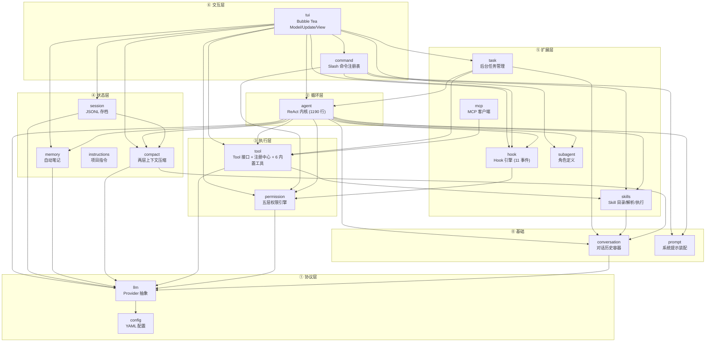
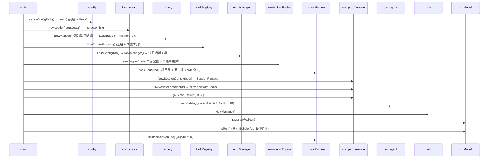
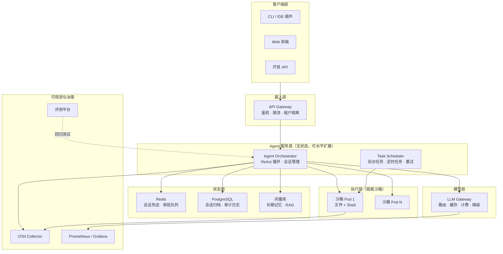

# 02 · 架构分层与依赖设计

> 源码：`mewcode/internal/` 全部 18 个包、`cmd/mewcode/main.go`
> 一句话：**这不是「一个 main.go 加几个工具函数」，而是一个有明确依赖方向、接口隔离、可替换实现的 18 包分层架构。**

---

## 一、这一章要回答什么

| 问题 | 本节位置 |
|---|---|
| 这个项目的架构是怎么切的？ | §2 分层 |
| 为什么这么切包？包之间谁依赖谁？ | §3 依赖方向 |
| 怎么保证 Agent 内核不被 SDK / UI 污染？ | §3.2 依赖规则 |
| 有哪些关键接口？为什么要抽象？ | §4 关键接口 |
| 一次启动、一轮对话的数据是怎么流的？ | §5 数据流 |
| 面试官会怎么挑架构的毛病？ | §7 Q&A |

---

## 二、六层架构



---

## 三、依赖方向（这是架构的核心约束）

### 3.1 真实的包依赖图

从源码 import 扫描出来的**完整依赖关系**：

| 包 | 依赖的内部包 |
|---|---|
| `config` | *（无）* |
| `instructions` | *（无）* |
| `prompt` | *（无）* |
| `llm` | `config` |
| `conversation` | `llm` |
| `permission` | `llm` |
| `memory` | `llm` |
| `hook` | `permission` |
| `skills` | `conversation` |
| `subagent` | `permission` |
| `compact` | `conversation`, `llm` |
| `session` | `compact`, `llm` |
| `tool` | `llm`, `skills` |
| `mcp` | `tool` |
| `agent` | `compact`, `conversation`, `hook`, `llm`, `memory`, `permission`, `prompt`, `skills`, `subagent`, `tool` |
| `task` | `agent`, `conversation`, `tool` |
| `command` | `hook`, `permission`, `prompt`, `skills` |
| `tui` | `agent`, `command`, `compact`, `config`, `conversation`, `hook`, `llm`, `memory`, `permission`, `prompt`, `session`, `skills`, `subagent`, `task`, `tool` |

**关键观察**：

1. **没有循环依赖**。`task → agent`、`agent → subagent`、`subagent → permission`，是一条链而不是环。
2. **叶节点包**（无内部依赖）：`config`、`instructions`、`prompt`——这三个是纯工具/常量包。
3. **只有 `tui` 和 `agent` 是「重」包**，其余都是单一职责。
4. **`agent` 不依赖 `session` / `instructions` / `mcp` / `command` / `tui`**——这正是分层的价值：内核不知道存档怎么做、指令从哪来、界面长什么样。

### 3.2 三条明确写在代码里的依赖规则

**规则 1：`agent` 不 import SDK**

```go
// agent/agent.go:1-2 —— 包注释就是架构约束
// Package agent 承载 ReAct 循环编排：多轮调 LLM → 权限判定 → 执行工具 → 结果回灌，直到任务完成。
// 对外吐出一条 Event 流供 TUI 渲染。只依赖 llm、tool、conversation、permission，不 import SDK，保持协议无关。
```

可验证：`internal/agent/` 下所有 import 中，没有任何 `anthropic` / `openai` / `bubbletea`。

**规则 2：用「窄接口」代替跨层直接依赖**

`agent` 需要调用 `task.Manager`（启动后台任务）和 `subagent.Catalog`（解析角色），但如果直接 import 就会形成 `agent → task → agent` 的循环。解决方案是**在 `agent` 包里定义窄接口**：

```go
// agent/agent_tool.go:22 —— agent 包自己定义接口，实现方在别的包
type AgentCatalog interface {
    Resolve(name string) (*subagent.Definition, bool)
    ForkDefinition() *subagent.Definition
    List() []*subagent.Definition
}

// agent/agent_tool.go:39 —— 只用到两个方法
type TaskManager interface {
    Launch(ctx context.Context, ag *Agent, conv *conversation.Conversation, name, task string) string
    AdoptRunning(ctx context.Context, ag *Agent, conv *conversation.Conversation, name string, ev <-chan Event, cancel context.CancelFunc) string
}
```

> 注释里写得很清楚：`// AgentCatalog 是 subagent.Catalog 的接口抽象，避免 agent 包直接依赖 subagent（用于测试 mock）。`

**代价**：`TaskManager` 接口签名里出现了 `*Agent`，也就是 `task` 包必须持有 `agent.Agent`。这个耦合是**语义上必要的**（任务管理器管的就是 Agent），无法消除，但方向是单向的：`task → agent`。

**规则 3：回调注入代替反向依赖**

Agent 需要把对话历史持久化，但它不认识 `session` 包。解决方案是 `conversation` 提供回调钩子，由 `main.go` 在装配时把 `session.Writer` 的方法注入进去：

```go
// cmd/mewcode/main.go:129
conv := conversation.NewWithHooks(writer.OnAppend(modelName), writer.OnReplace())

// conversation/conversation.go:11
type Conversation struct {
    mu        sync.Mutex
    messages  []llm.Message
    onAppend  func(llm.Message)     // 可选：消息追加回调
    onReplace func([]llm.Message)   // 可选：消息替换回调
}
```

**依赖倒置的经典应用**：高层模块（conversation）定义回调签名，低层模块（session）实现它，装配在 main 里完成。这样 `conversation` 不依赖 `session`，`session` 也不用依赖 `conversation`（它只依赖 `compact` 做 session ID 解析）。

---

## 四、五个关键接口（面试重点）

### 4.1 `llm.Provider` —— 协议抽象

```go
// llm/provider.go:91
type Provider interface {
    Name() string
    Model() string
    Stream(ctx context.Context, req Request) <-chan StreamEvent
}
```

**三个实现/消费方**：`anthropicProvider`、`openaiProvider`（实现方）；`agent`、`compact`、`tui`（消费方）。
**设计要点**：错误走 channel，接口无 error 返回值（详见 [§10 章](/phase3/mewcode/10-多协议抽象与提示工程)）。

### 4.2 `tool.Tool` —— 能力抽象

```go
// tool/tool.go
type Tool interface {
    Name() string
    Description() string
    Parameters() map[string]any
    ReadOnly() bool
    Execute(ctx context.Context, args json.RawMessage) Result
}
```

**为什么 `ReadOnly()` 是接口的一部分**：它同时服务两个消费者——
1. **Agent 的并发调度**：`executeBatched` 用它决定「并发批」还是「串行」；
2. **权限引擎 Plan Mode**：`registry.ReadOnlyDefinitions()` 用它裁剪工具集。

**一个接口方法服务两个正交关注点**——这是「把语义放进类型系统」的典型例子。

**实现方有两类**：6 个内置工具 + MCP 远端工具（`mcp/tool.go` 把远端工具适配成 `tool.Tool`）。**关键收益：MCP 工具走完全相同的权限链路、Agent 编排、UI 渲染，零特判代码。**

### 4.3 `ApprovalUpgrader` —— 子 Agent 审批升级

```go
// agent/permission_upgrade.go:12 —— 全文只有 12 行
type ApprovalUpgrader func(ctx context.Context, req *ApprovalRequest) (permission.Outcome, bool)
```

**语义**：子 Agent 遇到需要人批准的权限判定时，把请求「升级」到父 TUI。`ok=false` 时调用方走默认的 `emit Approval` 路径。

**三层升级链**（实现在 `agent.go:760-845`）：

```
① 子 Agent dontAsk 模式 → 直接 Allow（不打扰用户）
② approvalUpgrader 非空 → 尝试升级到父 TUI
③ ok=false（降级）→ 走默认 requestApproval（阻塞等自己的事件消费者回应）
```

> **诚实提示**：`WithApprovalUpgrader` 这个 Option 已定义，但在 `tui` 层**从未接线**（没有调用点）。所以实际上子 Agent 走到第 ③ 步时，如果它的事件消费者（`task.aggregateEvent`）忽略了 `Approval` 事件，**就会永久阻塞**。这是本项目一个已知的架构缺口，面试时主动说出来是加分项。

### 4.4 `AgentCatalog` / `TaskManager` —— 窄接口隔离

见 §3.2 规则 2。

### 4.5 `Conversation` 的回调 —— 依赖倒置

见 §3.2 规则 3。

---

## 五、数据流

### 5.1 启动装配（`main.go` 的 20 步）



**注意装配顺序的三条隐性约束**：
1. `permission.NewEngine` 必须在工具注册**之后**（虽然代码里没有强制，但语义上权限规则要能覆盖已注册的工具名）。
2. `conv` 必须在 `tui.New` **之后**用 `SetConversation` 覆盖（TUI 内部先建了一个空 Conversation）——**这留下了一个真实的 bug**：`AgentTool.SetParentConvFn(m.conv.Messages)` 绑定的是 `SetConversation` 之前的旧 conversation，导致 Fork 路径拿到空父历史。
3. `sessionCtx` 必须在 `SessionRuntime` 之前创建（运行时状态持有它）。

### 5.2 一轮对话的数据流

```
用户输入「帮我重构 auth 模块」
     │
     ▼
TUI: textarea 收 Enter → 判断是否 Slash 命令
     │  非命令 → Hook: UserPromptSubmit（可拦截）
     ▼
TUI: conv.AddUser(text)  ──→ onAppend ──→ session.Writer.Append(JSONL + fsync)
     │
     ▼
TUI: agent.Run(ctx, conv, mode) → <-chan agent.Event
     │
     ▼  ┌───────────────── ReAct 循环（最多 25 轮） ─────────────────┐
     │  │                                                            │
     │  │  ① prompt.GatherEnvironment + BuildSystemPrompt            │
     │  │  ② compact.ManageContext（L1 落盘 → 阈值判断 → L2 摘要）    │
     │  │  ③ buildReminder（Plan Mode 按轮次 + Hook 注入）            │
     │  │  ④ provider.Stream(ctx, Request) → <-chan StreamEvent      │
     │  │       ├─ Text 增量 → agent.Event{Text} → TUI 打字机        │
     │  │       └─ ToolCalls → 下一段                                 │
     │  │  ⑤ executeBatched（保序分批并发 + 五层权限判定）            │
     │  │       ├─ Hook: PreToolUse（可拦截）                         │
     │  │       ├─ permission.Engine.Check → Allow/Deny/Ask           │
     │  │       ├─ Ask → emit ApprovalRequest → 阻塞等 TUI 回传       │
     │  │       ├─ registry.Execute(ctx, name, input)                 │
     │  │       └─ Hook: PostToolUse                                 │
     │  │  ⑥ conv.AddAssistantWithToolCalls / AddToolResults          │
     │  │  ⑦ 无工具调用 → Done                                        │
     │  └────────────────────────────────────────────────────────────┘
     │
     ▼
TUI: stream.go 把 agent.Event 转成 tea.Msg → Update → View
```

### 5.3 `/resume` 恢复流

```
/resume → ListSessions()（扫描 .mewcode/sessions/*/conversation.jsonl，mtime 倒序）
        → 列表 UI（选择/过滤）
        → LoadSession()：从最后一个 compact 标记后加载 + 跳过坏行 + 截断孤立调用
        → 估算 token，若 > cw - 8000 → 在临时 Conversation 上 RunForceCompact
        → > 6h 追加时间跨度提醒
        → runtime.ResetForNewSession(sessionCtx)  ← 清空 compact 子状态 / Skills / PendingReminders
        → 重建 conv(挂 writer) / writer / sessionCtx
```

**`ResetForNewSession` 的必要性**（很容易漏）：

```go
// agent/runtime.go:67
func (r *SessionRuntime) ResetForNewSession(sesCtx *compact.SessionContext) {
    r.Replacement = nil        // 替换账本作废（旧会话的 tool_use_id 不再有意义）
    r.Recovery = nil           // 文件追踪作废
    r.AutoTracking = nil       // 熔断计数清零
    r.Session = sesCtx
    r.UsageAnchor = 0          // 锚点作废
    r.AnchorMsgLen = 0
    r.TurnCount = 0
    r.PendingReminders = nil
    if r.ActiveSkills != nil { r.ActiveSkills.Clear() }
    if r.HookEngine != nil { r.HookEngine.ResetForNewSession() }   // only_once 集合重置
}
```

**漏掉任何一项都会出问题**：比如不重置 `UsageAnchor`，新会话的 token 估算会从旧会话的锚点开始，导致压缩永远不触发或过早触发。

---

## 六、设计决策与权衡

| # | 决策 | 为什么 | 替代方案及为什么没选 |
|---|---|---|---|
| 1 | **18 个细粒度包**，而非 3-5 个大包 | 依赖图可验证、便于单测 mock、改动影响面小 | 大包（如 `internal/core`）会导致循环依赖和「改一处动全身」 |
| 2 | **`agent` 不 import SDK** | 内核保持协议无关，可测、可移植 | 直接在 Agent 里调 SDK → 协议分支渗透到主循环 |
| 3 | **在消费方定义窄接口**（`AgentCatalog`/`TaskManager`） | 打破 `agent ↔ task` 循环依赖 | 把接口放实现方（`task` 里定义）会形成 `agent → task` 单向依赖，但那样 `agent` 就必须认识 `task` 包，测试也要拉起 task 包 |
| 4 | **回调注入做持久化**（`onAppend`/`onReplace`） | `conversation` 不认识 `session`，依赖倒置 | `conversation` 直接调 `session.Writer` → 循环依赖 + 无法在测试里不落盘 |
| 5 | **所有事件走一个 `Event` 结构体** | TUI 侧一次 `switch` 分派，新增字段兼容旧代码 | `interface{}` 多态事件 → 每个消费者都要 type switch，新增类型要改所有实现 |
| 6 | **`Tool.ReadOnly()` 放在接口里** | 一个方法同时服务「并发调度」和「Plan Mode 裁剪」 | 单独维护一个只读工具名单 → 两份真相，容易不同步 |
| 7 | **MCP 工具适配成同一个 `Tool` 接口** | 权限链路、编排、UI 全复用，零特判 | 为 MCP 工具开专用路径 → 权限漏洞（远端工具绕过沙箱的风险真实存在，但至少走同一条链路） |
| 8 | **`SessionRuntime` 跨 Run 复用状态** | compact 账本、token 锚点、熔断计数、活跃 Skill 必须跨轮保持 | 每轮重建 → 压缩决策翻转，Prompt Cache 失效 |
| 9 | **`main.go` 集中装配，不用 DI 框架** | 依赖图一眼可见，20 步顺序显式 | 引入 wire/dig → 多一层间接，调试时「谁注入了什么」不透明 |
| 10 | **`tui` 包是唯一的重依赖包** | UI 天然需要看到所有组件 | 拆成 view/state/controller → 在 CLI 规模下收益小于成本 |

---

## 七、面试官可能追问（Q&A）

### L1 基础

**Q1：介绍一下这个项目的架构。**
> A：六层：**协议层**（`llm.Provider` 抽象双协议 + `config`）、**循环层**（`agent` ReAct 内核）、**执行层**（`tool` 注册中心 + `permission` 五层引擎）、**状态层**（`compact` 压缩 + `session` 存档 + `memory` 笔记 + `instructions` 指令）、**扩展层**（`mcp` / `skills` / `hook` / `subagent` / `task`）、**交互层**（`tui` + `command`）。加上两个基础包 `conversation` 和 `prompt`，共 18 个包。**依赖方向严格单向，无循环**。

**Q2：为什么切这么细？18 个包是不是过度设计？**
> A：这个问题有两面。**支持的理由**：① 每个包单一职责，易于单测（比如 `permission` 可以完全不依赖 Agent）；② 依赖图可以机械验证（我扫过 import，确认无环）；③ 改动影响面小。**过度设计的一面**：`command` 包 6 个文件、`subagent` 5 个文件，其中 `doc.go`/`embed.go` 这类文件确实很薄，可以合并。如果是团队协作我会拆得更细（按 owner 划分）；个人项目这个粒度略碎。

### L2 深挖

**Q3：`agent` 和 `task` 互相需要对方，怎么解决的？**
> A：单向化 + 窄接口。`task` 直接 import `agent`（它管的就是 Agent），而 `agent` **不 import `task`**，只在 `agent_tool.go` 里定义了一个两方法的 `TaskManager` 接口。`task.Manager` 天然满足这个接口（Go 的隐式实现），装配时在 `main.go` 里注入。这样依赖方向是 `task → agent` 单向，且 `agent` 的测试可以用 mock 替代 task。

**Q4：对话持久化是谁的职责？**
> A：`conversation` 不认识 `session`。`Conversation` 提供两个可选回调 `onAppend` / `onReplace`，`main.go` 装配时把 `session.Writer.OnAppend()` / `OnReplace()` 注入进去。这是依赖倒置：高层定义接口（回调签名），低层实现，装配层连接。好处是测试时可以传 nil（不落盘），以及将来换成数据库存储不用改 `conversation`。

**Q5：为什么 `Tool.ReadOnly()` 要放在接口里？**
> A：它有两个消费者：① `agent.executeBatched` 用它决定「连续只读工具并发执行」还是「有副作用工具串行执行」；② `permission` + `registry.ReadOnlyDefinitions()` 用它裁剪 Plan Mode 的工具集。**如果单独维护一份只读工具名单，就会出现两份真相**——新增工具时忘了加到名单里，可能导致写操作被误判为只读而并发执行。放进接口强制每个工具作者表态。

**Q6：`SessionRuntime` 为什么要跨 Run 复用？**
> A：因为它持有的是**会话级**状态而不是单轮状态：`ContentReplacementState`（替换账本，必须跨轮冻结）、`RecoveryState`（文件追踪）、`AutoCompactTrackingState`（熔断计数）、`UsageAnchor`（token 锚点）、`TurnCount`（记忆触发计数）、`ActiveSkills`（已激活的 Skill）。**这些状态如果每轮重建，会出现三类问题**：① 替换决策翻转 → Prompt Cache 失效；② 熔断计数清零 → 无法熔断；③ 锚点丢失 → token 估算失准。所以它由 TUI 持有，每轮 `Run` 时传入。

**Q7：`main.go` 里为什么有 `m.SetConversation(conv)` 这一步？**
> A：因为 `tui.New()` 内部会创建一个空的 `Conversation`，但 `main` 需要在 TUI 之前创建带持久化回调的 `Conversation`（因为要用 `writer`）。所以先 `tui.New()` 再 `SetConversation()` 覆盖。**这个顺序留下了一个真实的 bug**：`AgentTool.SetParentConvFn(m.conv.Messages)` 是在 TUI 内部绑定的，绑定到的是**旧的空 conversation**，导致 Fork 模式拿到空的父历史。正确做法是把 `conv` 作为参数传给 `tui.New()`。

### L3 故障与边界

**Q8：如果一个包 panic 了，会不会拖垮整个进程？**
> A：会。当前架构里 panic 的传播路径是：工具执行（`registry.Execute`）→ `executeBatched` 的 goroutine → **整个 goroutine 崩溃 → 进程退出**。而且因为 `executeBatched` 用了 `sync.WaitGroup`，一个 goroutine panic 会导致 `wg.Wait()` 永久阻塞（除非进程先退出）。**正确做法**：在工具执行外层加 `defer recover()`，把 panic 转成 `Result{IsError:true}` 回灌给模型；同时给 Agent 主 goroutine 加顶层 recover，把 panic 转成 `Event{Err}`。

**Q9：如果配置文件的 provider 数量变了，会有什么影响？**
> A：`main.go` 里有一处**硬编码 `cfg.Providers[0]`**（用于 `ContextWindow` 和 `modelName`）。但 TUI 支持多 provider 切换（`select.go`），切换后如果新 provider 的 `context_window` 不同，**压缩阈值仍然是第一个 provider 的值**。正确做法是在 provider 切换时更新 `runtime.ContextWindow`。

**Q10：`tui` 包依赖了 15 个内部包，这是不是坏味道？**
> A：是「必要的坏味道」。UI 天然需要看到所有组件（要显示 token 用量、权限模式、任务列表、Skill 列表）。缓解手段是：① `tui` 只**读**其他包的状态，不做业务决策（业务逻辑在 `agent`/`compact`）；② 把视图渲染抽到 `view.go`、命令分派抽到 `commands.go`/`command` 包，避免 `tui.go` 膨胀（现在是 667 行）。如果要更干净，可以引入一个 `app` 包做依赖聚合——但那是给「多前端」（TUI + Web + HTTP API）准备的，当前只有一个前端，不值得。

### L4 设计与权衡

**Q11：为什么不用依赖注入框架？**
> A：`main.go` 的 20 步装配是**显式且可读**的——读一遍就知道谁依赖谁、什么顺序。DI 框架（wire/dig/fx）会带来：编译期代码生成或运行期反射、错误信息变长、调试时「谁注入了这个字段」不透明。在 20 个组件的规模下，手写装配的收益大于成本。**什么时候该引入**：组件超过 50 个、有多种构建变体（测试/生产/多租户）时。

**Q12：如果要把这个项目改造成 HTTP 服务（多用户），架构要怎么变？**
> A：四处改动：① **`SessionRuntime` 从「进程单例」变成「按 session 索引」**——现在 TUI 持有一个 runtime，服务化后需要 `map[sessionID]*SessionRuntime` + 生命周期管理；② **`Conversation` 需要外置存储**——现在在内存 + JSONL，服务化要换成 Redis/DB 并加版本号做并发控制；③ **`permission` 的「人在回路」需要异步化**——现在是阻塞等 TUI channel，HTTP 场景要改成「返回 202 + pending approval ID，客户端轮询/SSE」；④ **`tui` 包整体替换为 HTTP handler + SSE 流**——`agent.Event` 已经是最小的事件契约，直接序列化成 SSE 即可，这部分**不需要改**。第 ④ 点正是当前分层的收益。

**Q13：这个架构里你最不满意的地方是什么？**
> A：三点：① **`agent.go` 1190 行**——`Run` / `executeBatched` / `RunToCompletion` 有大量重复代码（约 120 行），应该抽公共循环体；② **`tui.New` 有 12 个参数**（`providers, version, registry, engine, runtime, writer, memMgr, instructionText, memoryText, hookEngine, taskMgr, subAgentCatalog`）——典型的「参数对象膨胀」，应该引入一个 `tui.Deps` 结构体；③ **插件加载器缺失**——`subagent` 的 `SourcePlugin` 常量已定义但 `LoadCatalog` 里插件来源恒为空，扩展生态没打通。

---

## 八、企业级方案对照

### 8.1 从「单进程 CLI」到「企业级 Agent 平台」的架构差异

| 维度 | MewCode（单机 CLI） | 企业级平台 |
|---|---|---|
| **部署形态** | 单二进制，跑在开发者机器 | 无状态服务集群 + 独立执行沙箱 |
| **会话状态** | 进程内 `Conversation` + 本地 JSONL | Redis/DB 集中存储，支持多端接续 |
| **Agent 执行** | 本地 goroutine | 容器/微虚拟机隔离，按需扩缩 |
| **工具执行** | 本地进程（bash / 文件 IO） | 沙箱容器 + 网络策略 + 资源配额 |
| **权限** | 本地规则文件 + TUI 弹窗 | 集中策略服务（OPA/Cedar）+ 审批工作流 + 审计日志 |
| **模型接入** | 直连 provider | LLM 网关（统一鉴权/限流/计费/路由/降级） |
| **多租户** | 无 | 强隔离（数据、配额、密钥、审计） |
| **可观测** | stderr 日志 + TUI | OTel Trace + Metrics + 日志三件套 + 会话回放 |
| **评测** | 无 | 回归测试集 + 在线 A/B + 人工标注闭环 |
| **扩展分发** | MCP 配置 + Skill 文件 | 插件市场 + 签名验证 + 供应链安全 |

### 8.2 企业级参考架构



### 8.3 重点讲一个：为什么执行层一定要隔离

MewCode 的沙箱是**字符串前缀比对**（`permission/sandbox.go`），它是**软约束**：

```go
// 真实逃逸路径
1. bash 工具完全不受沙箱约束 —— `bash("cat /etc/passwd")` 只要权限判定放行就能读
2. TOCTOU：检查路径 → 攻击者替换为 symlink → 打开文件
3. 无 fd 级别强制 —— 检查的是字符串，不是打开的文件描述符
```

企业级的做法是**内核强制**：

| 方案 | 隔离级别 | 启动开销 | 适用场景 |
|---|---|---|---|
| 路径白名单（本项目） | 应用层软约束 | ~0 | 个人开发工具 |
| `chroot` / `chdir` + 降权 | 进程级 | 低 | 简单服务 |
| Linux namespaces（`bubblewrap`） | 进程级 | ~10ms | CLI Agent（Claude Code 在 macOS 用 seatbelt、Linux 用 bubblewrap） |
| seccomp + Landlock | 系统调用级 | ~0 | 精细化限制 |
| gVisor | 内核级（用户态内核） | ~100ms | 多租户容器 |
| 微虚拟机（Firecracker / Kata） | 硬件虚拟化 | ~125ms | 强隔离、不可信代码 |
| 独立云沙箱（E2B / Daytona） | VM 级 + 生命周期管理 | 秒级 | 云端 Agent 服务 |

**选型决策树**：

```
代码来源可信吗？
├─ 是（自家开发者用的 CLI）→ 应用层沙箱 + 人在回路（本项目）
└─ 否（用户提交的 Agent 任务）
   ├─ 需要毫秒级启动？ → gVisor / Landlock
   └─ 需要强隔离/异构 OS？ → Firecracker 微虚拟机 / E2B
```

**为什么本项目的选择是合理的**：MewCode 是**开发者自己用的 CLI**，代码来源就是用户自己。此时「应用层沙箱 + 明确的权限弹窗」已经提供了合理的保护，而引入微虚拟机会让启动时间从 10ms 变成 200ms+，破坏 CLI 的交互体验。**但对于云端 Agent 服务，这个选择就不成立了**——必须上内核级隔离。这个「按场景选型」的论述比背沙箱技术清单更有说服力。

---

## 九、本章速记卡

```
包数量       18 个 internal 包 + 2 个 cmd
分层         协议(llm/config) → 循环(agent) → 执行(tool/permission)
             → 状态(compact/session/memory/instructions)
             → 扩展(mcp/skills/hook/subagent/task) → 交互(tui/command)
             基础：conversation / prompt

依赖规则     ① agent 不 import SDK（包注释即架构约束）
             ② 消费方定义窄接口（AgentCatalog / TaskManager）打破循环
             ③ 回调注入做持久化（Conversation.onAppend/onReplace）
             ④ 无循环依赖（可机械验证）

关键接口     llm.Provider (3 方法，错误走 channel)
             tool.Tool (5 方法，ReadOnly 服务两个消费者)
             ApprovalUpgrader (子 Agent 审批升级)
             AgentCatalog / TaskManager (窄接口隔离)
             Conversation 回调 (依赖倒置)

装配顺序     main.go 20 步；三条隐性约束
             ⚠️ SetConversation 在 tui.New 之后 → AgentTool 绑到旧 conv（已知 bug）

状态复用     SessionRuntime 跨 Run：账本/文件追踪/熔断/锚点/轮次/活跃 Skill
             ResetForNewSession 在 /resume 时清空全部（漏一项就出问题）

已知缺口     工具 panic 无 recover / 多 provider 切换不更新 ContextWindow /
             WithApprovalUpgrader 从未接线 / AgentTool 绑定旧 conversation /
             tui.New 12 个参数 / Run 与 RunToCompletion 重复 120 行
```

---

- [上一篇：项目全景与面试开场](/phase3/mewcode/01-项目全景与面试开场)
- [下一篇：Agent 内核与 ReAct 循环](/phase3/mewcode/03-Agent内核与ReAct循环)
