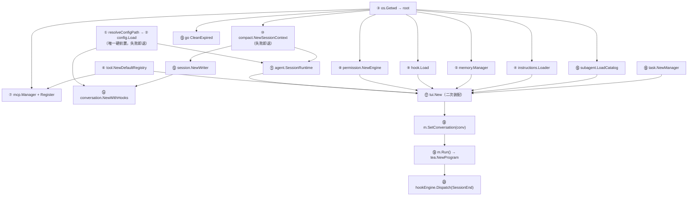
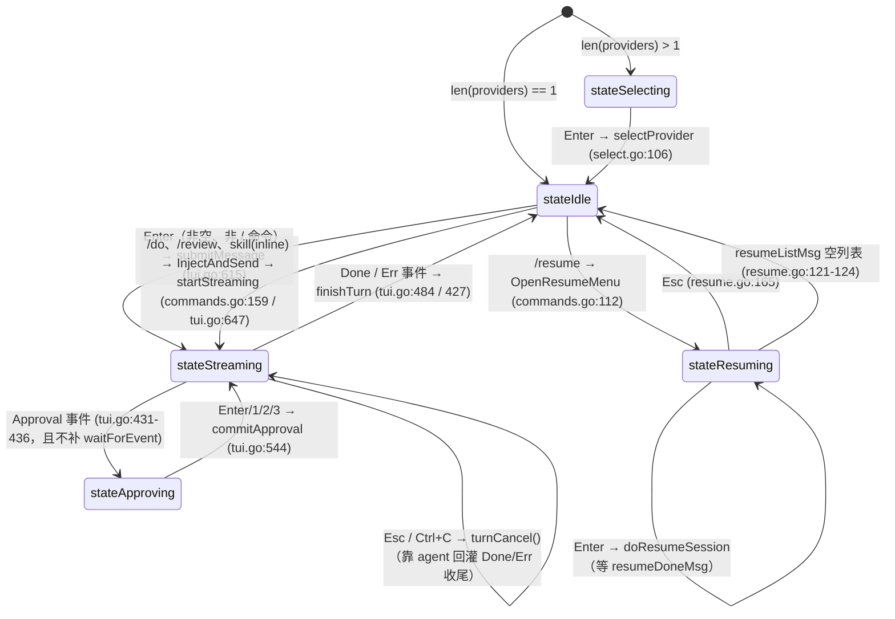
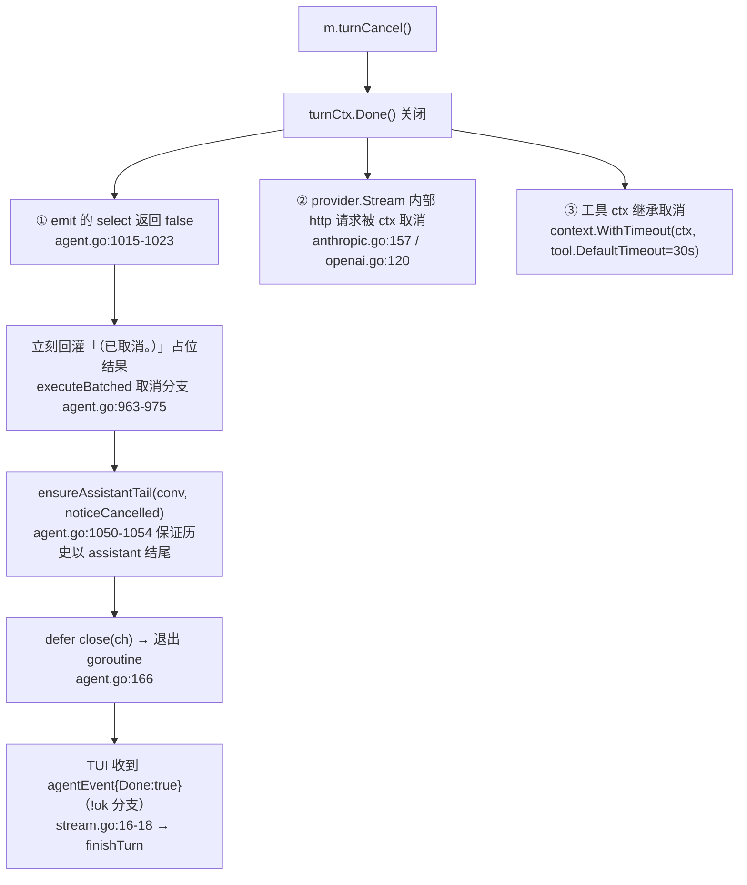
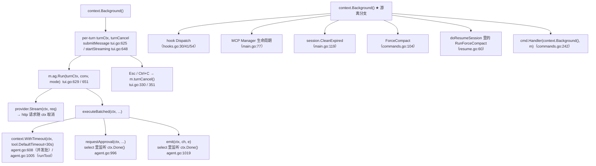
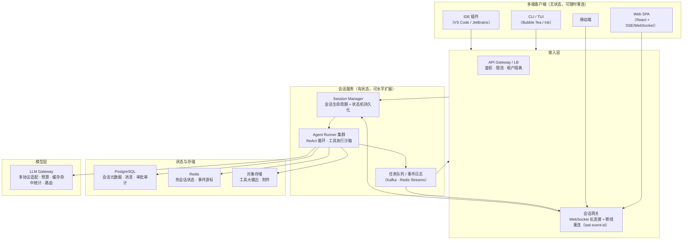

# 11 · TUI 与 Go 并发模型

> 源码：`mewcode/cmd/mewcode/main.go`（174 行）、`mewcode/internal/tui/`（`tui.go` 667、`view.go` 285、`commands.go` 310、`complete.go` 203、`resume.go` 279、`select.go` 120、`hooks.go` 92、`tasks.go` 33、`stream.go` 21）、`mewcode/internal/command/`（`registry.go` 118、`command.go` 31、`dispatch.go` 43、`builtins.go` 20、`builtin_local.go` 139、`builtin_ui.go` 40、`builtin_prompt.go` 24、`builtin_skill.go` 138、`skills.go` 65、`ui.go` 77）
> 这一章表面讲终端界面，实质讲的是 **Go 并发功底**：一个 Elm 架构的单线程状态机，如何通过一条无缓冲 channel 和一次阻塞读，把一个跑在别的 goroutine 里的 ReAct 循环接管过来——包括**怎么暂停它、怎么取消它、怎么让它等用户按一个键**。

---

## 一、这一章要回答什么

| 面试问题 | 本节位置 |
|---|---|
| 一个 Go 终端 AI 助手从进程启动到画出第一帧，都 new 了些什么？顺序能乱吗？ | §二 |
| Bubble Tea 的 Elm 架构（Model/Update/View）到底怎么落地？Msg 从哪来？ | §三 |
| 为什么 `View()` 里看不到历史对话？ | §3.6 |
| Agent 在别的 goroutine 里跑，事件怎么进 Update 的？ | §四 |
| 用户按 Esc 取消，是怎么传到 HTTP 请求上的？ | §4.5 |
| 「让用户确认一下」这个需求，怎么让一个正在跑的 Agent 停下来等？ | §五 |
| 多个工具并发执行时，UI 怎么同时显示好几行 `● name(args) Running…`？ | §3.5 |
| 命令体系怎么做到 tui 包和 command 包互相不依赖？ | §六 |
| **这个项目一共有多少 goroutine？谁拥有谁？谁负责让它们退出？** | §7.1 |
| **所有 channel 的容量和语义是什么？为什么这么定？** | §7.2 |
| **所有锁保护什么？有没有漏保护的共享状态？** | §7.3 |
| **`-race` 跑过吗？哪里最可能出问题？** | §7.7 |

---

## 二、main.go 启动装配顺序

`main()`（`main.go:29`）是一条**纯线性装配流水线**：没有 DI 容器、没有 `wire`、没有 `init()` 魔法，全部显式 `new`，出错就 `os.Exit(1)` 或降级打印。这种写法的好处是"读 main 就等于读架构图"（代价是不能按需延迟构造，启动成本固定）。

### 2.1 编号步骤（1..20）

| # | 代码 | 做什么 | 失败策略 | 依赖 |
|---|---|---|---|---|
| 1 | `resolveConfigPath()`（`main.go:33` → `161`） | 两层 fallback：`./.mewcode/config.yaml` → `~/.mewcode/config.yaml`；都不存在时返回**用户级路径** | 返回 err → `os.Exit(1)` | `os.Stat` / `os.UserHomeDir` |
| 2 | `config.Load(cfgPath)`（`main.go:38`） | 解析 YAML 得 `cfg`；失败时 stderr 打印一份 `providers:` 样例模板 | `os.Exit(1)` | 1 |
| 3 | `root, _ := os.Getwd()`（`main.go:50`） | 项目根，供后续 instructions/memory/MCP/permission/session 使用 | 错误被丢弃（`_`） | — |
| 4 | `instructions.NewLoader(root).Load()`（`main.go:53-54`） | 三层 `MEWCODE.md`（`<root>` → `<root>/.mewcode` → `~/.mewcode`）+ `@include` 展开 | **只打印不中断** | 3 |
| 5 | `memory.NewManager(projectMemDir, userMemDir, nil, "")`（`main.go:66`） + `LoadIndex()` | 记忆管理器；第 3/4 参数是 provider 与 model，**此刻 provider 尚未选定**，故传 `nil, ""` | 静默 | 3 |
| 6 | `tool.NewDefaultRegistry()`（`main.go:73`） | 6 个内置工具：`read_file / write_file / edit_file / bash / glob / grep` | — | — |
| 7 | `mcp.LoadConfig(root)` → `mcp.NewManager(context.Background(), ...)` → 逐个 `reg.Register(t)`（`main.go:76-81`） | 远端 MCP server 工具并入注册中心；`defer mgr.Close()` | 配置错误丢弃 | 3、6 |
| 8 | `permission.NewEngine(root)`（`main.go:84`） | 三层规则（local > project > user）+ 黑名单编译 + `defaultMode` | **err 也继续**：`eng` 必非 nil（降级为空规则安全引擎） | 3 |
| 9 | `hook.Load(root)`（`main.go:91`） | Hook 引擎；错误被丢弃 → **`hookEngine` 可能为 nil** | 静默 | 3 |
| 10 | `compact.NewSessionContext(root)`（`main.go:94`） | 生成 `SessionID`（`YYYYMMDD-HHMMSS-xxxx`）、`SessionDir`、`SpillDir` | **`os.Exit(1)`**（会话目录是持久化刚需，不做降级） | 3 |
| 11 | `agent.SessionRuntime{...}`（`main.go:99-105`） | `Replacement` / `Recovery` / `AutoTracking` / `Session` / `ContextWindow` | — | 2、10 |
| 12 | `session.NewWriter(sessionCtx.SessionDir)`（`main.go:108`） + `defer writer.Close()` | `conversation.jsonl` 追加写 | `os.Exit(1)` | 10 |
| 13 | `go session.CleanExpired(sessionsDir, 30*24h)`（`main.go:118`） | 后台清理过期会话（**异步、不阻塞启动**） | 只打 stderr | 3 |
| 14 | `conversation.NewWithHooks(writer.OnAppend(modelName), writer.OnReplace())`（`main.go:129`） | 带持久化回调的 Conversation；`modelName = cfg.Providers[0].Model` | — | 2、12 |
| 15 | `subagent.LoadCatalog(root)`（`main.go:132`） | 子 Agent 角色目录，打印 `[subagent] 已加载 N 个 Agent 角色` | — | 3 |
| 16 | `task.NewManager()`（`main.go:136`） | 后台任务管理器（`done chan string` 缓冲 32 + `byName` 索引） | — | — |
| 17 | `tui.New(...)`（`main.go:139`） | **12 参数巨型构造函数**（providers, version, reg, eng, runtime, writer, memMgr, instructionText, memoryText, hookEngine, taskMgr, subAgentCatalog）；内部继续二次装配 | — | 2/6/8/10/11/12/4/5/9/15/16 |
| 18 | `m.SetConversation(conv)`（`main.go:141`） | 用第 14 步带回调的 Conversation **覆盖** TUI 内部 `New()` 里创建的裸 `conversation.New()`（`tui.go:178`） | — | 14、17 |
| 19 | `m.Run()`（`main.go:143` → `tui.go:663`） | `tea.NewProgram(m).Run()`，**无任何 `tea.WithXxx` 选项** | `os.Exit(1)` | 17、18 |
| 20 | `hookEngine.Dispatch(ctx, EventSessionEnd, ...)`（`main.go:149-153`） | 进程退出前兜底派发 SessionEnd（`/clear`、`/resume` 路径另有各自的 SessionEnd） | nil 保护 | 9、19 |

### 2.2 依赖关系图



**面试要点**：`CFG` 有两条入边指向 `RT` 与 `CONV`，因为 `main.go:104` 用了 `cfg.Providers[0].EffectiveContextWindow()`、`main.go:127` 用了 `cfg.Providers[0].Model`——**直接索引 `[0]`，源码未体现空切片保护**。实际由第 2 步 `config.Load` 的校验兜住，属于隐性契约。

### 2.3 `tui.New` 内部二次装配（第 17 步展开）

`tui.New`（`tui.go:139`）是真正的"组装车间"，顺序不能乱：

1. `providers` 为空则兜底 `[{Name:"default", Protocol:"anthropic", Model:"unknown"}]`（`tui.go:140-142`）。
2. `textarea.New()`（`Prompt = "❯ "`、`Placeholder = "Send a message..."`、`ShowLineNumbers = false`、80×3，`tui.go:144-149`）；`spinner.New()` + `spinner.Dot`（`151-152`）；`glamour.TermRenderer`（`style.json` 通过 `//go:embed` 注入零 margin 样式，失败回退 `light` 主题 + `WithWordWrap`，`tui.go:43-46` / `121-136`）。
3. `startMode = engine.StartMode()`（engine 为 nil 时 `ModeDefault`，`tui.go:154-157`）。
4. `cwd, _ := os.Getwd()`；`sessionsDir = cwd + "/.mewcode/sessions"`（`159-160`）——注意这里是**字符串拼接**，`main.go:117` 用的是 `filepath.Join`，两者写法不一致。
5. `command.New()` + `command.RegisterBuiltins(cmdReg)` → 13 条内置命令（`163-164`）。
6. `skills.LoadCatalog(cwd)` → `skills.NewActiveSkills()` → **写回 `runtime.ActiveSkills`**（`167-169`）：Agent 与 TUI 共享同一 runtime，激活状态跨轮保持。
7. **单 provider 分支**（`195-273`）：
   - `llm.New(providers[0])` 失败则 `m.provider = nil`（`196-201`），**源码未体现后续保护**——`submitMessage` 会调用 `m.ag.Run`，而 `m.ag` 由 nil provider 构造，属已知缺口；
   - `agent.New(provider, registry, version, engine, opts...)`，opts 依次 `WithRuntime` / `WithCatalog` / `WithHookEngine` / `WithMemoryManager` / `WithInstructionText` / `WithMemoryText`（`204-217`）；
   - `runtime.HookEngine = hookEngine`（`220-223`）——这是 `HookEngine` 字段的**第二个赋值点**（`agent.New` 内部也会兜底设一次）；
   - `skills.NewExecutor(cat, m.ag)`（`224`）：`*agent.Agent` 实现 `SkillHost.ActivateSkill`；
   - `command.RegisterSkillsAsCommands`（`227`）：每个 skill 注册为 `/<name>`，inline → `KindPrompt`，fork → `KindSkillFork`；
   - `tool.NewLoadSkillTool`（系统工具，`230-231`）+ `tool.NewInstallSkillTool`（普通工具、受权限约束，`234-238`），后者的 `onInstalled` 回调**重新注册全部 skill 命令**（热更新）；
   - `cat.ValidateTools(...)`（`241-247`）：校验 `allowed_tools` 是否存在，问题只打 stderr 警告；
   - `command.RegisterSkillCmd(cmdReg, m.skillDeps)`（`250-256`）→ `/skill`；
   - 4 个 task 工具（`259-264`）+ `agent.NewAgentTool(...)`（`267-273`），并 `agentTool.SetParentConvFn(m.conv.Messages)`。
8. **多 provider 分支**（`274-277`）：`state = stateSelecting` + `initList()`，**不构造 provider、不构造 agent、不注册 skill/task/agent 工具**。`selectProvider`（`select.go:106-119`）只设 `m.provider` 与 `state = stateIdle`，**源码未体现重新构造 Agent 的逻辑**——多 provider 路径下 `submitMessage` 会碰到 nil 的 `m.ag`。

> **面试官追问点**：`SetParentConvFn(m.conv.Messages)` 绑定的为什么可能是**旧 conversation**？
> **答**：因为 `tui.New` 在第 17 步执行，而 `SetConversation` 在第 18 步才把带回调的 conv 换进去（`main.go:141`）。闭包捕获的是 **`m.conv` 这个字段的方法值**——Go 里 `m.conv.Messages` 求值时已经确定了接收者，所以绑定的是一个**即将被丢弃的空 Conversation**。后果是 Fork 类子 Agent 拿到空的父历史。这是"先构造 TUI、再注入 conversation"这个补丁式设计的直接副作用，属于已知缺陷。

---

## 三、Bubble Tea 架构

### 3.1 Elm 架构的三件套与 Bubble Tea 的对应

| Elm 概念 | Bubble Tea 对应 | 本项目落点 |
|---|---|---|
| Model（不可变状态） | `tea.Model` 接口的 `Init/Update/View` | `*tui.Model`（`tui.go:55-118`，60+ 字段） |
| Msg（事件） | `tea.Msg`（任意类型，靠 type switch 分派） | `agentEvent` / `resumeListMsg` / `resumeDoneMsg` + 框架 Msg |
| Update（纯函数） | `func(tea.Msg) (tea.Model, tea.Cmd)` | `(*Model).Update`（`tui.go:307`） |
| Cmd（副作用描述） | `type Cmd func() tea.Msg` | `waitForEvent` / `tea.Println` / `beginResume` / `doResumeSession` |
| Subscriptions（长期订阅） | Bubble Tea **没有** subscriptions | 本项目的"订阅"是 `waitForEvent` 接力（见 §四） |

**最关键的架构事实（面试必讲）**：Bubble Tea 保证 **`Update` 在单 goroutine 上串行执行**。所有 UI 状态的读写都发生在这一条线程上，因此 `Model` 的绝大多数字段**不需要任何锁**。项目的并发设计全部服务于同一个目标：**把外部世界的并发收敛成"一次一个 Msg"喂给 Update**。

### 3.2 Model：单结构体 + 注释分区

`Model`（`tui.go:55`）是一个 60+ 字段的扁平结构体，**没有拆成 Elm 风格的 sub-model**，可读性靠注释分区：

| 分区 | 字段 | 行号 |
|---|---|---|
| UI 原语 | `textarea` / `spinner` / `list`（provider 选择）/ `resumeList` / `renderer` / `width` / `height` | `tui.go:56-60`、`76`、`115-116` |
| 依赖注入 | `providers` / `provider` / `registry` / `conv` / `engine` / `runtime` / `ag` / `writer` / `memMgr` / `instructionText` / `memoryText` / `sessionsDir` / `cmdRegistry` / `skillCatalog` / `skillExecutor` / `skillDeps` / `hookEngine` / `taskMgr` / `subAgentCatalog` / `agentTool` / `version` / `cwd` | `tui.go:62-75`、`95`、`101-111`、`113`、`117` |
| 流式状态 | `cancel`（**从未被赋值**）、`turnCancel`（per-turn）、`events <-chan agent.Event`、`curReply strings.Builder`、`curTools []toolDisplay`、`turnStart`、`mode`、`iter`、`usageIn/usageOut` | `tui.go:79-88` |
| 人在回路 | `pending *agent.ApprovalRequest`、`approveCursor int` | `tui.go:91-92` |
| 命令/输出缓冲 | `completion completionMenu`、`pendingPrintln []string`、`pendingCmd tea.Cmd` | `tui.go:96-98` |

`toolDisplay` 只有两个字段（`tui.go:49-52`）：

```go
type toolDisplay struct {
	name string
	args string
}
```

**`curTools` 是切片而不是单值**（`tui.go:83`，注释写明"替换单个 curTool，支持并发批"）：因为 agent 的 `executeBatched` 会对连续只读工具批量并发，**Start 事件先按调用序全部发出**（`agent.go:568-587`），所以 TUI 必须能同时展示多行 `● name(args) Running…`。这是一个"UI 数据结构被下游并发策略反向决定"的好例子。

### 3.3 状态机：5 个状态，故意没有 tool-running

```go
// tui.go:35-41
const (
	stateSelecting sessionState = iota // 多 provider 时的选择界面
	stateIdle                          // 等待用户输入
	stateStreaming                     // 等待/接收模型流
	stateApproving                     // 人在回路待批准
	stateResuming                      // 会话恢复列表选择
)
```

**关键设计：没有 `tool-running` 状态**。工具执行期间仍处于 `stateStreaming`（agent 的执行与事件发射都在同一个 ReAct goroutine 内），UI 靠 `len(m.curTools) > 0` 分支渲染不同内容（`view.go:150-170`，`renderStreamingReply`）：有工具则逐行 `● name(args) ⠋ Running…`，否则 `⠋ Imagining… (Ns · 第 N 轮)`。

> **面试官追问**：为什么不加一个 `tool-running` 状态？
> **答**：因为对 TUI 而言"模型在思考"和"工具在跑"的**输入语义完全相同**（用户的合法操作只有 Esc/Ctrl+C 取消），区别只在渲染。加状态会引入一条"必须在 N 个地方同步维护"的转移边，而收益只有一次 `if`。（对比：如果要做"工具运行时可查看详情/可单独中止某个工具"，那就必须加状态——**状态机的粒度应该由"用户可执行的动作集合"决定，而不是由内部阶段数量决定**。这句话是很好的加分回答。）

**转移图（含触发点）**：



**取消路径的语义很讲究**：`stateStreaming|stateApproving` 下按 Esc/Ctrl+C **不改变状态**（`tui.go:341-356` / `320-338`），只调 `m.turnCancel()` 然后继续 `waitForEvent`——**状态的迁移权完全交给 agent 事件流**（等它把 `Done`/`Err` 送回来）。这是"单一真相来源"原则在状态机上的体现：**TUI 不猜测 agent 什么时候停，它只等待。**

### 3.4 Update 分发：三段式优先级

`Update`（`tui.go:307`）的结构是"**全局硬编码键位 → 状态分派 → 兜底透传**"：

```
WindowSizeMsg                 → width/height；textarea.SetWidth(w-4)；w>20 时重建 renderer(w-4)   (309-316)
KeyPressMsg:
   ① ctrl+c 硬编码分支（全局最高优先级）                                                     (320-338)
   ② Esc 硬编码分支                                                                          (341-356)
   ③ shift+tab（仅 stateIdle）循环切换权限模式                                               (359-363)
   ④ switch m.state → handleSelectingKey / handleIdleKey / (streaming: 吞掉) /
                       updateApproving / updateResuming                                       (365-376)
agentEvent:
   state == stateApproving → updateApproving（实际只处理 KeyPressMsg，事件被忽略）            (378-382)
   否则 → handleAgentEvent                                                                   (421)
spinner.TickMsg              → handleSpinnerTick（非 streaming 直接丢弃，567-570）             (384-385)
resumeListMsg / resumeDoneMsg→ 仅 stateResuming 处理                                          (387-391)
default                      → 透传给 textarea.Update（光标移动/插入/删除）                    (394-396)
```

**为什么 `ctrl+c` / `Esc` 要硬编码在 switch 之前**：Bubble Tea 的 `Update` 是唯一能"拦住"按键的地方，把"取消/退出"放在最前面保证了**任何状态下这两个键都有确定语义**，不会被子组件（textarea/list/补全菜单）先消费。

**这条设计的代价（主动指出来会加分）**：硬编码顺序产生了一个真实 bug——`handleCompletionKey` 的 `tea.KeyEscape` 分支（`complete.go:164-166`）**是死代码**：`Update` 顶部的全局 Esc 处理在 `stateIdle` 时直接 `return m, nil`（`tui.go:355`），根本不会下传到 `handleIdleKey`。后果是**Esc 无法撤销已弹出的补全菜单**。

### 3.5 `handleAgentEvent`：无 tag switch 的 case 顺序即优先级

`handleAgentEvent`（`tui.go:421`）用一个**没有 tag 的 `switch` + case 布尔表达式**排定事件优先级，**顺序本身就是语义**：

```
Compact > Err > Approval > Tool(PhaseStart) > Tool(PhaseEnd) > Usage > Iter > Notice > Text > Done
```

逐条说清楚（这是面试官验证"你是不是真读过自己代码"的地方）：

| case | 行号 | 关键行为 |
|---|---|---|
| `ev.Compact != nil` | `423-425` | 只是 Notice 渲染（`formatCompactNotice`，`commands.go:296-310`：Before/After × Auto/Emergency 四态文案）；**继续补读**，压缩不结束本轮 |
| `ev.Err != nil` | `427-429` | 打印红色错误块 + `finishTurn()`，**不再补读 channel**（残余事件被丢弃，agent 侧随后 `close(ch)`，无泄漏） |
| `ev.Approval != nil` | `431-436` | 存 `m.pending`、`approveCursor = 0`、`state = stateApproving`，**刻意 `return m, nil`**——不补 `waitForEvent`（这就是"挂起 Agent"的全部实现，见 §五） |
| `Tool PhaseStart` | `438-448` | 若 `len(curTools)==0 && curReply.Len()>0`，**先把已累积的 preamble 作为 assistant 块 `tea.Println` 出去**，再 append 本次工具；这是"分离思考性前导文本与后续工具轮"的处理 |
| `Tool PhaseEnd` | `450-463` | **FIFO 弹出队首** `m.curTools[0]`（agent 保证 Start/End 都按调用序 emit，所以队首就是本次结束的工具），同时 `tea.Println` 工具行 + 结果摘要 |
| `Usage` | `465-468` | `usageIn/usageOut` 累加（**会话累计语义，跨轮不清零**） |
| `Iter > 0` | `470-472` | `m.iter = ev.Iter`，供 `Imagining… (Ns · 第 N 轮)` 显示 |
| `Notice != ""` | `474-478` | 仅 UI 展示，**不进历史**（历史侧由 agent 的 `ensureAssistantTail` 写同源常量，`agent.go:151-156`） |
| `Text != ""` | `480-482` | 写入 `curReply`（累加，不立即打印） |
| `Done` | `484-495` | 用 glamour 渲染整段 `curReply` 再 `tea.Println`，然后 `finishTurn()` |

**为什么 `Text` 不立即 `Println` 而是攒在 `curReply` 里**：因为要支持"边流边显示"——`View()` 里的 `renderStreamingReply`（`view.go:144`）每帧读 `curReply.String()` 画在输入框上方，形成打字机效果；`Done` 时才把它**定型**并推进 scrollback。**同一份文本有两种生命周期**：流式期活在 View（可被下一帧重画），完成期活在 scrollback（永久）。

### 3.6 View：scrollback 模式，`View()` 只画最后几行

`Run()`（`tui.go:663-666`）只有三行：

```go
func (m *Model) Run() error {
	p := tea.NewProgram(m)
	_, err := p.Run()
	return err
}
```

**没有 `tea.WithAltScreen()`、没有鼠标、没有自定义输入输出**，因此跑在 Bubble Tea 的 **scrollback 模式**：

- 所有对话内容（banner、用户消息、assistant 回复、工具行、工具结果、notice、错误）通过 `tea.Println(...)` 输出到**终端原生历史缓冲区**，永久可滚、可选中、可复制、可 `Cmd+F`。
- `View()`（`view.go:92-103`）只负责屏幕底部一小块，按 state 四选一：

| state | View 内容 | 实现 |
|---|---|---|
| `stateSelecting` | `list.View()` + 提示行 | `select.go:57-66` |
| `stateResuming` | `resumeList.View()`；列表未加载时 `"正在加载会话列表..."` | `resume.go:181-186` |
| `stateApproving` | 审批块（`renderApprovalBlock`）+ 状态栏 | `view.go:132-142` |
| 默认（idle/streaming） | 流式回复 + 带圆角边框的输入框 + 补全菜单 + 状态栏 | `view.go:105-129` |

`View()` 返回 `tea.View`（v2 API：`tea.NewView(s string)`，`view.go:95`）。

**渲染函数族（工具行的视觉规范）**：

```go
// view.go:56-59 —— 工具行
func toolLine(name, args string) string {
	line := fmt.Sprintf("● %s(%s)", name, args)
	return toolStyle.Render(line)   // #44CCCC 青色
}

// view.go:62-77 —— 工具结果
func toolResultSummary(result string, isError bool) string {
	lines := strings.Split(result, "\n")
	if len(lines) > 8 {                      // ★ UI 侧截断 8 行
		lines = lines[:8]
		result = strings.Join(lines, "\n") + "\n..."
	}
	summary := "  ⎿  " + strings.ReplaceAll(result, "\n", "\n     ")   // ★ 缩进两空格 + 续行对齐
	if isError {
		return toolErrorStyle.Render(summary)  // #FF4444 红
	}
	return toolResultStyle.Render(summary)     // #888888 灰
}
```

于是终端上出现的是这样一组行：

```
● read_file(internal/tui/tui.go)
  ⎿  package tui
     import (
     ...
● bash(go test ./...)
  ⎿  ok  mewcode/internal/tui  0.31s
```

**注意 `⎿` 是 U+23BF**，配合 `"  ⎿  "` 前缀与 `"\n     "`（5 空格）续行缩进，形成 Claude Code 那种"工具调用 + 结果挂靠"的视觉层级。

其余渲染函数：`renderUserBlock`（`● text`，`79-81`）、`renderAssistantBlock`（`●\n` + 正文，`83-85`）、`renderErrorBlock`（`● 错误: ...`，`87-89`）、`renderNoticeBlock`（灰底，`234-236`）、`renderApprovalBlock`（`239-285`）。样式全部是**包级 `lipgloss.NewStyle()` 变量**（`view.go:14-53`），硬编码 hex 颜色，**无主题切换**。

**状态栏**（`view.go:180-219`）：左模式标签（按 Mode 着色：default 绿 `#44CC44` / acceptEdits 青 `#44CCCC` / plan 黄 `#CCCC44` / bypass 红 `#FF4444`）+ 右侧 `模型名 ↑in ↓out tok`（`formatCompact` 到 k/M，`222-231`），中间用空格填充到 `m.width`（`width < 20` 时兜底 80）。

### 3.7 自定义 Msg 清单

| Msg 类型 | 定义处 | 语义 |
|---|---|---|
| `agentEvent` | `stream.go:9` `type agentEvent agent.Event`（**新类型而非别名**） | agent 事件流元素 |
| `resumeListMsg` | `resume.go:39-42` `{infos []session.SessionInfo; err error}` | 会话列表异步加载完成 |
| `resumeDoneMsg` | `resume.go:105-112` `{conv, writer, sessionCtx, sessionID, msgCount, err}` | 会话恢复（含压缩）完成 |

> **面试官追问**：为什么写 `type agentEvent agent.Event` 而不是 `type agentEvent = agent.Event`？
> **答**：Go 里 `type A B` 是**新定义类型**（type identity 不同），`type A = B` 是别名（完全等价）。用新类型后：① `Update` 的 `case agentEvent:` 才能精确匹配桥接消息，不会被 `agent.Event` 的其它使用者误伤；② 底层类型相同，字段访问与转换都保留（`agentEvent(ev)` 是零成本转换）；③ 避免 tea 框架把它当成别的 `tea.Msg`。这是 Go 类型系统里"新类型即语义标签"的经典用法。

**框架 Msg**：`tea.WindowSizeMsg`、`tea.KeyPressMsg`、`spinner.TickMsg`，以及 textarea / list 内部产生的 Msg（走 `default` 分支透传，`tui.go:394-396`）。

**Cmd 形式**（Cmd = `func() tea.Msg`，在 Bubble Tea 自己的 goroutine 里执行）：

| Cmd | 来源 | 说明 |
|---|---|---|
| `waitForEvent(m.events)` | `stream.go:13` | **唯一的数据入口**，一次阻塞读一个事件 |
| `tea.Println(...)` / `tea.Batch(...)` / `tea.Quit` | 框架 | `tea.Quit` 由 `Quit()`（`commands.go:86-91`）写入 `pendingCmd`，经 `flushPending` 交给框架 |
| `m.spinner.Tick` | bubbles | spinner 自驱动（不依赖外部 ticker） |
| `m.textarea.Focus()` | bubbles | `Init()`（`tui.go:301-304`） |
| `beginResume()` | `resume.go:28-36` | 闭包 Cmd：异步 `session.ListSessions` → `resumeListMsg` |
| `doResumeSession(info)` | `resume.go:45-102` | 闭包 Cmd：加载 + token 估算 + 可能压缩 + 重开会话目录/Writer → `resumeDoneMsg` |

### 3.8 三条并发通道，三种处理策略

TUI 要面对三个"外部世界"，处理方式刻意不同：

| 通道 | 接入方式 | 状态写入 | UI 可见性 |
|---|---|---|---|
| **agent 事件流** | 正规的 `waitForEvent` 接力（Cmd 拉取） | 全部在 Update 单线程内 | 完整可见 |
| **后台任务完成通知**（`tasks.go`） | **不走 Update、不走 tea.Msg**：`Init()` 里 `go m.consumeTaskDone()` 常驻 goroutine，直接 `range m.taskMgr.SubscribeDone()`，把 `<task-notification>` 原文 `m.runtime.AppendReminders(...)`（`tasks.go:10-21`） | 跨 goroutine 写 `SessionRuntime`，由 `runtime.mu` 保护（`runtime.go:31`） | **无任何 UI 提示**（只有模型在下一轮 `buildReminder → TakeReminders` 时看到） |
| **异步命令 Cmd** | Cmd 在 Bubble Tea 的 goroutine 里跑，返回 Msg 回到 Update | 只在 Update 里写 | 完整可见 |

> **面试官追问点（很好的加分项）**：第二条通道为什么不做成 Msg？
> **答**：因为它**不需要 UI 反馈**——后台任务完成的语义是"下一轮对话时告诉模型"，而不是"现在打断用户"。用 `AppendReminders` 直连 `SessionRuntime` 是最短路径，也避开了"Update 里排队"的复杂度。**但它暴露了一个可观测性缺口**：用户完全不知道后台任务完成了，只能等模型主动提。企业级做法是把这条路径也发一个 Msg（或至少发一个 `Notice`）到 scrollback。

### 3.9 异步 Cmd 的正确用法（`resume` 是范本）

`doResumeSession`（`resume.go:45-102`）演示了"重活放 Cmd 里"的标准做法：

1. `session.LoadSession(info.Dir)` 读消息；
2. `estimateTokens(msgs)`（`chars * 0.25` 粗估，`resume.go:189-201`），若超 `ContextWindow - 8000` 则先 `RunForceCompact` 压缩（`54-65`）；
3. 若 `time.Since(info.ModifiedAt) > 6h`，追加一条 user 消息 `"[系统提示] 本会话已暂停 X。部分上下文可能已过时…"`（`68-71`）；
4. `compact.OpenSessionContext` + `session.OpenWriter`（追加模式重开 JSONL）——**必须在构造 Conversation 之前**（`80-92`，注释明确写了原因：否则 `OnAppend` 会绑到旧 writer）；
5. 回到 Update 后（`resume.go:137-156`）替换 `m.conv/m.writer/m.runtime.Session`，并用 `renderHistoryMessages`（`255-279`，tool 消息截断 200 字符）在 scrollback 里**回放历史**。

**这四步全是阻塞 I/O（读文件、可能还有一次 LLM 压缩请求）**，如果写在 Update 里，界面会直接冻住。放进 Cmd 后，spinner 照常转、窗口照常 resize。**这就是 Elm 架构里 Cmd 存在的唯一理由**。

---

## 四、Agent Event → tea.Msg 桥接

### 4.1 桥接代码：21 行，整个 TUI 的"心脏瓣膜"

```go
// internal/tui/stream.go 全文
package tui

import (
	tea "charm.land/bubbletea/v2"
	"mewcode/internal/agent"
)

// agentEvent 包装 agent.Event 作为 bubbletea 消息
type agentEvent agent.Event

// waitForEvent 从 agent 事件 channel 读取事件并返回为 bubbletea 消息。
// channel 关闭时返回 Done 事件。
func waitForEvent(ch <-chan agent.Event) tea.Cmd {
	return func() tea.Msg {
		ev, ok := <-ch
		if !ok {
			return agentEvent{Done: true}   // channel 关闭 == 本轮结束
		}
		return agentEvent(ev)
	}
}
```

**逐条拆解**：

1. **Cmd 闭包 = 一次阻塞读**。`tea.Cmd` 就是 `func() tea.Msg`，Bubble Tea 在自己的 goroutine 中执行它。闭包里的 `<-ch` 阻塞期间**不会卡住 UI**（Update/View 仍在跑，spinner 靠 `spinner.TickMsg` 自驱动）。这是"把阻塞式 channel 读接进 Elm 架构"的标准做法。
2. **一次只读一个事件**。处理器每处理完一个事件就 `return m, waitForEvent(m.events)` 补一个读，形成**接力**。因为补读发生在 Update 里（串行），所以正常路径下**永远只有一个读者**。
3. **channel 关闭 → Done**。agent 侧 `Run` 的 goroutine 有 `defer close(ch)`（`agent.go:166`），所以 `close` 被复用为 **Done 信号的兜底**：即便 agent 异常返回而没有 emit `Done`，TUI 也会收到 `agentEvent{Done: true}` 并 `finishTurn()`（此时 `curReply` 可能为空 → 不打印任何块）。
4. **为什么需要桥接**：`agent` 包**不可能** import `tui` 或 `bubbletea`（否则会形成反向依赖，Agent 也没法在 `cmd/smoke` 里被非交互消费）。所以 agent 只暴露 `<-chan Event`，由 TUI 侧做一次类型包装把"阻塞的 channel"翻译成"框架认识的 Msg"。**桥接层就是唯一允许知道双方类型的地方**——这是依赖倒置在事件流上的具体形态。

### 4.2 channel 生命周期

| 阶段 | 代码 | 说明 |
|---|---|---|
| **创建** | `m.events = m.ag.Run(turnCtx, m.conv, m.mode)`（`tui.go:629` `submitMessage` / `tui.go:651` `startStreaming`） | **只有这两处来源**，都是"新一轮开始" |
| **消费** | `waitForEvent` 接力，直到收到 `Done`/`Err`/channel 关闭 | 唯一数据入口 |
| **释放** | `finishTurn()`（`tui.go:556-564`）：`events = nil`、`turnCancel = nil`、`curReply.Reset()`、`curTools = nil`、`iter = 0`、`state = stateIdle` | **保留 `mode` 与 `usageIn/usageOut`**（跨轮语义） |
| **底层容量** | `ch := make(chan Event)`（`agent.go:165`，**无缓冲**） | 背压阀门，见 §4.4 |

> **面试官追问**：`finishTurn` 为什么保留 `mode` 和 usage，却清空 `iter`/`curTools`？
> **答**：生命周期不同。`mode` 是用户档位（`Shift+Tab` 切换、跨轮保持）；`usageIn/usageOut` 是**会话累计值**（`/status` 要显示累计 token，`main.go` 侧也无法重算）；而 `iter`（本轮迭代数）、`curTools`（本轮工具展示队列）、`curReply`、`events`、`turnCancel` 都是**本轮临时态**，必须清干净，否则下一轮会串味——最典型的 bug 是 `curTools` 残留会让 `PhaseEnd` 的 FIFO 弹错工具名。

### 4.3 事件字段互斥由 case 顺序裁决

`agent.Event`（`03-Agent内核与ReAct循环.md` §3.1 已列）是一个 9 字段结构体，`handleAgentEvent` 用**无 tag switch** 分派。这意味着：

- **不变量不是由结构体保证的，而是由 case 顺序 + agent 侧的 emit 约定共同保证的**；
- 如果 agent 某次 emit 同时设置了 `Approval` 和 `Tool`，TUI 会按 `Approval > Tool` 处理，后者被**静默丢弃**；
- 目前 agent 侧所有 `emit` 调用点都只填一个语义字段（可 grep 验证），所以现状是安全的。

> **面试官追问**：这种设计有什么风险？
> **答**：**新增事件类型时容易漏改**——如果将来加了 `ev.Progress`，必须记得插到优先级列表的正确位置，编译器不会提醒。更稳的写法是给 `Event` 加一个 `Kind` 枚举字段做显式分派（switch on Kind），字段互斥由构造函数保证。这是我在项目里明确意识到的**取舍点**：当前写法更省字段、更贴合"零值即未设置"的 Go 风格，代价是**隐式契约**。

### 4.4 背压：无缓冲 channel 就是阀门

```go
// agent.go:164-166
func (a *Agent) Run(ctx context.Context, conv *conversation.Conversation, mode permission.Mode) <-chan Event {
	ch := make(chan Event)      // ★ 无缓冲
	go func() {
		defer close(ch)
```

无缓冲 channel 的效果：**TUI 不读 → agent 的 `emit` 阻塞 → 整个 ReAct 循环暂停**。

| 场景 | 有缓冲（如 32） | **本项目：无缓冲** |
|---|---|---|
| UI 处理慢时 | 事件在缓冲区积压，用户看到的是**过期状态** | UI 处理完才继续，视图永远最新 |
| 人在回路挂起 | 挂起延迟生效（缓冲区里的 Text 先被消费） | **零成本挂起**（agent 直接停在 `emit` 或 `select`） |
| 吞吐 | 略好 | 略差（但这个场景下 UI 才是瓶颈） |
| 消费者死亡 | 生产者可以跑一段才阻塞 | 立刻阻塞（靠 `ctx.Done()` 兜住，见下） |

这正是"人在回路"能阻塞 Agent 的**机制基础**——`stateApproving` 时 TUI 不补 `waitForEvent`，于是 `m.events` 没有读者，agent 的下一次 `emit` 就会挂在 `select` 上（或者它已经挂在 `requestApproval` 的 `select` 上，见 §五）。

### 4.5 取消与取消传播

**TUI 侧发起**（`tui.go:320-338` Ctrl+C / `341-356` Esc，两处逻辑完全对称）：

```
Esc / Ctrl+C（stateStreaming | stateApproving）
  ├─ 若 stateApproving 且 pending != nil：
  │     select { case m.pending.Respond <- permission.OutcomeDenyOnce: default: }   // 非阻塞兜底
  ├─ if m.turnCancel != nil { m.turnCancel() }                                      // 取消 per-turn ctx
  └─ return m, waitForEvent(m.events)                                               // 继续读残余事件，等 Done/Err

Esc（其它状态）      → return m, nil
Ctrl+C（其它状态）   → if m.cancel != nil { m.cancel() }（nil，no-op）+ tea.Quit
```

**per-turn context 的创建**：`context.WithCancel(context.Background())` 在 `submitMessage`（`tui.go:625`）与 `startStreaming`（`tui.go:648`）里**每轮新建**，存进 `m.turnCancel`，`finishTurn` 置 nil。

**取消如何在 agent 侧被感知（三层）**：



**注意 `emit` 不是简单的 `ch <- e`**（`agent.go:1015-1023`）：

```go
func emit(ctx context.Context, ch chan<- Event, e Event) bool {
	select {
	case ch <- e:
		return true
	case <-ctx.Done():
		return false
	}
}
```

这个 `ctx.Done()` 分支是**防 goroutine 泄漏的关键**：如果没有它，TUI 一旦停止消费（比如用户 Ctrl+C 直接退出、或者进程正在关闭），agent goroutine 会永久阻塞在 `ch <- e` 上。加上之后，取消立刻穿透发送点，调用方据此走收尾路径（把剩余工具全部标记为"（已取消。）"并 return）。

**`m.cancel` 是死字段**：`tui.go:79` 声明为"程序级取消（idle 时 Ctrl+C 退出）"，在 `tui.go:334-336` 与 `commands.go:87-89`（`Quit()`）被**读取**，但**全仓没有任何赋值点**（grep 可验证）。所以"程序级取消"实际不存在——退出完全依赖 `tea.Quit`。这是把 per-turn cancel 做扎实之后遗留的设计空洞：**本来想做"程序级 ctx，用于取消入参给 hook/MCP/ForceCompact 的 `context.Background()`"**。

---

## 五、人在回路弹窗

### 5.1 触发条件：不是 TUI 主动弹，而是 agent 通过事件流"请求"

链路（`agent.go` 的串行工具分支）：

1. `executeBatched` 走到**非只读、串行**分支（`a.registry.IsReadOnly(name) == false`，即 `write_file / edit_file / bash / MCP` 及未知工具）。
2. HOOK `PreToolUse` 未被拦截（被拦截则直接产出 hook block 结果，不进审批）。
3. `a.eng.Check(mode, call, false)` 返回 `permission.Ask`。`modeFallback` 只产 Allow/Ask，**绝不产 Deny**：default/plan 的 Write/Exec、acceptEdits 的 Exec → Ask；`reason` 形如 `"default 模式下 文件写入 类操作需确认"`。
4. 两条旁路：`a.dontAsk == true` 直接 Allow（`agent.go:762`，子 Agent 专用）；`a.approvalUpgrader != nil` 走升级回调（`agent.go:787`）。
5. 构造请求并阻塞（`agent.go:982-999`）：

```go
func (a *Agent) requestApproval(ctx context.Context, call llm.ToolCall, reason string, ch chan<- Event) (permission.Outcome, bool) {
	respond := make(chan permission.Outcome, 1)          // ★ 缓冲 1
	req := &ApprovalRequest{
		Name:    call.Name,
		Args:    argPreview(call.Input),
		Reason:  reason,
		Respond: respond,
	}
	if !emit(ctx, ch, Event{Approval: req}) {            // 事件流 = 请求通道
		return 0, false
	}

	select {
	case o := <-respond:   return o, true                // 收到决策
	case <-ctx.Done():     return 0, false               // 取消 → ok=false
	}
}
```

### 5.2 三选一如何回写

TUI 侧收到 `Approval` → `m.pending = ev.Approval; m.approveCursor = 0; m.state = stateApproving; return m, nil`（`tui.go:431-436`，**刻意不补 `waitForEvent`**）。

`viewApproving`（`view.go:132-142`）+ `renderApprovalBlock`（`view.go:239-285`）渲染三行菜单：

| 索引 | 标签（源码文案） | Outcome | 语义 |
|---|---|---|---|
| 0 | `1. 允许本次` | `OutcomeAllowOnce` | 仅本次放行，不记录规则 |
| 1 | `2. 永久允许（写入本地配置）` | `OutcomeAllowForever` | 记录精确 allow 规则，跨会话生效 |
| 2 | `3. 拒绝本次` | `OutcomeDenyOnce` | 回灌错误给模型，让其调整策略 |

**输入处理**（`updateApproving`，`tui.go:502-527`）：`↑/k`、`↓/j` 移动 cursor（钳制 0..2）；`enter`/`space` 提交 `outcomeForIndex(cursor)`（`530-541`）；数字 `1/2/3` 直达。

**回写**（`commitApproval`，`tui.go:544-553`）：

```go
func (m *Model) commitApproval(outcome permission.Outcome) (tea.Model, tea.Cmd) {
	if m.pending == nil {
		return m, nil
	}
	m.pending.Respond <- outcome      // ★ 缓冲 1，永不阻塞
	m.pending = nil
	m.state = stateStreaming
	m.approveCursor = 0
	return m, waitForEvent(m.events)  // ★ 恢复读取 → agent 继续
}
```

**agent 侧收到 outcome 的处理**：

| Outcome | 行为 |
|---|---|
| `DenyOnce` | `llm.ToolResult{Content: "用户拒绝执行：" + reason, IsError: true}` 回灌，**模型看到一条工具错误并可能改变策略**（"拒绝"被设计成**可自愈**的关键）；只 emit PhaseEnd，不 emit PhaseStart |
| `AllowOnce` | emit PhaseStart → `registry.Execute(ctx-with-`tool.DefaultTimeout`)` → emit PhaseEnd |
| `AllowForever` | 先 `eng.PersistLocalAllow(call)`（失败则 emit 一条 Notice `（写入本地规则失败: %v）`，**仍然执行**），再走 Execute |

`PersistLocalAllow` 的规则生成有三条硬约束：`ruleFor` 生成**不含通配的精确规则**；命令串用 `escapeGlob` 转义 `\ * ? [ ]`（防止"永久允许"被泛化成通配放行）；去重幂等（已存在同名规则直接 return），写 `<root>/.mewcode/settings.local.yaml` 并同步更新内存 `e.local.allow`。

### 5.3 如何阻塞 Agent goroutine（这是本章最值得讲的一处设计）

**阻塞链路有两段，缺一不可**：

```
agent goroutine                                   bubbletea goroutine（Update 单线程）
─────────────────────────────────────────────     ──────────────────────────────────────
emit(ctx, ch, Event{Approval: req})
  → ch <- e  阻塞，直到 TUI 的 waitForEvent 读走   ← waitForEvent 的 <-ch 读走它
                                                   handleAgentEvent: state = stateApproving
                                                   return m, nil   ★ 不补 waitForEvent
select { case o := <-respond: ... }  ← 唯一阻塞点
                                                   （用户按键）
                       o ← ───────────────────────  commitApproval: pending.Respond <- outcome
  → 继续执行工具                                     return m, waitForEvent(m.events)  ★ 恢复读取
```

**注意这里有两个"刹车"同时踩下**：

1. **agent 自己 `select` 等 `respond`**（主刹车，语义明确）；
2. **TUI 不再读 `m.events`**（副刹车，无缓冲 channel 提供的背压）——即使 agent 因为某种原因没挂在 `select` 上，它下一次 `emit` 也会阻塞。

> **面试官追问**：审批期间 Agent 到底"阻塞在哪一行"？
> **答**：阻塞在 `agent.go:993` 的 `select { case o := <-respond; case <-ctx.Done() }`。让整个 ReAct 循环**在它之前就停住**的，是"TUI 不再读 channel"这一行为本身——`emit(Event{Approval})` 早已返回（因为 TUI 读走了它），但之后 agent 要发任何新事件都会因为没有读者而阻塞。**两个刹车是冗余的，这种冗余是刻意的**：它让"挂起"这个语义不依赖 agent 侧任何一行代码的正确性。

### 5.4 解阻塞的三条路径与缺失的超时

唯一的解阻塞路径：

1. 用户按键 → `commitApproval` 发送 outcome；
2. 用户按 Esc / Ctrl+C → Update 先把 `OutcomeDenyOnce` 塞进缓冲 channel（`select` + `default` **防阻塞**），再 `turnCancel()`；agent 侧 `select` 随 `ctx.Done()` 返回 `ok=false`，把剩余工具全部标记为"（已取消。）"，然后沿取消路径收尾；
3. ctx 被外部取消（同一个 `turnCtx`）。

**没有任何超时**（源码未体现 timeout / 默认拒绝 / 倒计时）。用户挂机不管 = Agent 永远卡在 `select`，spinner 会一直转（`spinner.TickMsg` 照常驱动），TUI 其它按键全部被 `stateApproving` 分支吞掉。

> **面试官追问**：为什么 Esc/Ctrl+C 那一段要用 `select { case ...: default: }` 而不是直接 `m.pending.Respond <- outcome`？
> **答**：因为这是**兜底**代码，必须保证自身不会阻塞。虽然 `Respond` 是缓冲 1 的 channel、正常来说直接发也不会阻塞，但"已经发过一次"（比如 `commitApproval` 刚发完、用户又在同一帧内按了 Esc）的情况下，第二次发送会阻塞——那就会把 Update 线程卡死，整个 UI 冻结。用 `select + default` 把"发不进去"变成"静默丢弃"，**用一个已存在的信号（`turnCancel()`）作为真正的解阻塞手段**，这是正确的分层：channel 是尽力而为，ctx 才是权威。

### 5.5 与 SubAgent 升级链的衔接（已知硬伤）

设计上完整：`ApprovalUpgrader` 类型（`agent/permission_upgrade.go:12`）、`WithApprovalUpgrader` option（`agent/runtime.go:164`）、`agent.go:787` 的升级分支都实现了。

**但 TUI 侧从未接线**：`tui.New` 造 `AgentTool` 时只调了 `SetParentConvFn`（`tui.go:270`），没调 `WithApprovalUpgrader`——全仓 grep 只有定义与 agent 内部使用。

后果：子 Agent（前台）的 `Approval` 事件被投到 `AgentTool` 内部的 `events := make(chan Event, 32)`（`agent_tool.go:216`），而 `task.aggregateEvent`（`manager.go:338-349`）**只统计 Tool/Usage，忽略 Approval** → 子 Agent 会一直阻塞在它的 `select` 上，直到前台 120s 超时（`autoBackgroundDuration = 120 * time.Second`，`agent_tool.go:18`）转后台；转后台后仍无人应答，最终只能靠父 ctx 取消才解开。

---

## 六、命令体系

### 6.1 注册表结构

```go
// internal/command/registry.go:10-13
type Registry struct {
	byName  map[string]*Command // 主名 + 别名都映射到同一 *Command，key 已转小写
	visible []*Command          // 按 Name 字典序排序，排除 Hidden，给 /help 与补全菜单使用
}
```

- **`Register` 的三道校验**（`registry.go:24-63`）：Name 非空、Name 必须全小写、`Name + Aliases` 中任一 key 与已有冲突 → **`panic`**。这是刻意的"启动期快速失败"：命令表是编译期知识，写错了不该等到运行时。
- `Lookup`（`66-69`）大小写不敏感（内部 `strings.ToLower`），别名与主名等价。
- `Visible()`（`72-76`）返回**副本**（防外部改内部切片），供 `/help` 与补全菜单。
- `PrefixMatch(prefix)`（`80-94`）：trim 掉前导 `/`、转小写、**只匹配 `Name` 前缀**（不匹配 Aliases、不匹配 Description），空前缀返回全部 visible。
- `RemoveNames(names)`（`97-118`）：skill reload 时清理旧命令，同时重建 `byName` 与 `visible`（`visible` 会因删除变成"非连续切片"，但仍保持有序）。

`Command`（`command.go:24-31`）：`Name`（不含 `/`、全小写、唯一）、`Aliases []string`、`Description`、`Kind`、`Hidden`（`/help` 与补全都不显示，但 dispatch 仍可命中——`registry_test.go` 的 `TestVisible_ExcludesHidden` 明确断言）、`Handler func(ctx, UI) error`。

### 6.2 Kind 四类语义

```go
// internal/command/command.go:12-17
const (
	KindLocal     Kind = iota // 纯本地：只打印信息，不改 Model，不进对话历史
	KindUI                    // 影响界面：可改 Model 状态，不进对话历史
	KindPrompt                // 提示词：向对话注入 user 消息 + 触发 LLM 回合
	KindSkillFork             // Skill fork：异步执行后以 assistant 消息写入对话
)
```

**核心洞见（面试必答）：`Kind` 是声明式元数据，真正分流的是 handler 调用了 `UI` 的哪个方法。**

- `KindPrompt` 的 handler 一定调 `ui.InjectAndSend(label, preset)`；
- `KindUI` 的 handler 调 `SetMode / Quit / ForceCompact / OpenResumeMenu / ClearAndNewSession`；
- `KindLocal` 只调 `Println / Error` 与只读查询。

**Idle 守护**（`commands.go:236-239`）：

```go
if (cmd.Kind == command.KindUI || cmd.Kind == command.KindPrompt || cmd.Kind == command.KindSkillFork) && !m.Idle() {
	m.Error("请等待当前任务完成")
	return m.flushPending(), true
}
```

即 5 条 `KindUI` 命令（`/exit`、`/clear`、`/plan`、`/resume`、`/compact`）在 streaming 期间**一律被拒**，必须先用 Esc 取消本轮；`KindLocal` 不受限（`/status`、`/help` 在流式中查询反而更有用）。

> **面试官追问**：为什么 `KindLocal` 不拦？
> **答**：因为 `KindLocal` 只读不写（`Println` + 只读查询），并发执行不会破坏状态；而 `KindUI` 会改 Model 结构（`/clear` 要重建 writer/conversation/runtime，`/resume` 要换 Session），必须串行。**（副作用：流式期间 `/exit` 也被拒，用户得先 Esc——这是个 UX 瑕疵，可以主动指出来。）**

**依赖倒置**：handler 只依赖 `command.UI` 接口（`ui.go:7-46`，22 个方法 + `NopUI()` 测试桩，`ui.go:52-77`），`*tui.Model` 实现它（`commands.go:24-190`）。这样 **`command` 包对 `tui` 包零依赖**（否则会形成 import cycle），也让 handler 可以用 `recordingUI` 单测（`builtins_test.go`）。

### 6.3 内置命令全表（13 条 + 动态 skill 命令）

`RegisterBuiltins` 注释写"一次性注册 12 条内置命令"（`builtins.go:3`），但**实际注册 13 条**（`builtins.go:7-19`），`builtins_test.go` 断言 `len(visible) != 13` 即失败——**注释与代码不一致（文档债）**。

| # | 命令 | Kind | Handler | 职责与实现要点 |
|---|---|---|---|---|
| 1 | `/clear` | `KindUI` | `handleClear`（`builtin_ui.go:35-39`） | `ClearAndNewSession()` + `ClearActiveSkills()` + 提示。内部顺序（`commands.go:118-157`）：派发 SessionEnd → 关旧 writer → `compact.NewSessionContext` → 新 writer → `bindConversation` → `runtime.ResetForNewSession` → 归零 iter/usage → 派发 SessionStart。**任一失败只 `Error` 并 return（可能留下半初始化状态）** |
| 2 | `/compact` | `KindUI` | `handleCompact`（`builtin_ui.go:23-26`） | `ForceCompact()`（`commands.go:93-110`）：按 mode 取工具集（Plan 只读）→ `ag.RunForceCompact(context.Background(), ...)`（内部 `runMu` 串行）→ 打印 `已压缩，token 从 X 降至 Y` |
| 3 | `/do` | `KindPrompt` | `handleDo`（`builtin_prompt.go:14-18`） | `SetMode(ModeDefault)` + `InjectAndSend("/do", prompt.ExecuteDirective)`——Plan Mode 的出口 |
| 4 | `/exit` | `KindUI` | `handleExit`（`builtin_ui.go:10-13`） | `ui.Quit()` → `cancel()`(no-op) + `pendingCmd = tea.Quit` |
| 5 | `/help` | `KindLocal` | `handleHelp(reg)`（`builtin_local.go:12-40`） | **闭包捕获 registry**（注册顺序依赖），遍历 `Visible()` 计算最长名对齐，逐行 `/<name>   desc`，一次 `Println`（多行靠 `joinLines`，`84-93`） |
| 6 | `/hooks` | `KindLocal` | `handleHooks`（`builtin_local.go:96-139`） | 按 event 分组打印规则（`[once]`/`[async]` 标记）+ `Loaded from: <sources>`；`HookRules() []interface{}` 是因为 command 包不想依赖 hook 包，TUI 侧做类型断言回转 `hook.Rule`（`hooks.go:85-92`） |
| 7 | `/memory` | `KindLocal` | `handleMemory`（`builtin_local.go:59-69`） | 列出 `memMgr.ListFiles()`（project + user 合并，`commands.go:47-56`） |
| 8 | `/permission` | `KindLocal` | `handlePermission`（`builtin_local.go:72-75`） | 打印 `ui.Mode().String()`（`default` / `acceptEdits` / `plan` / `bypassPermissions`） |
| 9 | `/plan` | `KindUI` | `handlePlan`（`builtin_ui.go:16-20`） | `SetMode(ModePlan)` + 提示。真正的只读约束在 agent 侧：Plan 模式 `registry.ReadOnlyDefinitions()` 收窄工具集 + 每轮 reminder |
| 10 | `/resume` | `KindUI` | `handleResume`（`builtin_ui.go:29-32`） | `OpenResumeMenu()`（`commands.go:112-116`）：`state = stateResuming` + `textarea.Reset()` + `pendingCmd = beginResume()`（异步 `session.ListSessions`） |
| 11 | `/review` | `KindPrompt` | `handleReview`（`builtin_prompt.go:21-24`） | 注入 `reviewDirective` 常量文本（`"请审查当前上下文中的代码变更/已读取的文件，指出潜在 bug、可读性问题和可简化处。"`，`builtin_prompt.go:11`）并发起回合 |
| 12 | `/session` | `KindLocal` | `handleSession`（`builtin_local.go:78-81`） | 打印 `Session: <SessionID>` 与 `Path: <writer.Path()>` |
| 13 | `/status` | `KindLocal` | `handleStatus`（`builtin_local.go:43-56`） | 6 项 `keyWidth=11` 对齐输出：Mode / Tokens(累计 in/out) / Tools(`registry.Count`) / Memories(文件数) / Model / Directory |
| + | `/skill` | `KindLocal` | `handleSkill` → `HandleSkillSub`（`builtin_skill.go:50-69`） | `list`（`Executor.ListSummaries()`，格式 `  /%-20s [source] mode - desc`）/ `info <name>`（Meta 详情：Mode/ForkContext/Model/AllowedTools/Source）/ `reload`（`Executor.ReloadCatalog` → `CmdReg.RemoveNames(removed)` → 重新 `RegisterSkillsAsCommands`） |
| + | `/<skill-name>` | `KindPrompt` / `KindSkillFork` | `makeSkillHandler`（`skills.go:45-65`） | 每个 skill 动态注册；inline 走 `exec.Execute` → `InjectAndSend("/"+name, body)`；**fork 返回错误** `"fork skill %q 暂不支持通过命令直接调用，请使用自然语言触发 LoadSkill"` |

**热更新**：`InstallSkillTool` 安装 skill 后的 `onInstalled` 回调**重新注册全部 skill 命令**（`tui.go:234-238`），新装的 skill 立即可用无需重启；`RemoveNames` 的 `visible` 重建保证 `/help` 不漏不重。

### 6.4 命令解析（`Parse` 的四态）

```go
// internal/command/dispatch.go:11-43
func Parse(input string) (name string, isSlash bool)
```

| 输入 | 返回 | Lookup 结果 |
|---|---|---|
| `"你好"` | `("", false)` | 非命令 → 送 LLM |
| `"/"` | `("", true)` | 必 miss |
| `"/help"` | `("help", true)` | 命中 |
| `"//double"` | `("", true)` | 必 miss（`dispatch.go:26-28`） |
| `"/ help"` | `("", true)` | 必 miss（`dispatch.go:32-35`） |
| `"/help xx"` | `("", true)` | 必 miss（`dispatch.go:36-39`） |

`Parse` 是**刻意保守**的：它只认"纯命令名"，参数解析被推迟到 TUI 层。于是 `dispatchSlash`（`commands.go:198-247`）里有一段**补丁逻辑**：

```go
// commands.go:208-216
// command.Parse 对带参数的命令返回 ("", true)，需要手动提取命令名
if name == "" {
	raw := strings.TrimPrefix(strings.TrimSpace(text), "/")
	if idx := strings.IndexByte(raw, ' '); idx > 0 {
		name = strings.ToLower(raw[:idx])
	} else if raw != "" {
		name = strings.ToLower(raw)
	}
}
```

结果是 `/help xx` 这类输入**不会走"未命中提示"，而会命中 `help` 并忽略参数**（带参数命令除 `/skill` 外都由 TUI 特判）。这是"解析层极简 + 上层补丁"的痕迹。

`/skill` 是**唯一有专属分发路径**的命令：`dispatchSlash` 里 `if name == "skill"` → `handleSkillCmd(text)`（`commands.go:250-267`）→ 取 `strings.Fields` 的第 2 段起作为 args → `command.HandleSkillSub(ui, args, deps)`。

**未命中兜底**（`commands.go:224-233`）：

```go
cmd, ok := m.cmdRegistry.Lookup(name)
if !ok {
	if name == "" {
		m.Println("未知命令。输入 /help 查看可用命令")
	} else {
		m.Println(fmt.Sprintf("未知命令: /%s。输入 /help 查看可用命令", name))
	}
	return m.flushPending(), true
}
```

**关键点：`return m.flushPending(), true` 的第二返回值是 `true`**——未知命令**不会**被当作自然语言送给 LLM。这是一条重要的产品决策：**用户打错命令时给出明确提示，而不是"静默地问模型"。**

### 6.5 输出缓冲与 `flushPending`

handler 通过 `UI` 接口输出时**不直接返回 Cmd**（因为接口签名是 `error`，且 handler 是同步函数），而是写进两个字段：

```go
// commands.go:74-80
func (m *Model) Println(msg string) { m.pendingPrintln = append(m.pendingPrintln, msg) }
func (m *Model) Error(msg string)   { m.pendingPrintln = append(m.pendingPrintln, "ERROR\x00"+msg) }
```

**用 `"ERROR\x00"` 前缀区分打印与报错**（`\x00` 是不可能出现在正常文本里的 NUL，做哨兵很安全），`flushPending`（`270-293`）在渲染时切回来：

```go
for _, msg := range m.pendingPrintln {
	if len(msg) >= 6 && msg[:6] == "ERROR\x00" {
		cmds = append(cmds, tea.Println(renderErrorBlock(msg[6:])))
	} else {
		cmds = append(cmds, tea.Println(renderNoticeBlock(msg)))
	}
}
```

`flushPending` 同时把 `pendingCmd`（handler 请求的异步操作，如 `beginResume()`、`tea.Quit`）追加进 batch。**每次 `dispatchSlash` 开头都会清空这两个缓冲**（`commands.go:204-206`），保证不串味。

> **面试官追问**：为什么 handler 不直接返回 `tea.Cmd`？
> **答**：因为 `command` 包**不能依赖 bubbletea**（会污染依赖方向），而 `tea.Cmd` 就是 `func() tea.Msg`——类型上可行但语义上耦合。当前设计用"缓冲 + flush"把 Cmd 的产生推迟到 TUI 层，代价是多了一层 string 哨兵 hack。**更干净的方案**是把 `UI` 的方法签名改成"收集副作用描述"（如 `UI.RequestQuit()` 直接对应一个内部枚举），由 TUI 翻译成 Cmd——这也是我在项目里想改的地方。

### 6.6 补全：只做前缀匹配的 8 行滚动菜单

`completionMenu`（`complete.go:16-21`）：`{items, cursor, offset, active}` + `completionMaxRows = 8`（`complete.go:13`）。

1. **触发与刷新**：`handleIdleKey` 每次 textarea 变更后调 `syncCompletionFromInput()`（`complete.go:200-203`）→ `completion.Update(textarea.Value(), cmdRegistry)`（`24-43`）：空串或不以 `/` 开头 → `Hide()`；否则 `items = reg.PrefixMatch(input)`、`active = true`，并修正 `cursor`（越界回退）与 `clampOffset()`。
2. **窗口滚动**：`clampOffset`（`79-86`）双向钳制：`offset > cursor` 时上移，`cursor >= offset+8` 时下移；渲染最多 8 行，上/下溢出分别显示 `↑ N more` / `↓ N more`（`114-119` / `140-144`）。
3. **渲染**（`88-147`）：计算最长名做 padding，选中行黑底白字高亮（`#000000` on `#CCCCCC`），普通行灰色；**无匹配时显示 `无匹配命令`**（`93-97`），但注意 `active` 仍为 true（因为 `/do xx` 这种带参数输入会走进"无匹配"分支）。
4. **按键拦截**：`handleCompletionKey(msg) (tea.Cmd, bool)`（`150-197`）在 `handleIdleKey` **最前面**调用（`tui.go:579-581`），`consumed = true` 则短路：

| 键 | 行为 |
|---|---|
| `KeyUp` / `KeyDown` | `MoveUp/MoveDown`，消费（`156-162`） |
| `KeyTab` | 取 `Selected()` → `textarea.SetValue("/"+name)` → `Reset()` → `Hide()` → **立刻 `dispatchSlash` 执行**（Tab = 选中并执行，`168-181`） |
| `KeyEnter` | 把选中项写入 textarea、`Hide()`、**返回 `consumed=false`**，让 `handleIdleKey` 的 Enter 分支继续走正常提交路径（等价于执行，但走"文本 → 提交"链路）；若 `items` 为空则 `Hide()` + 消费（**吞掉这次回车**，`183-193`） |
| `KeyEscape` | `Hide()`，但**这条分支实际是死代码**（`Update` 顶部全局 Esc 在 `stateIdle` 直接 `return m, nil`，`tui.go:355`） |

5. **能力边界**：只做**命令名前缀匹配**——无模糊匹配、无描述匹配、无别名匹配（`Aliases` 字段已实现于 Registry 但 13 条内置命令**一条都没用**）、无参数补全（`/skill <TAB>`、`@file` 均不支持）。

---

## 七、Go 并发模型总结 ★

> 这一节是面试官验证 Go 功底的地方。**把真实声明、容量、作用域、行号全部对应上，比背概念有用一百倍。**

### 7.1 goroutine 清单与所有权

| # | goroutine | 创建点 | 归属（谁拥有） | 退出条件 | 泄漏风险 |
|---|---|---|---|---|---|
| 1 | **main** | runtime | 进程 | `p.Run()` 返回后走完 main | — |
| 2 | **tea 事件循环** | `tea.NewProgram(m).Run()`（`tui.go:664-665`） | Bubble Tea | `tea.Quit` / 输入流 EOF | — |
| 3 | **Cmd 执行 goroutine** | Bubble Tea 内部（每个 Cmd 一个） | Bubble Tea | Cmd 返回 Msg | 短命；**闭包里的阻塞读不可取消**（见 §7.7-①） |
| 4 | **agent ReAct 循环** | `go func() { ... }()`（`agent.go:166`） | 由 `Run` 返回的 channel + `turnCtx` 共同"拥有" | 循环自然结束/出错/ctx 取消 → `defer close(ch)`（`agent.go:166`） | `emit` 里有 `ctx.Done()` 兜底（`agent.go:1015-1023`），**正常情况下不泄漏** |
| 5 | **只读工具并发批** | `go func(idx int)`（`agent.go:606`），由 `var wg sync.WaitGroup`（`600`）+ `wg.Wait()`（`618`）加入/等待 | 该批的 `wg` | 工具返回（受 `tool.DefaultTimeout = 30s` 约束，`agent.go:608`） | **工具 panic 会打穿这层**（`registry.Execute` 无 recover）→ 进程崩溃 |
| 6 | **会话清理** | `go func() { session.CleanExpired(...) }()`（`main.go:118-122`） | 进程 | 清理完成 | 长命但因进程退出而终止，可接受 |
| 7 | **后台任务完成消费者** | `go m.consumeTaskDone()`（`tui.go:298`） | Model（**无任何句柄**） | `range` 直到 channel 关闭——而 `SubscribeDone()`（`manager.go:127-129`）**永不关闭** | **无优雅退出路径**，随进程退出而终止 |
| 8 | **后台 task 工作 goroutine**（`Launch`） | `go func() { ... }()`（`manager.go:168`） | `task.Manager`（`mu` + `tasks` map） | `RunToCompletion` 返回 → push `done`（`176-180`）→ 退出；**含 `recover()`**（`171-175`） | 有 recover，较稳 |
| 9 | **AdoptRunning 消费 goroutine** | `go func() { for ev := range ev { ... } }()`（`manager.go:232`，`for` 在 `248`） | `task.Manager` | 事件流关闭 | 同上，含 recover |
| 10 | **事件聚合 goroutine** | `go aggregateTaskEvents(events, bt)`（`manager.go:183` / `306`） | 局部 | `events` 被 `close` | 依赖调用方 close（`manager.go:189`、`agent_tool.go:218`） |
| 11 | **provider 流式 goroutine** | `go func() { defer close(ch) ... }()`（`anthropic.go:157-160` / `openai.go:120-123`） | 返回的 `<-chan StreamEvent` | 流结束/错误/`ctx` 取消 | 有 `defer close(ch)` |
| 12 | **hook async 规则** | `go func(r Rule) {...}`（`hook/engine.go:76`） | Hook 引擎（**无追踪**） | 规则动作执行完 | **fire-and-forget，无 join、无 ctx**（见 §7.7-⑤） |
| 13 | **memory UpdateAsync** | `go func() {...}`（`memory/manager.go:72`） | `memory.Manager` | 更新完成 | 无追踪 |
| 14 | **MCP 连接/关闭** | `var wg sync.WaitGroup`（`mcp/manager.go:81`、`180`） | `mcp.Manager`；`defer mgr.Close()`（`main.go:78`） | 每个连接 goroutine 结束 | 有 wg 等待，较稳 |
| 15 | **子 Agent 事件聚合** | `events := make(chan Event, 32)`（`agent_tool.go:216`）+ `task.Manager` 消费 | AgentTool / Manager | `close(events)`（`agent_tool.go:218`） | 有缓冲 32 |

**一句话总结所有权模型**：**每个 goroutine 都由"创建它的那一层"负责退出**，跨层不托管。具体地——`Run` 的 goroutine 由 `turnCtx` + `close(ch)` 双重收口；工具批的 goroutine 由 `wg` 收口；Cmd 的 goroutine 由 Bubble Tea 收口（但**闭包不可取消**）。**唯一的无主 goroutine 是 `consumeTaskDone`**（#7）。

### 7.2 所有 channel：声明、容量、语义

| channel | 声明处 | 容量 | 生产者 | 消费者 | 关闭方 | 语义 |
|---|---|---|---|---|---|---|
| **Agent Event** | `agent.go:165` `make(chan Event)` | **0（无缓冲）** | agent ReAct goroutine（`emit`，`agent.go:1015`） | TUI 的 `waitForEvent`（`stream.go:13-20`） | agent（`defer close(ch)`，`agent.go:166`） | **背压阀门 + 人在回路的制动器**（§4.4） |
| **Approval.Respond** | `agent.go:983` `make(chan permission.Outcome, 1)`（另见升级路径 `agent.go:792`） | **1（缓冲）** | TUI 的 `commitApproval`（`tui.go:548`）/ Esc 兜底（`tui.go:325`、`346`） | agent 的 `requestApproval` select（`agent.go:993`） | **从不关闭**（GC 回收） | **一次性请求-应答**；缓冲 1 保证 TUI 侧发送永不阻塞；只可能回传一次，所以 1 足够 |
| **provider Stream** | `anthropic.go:157` / `openai.go:120` `make(chan StreamEvent)` | **0（无缓冲）** | provider 的 HTTP 流读 goroutine | `streamOnce` 的 `for ev := range stream`（`agent.go` 的 `streamOnce`） | provider（`defer close(ch)`） | 逐 token 增量；无缓冲意味着 LLM 流的节奏由 agent 消费速度决定 |
| **task Done** | `manager.go:87` `make(chan string, 32)` | **32（缓冲）** | 每个后台任务结束时（`manager.go:176-180`，**`select + default` 丢弃满溢**） | TUI 的 `consumeTaskDone`（`tasks.go:11`） | **从不关闭** | 通知型（丢了也不致命，但会**静默丢通知**并打 stderr） |
| 子 Agent 事件（AgentTool） | `agent_tool.go:216` `make(chan Event, 32)` | 32 | 子 Agent 的 `RunToCompletion` | `aggregateTaskEvents` / Manager | 调用方 `close(events)`（`agent_tool.go:218`） | 缓冲 32 是为了**跨过 120s 前台窗口**而不会阻塞子 Agent |
| 子 Agent 内部转发 | `run_to_completion.go:153` `make(chan Event, 32)` | 32 | `RunToCompletion` 内部 | `drainEvents`（`run_to_completion.go:243`） | 内部 | "内部 channel → 外部 channel"的转发层 |
| task 聚合事件（Manager） | `manager.go:183` / `306` `make(chan Event, 32)` | 32 | `RunToCompletion` | `aggregateTaskEvents` | 调用方 `close`（`manager.go:189`） | 仅统计 Tool/Usage（**忽略 Approval**，§5.5） |
| MCP 关闭信号 | `mcp/manager.go:189` `make(chan struct{})` | 0 | 关闭方 | 连接 goroutine | 关闭方 | 经典 `done` 信号 |
| smoke 测试 | `cmd/smoke/main.go:83` `make(chan struct{})` | 0 | 测试 | 测试 | 测试 | 非交互流程的等待点 |

**容量选择的规律（这是面试可以总结的一条经验）**：

| 容量 | 什么时候用 | 本项目例子 |
|---|---|---|
| **0** | 需要**背压**或需要"挂起生产者"作为控制手段 | Agent Event、provider Stream |
| **1** | **一次性请求-应答**，且发送方必须永不阻塞 | `Approval.Respond` |
| **32** | **不能阻塞生产者**的旁路通知/转发（消费者可能慢或暂时不在） | task `done`、子 Agent events |

> **面试官追问：`Approval.Respond` 为什么是缓冲 1 而不是无缓冲？**
> **答**：三个理由。① **TUI 侧的发送动作发生在 Update 单线程里**，如果无缓冲且 agent 已经因 `ctx` 取消而不再接收，发送就会**永久阻塞 Update**→ 整个 UI 冻结。缓冲 1 让发送变成"投递即返回"。② 语义上这是一次性应答，全程只会有一个值。③ 让 Esc 兜底路径可以用 `select + default` 写成非阻塞（`tui.go:324-327`）。**注意缓冲 1 并不解决"agent 永不接收"的泄漏——那是由 GC 解决的（没人引用后 channel 被回收）**，它解决的是"发送方不被卡住"。

### 7.3 所有 Mutex / atomic：保护对象与作用域

| 锁 | 声明处 | 保护对象 | 谁在写 | 谁在读 | 备注 |
|---|---|---|---|---|---|
| `agent.Agent.runMu sync.Mutex` | `agent.go:103` | **串行化 `Run` 与 `RunForceCompact`** | `Run`（`agent.go:173-174`）、`RunForceCompact`（`agent.go:414`） | 同 | 保证 `/compact` 不会与正在跑的循环并发改 `Conversation` 与 compact 状态 |
| `agent.Agent.running int32` | `agent.go:104`（`atomic`） | "是否正在跑"标志 | `atomic.StoreInt32`（`agent.go:170-171`） | `atomic.LoadInt32`（`agent.go:118` `IsRunning`） | 给 `TaskManager`/`AgentTool` 判断用；**不是锁，是状态** |
| `agent.SessionRuntime.mu sync.Mutex` | `runtime.go:31` | `UsageAnchor` / `AnchorMsgLen` / `TurnCount` / `PendingReminders` | `UpdateAnchor`（`35-40`）/ `ResetAnchor`（`43-48`）/ `IncTurn`（`58-63`）/ `ResetForNewSession`（`67-84`）/ `AppendReminders` | `GetAnchor`（`51-55`）/ `TakeReminders` | **这是 TUI 与 agent 之间唯一真正跨 goroutine 保护的共享状态**（`consumeTaskDone` 会从别的 goroutine 调 `AppendReminders`，`tasks.go:18`） |
| `conversation.Conversation.mu sync.Mutex` | `conversation.go:12` | `messages` 切片 + 回调 | `AddUser`/`AddAssistant`/`AddToolResults` 等 | `Messages()`/`LastRole()` | 头注释明确写"所有公开方法并发安全" |
| `session.Writer.mu sync.Mutex` | `session/writer.go:26` | JSONL 单行写入 + `Sync` | `OnAppend`/`OnReplace` 回调 | — | 保证多 goroutine 追加时**不出现半行交错** |
| `task.Manager.mu sync.Mutex` | `manager.go:75` | `tasks` map / `byName` map | `Launch`/`AdoptRunning`/`SendMessage`/`Stop` | `Get`/`List` | `done` channel 本身**不需要锁**（channel 天然并发安全） |
| `task.Manager.counter int64` | `manager.go:93`（`atomic.AddInt64`） | ID 计数器 | 同上 | — | 无锁 ID 生成 |
| `skills.Catalog.mu sync.RWMutex` | `skills/catalog.go:15` | skill 目录 | `Reload`（**先无锁做 I/O，再写锁原子替换**） | `Get`/`Names`/`ToPromptItems` | 读多写少，RWMutex 合适 |
| `skills.ActiveSkills.mu sync.Mutex` | `skills/active.go:7` | 已激活 skill（`map[name]idx` + `[]ActiveEntry`） | `Activate`/`Clear` | 渲染 env 段 | 被 agent（每轮读）与 TUI（`/clear` 写）跨 goroutine 访问 |
| `hook.Engine.mu sync.Mutex` | `hook/engine.go:16` | only_once 集合等状态 | `Dispatch` | — | 因为 async 规则会起 goroutine |
| `subagent.Catalog.mu sync.Mutex` | `subagent/catalog.go:16` | 角色目录 | `Load` | `List`/`Get` | — |
| `compact` 三处 `sync.Mutex` | `compact/state.go:95`（`ContentReplacementState`）、`150`（`RecoveryState`）、`190`（`AutoCompactTrackingState`） | 三种上下文管理子状态 | 各自的 Set/Reset | 各自的 Get | 由 `runtime` 字段持有 |
| `memory.Manager.mu sync.Mutex` | `memory/manager.go:23`（注释"保护并发更新"） | 记忆索引 | `UpdateAsync` 的 goroutine | `LoadIndex`/`ListFiles` | 因为 `UpdateAsync` 起独立 goroutine |
| `memory.Store.mu sync.Mutex` | `memory/store.go:16` | 落盘 | — | — | — |

**`tool.Registry` 没有任何锁**（`tool/registry.go:16-31`，只有 `order []string` + `tools map[string]Tool`）——这是一个值得主动指出的点：

> **面试官追问**：`tool.Registry.Register` 有锁吗？会不会有竞态？
> **答**：**没有锁**（`tool/registry.go:16-31` 只有 `order` + `tools` 两个字段）。**严格核查后，当前没有活跃竞态**：`Register` 的全部调用点都在装配期（`main.go:80`、`tui.go:231/238/260-263/271`，全部发生在 `main()` / `New()` 里、TUI 启动之前），运行期没有任何工具写 registry。但这是一个**很脆弱**的"恰好安全"：`ForceCompact`（`commands.go:93-110`）会在 **Update goroutine** 里调 `m.registry.Definitions()` **读** registry，而工具执行发生在 **agent goroutine**——只要将来有人让运行期也能注册工具（比如让 `InstallSkillTool.onInstalled` 顺手注册新工具，`tui.go:234-238` 的注释已经在暗示这个方向），data race 立刻成立。**正确做法**是给 `Registry` 加 `sync.RWMutex`——成本极低，收益是把这个隐患彻底消除。详细分析见 §7.7-③。

### 7.4 context 传播路径



**这条图里最重要的事实（面试官一定会问）**：**`context.Background()` 有 7 个游离使用点**，它们**不继承 per-turn ctx**。直接后果：

- `/compact` 压缩进行中按 Esc **无效**（`ForceCompact` 用的是 `context.Background()`）；
- hook 的 `Dispatch` 无法从 TUI 侧取消（一个慢 hook 会挂住调用它的那条 goroutine）；
- MCP 生命周期与 TUI 的 per-turn 完全无关（这是**正确**的——MCP 连接是进程级的，本来就该用 root ctx）；
- `session.CleanExpired` 同理（后台清理是进程级任务）。

> **面试官追问：per-turn context 的设计有什么代价？**
> **答**：好处是一轮对话是天然的生命周期单元，取消本轮后 `m.events`/`turnCancel` 归零，下一轮完全干净，`finishTurn` 的清理边界与 ctx 边界重合、好推理。代价是**所有非 agent 路径的操作都拿不到取消能力**（上面列了 6 处），因为它们要么在 `main` 装配期（拿不到 per-turn ctx），要么被 `command` 包的接口签名限制（`Handler(ctx, UI)` 的 ctx 由 dispatcher 传入，而 dispatcher 用的是 `context.Background()`）。**更完善的方案**是维护一个 `appCtx`（程序级，`m.cancel` 本来想承担这个角色）→ `turnCtx = WithCancel(appCtx)`，则 Esc 取消本轮、`/exit` 取消全体，且 hook/MCP 都能挂在 `appCtx` 上。**我明确知道 `m.cancel` 是为此预留的，但它始终没有被赋值**——这是一个"设计已想清楚、实现没落地"的典型。

### 7.5 防泄漏手段清单

| # | 手段 | 位置 | 防的是什么 |
|---|---|---|---|
| 1 | **`emit` 内 `select ctx.Done()`** | `agent.go:1015-1023` | TUI 停止消费时 agent goroutine 永久阻塞在 `ch <- e` |
| 2 | **`defer close(ch)`** | `agent.go:166` | 让 `waitForEvent` 的 `<-ch` 永不永久阻塞（关闭即得到 `Done`，`stream.go:16-18`） |
| 3 | **`defer wg.Done()`** | `agent.go:607` | 并发批的工具 goroutine 计数归零 |
| 4 | **`defer cancel()`（工具 ctx）** | `agent.go:609`、`agent.go:1006` | 工具超时后释放 timer 与其派生 ctx |
| 5 | **`defer cancel()`（per-turn）** | 由 `finishTurn` 置 nil 让其被 GC；`turnCtx` 本身没有 defer cancel（因为要跨 Msg 存活） | 见 §7.7-② 的讨论 |
| 6 | **工具批 `wg.Wait()`** | `agent.go:618` | 保证批内 goroutine 全部结束才继续（避免"结果还没写完就读"） |
| 7 | **`recover()`** | `manager.go:171-175`（Launch）/ 同结构见 `232`+、`292`+ | 后台任务 panic 不杀进程 |
| 8 | **`Respond` 缓冲 1** | `agent.go:983`、`792` | TUI 侧发送不阻塞 |
| 9 | **Esc 兜底 `select + default`** | `tui.go:324-327`、`345-348` | 兜底代码自身不阻塞 |
| 10 | **`task done` 满溢丢弃** | `manager.go:176-180`（`select + default` + stderr 告警） | 通知通道满时不阻塞任务收尾 |

**遗漏的防护（都可以主动讲）**：

- **tool `Execute` 无 `recover`**：工具 panic 会打穿 agent goroutine（`03-Agent内核与ReAct循环.md` §3.3 末尾已指出，此处从并发视角再确认一次：**这层 goroutine 没有 recover，且它是"谁都没法 join 的守护 goroutine"**，panic 直接杀进程）；
- **`hook` async 规则无 join**：`go func(r Rule)`（`engine.go:76`）是 fire-and-forget，进程退出时可能被硬截断；
- **`consumeTaskDone` 无退出路径**：`SubscribeDone()` 永不 close（`manager.go:127-129`），goroutine 只能随进程退出。

### 7.6 `go test -race` 覆盖范围（实测）

事实（已核对）：

- **CI 是存在的**：`.github/workflows/ci.yml`（另有 `release.yml`），三个 job：
  - `lint` → `golangci-lint`（`working-directory: mewcode`）
  - `test` → **矩阵 3 OS × 2 Go 版本**（`ubuntu/macos/windows` × `1.25/1.26`），命令是
    `go test -v -race -coverprofile=coverage.out ./internal/... ./cmd/...`
  - `build` → 构建检查
  触发条件限定在 `mewcode/**` 路径变更，且只在 `push`/`PR` 到 `main` 时跑。
- **所以 `-race` 是在 CI 上跑的**（`test` job 的 `-race` 是显式的）——git log 里连续 5 个 `ci(fix)` 提交（含 `ci(fix): windows test`）正是这套矩阵在跨平台适配过程中留下的痕迹。
- 全仓 `_test.go` 共 **15 个**，分布在 `agent` / `command`（3 个）/ `config`（2 个）/ `conversation` / `hook`（2 个）/ `mcp`（3 个）/ `permission` / `prompt` / `skills` / `tool`（2 个）；
- **`internal/tui/` 目录零测试文件**——这是真正的缺口（`tui` 是全仓最重的并发消费者，却完全没有测试）；
- Go 版本：`go.mod` 声明 `go 1.25.8`；依赖 `bubbletea/v2 v2.0.8`。

**这意味着**：

| 包 | 有单测 | CI 的 `-race` 能覆盖的并发 | 结论 |
|---|---|---|---|
| `command` | ✅（`dispatch_test.go` / `registry_test.go` / `builtins_test.go`） | 无并发（纯同步逻辑，靠 `NopUI`/`recordingUI` 桩测试） | 竞态无关 |
| `agent` | ✅（`agent_test.go`） | ✅ 覆盖 `Run` goroutine + `emit` + 并发批 + `SessionRuntime.mu` | **已覆盖，最高价值** |
| `conversation` | ✅ | ✅ `mu` 保护的读写 | 有覆盖 |
| `mcp` / `hook` | ✅ 各 2-3 个 | ✅ `wg` / 连接管理 / async 规则 | 已覆盖 |
| **`tui`** | ❌ **零测试** | ❌ **覆盖不到** | **这是最大缺口**（而它恰恰是 channel 最多、goroutine 归属最复杂的包） |

> **面试官追问：TUI 包为什么没测试？怎么补？**
> **答**：直接原因是 `Model` 与 Bubble Tea 的运行时强耦合（要真起一个 `tea.Program` 才能测）。但 **Bubble Tea 的 Elm 架构恰恰是为可测性设计的**——`Update` 是纯函数 `(tea.Msg) → (tea.Model, tea.Cmd)`，可以**完全不起 Program**，直接构造 `Model` 然后喂 Msg 断言状态：
>
> ```go
> m := &Model{state: stateIdle, /* ... */}
> tm, cmd := m.Update(agentEvent{Done: true})
> if tm.(*Model).state != stateIdle { t.Fatal("应回 idle") }
> ```
>
> **我该做的三件事**：① 用 `Update` 级别的表驱动测试覆盖状态机全部转移（含 `Approval → stateApproving`）；② 对 `waitForEvent` 写"channel 关闭返回 `Done: true`"的单测（`stream.go` 只有 21 行，却是最该测的）；③ **把 `internal/tui` 纳入 CI 的 `-race` 覆盖**——CI 本身已经在跑 `go test -race ./internal/... ./cmd/...`，但 `tui` 包零测试文件，等于这条流水线**跳过了最需要它的那个包**。**这条回答的价值在于：它同时展示了我懂 Elm 架构的可测性优势、知道当前缺口、并且能给出具体补法。**

### 7.7 已知的竞态风险点（逐条，含行号与触发条件）

#### ① Esc 取消时可能存在**两个 `waitForEvent` 读者**（最真实的竞态）

**机理**：`tea.Cmd` **不可取消**。上一个 `waitForEvent` 的 Cmd goroutine 仍阻塞在 `<-ch`（`stream.go:15`）时，Update 在 Esc 分支又 `return m, waitForEvent(m.events)`（`tui.go:353`）→ **两个 goroutine 同时竞争同一个无缓冲 channel**。

**后果**：Go 的 channel 保证"每个值只被一个接收者拿到"，所以**不会崩溃、不会丢事件、不会重复**；但**事件到达 Update 的顺序不再与 agent 的 emit 顺序一致**（可能 A 事件被新 reader 拿到、B 事件被旧 reader 拿到，而旧 reader 的 Msg 后到）。理论上会导致工具行 FIFO 错配（`tui.go:452-454`）。

**不变式**：正常路径（"收到事件 → 处理 → 补读"）维持"**同时最多一个读者**"；**取消路径打破它**。

**修法**：给 reader 加代数 token（`m.readerGen`），`waitForEvent(ch, gen)` 在 Cmd 里返回 `agentEvent{gen: gen}`，Update 里丢弃 `gen != m.readerGen` 的 Msg。

#### ② `finishTurn` 把 `m.events` 置 nil → 对 nil channel 的读会永久阻塞

`finishTurn`（`tui.go:556-564`）里 `m.events = nil`。此后任何路径调用 `waitForEvent(m.events)` 都会**永久阻塞在 nil channel**（Go 语义：对 nil channel 的收发永远阻塞）。

**当前是否安全**：所有调用点都在 `m.events` 非 nil 时（`finishTurn` 之后不再补读）。属**隐性契约**，没有编译期或运行期保护。**修法**：`waitForEvent` 里加 `if ch == nil { return agentEvent{Done: true} }`——一行代码，把它从隐性契约变成显式行为。

#### ③ `tool.Registry` 无锁 + `ForceCompact` 跨 goroutine 读

见 §7.3 末尾。触发条件：`/compact` 在 Update goroutine 调 `m.registry.Definitions()`（`commands.go:100-103`）的同时，agent goroutine 里正好有工具在 `InstallSkillTool.onInstalled` 里 `Register`（`tui.go:236` → `command.RegisterSkillsAsCommands`，注意这注册的是**命令**；真正写 registry 的是 `tui.go:231` / `238` 的 `registry.Register`，发生在 `New()` 也就是装配期）。

**严格核查后的结论（重要，不要夸大战果）**：`Register` 的全部 **8 处调用点**都在装配期——`main.go:80`（MCP 工具）、`tui.go:231`（LoadSkillTool）、`238`（InstallSkillTool）、`260-263`（4 个 task 工具）、`271`（AgentTool），全部发生在 `main()`/`New()` 里、TUI 启动之前。**`onInstalled` 回调只重新注册命令、不注册工具**。因此**当前没有实际触发路径**——`Registry` 无锁目前是**潜在**风险而非活跃竞态。但这个"潜在"很脆弱：只要将来有人让 `onInstalled` 也注册工具（很自然的需求），竞态立刻成立。**面试时这样讲最有说服力：指出风险、给出准确触发条件、承认它现在打不到。**

#### ④ `consumeTaskDone` 跨 goroutine 写 `SessionRuntime`（已防护）

`tasks.go:18` 的 `m.runtime.AppendReminders(...)` 发生在常驻 goroutine 里，而 agent 侧 `TakeReminders`（`buildReminder` 中）发生在 agent goroutine。**由 `runtime.mu` 保护（`runtime.go:31`）**——这是本项目中**唯一真正必要且已正确实现的跨 goroutine 锁**。

#### ⑤ hook async 规则与 only_once 状态

`engine.go:75-76` 起 goroutine 执行异步规则；`only_once` 集合的读写由 `Engine.mu`（`engine.go:16`）保护。风险在于**异步规则里的用户脚本可能长时间运行且无 ctx 可取消**，进程退出时被硬杀。

#### ⑥ `Tool PhaseEnd` 的 FIFO 依赖 agent 的顺序承诺

`tui.go:450-463` 靠 `m.curTools[0]` 弹出队首，依赖"agent 的 Start/End 都按调用序 emit"。若 agent 侧将来改成并发 emit End，TUI 会**错配工具名**（不崩溃，但显示错误）。这是一个**跨 goroutine 的隐式协议**，没有类型或测试保证。

#### ⑦ `m.cancel` 死字段

`tui.go:79` 声明、`tui.go:334-336` 与 `commands.go:87-89` 读取，**全仓无赋值点**。不是竞态，但是"并发控制设计未完成"的直接证据。

---

## 八、边界与已知缺陷

| # | 缺陷 | 位置 | 影响 | 修法 |
|---|---|---|---|---|
| 1 | **子 Agent 审批链路未接线** | `tui.go:270` 只调 `SetParentConvFn`，从未 `WithApprovalUpgrader`；`aggregateEvent`（`manager.go:338-349`）忽略 `Approval` | 子 Agent 遇 `Ask` **必卡**，直到 120s 转后台、最终靠父 ctx 取消 | 在 `AgentTool` 里注入 upgrader，把 Approval 冒泡成 `Event{Approval}` 给主 TUI |
| 2 | **多 provider 路径未完成** | `selectProvider`（`select.go:106-119`）只设 provider 与 state，不构造 agent | 多 provider 下 `submitMessage`（`tui.go:629`）调用 nil `m.ag` → panic | `selectProvider` 里补一次与单 provider 分支等价的装配 |
| 3 | **`SetParentConvFn` 绑定了旧 conversation** | `tui.go:270` 早于 `main.go:141` 的 `SetConversation` | Fork 子 Agent 拿到空父历史，Prompt Cache 与上下文继承双双失效 | 改绑 `func() []llm.Message { return m.conv.Messages() }`（求值时取当前字段） |
| 4 | **`m.cancel` 死字段** | `tui.go:79` | 无程序级取消；`/compact` 中按 Esc 无效 | 引入 `appCtx`，per-turn 派生自它 |
| 5 | **补全菜单 Esc 死代码** | `complete.go:164-166` 被 `tui.go:355` 的全局 Esc 短路 | Esc 无法撤销已弹出的补全菜单 | 把"补全菜单是否激活"提到 Esc 分支判断里 |
| 6 | **审批不入历史、无 hook 事件、** 无超时 | `requestApproval`（`agent.go:982`）/ `EventNotification` 注释与实现不符（只在 stream 出错时派发，`agent.go:320` 区域） | "谁批准了什么"不可审计、不可回放；挂机无人应答时永远卡住 | 审批写 JSONL + 派发 `Notification`/自定义事件 + 加超时默认拒绝 |
| 7 | **`Parse` 与 TUI 二次提取的补丁** | `dispatch.go:11-43` + `commands.go:208-216` | 除 `/skill` 外所有命令的参数被**静默忽略**（`/help xx` 会命中 `help`） | `Parse` 返回 `(name, args)`，把参数语义交给 handler |
| 8 | **13 条内置命令的注释写"12 条"** | `builtins.go:3` | 文档债（测试断言 13） | 改注释，或让测试/注释同源 |
| 9 | **缓存断点只用 1 个** | `toAnthropicSystem` 只给 `Stable` 打点；tools/messages 未打点 | 长会话成本优化空间未兑现 | 给 tools 末尾与 messages 稳定前缀补断点；压缩后迁移断点 |
| 10 | **`CacheRead/CacheWrite` 采集了却不展示** | `agent.Event.Usage` 收集后 `handleAgentEvent`（`tui.go:465-468`）只累加 Input/Output | 缓存收益不可观测 | 状态栏加 `cache R/W` 或加 `/stats` |
| 11 | **`EventSessionResume` 定义但从未派发** | hook 侧 11 个事件定义只用了 10 个 | 埋点/审计链缺口 | `resumeDoneMsg` 处理里派发 |
| 12 | **工具 panic 无 recover** | `registry.Execute` 无 `defer recover()` | 工具 panic 打穿 agent goroutine → 进程崩溃 | 在 `Execute` 外层包 recover，转成 `Result{IsError:true}` |
| 13 | **UI 侧工具结果截断 8 行 vs 历史全文** | `view.go:65-68`（UI 截 8 行）vs `agent.go` 的 `truncateLines(resultSummary, 8)` 只截"发到 UI 的那份" | 用户按屏幕内容与模型讨论时可能对不上 | 提供"展开完整结果"的按键，或至少在截断处显示"还有 N 行" |
| 14 | **无 AltScreen / 无固定布局 / 无主题** | `tui.go:664` 无任何 `tea.WithXxx`；颜色硬编码 `view.go:14-53` | 无法做 header/sidebar 布局；无法换主题；窄终端兜底散落多处（`tui.go:313`、`view.go:193`、`select.go:76`） | 引入 `viewport`/AltScreen + lipgloss 布局 + 主题配置 + 键位映射集中化 |

---

## 九、面试官可能追问（Q&A）

### L1 基础理解

**Q1：Bubble Tea 的 Elm 架构，Model / Update / View 各自对应什么？Cmd 为什么必须存在？**
> A：Model 是不可变状态的载体（本项目是 `*tui.Model`，`tui.go:55`）；Update 是 `func(Msg) (Model, Cmd)` 的纯状态转移（`tui.go:307`）；View 是 `func() tea.View` 的纯渲染（`view.go:92`）。**Cmd 存在的唯一理由是"副作用必须被描述而不是被执行"**：Bubble Tea 保证 Update 在单 goroutine 上串行，如果在 Update 里直接做阻塞 I/O（读文件、发 HTTP），整个 UI 会冻结。Cmd 是 `func() tea.Msg`，被框架拿到自己的 goroutine 里跑，结果作为新 Msg 回到 Update——**副作用的执行时机被框架掌控，Update 保持纯净**。`doResumeSession`（`resume.go:45-102`）就是范本：读会话、估 token、可能发一次压缩请求、重开 writer，全在 Cmd 里。

**Q2：为什么 `View()` 里看不到历史对话？**
> A：因为 `Run()`（`tui.go:663-665`）用 `tea.NewProgram(m)`，**没有 `tea.WithAltScreen()`** → 跑在 scrollback 模式。所有对话内容通过 `tea.Println(...)` 追加到终端原生历史缓冲区（永久可滚、可选中、可复制），`View()` 只返回底部一小块（`view.go:92-103`）。好处是免费获得滚动/复制/搜索；代价是**无法做整体布局**（无固定 header/侧栏，状态栏只能贴底），且**弹窗内容切态后不留痕迹**（审批菜单只存在于 View，不进 scrollback）。

**Q3：`agentEvent` 为什么写成 `type agentEvent agent.Event` 而不是别名？**
> A：`type A B` 在 Go 里是**新定义类型**（type identity 不同），`type A = B` 是别名（完全等价）。用新类型后 `Update` 的 `case agentEvent:` 才能精确匹配桥接消息（`tui.go:378`），同时底层类型相同所以字段访问和零成本转换都保留（`agentEvent(ev)`）。这是"新类型即语义标签"的经典用法。**（`stream.go:9`）**

**Q4：Agent 事件流为什么需要"桥接"？直接让 agent 包 import bubbletea 不行吗？**
> A：不行，两条理由。① **依赖方向**：agent 是内核，TUI 是外层，内核依赖外层会形成环；② **复用性**：同一个 `Agent.Run` 还要被 `cmd/smoke`（非交互）和 `task.Manager`（后台任务）消费，它们都不该被 bubbletea 污染。所以 agent 只暴露 `<-chan Event`，由 TUI 侧的 `waitForEvent`（`stream.go:13-20`，共 21 行）做一次类型包装，把"阻塞 channel 读"翻译成"框架认识的 Msg"。**桥接层是唯一允许知道双方类型的地方**，这是依赖倒置在事件流上的具体形态。

**Q5：命令的 `Kind` 有哪四类？它真的控制行为吗？**
> A：四类：`KindLocal`（只打印，不改 Model，不进历史）、`KindUI`（改 Model 状态，不进历史）、`KindPrompt`（注入 user 消息 + 触发 LLM 回合）、`KindSkillFork`（异步执行后以 assistant 消息写入对话）（`command.go:12-17`）。**它不直接控制行为——`Kind` 是声明式元数据，真正分流的是 handler 调了 `UI` 的哪个方法**（`KindPrompt` 必调 `InjectAndSend`，`KindUI` 调 `SetMode/Quit/ForceCompact/...`）。唯一被 `Kind` 直接驱动的逻辑是 **Idle 守护**（`commands.go:236-239`）：`KindUI|KindPrompt|KindSkillFork` 在非 idle 时一律拒绝，`KindLocal` 放行。

**Q6：终端里那一行 `● read_file(a.go)` 加 `⎿  ...` 是怎么画出来的？**
> A：`toolLine`（`view.go:56-59`）渲染 `● %s(%s)`（青色 `#44CCCC`）；`toolResultSummary`（`view.go:62-77`）渲染 `"  ⎿  "` 前缀 + 续行 `"\n     "` 对齐缩进，**UI 侧截断 8 行**（超了补 `...`），错误结果用红色 `#FF4444`、正常用灰色 `#888888`。工具**执行中**的那一行由 `renderStreamingReply`（`view.go:150-160`）画在 View 里（`● name(args) ⠋ Running…`，**每个并发工具一行**），完成后才由 `handleAgentEvent` 的 `Tool PhaseEnd` 分支 `tea.Println` 推进 scrollback——**同一行内容在"进行时"和"完成时"分属两个渲染通道**。

### L2 深挖实现

**Q7：`waitForEvent` 为什么能保证事件不丢、不乱序？它在什么情况下会失灵？**
> A：正常情况不会失灵——每个事件处理完后 Update 恰好补发一个 `waitForEvent`（`tui.go:448`/`463`/`468` 等），而 Bubble Tea 保证"产生该 Msg 的 Cmd 已经结束"，所以任一时刻**最多一个读者**，`<-ch` 的接收顺序就是 `emit` 的发送顺序。**失灵窗口在取消路径**：Esc/Ctrl+C 分支（`tui.go:332`、`353`）返回 `waitForEvent(m.events)` 时，上一个读取 Cmd 的 goroutine **仍阻塞在 `<-ch`**（`stream.go:15`，tea.Cmd 不可取消），于是两个 goroutine 抢同一个无缓冲 channel——**不会崩溃、不会丢事件**（channel 保证每个值只被一个接收者拿到），但**事件到达 Update 的顺序不再与 emit 顺序一致**，可能让工具行 FIFO 错配（`tui.go:452-454`）。修法是给 reader 加代数 token，丢弃过期 Msg。

**Q8：审批期间 Agent 到底阻塞在哪一行？**
> A：阻塞在 `agent.go:993` 的 `select { case o := <-respond: ...; case <-ctx.Done(): ... }`（`requestApproval`，`agent.go:982-999`）。而 TUI 侧 `handleAgentEvent` 在 Approval 分支 `return m, nil`（`tui.go:436`）**故意不补 `waitForEvent`**。所以真正让整个 ReAct 循环停住的有**两个刹车**：agent 自己 `select` 等 `respond`（主刹车），以及"TUI 不再读 `m.events`"（副刹车，无缓冲 channel 提供的背压）。**冗余是刻意的**——它让"挂起"不依赖 agent 侧任何一行代码的正确性。

**Q9：`updateApproving` 为什么只处理 `KeyPressMsg`？agent 事件在这期间被丢了？**
> A：`Update` 顶部（`tui.go:378-382`）对 `agentEvent` 有一层判断：`state == stateApproving` 时转发给 `updateApproving`，而它内部只 `case tea.KeyPressMsg`（`tui.go:504`），其它一律 `return m, nil`。**这不是"丢失"**——因为 TUI 在进入 `stateApproving` 时就不再补 `waitForEvent`，**根本不会有新事件产生**（agent 已经挂在 `select` 上）。所以这个分支是"防御性空转"，语义正确。

**Q10：`curTools` 为什么是切片？PhaseEnd 为什么弹队首而不是按名字匹配？**
> A：切片是因为 agent 的 `executeBatched` 对连续只读工具**批量并发**，且**先把整批的 PhaseStart 按调用序全部 emit**（`agent.go:568-587`），所以 UI 上会同时出现多行 `Running…`，必须能存多个（`tui.go:83` 的注释直接写了"替换单个 curTool，支持并发批"）。PhaseEnd 弹队首（`tui.go:452-454`）是因为 agent 在并发批结束后**再按原始顺序 emit 所有 PhaseEnd**（`agent.go:620-650`），所以队首就是本次结束的工具。**代价是这是一个跨 goroutine 的隐式顺序协议**：如果 agent 改成并发 emit End，UI 会静默错配工具名（§7.7-⑥）。

**Q11：`/help` 的输出为什么能对齐？**
> A：`handleHelp`（`builtin_local.go:12-40`）是**闭包捕获 registry** 的工厂函数（注册时 `handleHelp(reg)`），执行时遍历 `reg.Visible()` 算出最长命令名 `maxNameLen`，然后 `fmt.Sprintf("/%s%s%s", name, padding, desc)` 逐行拼接，最后 `joinLines` 一次 `Println`。**注意它是"注册顺序依赖"**——`RegisterBuiltins` 里必须先有 `reg` 才能把闭包塞进去，但因为执行发生在用户输入 `/help` 时，此时所有命令都已注册，所以看到的总是完整列表（含动态 skill 命令）。

**Q12：命令 handler 为什么不用直接返回 `tea.Cmd`？`pendingPrintln` 的 `"ERROR\x00"` 是什么？**
> A：handler 的接口签名是 `func(ctx, UI) error`（`command.go:21`），**`command` 包不能依赖 bubbletea**（否则污染依赖方向）。所以输出先写进 Model 的两个缓冲字段（`commands.go:74-80`），`dispatchSlash` 返回前调 `flushPending()`（`270-293`）把它们翻译成 `tea.Println(...)` 的 batch。`Error(msg)` 的实现是往同一个切片里 push `"ERROR\x00"+msg`——**用不可能出现在正常文本里的 NUL 字符做哨兵**，`flushPending` 再按前缀切回 `renderErrorBlock`。这是一个"缓冲 + 哨兵"的折中，代价是多了一层字符串 hack。

**Q13：补全菜单的 Tab 和 Enter 行为差异是什么？**
> A：`Tab`（`complete.go:168-181`）：取 `Selected()` → `textarea.SetValue("/"+name)` → `Reset()` → `Hide()` → **立刻 `dispatchSlash` 执行**（Tab = 选中并执行）。`Enter`（`183-193`）：把选中项写入 textarea、`Hide()`、**返回 `consumed=false`**，让 `handleIdleKey` 的 Enter 分支走"提交"链路（效果同样是指令执行，但多了一次 textarea 往返）；当 `items` 为空时 Enter 被 `Hide()` + 消费（**吞掉这次回车**）。另外 `KeyEscape` 分支（`164-166`）是**死代码**——`Update` 顶部的全局 Esc 在 `stateIdle` 就 `return m, nil` 了（`tui.go:355`），所以 Esc 关不掉已弹出的补全菜单。

**Q14：为什么 `waitForEvent` 一次只读一个事件，而不是在 `Init()` 里起 goroutine `p.Send(agentEvent)`？**
> A：`p.Send` 是**并发入口**，它把事件直接塞进 Msg 队列，**无法形成背压**——UI 慢的时候事件会在框架队列里堆积，用户看到的是过期状态；更关键的是它**丢掉了"暂停消费"这个控制手段**，而人在回路正是靠"不读 channel"挂起 agent 的（§5.3）。`waitForEvent` 接力让"不读"成为一个**可用的动作**（`tui.go:436` 的那句 `return m, nil` 就是全部实现）。另外 `p.Send` 还有"程序退出后仍在 send"的 panic 风险需要自己兜。代价是每次要多一次 Cmd 调度开销——在这个场景（事件频率是人机对话级别）完全可以忽略。

### L3 故障与边界

**Q15：用户按 Esc 时，如果**正在**执行 `bash(rm -rf ...)`，会发生什么？**
> A：`turnCancel()` 关闭 `turnCtx.Done()`。`bash` 工具的 `tctx, cancel := context.WithTimeout(ctx, tool.DefaultTimeout)`（`agent.go:608`）**继承取消**，所以子进程会被杀掉（取决于 bash 工具是否用 `exec.CommandContext`）。同时 `executeBatched` 的取消分支（`agent.go:963-975`）给所有未完成的调用补 `{Content: "（已取消。）", IsError: true}` 结果，`Run` **无论是否取消都回灌工具结果**（保证 `tool_use`/`tool_result` 配对），最后 `ensureAssistantTail(conv, noticeCancelled)`（`agent.go:1050-1054`）保证历史以 assistant 结尾。**终点是"历史合法、可以继续对话"**，不是"一半的状态"。但 UI 侧的取消是**尽力而为**：`m.events = nil` 之后的残余事件会被丢弃（`finishTurn`），而 agent goroutine 可能还在跑收尾逻辑（它会因为 `emit` 返回 false 而尽快 return）。

**Q16：审批弹窗弹出时用户直接关掉终端窗口，会怎样？**
> A：agent goroutine 会**泄漏**（阻塞在 `select` 的 `<-respond` 上，直到进程被 OS 回收）。因为 `respond` 的 `ctx.Done()` 分支依赖 `turnCtx` 被取消，而关窗口不会触发 `m.turnCancel()`（Bubble Tea 拿到 EOF 就退出程序）。**这是"无超时 + 无程序级 ctx"两个缺失的叠加后果**：如果有 `appCtx`（`m.cancel` 本来要承担的角色），进程退出前 `defer cancel()` 就能解阻塞。**面试时这样讲**：这不是泄漏到"进程还活着但 goroutine 永远不退出"的严重程度（进程都没了），但它是**缺少优雅关闭路径**的明确证据。

**Q17：`task.Manager` 的 `done` channel 满了会怎样？**
> A：会**静默丢弃通知**并打 stderr（`manager.go:176-180`）：`select { case m.done <- id: default: fmt.Fprintf(os.Stderr, "task manager: done channel full, dropping notification for %s\n", id) }`。设计上是"通知丢了不致命"——任务状态仍然在 `Manager.tasks` 里，可以靠 `TaskList` 工具查到。但这个丢弃是**无声的**（对用户而言），配合"这条路径没有任何 UI 提示"（§3.8），会造成"后台任务完成了但谁也也不知道"。

**Q18：如果 `hook.Load` 返回 err（`hookEngine == nil`），TUI 会崩吗？**
> A：不会。`hookEngine` 的**每一个使用点都做了 nil 保护**：`dispatchSessionStart`（`hooks.go:27-29`）、`dispatchSessionEnd`（`38-40`）、`dispatchUserPromptSubmit`（`49-51`）、`hookSources`（`65-67`）、`hookRules`（`73-75`），以及 `tui.New` 里的 `if hookEngine != nil` 才加 `agent.WithHookEngine`（`tui.go:205-207`）。`/hooks` 命令会打印 `No hooks loaded.`（`builtin_local.go:100-103`）。**这是一个处理得很干净的降级设计**——"可选依赖用 nil 而非空对象表示"在 Go 里比 Java 式的 Null Object 更自然，代价是每个调用点都要记得判空。

**Q19：`/compact` 进行中按 Esc 为什么无效？**
> A：因为 `ForceCompact`（`commands.go:104`）用的是 `context.Background()`，**不继承 per-turn ctx**。Esc 只调 `m.turnCancel()`（`tui.go:330`），而对已捕获的 `Background()` 没有任何影响。另外此时状态机处于 `stateIdle`（`/compact` 是 `KindUI`，只在 idle 被执行），所以 Esc 走的是 `tui.go:355` 的 `return m, nil` 分支（连 cancel 都不调）。**修法**：`ForceCompact` 接受一个 ctx 参数，由 `dispatchSlash` 传入 `appCtx`（或至少在 `Idle` 检查外再加一层"压缩中"状态）。

**Q20：如果 `View()` 在审批态被调用，但 `m.pending` 是 nil，会怎样？**
> A：`viewApproving`（`view.go:135-138`）有 `if m.pending != nil` 保护，所以只会渲染一个空内容 + 状态栏。**不会 panic**。但状态机会卡住（没有菜单可选项，`updateApproving` 的 Enter 会走 `commitApproval` → `m.pending == nil` → `return m, nil`，`tui.go:545-547`），用户只能靠 Esc 出去。这是一个"状态与数据不一致"的边界：`state = stateApproving` 与 `pending != nil` 的不变式**没有被强制**（`/clear`、`/resume` 若在 pending 状态下触发，`pending` 不会被清；`finishTurn` 也不清它，`tui.go:556-564`）。

**Q21：`m.cancel` 有什么用？**
> A：**没有实际作用**。它在 `tui.go:79` 声明（注释写"程序级取消（idle 时 Ctrl+C 退出）"），在 `tui.go:334-336`（Ctrl+C 退出分支）与 `commands.go:87-89`（`Quit()`）被读取，但**全仓没有任何赋值点**（grep 可验证）。`Quit()` 真正生效的是 `m.pendingCmd = tea.Quit`。它反映的是一段**未完成的设计**（本来想做"程序级 ctx，用于取消入参给 hook/MCP/ForceCompact 的 `context.Background()`"）。面试时主动说"我知道这是死字段，也知道它本该承担什么"，比被问住强十倍。

### L4 设计与权衡

**Q22：为什么状态机只有 5 个状态、故意没有 `tool-running`？**
> A：因为状态机的粒度应该由**"用户可执行的动作集合"**决定，而不是由内部阶段数量决定。对 TUI 而言"模型在想"和"工具在跑"的**输入语义完全相同**（合法操作只有 Esc/Ctrl+C 取消），区别只在渲染，用一个 `len(m.curTools) > 0` 分支就够了（`view.go:150`）。加状态会引入一条"必须在 N 个地方同步维护"的转移边，收益只有一次 `if`。**反过来说**：如果要做"工具运行时可展开详情/可单独中止某个工具"，状态与对应的键位就必须加——那时"渲染差异"升级成了"动作差异"，粒度就该变。

**Q23：为什么让 agent 侧阻塞（`select` 等 `respond`），而不是 TUI 侧挂起状态机？**
> A：① **阻塞点离业务最近**：Agent 是"知道自己在等什么"的一方，`requestApproval` 就在 `executeBatched` 里，取消语义天然统一（同一个 `ctx`）；② **Agent 可以独立于 TUI 被消费**：`cmd/smoke` 用同一个 `Run` 跑非交互流程，`task.Manager` 直接消费事件流做后台任务——如果把审批逻辑写进 TUI，这些消费者都得重复实现；③ **TUI 侧的实现成本降到零**：`handleAgentEvent` 的 Approval 分支只需要一行 `return m, nil`（`tui.go:436`）。替代方案"TUI 挂起 + agent 轮询 `Respond`"会浪费 CPU 且取消延迟大。

**Q24：为什么 `Registry.Register` 冲突直接 panic，而不是返回 error？**
> A：命令表是**编译期知识**（内置 13 条 + 动态 skill），冲突一定是编码错误。启动期 panic 让 CI/单测立刻暴露（`registry_test.go` 有三个 panic 用例），避免"某个命令静默失效"这种最难查的 bug。替代方案"返回 error 让调用方决定"——调用方（`RegisterBuiltins`）大概率会忽略，变成运行期才发现的诡异行为；"后者覆盖前者"更糟——skill 与内置命令同名时会**意外劫持**（用户以为在 `/clear`，实际执行了某个 skill）。**代价是 skill 的名字空间与内置命令硬冲突**：一个叫 `clear` 的 skill 会让进程启动即崩，而不是给出友好提示。这是当前设计可以改进的点。

**Q25：为什么 `waitForEvent` 用无缓冲 channel，其它通道却用 32 缓冲？**
> A：**容量由"语义"决定，不是由性能决定**。① `Agent Event` 是**控制通道**：无缓冲让"TUI 不读"成为一个**可用的暂停动作**（人在回路的全部机制），同时也是背压阀门，保证 UI 永远看到最新状态（`agent.go:165`）。② `Approval.Respond` 是**一次性请求-应答**：缓冲 1 让 TUI 侧发送永不阻塞（`agent.go:983`）。③ 子 Agent 事件 / task `done` 是**旁路通知**：消费者可能正在忙（或者不在），生产者**绝对不能因此阻塞**，所以用 32 的缓冲把"消费不及时"吸收掉（`agent_tool.go:216`、`manager.go:87`）——`done` 满了还额外用 `select + default` 丢弃。**一句话**：需要控制用无缓冲，需要应答用 1，需要不阻塞生产者用带缓冲。

**Q26：如果让你重做这个 TUI 的并发设计，你会改什么？**
> A：五点。① **引入 `appCtx`**（`m.cancel` 本来预留的位置），`turnCtx = WithCancel(appCtx)`，让 hook/MCP/ForceCompact 都能被取消，并在 `main` 里 `defer cancel()` 兜底；② **给 `waitForEvent` 加代数 token**，消除取消路径的双读者竞态（§7.7-①），并顺手处理 `ch == nil` 的显式返回；③ **给 `tool.Registry` 加 RWMutex**，把"潜在竞态"提前消灭（§7.3 末尾）；④ **给 `command.UI` 的输出方法换成结构化的副作用枚举**，去掉 `"ERROR\x00"` 哨兵和 `pendingPrintln` 缓冲；⑤ **给 `internal/tui` 补 `Update` 级别的表驱动测试 + CI 里跑 `go test -race ./...`**——Elm 架构的最大优势就是 `Update` 是纯函数、可脱离 Program 测试，现在这个优势完全没用上。

---

## 十、企业级方案对照

### 10.1 TUI 框架与前端形态选型

| 维度 | Bubble Tea（本项目） | Ink（Node/React） | Textual（Python） | Web 前端 + SSE/WebSocket | 桌面 Electron |
|---|---|---|---|---|---|
| **渲染模型** | Elm 架构（Init/Update/View + Cmd）；`tea.Println` 天然利用终端 scrollback | React reconciler 驱动 `<Box>/<Text>`；`useInput` | 类 CSS 样式 + DOM 查询 + `reactive` 属性 + 成熟 widget（DataTable/Tree/TabbedContent） | 浏览器 DOM/Canvas，能力上限最高（富文本、代码高亮、图表、拖拽） | Chromium + Node 双栈，等于 Web 能力 + 本地文件系统权限 |
| **并发模型** | **Go：Cmd + Msg 单一入口，Update 单线程**。goroutine 是一等公民 | 单线程事件循环 + 异步 I/O；并发靠 Promise/worker_threads | **asyncio**：`await` 驱动，并发语义依赖事件循环 | 前端单线程（或 Web Worker）+ 后端多路复用（Go/Node/Java） | 主进程（Node）+ 渲染进程（Chromium）+ IPC |
| **分发** | **Go 单二进制，零运行时依赖**（本项目 `go build` 即得） | 需要 Node 运行时 + npm 依赖体积（Claude Code 即 Node/Ink 阵营） | Python 分发（打包体积/启动慢/依赖环境敏感） | 只需浏览器，但**必须常驻服务端** | 安装包 100MB+，自动更新链路 |
| **跨平台** | 含 Windows（Bubble Tea 处理了终端差异） | 好 | 好 | 最好（浏览器即平台） | 好 |
| **上手/改造成本** | 低（本项目已成型） | 中（需 Node 技术栈） | 中 | 高（需前端工程 + 后端工程 + 协议设计） | 最高 |
| **适合场景** | 开发者 CLI 工具、服务器端运维界面 | 已有 Node 生态的 CLI | 复杂面板式终端应用 | 团队协作产品、需要分享会话、需要富交互 | 面向非技术用户的桌面产品 |

**本项目当前的选型结论**：Bubble Tea 是**正确**的——目标是"开发者终端助手"，Go 单二进制、无运行时依赖、`tea.Println` 免费获得 scrollback，是这个场景的最优解。**但企业级观感需要补四件事**（§八-14）：AltScreen + `viewport` + lipgloss 三段布局（header/sidebar/状态栏）、主题可配（当前颜色硬编码在 `view.go:14-53`）、键位映射集中化（现在 ctrl+c/Esc/shift+tab 硬编码在 `Update` 顶部且与补全菜单有拦截顺序冲突）、窄终端降级（`width < 20` 的兜底散落在 `tui.go:313`、`view.go:193`、`select.go:76` 三处）。

### 10.2 重点讲一个：企业级 Agent 前端的架构

**核心变化：把"进程内的 TUI"升级成"会话服务 + 多端客户端"。** 下面这套架构是当前一线 Agent 产品（以及 Anthropic/OpenAI 的官方客户端）的通用形态。



**四个必须讲清楚的差异点**：

**① 会话服务化：Agent 不再活在 UI 进程里。**
MewCode 的 Agent 是 `main` 里 new 出来的、与 TUI 同生共死的 goroutine（`tui.go:217` 的 `m.ag`）。企业级必须把它搬到服务端，因为：会话要能在 CLI 里开、回 Web 里继续看、关机后回来还在跑；`Run` 的输出要能落库、能回放、能给多个订阅者广播。**对照本项目**：`Run` 返回 `<-chan Event`、`close(ch)` 表示结束——这个接口**天然适合服务化**（把它接到一个 fan-out 广播器上即可，不需要改 agent 内核）。这是"事件流抽象"的红利。

**② 多端复用：UI 只做渲染，状态在服务端。**
本项目 TUI 的 `Model` 里有 60+ 字段，其中一半是**会话真相**（`conv`、`iter`、`usageIn/usageOut`、`pending`），一半是**纯 UI 状态**（`textarea`、`spinner`、`width`）。多端复用要求把前者全部移到服务端，客户端只保留后者。**对照本项目**：`agent.Event` 已经是一份"协议无关的会话事件"（Text/Tool/Usage/Iter/Notice/Done/Err/Approval/Compact），稍加改造就能当 wire format——**这正是它作为单结构体 + 零值分派设计的意外收益**（`03-Agent内核与ReAct循环.md` §3.1 讨论了它的代价）。

**③ 流式协议：本项目用 channel，企业级用带序号的持久事件流。**
| 维度 | MewCode（进程内 channel） | 企业级（SSE / WebSocket） |
|---|---|---|
| 传输 | `chan Event`（内存） | SSE（HTTP 单向流）或 WebSocket（双向） |
| 序号 | 无 | **每个事件带单调递增 `seq`**（客户端记得 `last-event-id`） |
| 断线重连 | 不支持（进程内无"断线"概念） | **必需**：从 `last-event-id` 续传，服务端从事件日志回放 |
| 背压 | 无缓冲 channel（天然） | 需要显式 ACK / 滑动窗口；否则慢客户端拖垮服务端（或反向：丢事件） |
| 审批回传 | `Approval.Respond` channel（`agent.go:983`） | 客户端 POST/WS 上行 `{approval_id, outcome}`，服务端用 `approval_id` 找到挂起的等待者 |
| 审计 | **无**（审批不入历史，§八-6） | 每个事件（含审批）落 PG，可回放、可审计 |

**注意审批模型的映射**：本项目的 `Respond chan permission.Outcome` + `select`，在企业级就是"**服务端持有一个挂起的 future/promise，key 是 `approval_id`，客户端上行决策时 complete 它**"。语义完全一致，只是"跨进程"了——**这就是"把 channel 换成分布式等待器"的标准模式**（同一套模式也用在 Temporal 的 signal、Kubernetes 的 admission webhook 上）。

**④ 状态同步：从"单 goroutine 串行"到"多副本一致性"。**
Bubble Tea 用"Update 单线程"免费解决了 UI 状态的一致性（§3.1）。服务化之后，同一个会话可能被多个客户端订阅（CLI + Web），于是需要：**事件日志作为唯一真相**（event sourcing）+ **客户端是事件的纯函数投影**——这正是 Elm 架构（本项目）思想的分布式版本：**`Model` 不再是内存里的结构体，而是"把事件流折叠（fold）出来的结果"**。能把这层联系讲清楚，是这一节最值钱的一句话：

> **Elm 的 Update 就是一个 fold：`Model = fold(Update, initialModel, msgs)`。进程内它保证了 UI 一致性；跨进程它保证了多端一致性。本项目已经用对了这个形状（`waitForEvent` 接力 = 单读者 fold 的驱动），只是 fold 的产物还在内存里。**

---

## 十一、本章速记卡

```
启动装配      main.go 20 步线性流水线；唯一硬前置是 config.Load；tui.New 内部二次装配 16 步
              ★ SetParentConvFn(m.conv.Messages) 绑在 SetConversation 之前 → 拿到空父历史

Bubble Tea    Elm 架构：Model(tui.go:55) / Update(tui.go:307) / View(view.go:92) / Cmd
              Run() 无 AltScreen → scrollback 模式：tea.Println 进终端历史，View 只画底部

状态机        5 态：stateSelecting / stateIdle / stateStreaming / stateApproving / stateResuming
              ★ 故意没有 tool-running：靠 len(curTools) > 0 分支渲染（view.go:150）
              取消不换态：Esc/Ctrl+C 只调 turnCancel()，迁移权交给 agent 的 Done/Err

Update 优先级  ctrl+c → Esc → shift+tab → switch state → agentEvent → spinner.TickMsg → textarea 透传
handleAgentEvent 顺序即语义：Compact > Err > Approval > Tool(Start) > Tool(End) > Usage > Iter > Notice > Text > Done

桥接          stream.go 21 行：type agentEvent agent.Event（新类型，非别名）
              waitForEvent = 一次阻塞读的 Cmd；channel 关闭 → agentEvent{Done:true}
              ★ 无缓冲 channel = 背压阀门 = 人在回路的制动器（agent.go:165）
              每轮新建 turnCtx（tui.go:625/648）；finishTurn 清 events/turnCancel/curReply/curTools/iter，保留 mode+usage

人在回路      agent.requestApproval 阻塞在 select{respond; ctx.Done()}（agent.go:982-999）
              TUI 不补 waitForEvent（tui.go:436）= 副刹车；Respond 缓冲 1 = 发送永不阻塞
              三选一：AllowOnce / AllowForever(PersistLocalAllow 精确规则+escapeGlob) / DenyOnce(回灌错误让模型自愈)
              ★ 无超时；★ 子 Agent 的 Ask 无人应答（WithApprovalUpgrader 未接线）

命令体系      Registry{byName, visible}；Register 冲突 panic（启动期快速失败）
              4 类 Kind：Local / UI / Prompt / SkillFork；★ Kind 是元数据，真分流靠 handler 调哪个 UI 方法
              13 条内置（注释写 12，文档债）+ /skill + 动态 /<skill-name>
              Idle 守护：UI|Prompt|SkillFork 在非 idle 一律拒（commands.go:236）；Local 放行
              Parse 只认纯 /name；TUI 层补丁二次提取（commands.go:208-216）；未知命令给提示、不送 LLM
              补全：PrefixMatch 前缀匹配 + 8 行滚动窗口；Tab=执行，Enter=走提交链路

并发（★）     goroutine 15 类；ownership = "谁创建谁收口"；唯一无主 = consumeTaskDone（tui.go:298）
              channel 容量规律：控制用 0（Agent Event）· 应答用 1（Approval.Respond）· 通知用 32（task done / 子 Agent）
              锁：runMu(Run vs ForceCompact) / runtime.mu(锚点+reminders，唯一真正跨 goroutine 的) /
                  conversation.mu / writer.mu / manager.mu / catalog(RWMutex) / ActiveSkills.mu
              ★ tool.Registry 无锁（当前打不到，但很脆弱）
              context：per-turn 派生自 Background；★ 7 处游离 Background（hook/MCP/cleanup/ForceCompact/Handler）

防泄漏        emit 内 select ctx.Done()（agent.go:1015）· defer close(ch) · wg.Wait() · defer cancel()
              满溢丢弃用 select+default（task done）· Esc 兜底非阻塞回传
              缺：工具 panic 无 recover · hook async 无 join · consumeTaskDone 无退出路径

竞态风险      ★ Esc 取消路径双 waitForEvent 读者（乱序，不崩溃）· m.events=nil 后读 nil channel 永久阻塞
              ★ PhaseEnd FIFO 依赖跨 goroutine 顺序承诺 · m.cancel 死字段
              ★ CI 已跑 -race（3 OS × 2 Go 矩阵），但 tui 包零测试 → 最该覆盖的包被跳过

企业级        会话服务化（Agent 搬出 UI 进程）+ 多端复用（会话真相移到服务端、UI 只留纯渲染态）
              + 流式协议带 seq/last-event-id 支持断线续传 + 事件日志做 event sourcing + 审批入审计库
              ★ Elm 的 Update 就是 fold：进程内保证 UI 一致性，跨进程保证多端一致性
```

---

- [上一篇：多协议抽象与提示工程](/phase3/mewcode/10-多协议抽象与提示工程)
- [下一篇：面试追问题库](/phase3/mewcode/12-面试追问题库)
