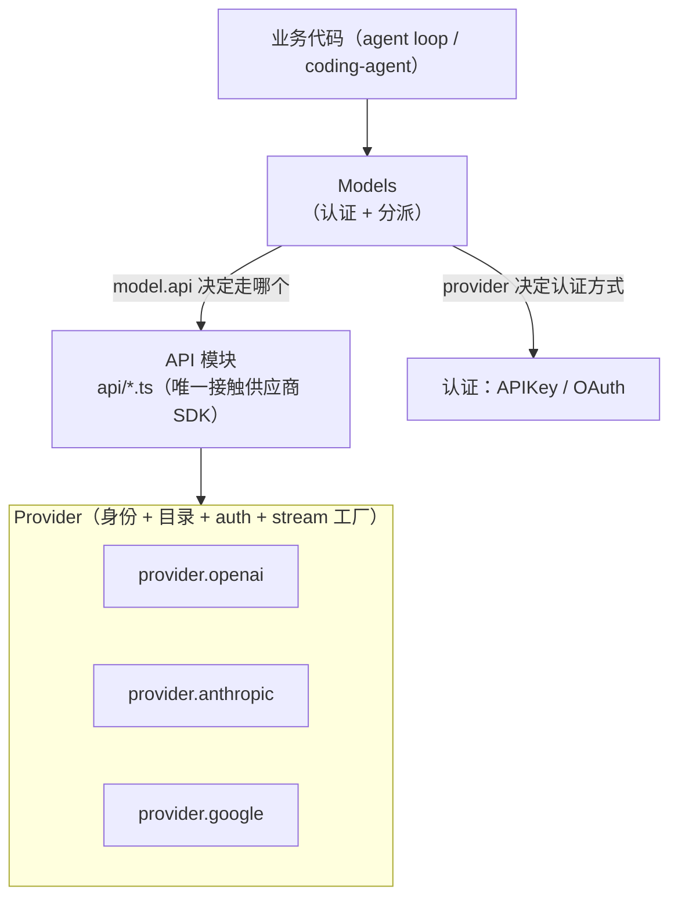
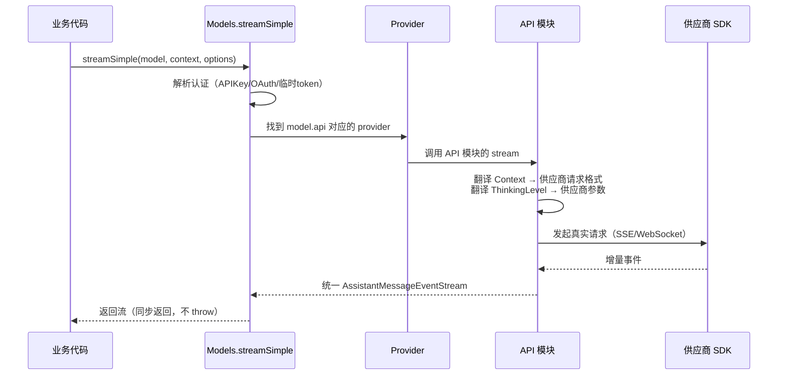

# 02 LLM 抽象层：统一多供应商 API

> 源码位置：`packages/ai/`（`src/types.ts`、`src/utils/event-stream.ts`、`src/api/*`、`src/providers/*`）
> 本篇回答一个核心问题：**如何让一个 agent 系统无缝对接 50+ 家 LLM 供应商，且切换模型不碰业务代码？**

---

## 1. 问题：多供应商接入为什么难

直接接供应商 SDK 的痛点：

1. **协议不同**：OpenAI 用 `chat/completions`，Anthropic 用 `messages`，Google 用 `generateContent`——消息结构、流式格式、工具调用格式全不一样。
2. **认证不同**：API Key、OAuth（设备码流/PKCE）、临时 token（GitHub Copilot 那种会过期的）。
3. **能力不同**：有的支持 reasoning，有的支持缓存，有的工具调用格式有差异。
4. **元数据分散**：每个模型的名字、上下文窗口、价格散落在各家文档里。

pi 的答案：**三层抽象 + 统一事件协议 + 单一 Model 元数据**。

---

## 2. 三层抽象：Models → Provider → API



| 层 | 职责 | 关键点 |
|----|------|--------|
| **`Model`** | 一个模型的所有元数据 | `{ id, api, provider, contextWindow, maxTokens, cost, thinkingLevelMap, compat }` |
| **`Provider`** | 一个供应商的身份/目录/认证/stream 工厂 | `createProvider()` 组装：auth + models 目录 + stream fn |
| **`API 模块`** | 一个 API 协议的具体实现（OpenAI-completions、anthropic-messages…） | 每个模块导出 `stream`/`streamSimple`，是唯一 import 供应商 SDK 的地方 |

**面试金句**：*"跨供应商差异被收敛到两层——`Model.compat` 开关描述能力差异，API 模块把差异翻译成供应商协议；业务代码永远只面对 `Model` 和 `Context`，不感知具体供应商。"*

---

## 3. StreamFn：全系统唯一的 LLM 调用入口

### 3.1 契约（`ai/src/types.ts`）

```ts
export type StreamFunction<TApi extends Api, TOptions extends StreamOptions> = (
  model: Model<TApi>,
  context: Context,          // { systemPrompt, messages, tools }
  options?: TOptions,
) => AssistantMessageEventStream;
```

**三条铁律**（注释里写明，面试直接引用）：

1. **同步返回流，绝不 throw**——请求/模型/运行时错误都必须编码进返回的流里。
2. 错误终止必须产生一条 `stopReason: "error" | "aborted"` 且带 `errorMessage` 的 AssistantMessage。
3. 事件协议统一：`start → text_delta/thinking_delta/toolcall_delta → done|error`。

**为什么"绝不 throw"？** 因为 agent loop 的每个分支都要处理"LLM 挂了"的情况。如果允许 throw，循环里到处是 try/catch，事件流会被打断，UI 收不到 agent_end。**把错误变成流的终止事件，消费者只有一种路径。**

> 💡 Go 映射：相当于 `func Stream(ctx context.Context, model Model, req Context) <-chan StreamEvent`——错误作为最后一个事件（`type ErrorEvent struct{ Err error }`）而不是返回 error。

### 3.2 EventStream：手写的双端等待队列

`ai/src/utils/event-stream.ts` 实现了一个异步可迭代的事件管道：

```ts
class EventStream<T, R> implements AsyncIterable<T> {
  private queue: T[] = [];                          // 无消费者时缓冲
  private waiting: Resolver[] = [];                 // 无事件时挂起消费者
  private isComplete: (event: T) => boolean;        // 终结条件
  private extractResult: (event: T) => R;           // 从终结事件提取最终结果

  push(event: T): void  // 有等待者→唤醒；否则入队；命中终结→结算 finalResult
  end(result?: R): void // 通知所有等待者 done
  result(): Promise<R>  // 单独拿最终结果
  async *[Symbol.asyncIterator]() { /* 队列优先，否则挂起 */ }
}
```

**设计要点（面试可讲）**：

- **push 与迭代器双向解耦**：生产者 push 不阻塞，消费者 for-await 不忙等。天然支持"一个请求方只等 `.result()`，UI 同时 for-await 增量事件"。
- **一次事件流两种消费**：`for await` 拿增量 + `.result()` 拿最终 AssistantMessage。
- **终结条件可配置**：`AssistantMessageEventStream` 把 `done`/`error` 当作终结。

---

## 4. Model 元数据：单一事实来源

```ts
interface Model<TApi> {
  id: string;               // 模型 id（如 "gpt-4o"）
  api: Api;                 // 走哪个 API 协议（"openai-completions" | "anthropic-messages"…）
  provider: string;         // 供应商 id（"openai" | "anthropic"…）
  name: string;
  baseUrl: string;
  contextWindow: number;    // 上下文窗口（token）
  maxTokens: number;        // 最大输出
  reasoning: boolean;       // 是否支持推理
  cost: { input, output, cacheRead, cacheWrite };  // 定价
  thinkingLevelMap?: ...;   // 语义推理等级 → 供应商参数
  compat?: ModelCompat;     // ★ 能力差异开关
}
```

**`ModelCompat` 是精髓**：同一个"推理"能力，不同供应商用不同参数名：

| 能力 | OpenAI | Anthropic | Google |
|------|--------|-----------|--------|
| 推理等级 | `reasoning_effort` | `thinking: {type:"adaptive"}` + effort | `thinking: {level}` |
| 推理预算 | `thinking_token_budget` | `thinkingBudgetTokens` | `budgetTokens` |

pi 用 `Model.compat.thinkingFormat`（一个 12 种取值的联合类型）做**策略分发**：`reasoning_effort` / `reasoning:{effort}` / `thinking:{type}` / `enable_thinking` / `chat_template_kwargs`… 统一成**语义层**（`ThinkingLevel`）后按 compat 翻译。

---

## 5. ThinkingLevel：语义推理等级 → 供应商参数

pi 定义 6 个**语言无关**的推理等级：

```
off → minimal → low → medium → high → xhigh → max
```

业务代码只跟 `ThinkingLevel` 打交道，供应商适配层负责翻译：

```ts
// 语义 → 各供应商参数
"high" → OpenAI: reasoning_effort="high"
       → Anthropic: thinking:{type:"adaptive", effort:"high"}
       → Google: thinking:{level:"high"}
```

**预算算法**（`api/simple-options.ts`）：推理 token 预算与答案共享 `max_tokens` 上限时，**永远为答案保留 1024 token**：

```
thinkingBudget = budgets[level]        // minimal:1024 low:2048 medium:8192 high:16384
maxTokens = min(baseMaxTokens + thinkingBudget, modelMaxTokens)
if (maxTokens <= thinkingBudget) thinkingBudget = max(0, maxTokens - 1024)
```

**为什么？** 经典 bug：思考预算吃满整轮输出，模型"想了很久但一句话没说"。留 1024 token 保底答案。这是面试能讲的**工程细节**。

---

## 6. 一个请求的完整旅程（streamSimple）



**临时 token 的处理**（`getApiKey` 回调）：Copilot 这类 OAuth 的 token 会过期，pi 允许**每次 LLM 调用前动态解析 key**（`config.getApiKey(provider)`），而不是启动时取一次。长任务跑了几分钟，token 可能已失效——动态解析避免了这个问题。

---

## 7. 模型目录：静态生成 + 动态刷新

- **静态**：`models.generated.ts` 由脚本从供应商官方目录生成（**不手动改生成文件**，改生成脚本再重新生成——AGENTS.md 里明确规则）。
- **动态**：运行时刷新 + ETag 持久化，模型涨价/新增不发布新版本也能生效。
- **模型解析**：`findInitialModel` 按作用域匹配（全局 → 项目 → 会话），支持别名。

**面试要点**：模型元数据是**数据不是代码**——生成 + 刷新 + 缓存，而不是手维护一个巨型常量表。

---

## 8. 各供应商落地形态（选读，展示"统一背后的差异"）

| 供应商 | 推理参数 | 备注 |
|--------|---------|------|
| Anthropic | `thinking:{type:"adaptive"}` + effort，或旧模型 `thinkingBudgetTokens` | `thinkingDisplay: "summarized"/"omitted"` 控制返回内容 |
| OpenAI 兼容 | `reasoning_effort` / `thinking_token_budget` / `enable_thinking` / `chat_template_kwargs` | `thinkingFormat` 12 种策略分发；vLLM 系强制留 `MIN_ANSWER_TOKENS=1024` |
| Google | `thinking:{level}`（Gemini 3 系）或 `budgetTokens`（2.5 系） | 按模型 id 子串匹配内置预算表 |
| 豆包/火山 | OpenAI 兼容格式 | 字节模型走统一格式，接入成本低 |

---

## 速记卡

| 概念 | 一句话记忆 |
|------|-----------|
| 三层抽象 | Models（认证+分派）→ Provider（身份+目录+auth）→ API 模块（唯一碰 SDK） |
| StreamFn 铁律 | 同步返回流、绝不 throw、错误编码为流终止事件 |
| EventStream | 手写双端等待队列：push 不阻塞、迭代不忙等、一次流两种消费 |
| Model.compat | 能力差异用开关描述，语义层翻译成供应商参数 |
| ThinkingLevel | 业务只认 6 级语义等级，适配层翻译成 effort/budget/level |
| 预算保底 | 推理预算与答案共享上限时，永远给答案留 1024 token |
| 模型目录 | 元数据是数据：脚本生成 + 动态刷新 + ETag 缓存 |
| 动态 key | 每次调用前解析 API key，应对 OAuth 临时 token 过期 |

**30 秒口述演练**：*"pi 的 LLM 层用三层抽象：Models 负责认证和分派，Provider 提供身份和模型目录，API 模块是唯一接触供应商 SDK 的地方。对外只暴露一个 StreamFunction 契约——同步返回流、绝不 throw、错误编码成流的终止事件，这样 agent loop 不需要到处 try/catch。模型能力差异（尤其是推理参数）收敛到 Model.compat 开关和语义化的 ThinkingLevel，业务代码永远只面对统一的 Model 和 Context。推理预算还会强制给答案留 1024 token 防止模型光想不说。"*
