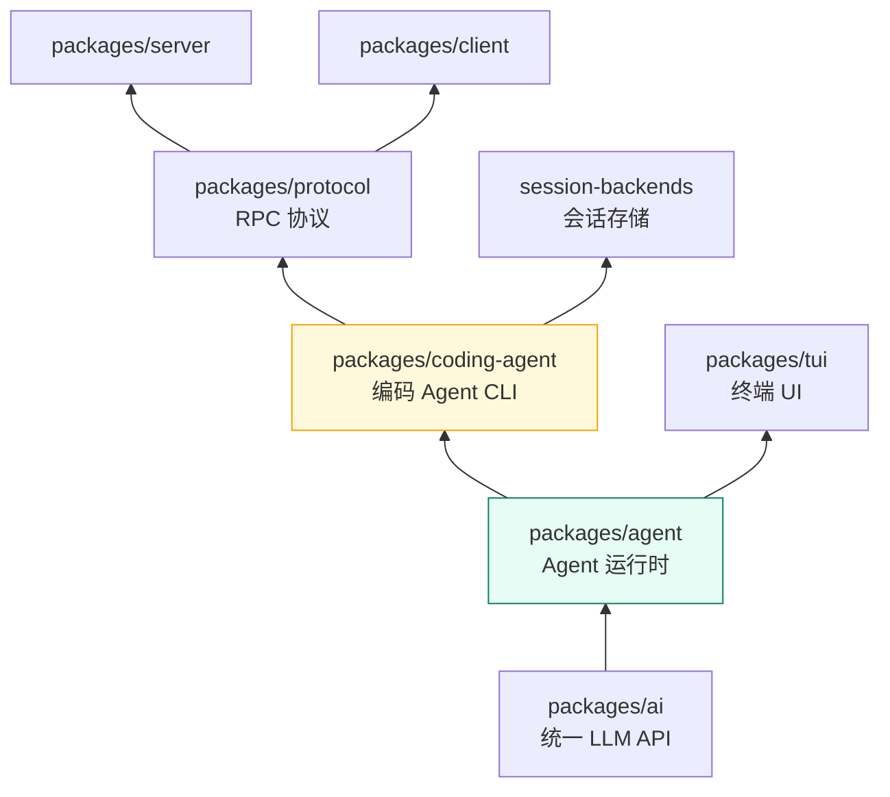

# pi — 开源 Agent Harness 深度拆解

> 目标：通过拆解真实开源项目 [earendil-works/pi](https://github.com/earendil-works/pi)（85k+ stars 的 AI Agent 工具链），理解 **Agent Harness 在生产中的真实落地形态**——不是玩具 demo，而是支撑一个日活数百万编码 agent 的完整工程体系。所有模式均可迁移到 Go 与字节跳动 AI 剪辑场景。

---

## 为什么选 pi 来拆解

| 维度 | pi 的优势 |
|------|----------|
| **规模验证** | 85.5k stars、10.6k forks、5755 commits，是当前最活跃的开源 Agent 工具链之一 |
| **组件完整** | 从 LLM 抽象、Agent 循环、工具系统、会话持久化到 TUI、RPC 协议全链路都有 |
| **架构清晰** | 5 个 monorepo 包严格分层，每层接口契约明确，是教科书级的"分层"样本 |
| **与目标岗位相关** | 剪映 AI 剪辑本质是"多工具编排的 agent 系统"，pi 的 Tool Calling、状态管理、扩展机制直接可迁移 |
| **可对照实现** | 自己用 Go 写 [agent-harness 项目](/phase3/agent-harness/) 时，pi 是绝佳的设计参照物 |

> 技术栈说明：pi 是 TypeScript/Bun 项目。拆解它**不是为了学 TS**，而是为了提炼**语言无关的 Agent 系统设计模式**——这些模式在 Go 里用接口、goroutine、channel 同样能落地（见《Go 落地与面试》篇）。

---

## 项目定位一句话

> **pi = 统一 LLM API + Agent 运行时 + 编码 Agent CLI + TUI + 远程会话协议**，目标是"一个可自扩展的最小终端编码 harness"。

官网描述（pi.dev / README）：

> "Pi is a minimal terminal coding harness. Adapt pi to your workflows, not the other way around, without having to fork and modify pi internals."

关键哲学：**通过扩展机制适配工作流，而不是 fork 改源码**。这决定了整个架构——可插拔是最高优先级。

---

## Monorepo 包结构与职责

```
pi/  (root: npm workspaces 的 monorepo)
├── packages/
│   ├── ai/              # 统一多供应商 LLM API（OpenAI/Anthropic/Google/豆包… 50+ 供应商）
│   │   ├── src/api/     #    每个供应商一个适配模块（唯一接触供应商 SDK 的地方）
│   │   ├── src/providers/ #  供应商元数据（models、认证、stream 工厂）
│   │   └── src/auth/    #    OAuth（设备码流/PKCE）、凭据存储
│   ├── agent/           # ★ Agent 运行时（本拆解核心）
│   │   ├── src/agent.ts #    Agent 类：状态机 + 事件 + 双队列
│   │   ├── src/agent-loop.ts # 低层循环：流式响应 + 工具执行编排
│   │   └── src/harness/ #    v2 架构：session 持久化 + reducer + compaction + 工具
│   ├── coding-agent/    # 编码 Agent CLI（落地产品层）
│   │   ├── src/core/    #    AgentSession：核心会话抽象（与 UI 无关）
│   │   ├── src/modes/   #    interactive(TUI) / print / rpc / json 四种运行模式
│   │   └── src/extensions/ # 扩展系统（~30 个钩子）
│   ├── protocol/        # 客户端↔服务器 RPC 协议（v1，CBOR 编码）
│   ├── server/          # 远程会话服务器（Unix socket）
│   ├── client/          # 远程会话客户端（RemoteSession）
│   ├── session-backends/# 会话持久化后端（SQLite，WAL + 事务 + fencing）
│   ├── telemetry/       # 供应商无关的遥测契约
│   └── tui/             # 终端 UI 库（差分渲染）
```

**包依赖方向（从下往上）**：



依赖规则：`ai` 不依赖任何上层；`agent` 只依赖 `ai`；`coding-agent` 依赖全部下层，是集成层。**每一层只关心自己的契约，通过接口通信。**

---

## 五层架构总览（面试速记框架）

```
┌─────────────────────────────────────────────────────────────┐
│ ⑤ 产品层   coding-agent：AgentSession + modes + extensions  │
├─────────────────────────────────────────────────────────────┤
│ ④ 会话层   session：JSONL 持久化 / SQLite / 分支树 / 恢复     │
├─────────────────────────────────────────────────────────────┤
│ ③ 运行时   agent：Agent 状态机 + Agent Loop + 工具编排        │
├─────────────────────────────────────────────────────────────┤
│ ② LLM 层   ai：StreamFn 抽象 + Model 元数据 + 50+ 供应商适配  │
├─────────────────────────────────────────────────────────────┤
│ ① 基座     tui / protocol / server / telemetry              │
└─────────────────────────────────────────────────────────────┘
```

面试时用这个框架回答"Agent 系统有哪些层次"：**产品层（怎么用）→ 会话层（怎么记）→ 运行时（怎么转）→ LLM 层（怎么连）→ 基座（怎么秀/怎么连远程）**。

---

## 核心设计哲学（贯穿全项目的 5 条原则）

1. **契约先行**：`StreamFn`、`AgentEvent`、`AgentTool`、协议 schema 全部是强类型契约，实现与消费方解耦。错误编码进结果/事件，**绝不 throw**（预期失败走返回值，非预期才抛异常）。
2. **接口快照化**：`Agent` 每次调用前对 context 做快照（`createContextSnapshot`），避免运行中状态被外部并发修改。
3. **事件驱动 UI**：Agent 只 emit 事件，TUI/RPC/日志各自订阅——**核心与展示彻底分离**。
4. **持久化即审计**：会话以追加式 JSONL 记录，任何状态可重放重建（event-sourcing 味道），崩溃可恢复。
5. **可扩展优先**：skills、prompt templates、extensions、themes、pi packages 五层扩展面，不 fork 也能改行为。

---

## 拆解目录导航

| 篇章 | 内容 | 面试价值 |
|------|------|---------|
| [01 核心机制：Agent Loop](/phase3/pi-harness/核心机制) | 双层循环、事件流、Tool Calling 全管线、状态双队列 | ★★★★★ 必考：agent 循环怎么设计 |
| [02 LLM 抽象层](/phase3/pi-harness/LLM抽象层) | StreamFn 契约、EventStream、多供应商统一、thinking 预算 | ★★★★ 常考：多模型切换怎么做 |
| [03 工程化落地](/phase3/pi-harness/工程化落地) | compaction 压缩、会话持久化、CBOR RPC、TUI 差分渲染、扩展系统 | ★★★★ 加分：工程深度 |
| [04 Go 落地与面试](/phase3/pi-harness/Go落地与面试) | Go/Eino 映射、面试话术、快速记忆卡 | ★★★★★ 直接用于面试 |

---

## 学习建议

1. **第一遍**：读本页 + 01 核心机制，理解 agent 循环与工具调用的骨架。
2. **第二遍**：读 02/03，理解"为什么这样设计"（每个机制先讲问题，再讲方案）。
3. **第三遍**：读 04，把 pi 的模式翻译成 Go 代码，对照自己的 agent-harness 项目。
4. **动手**：自己用 Go 实现一个最小 Agent Loop（read → 思考 → 工具 → 反馈），只有亲手写过，面试才讲得深。

> 每篇末尾都有 **「速记卡」**，用 30 秒可复习的方式总结该篇要点。
