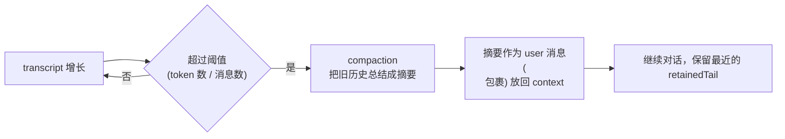
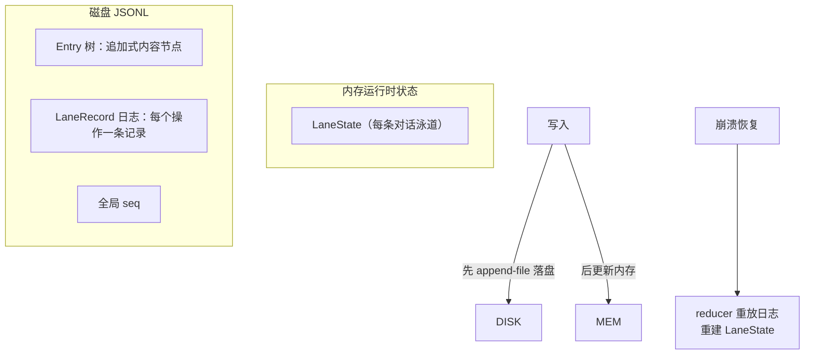
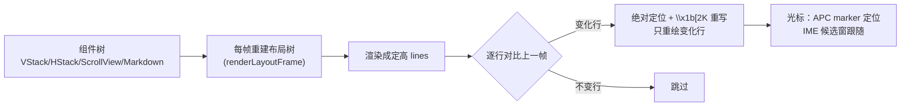

# 03 工程化落地：压缩、持久化、协议、UI、扩展

> 源码位置：`packages/agent/src/harness/`、`packages/protocol/`、`packages/server/`、`packages/client/`、`packages/tui/`、`packages/coding-agent/src/extensions/`
> 本篇回答：一个 agent 系统从 demo 到生产，还要解决哪些"脏活"？——上下文会爆、会话要存、进程要通信、界面要流畅、能力要扩展。

---

## 1. 上下文压缩（Compaction）：token 预算管理

### 1.1 问题

对话无限增长 → 超 context window → 要么报错要么质量崩塌。方案不是简单截断（丢信息），而是**摘要压缩**。

### 1.2 pi 的方案



**关键工程细节**（`harness/compaction/compaction.ts`）：

| 细节 | 做法 | 为什么 |
|------|------|--------|
| 触发阈值 | token 数或消息数超限（可配置） | 可调，不写死 |
| 切割方式 | 只压缩"切点之前"的历史，保留尾部 | 保留最近上下文，避免压缩掉正在处理的内容 |
| `isSplitTurn` | 超大单轮：轮头单独摘要 + 轮尾保留 | 一轮太大不能整轮压缩 |
| 增量摘要 | 多轮压缩可"接力"（`UPDATE_SUMMARIZATION_PROMPT`） | 每次都全量重摘要会贵且丢细节 |
| 摘要格式 | `<summary>` + `<read-files>/<modified-files>` 文件操作元数据 | 保留"文件指纹"，模型知道动过哪些文件 |
| 失败处理 | `CompactionError`（`aborted`/`summarization_failed`） | 压缩失败不炸会话，可重试 |

**分支摘要（branch-summarization）**：pi 支持会话**分支树**（类似 git branch），切换分支前把旧分支摘要，之后想回去时导航靠摘要而不是完整重放。

> 💡 面试映射：context 管理是 agent 系统最容易翻车的点。能说出"截断 vs 摘要 vs 滑动窗口"的取舍，再能说出 pi 的"增量摘要 + 保留文件指纹"细节，就是深度。

---

## 2. 会话持久化：event-sourcing 风格的状态树

### 2.1 设计（`harness/session/`）

pi 的会话存储是**追加式日志**（类似 event sourcing / git）：

```
会话 = Entry 树（内容） + LaneRecord 日志（操作）
      + 全局单调递增 seq + applyMutation 强校验
```



**三条铁律**：

1. **先落盘后更新内存**：任何写入先 append 到文件（原子 rename 发布），再改内存——崩溃时磁盘日志永远完整。
2. **reducer 纯函数重放**：从日志重建状态是纯函数（`reducer.ts`），`validateRecordLog` 先检查 12 种损坏模式（拒绝矛盾状态），再重建。
3. **torn-tail 修复**：日志尾部若被截断（torn tail），自动修复，保证可重放。

**为什么这么设计？** 
- **审计**：每个操作都有记录，谁改了什么一目了然（AI 剪辑场景：可追溯 agent 每一步操作）。
- **恢复**：崩溃/断电后从日志重建，不丢会话。
- **确定性**：写入是确定性的，日志可无限重放。

### 2.2 多 lane + 分支树

- **Lane（泳道）**：一条独立对话流（类似一个会话/一个任务）。
- **分支**：`parentId` 链接形成树，lane 是指向叶子的指针。
- **导航**：`navigateTree` 前生成分支摘要（见上节）。

### 2.3 生产级存储（session-backends）

- SQLite：**WAL + 事务串行化 + writer lease fencing（防脑裂）**。
- fencing：多个进程同时写时用 TTL + 栅栏序号防止旧 writer 覆盖新 writer——分布式一致性的经典手法。

---

## 3. RPC 协议：CBOR over Unix Socket

### 3.1 为什么需要协议层

编码 agent 可以**无头运行**（嵌入 IDE/脚本），也需要**多客户端共享一个会话**（编辑器 + 终端同时看）。pi 用"客户端 ↔ 服务器"模式：`pi server` 起一个本地会话服务，多个 `pi client` 连接。

### 3.2 协议设计（`protocol/src/schemas.ts`）

```
线格式：4 字节大端 uint32 长度前缀 + CBOR 载荷（v1，maxFrame 16MiB）
消息：hello（版本握手，首帧必发）→ request/response（id 关联）→ event（广播）
编码：严格 RFC 8949 CBOR 子集（拒绝 NaN/Infinity/循环引用/超深度）
校验：TypeBox StrictObject，additionalProperties:false（拒绝未知字段）
```

**9 种命令**：`list`、`create`、`attach`、`detach`、`prompt`、`steer`、`abort`、`set_model`、`set_thinking`。

### 3.3 核心设计原则：「快照权威，进度瞬态」

| 消息 | 性质 | 用途 |
|------|------|------|
| `SessionSnapshot` | **权威**状态（可入状态机） | `{id, cwd, phase, model, thinkingLevel, revision, transcript, …}` |
| `TranscriptProgress` | **瞬态** UI 提示（禁止归约为状态） | `item_started / assistant_delta / item_updated / item_finished` |
| `ServerSnapshot` | 服务器级快照 | `{serverId, protocolVersion, revision, sessions, models}` |

**面试金句**：*"快照是权威真相（客户端可据此重建 UI 状态机），进度是瞬态提示（只用于显示，禁止持久化）。快照带单调递增的 revision，客户端据此去重缓存——这是'状态同步'而非'事件重放'的设计。"*

**SessionPhase**：`idle / turn / compaction / branch_summary / retry`——与 AgentHarness 阶段对齐，**免二次词汇映射**（协议与运行时共用一套阶段词）。

### 3.4 传输选择

- **Unix socket**（本地 IPC）：文件权限天然认证、无 TCP 头开销、性能好。
- 服务端通过 **hardlink 原子发布** socket 文件 + `0o600` 权限。
- 错误码：`version/busy/session_locked/not_found/invalid_request/not_implemented/internal_error`。

> 💡 面试追问准备：为什么 CBOR 不是 JSON？（定长二进制、无解析歧义、schema 严格性）。为什么 unix socket 不是 HTTP？（本地 IPC、权限认证、无网络头）。为什么快照带 revision？（客户端去重、状态机单调推进）。

---

## 4. TUI：差分渲染

### 4.1 问题

终端 UI 不能像浏览器 DOM 那样局部更新——只能写字符串。全量重绘会闪烁 + 丢失滚动缓冲（scrollback）。

### 4.2 pi 的方案（`tui/src/tui-main-screen.ts`、`tui-alt-screen.ts`）



**关键点**：

| 机制 | 做法 | 效果 |
|------|------|------|
| 逐行差分 | `if (screen[row] === previousScreen[row]) continue;` | 只重绘变化行，极低带宽 |
| 首帧/尺寸变化 | 全量重绘 | 状态重置 |
| 布局重建 | 每帧重建 layout、不重建组件状态 | 布局简单可靠 |
| 光标/IME | 输出埋零宽 `CURSOR_MARKER`（APC），扫描定位 | 硬件光标 + 输入法候选窗跟随 |
| 图片 | Kitty 协议，追踪已上传图片 id，覆盖区间删除旧图 | 终端内看图 |
| 调试 | `PI_DEBUG_REDRAW=1` 记录全量重绘原因 | 排查性能 |

> 💡 面试映射：差分渲染 = 虚拟 DOM 的终端版。能讲"只重绘变化行 + 布局树与组件状态分离"就是深入。

---

## 5. 扩展系统：不 fork 也能改行为

### 5.1 五层扩展面

| 扩展面 | 是什么 | 用法 |
|--------|--------|------|
| **Extensions** | TS 插件，约 30 个钩子覆盖全链路 | 拦截 provider 请求头、工具执行、输入事件… |
| **Skills** | `SKILL.md` 文件，注入系统提示词（agentskills.io 规范） | 教模型"什么时候用什么技能" |
| **Prompt Templates** | 可参数化的提示词模板 | `/命令` 路由、自动补全 |
| **Themes** | TUI 主题 | 视觉定制 |
| **Pi Packages** | 上述四者的打包分发（npm/git） | 分享给他人 |

### 5.2 扩展即事件总线

Extensions 的钩子覆盖（示例）：

```
provider_request（改请求头/模型）
provider_response（改响应）
tool_call（beforeToolCall：拦截/确认/改写）
tool_result（afterToolCall）
input（用户输入预处理：/命令展开、skill 触发）
session_*（生命周期）
```

**架构本质**：扩展系统 = **事件总线 + 钩子中间件**。核心循环保持纯净，所有可定制点都暴露为钩子，第三方插件通过钩子注入行为。这与字节 Eino 的组件化思想（`Graph`/`Chain`/中间件）同构。

### 5.3 运行模式（产品层）

pi 四种模式，**共享同一个 AgentSession 核心**：

| 模式 | 输入/输出 | 场景 |
|------|----------|------|
| interactive | 全屏 TUI | 人机交互 |
| print / json | 单次输出 | 脚本/CI |
| rpc | stdin/stdout JSONL 命令 | 进程内嵌入 |
| SDK | 编程 API（`createAgentSession()`） | 自建应用 |

**分层铁律**：core（业务）与 modes（I/O）严格分离——同一 `AgentSession` 被四种模式复用。"核心无关 UI"是这类工具的标准答案。

---

## 速记卡

| 主题 | 一句话记忆 |
|------|-----------|
| 压缩 | 阈值触发 → 旧历史摘要成 `<summary>` 放回 → 保留尾部；增量摘要 + 文件指纹 |
| 持久化 | 追加式日志 + reducer 纯函数重放 + 先落盘后更新内存 + torn-tail 修复 |
| 分支 | 会话 = 泳道树，切换前生成分支摘要 |
| 协议 | 4 字节长度前缀 + CBOR，hello 握手 + request/response + event 广播 |
| 快照 vs 进度 | 快照权威（带 revision 去重），进度瞬态（禁止持久化） |
| TUI | 逐行 diff → 只重绘变化行；布局树与组件状态分离 |
| 扩展 | 5 层扩展面 + ~30 钩子事件总线，核心保持纯净 |
| 模式 | interactive/print/rpc/SDK 共享同一 core |

**30 秒口述演练**：*"生产级 agent 还要解决四件事：第一，上下文压缩——超阈值把旧历史摘要成 summary 放回，保留最近 tail，失败可重试；第二，会话持久化——追加式日志 + 纯函数 reducer 重放，崩溃可从日志重建，先落盘后更新内存；第三，进程通信——CBOR over Unix socket 的 RPC 协议，快照是权威状态带 revision 去重，进度是瞬态提示；第四，扩展性——约 30 个钩子覆盖 provider 请求到工具执行全链路，五种扩展面让用户不改源码就能定制。"*
