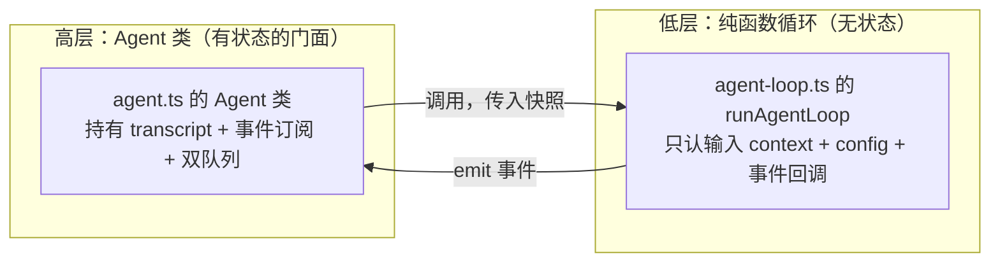
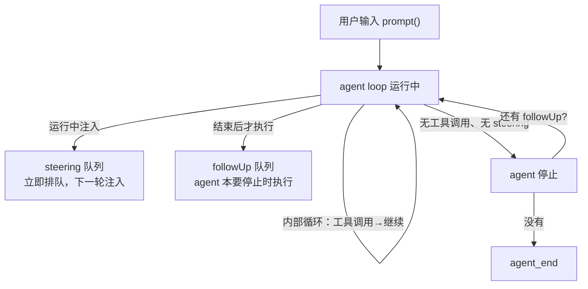
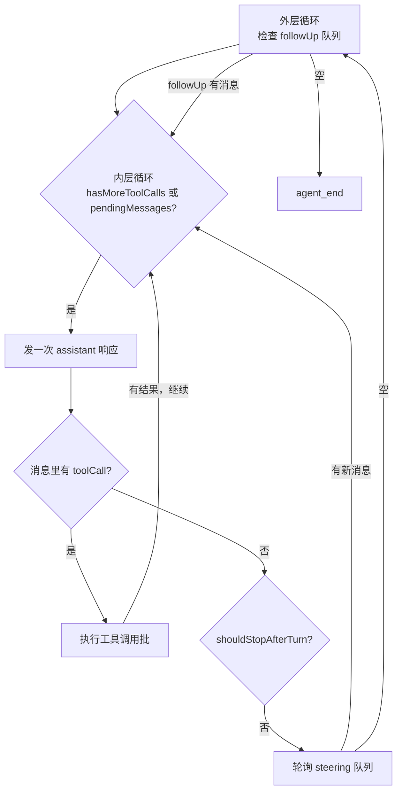
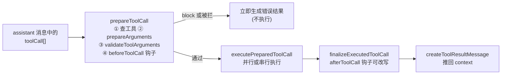
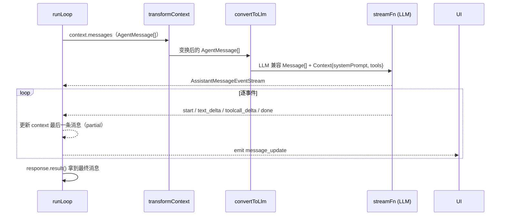

# 01 核心机制：Agent Loop 与 Tool Calling

> 源码位置：`packages/agent/src/agent.ts`、`agent-loop.ts`、`types.ts`
> 本篇是 pi 的**心脏**，面试必考。先讲问题，再讲 pi 的方案，最后给速记卡。

---

## 1. 两个抽象层级（先分清，否则后面全乱）

pi 把 agent 运行时拆成**两个层级**，这是全篇最重要的认知：



| 层 | 文件 | 有状态？ | 职责 |
|----|------|---------|------|
| 高层 `Agent` | `agent.ts` | ✅ 有状态 | 拥有当前 transcript（messages）、工具列表、事件订阅者、steering/followUp 双队列 |
| 低层 `runAgentLoop` | `agent-loop.ts` | ❌ 纯函数 | 每次执行传入 `context` 快照 + `config`，通过 `emit` 回调把事件推给高层 |

**为什么这样拆？** 低层循环可以独立测试、独立复用（headless 场景不需要 UI 状态）；高层只做"状态归集 + 事件分发"，把"循环怎么转"和"状态怎么存"解耦。这也是 pi 能从 `Agent` 类平滑演进到 `AgentHarness`（v2 架构）的原因。

---

## 2. Agent 类：状态机 + 事件 + 双队列

### 2.1 状态结构（`types.ts` 的 `AgentState`）

```ts
interface AgentState {
  systemPrompt: string;          // 系统提示词
  model: Model<any>;             // 当前模型
  thinkingLevel: ThinkingLevel;  // 推理强度（off/minimal/low/medium/high/xhigh/max）
  tools: AgentTool<any>[];       // 可用工具（赋值时拷贝数组）
  messages: AgentMessage[];      // 完整对话记录（赋值时拷贝数组）
  readonly isStreaming: boolean; // 是否正在处理
  readonly streamingMessage?: AgentMessage; // 流式中的部分消息
  readonly pendingToolCalls: ReadonlySet<string>; // 正在执行的工具调用 id
  readonly errorMessage?: string; // 最近一次失败
}
```

**面试要点**：`tools`/`messages` 的 setter 都会 `.slice()` 拷贝——**避免外部拿到引用后并发修改内部状态**。这是"状态所有权"思想：Agent 是 transcript 的唯一写者。

### 2.2 事件流（`AgentEvent` 联合类型）

```
agent_start → turn_start → (message_start → message_update* → message_end)*
            → tool_execution_start → tool_execution_update* → tool_execution_end
            → turn_end → [prepareNextTurn / shouldStopAfterTurn] → …
            → agent_end
```

| 事件 | 含义 |
|------|------|
| `agent_start` / `agent_end` | 一次完整运行开始/结束（agent_end 携带本次新增的全部 messages） |
| `turn_start` / `turn_end` | 一个 turn = 一次 assistant 响应 + 它触发的所有工具调用 |
| `message_start/update/end` | 单条消息生命周期（update 只对 assistant 流式时发，携带流式增量事件） |
| `tool_execution_start/update/end` | 工具执行生命周期（update 用于进度条、部分输出等） |

**为什么事件如此细致？** 因为消费方多样：TUI 要逐 token 渲染、RPC 要转发给远程客户端、日志要完整审计、测试要断言顺序。**事件是 Agent 对外的唯一契约，UI 只是订阅者之一。**

### 2.3 双队列：steering 与 followUp（pi 的精妙设计）



- **`steer(message)`**：运行**中**排队，agent 会在下一轮注入（用户边看边补充指令）。
- **`followUp(message)`**：agent 快要停止时才注入（"跑完这些，再帮我做 X"）。
- 队列模式 `QueueMode`：`all`（一次全部注入）/ `one-at-a-time`（一次只注入最早一条）。

**设计意图**：用户与 agent 是**异步**的——用户打字需要时间，agent 不能干等。双队列让"人类在环（human-in-the-loop）"成为一等公民，而不是事后补救。

---

## 3. 低层循环 runLoop：双层 while 结构

`agent-loop.ts` 的核心是 `runLoop`，**两层循环**：



- **内层循环**：同一轮 assistant 响应引发的多次工具调用往返（reason → act → observe → reason）。
- **外层循环**：agent 本要停了，但 followUp 队列有新消息 → 重新进内层。

对应代码骨架（`agent-loop.ts:155-275`）：

```ts
while (true) {                          // 外层：followUp 驱动
  let hasMoreToolCalls = true;
  while (hasMoreToolCalls || pendingMessages.length > 0) {  // 内层
    // 1. 先注入 pendingMessages（steering）
    // 2. streamAssistantResponse() —— 一次 LLM 调用
    // 3. 提取 message.content 里的 toolCall
    // 4. 执行工具调用批 → 得到 toolResults，推回 context
    // 5. emit turn_end → prepareNextTurn → shouldStopAfterTurn?
    // 6. 轮询 steering 队列 → 作为新 pendingMessages
  }
  // 内层退出 → 轮询 followUp 队列
  const followUpMessages = await config.getFollowUpMessages?.() || [];
  if (followUpMessages.length > 0) { pendingMessages = followUpMessages; continue; }
  break;                                // 彻底停止
}
```

**一个 turn 的完整周期（面试要能默写）**：

```
① LLM 响应（可能带 toolCall）
② 校验工具参数（TypeBox schema）
③ beforeToolCall 钩子（可拦截 block）
④ 执行工具（并行/串行）
⑤ afterToolCall 钩子（可改写结果）
⑥ 结果作为 toolResult 消息推回 context
⑦ 回到 ① —— 直到模型不再要工具
```

---

## 4. Tool Calling 全管线（重点中的重点）

### 4.1 工具定义（`types.ts` 的 `AgentTool`）

```ts
interface AgentTool<TParameters extends TSchema, TDetails> extends Tool<TParameters> {
  label: string;                                        // UI 显示名
  prepareArguments?: (args) => Static<TParameters>;     // 兼容层：原始参数→schema 参数
  execute: (toolCallId, params, signal?, onUpdate?)     // 执行；抛异常=失败
              => Promise<AgentToolResult<TDetails>>;
  executionMode?: "sequential" | "parallel";            // 单工具执行模式覆盖
}
```

**要点**：
- `TParameters` 是 **TypeBox JSON Schema**——模型看到的工具描述就是它，校验也用同一份（单一事实来源）。
- `execute` 返回 `AgentToolResult`：`{ content, details, usage?, terminate?, addedToolNames? }`。`content` 是给模型看的文本/图片；`details` 是给 UI/日志的结构化数据。
- `onUpdate` 回调让工具**流式汇报进度**（如 bash 输出、下载进度），不阻塞主循环。

### 4.2 执行管线（`agent-loop.ts`）



**关键决策点**：

| 决策 | pi 的做法 | 原因 |
|------|----------|------|
| 并行还是串行 | 默认并行（`toolExecution: "parallel"`），有 `sequential` 工具则整批串行 | 并行提速；文件写类工具必须串行防竞态 |
| 参数校验失败 | 生成错误 toolResult 返回给模型，模型自行修正 | 不中断循环，模型有自愈机会 |
| 工具不存在 | 错误 toolResult："Tool xxx not found" | 同上 |
| 输出被 token 截断（stopReason=length） | **整批工具调用全部作废**，让模型重发 | 截断的参数是残缺 JSON，执行了会出错 |
| 工具抛异常 | 捕获 → 错误 toolResult | 错误编码进结果，不炸循环 |
| 提前终止 | 所有工具结果 `terminate: true` 才终止整批 | 防止个别工具擅自结束任务 |

**beforeToolCall / afterToolCall 钩子**（这是 pi 扩展能力的核心，coding-agent 用它实现权限确认、扩展拦截）：

- `beforeToolCall({assistantMessage, toolCall, args, context}, signal)` → 返回 `{block: true, reason}` 可阻止执行（权限系统、危险命令确认）。
- `afterToolCall({..., result, isError}, signal)` → 返回部分覆盖字段（content/isError/usage/terminate），**字段级覆盖，不做深合并**。

> 💡 面试映射：这两个钩子就是字节 Eino 的 `PreToolCall`/`PostToolCall`（中间件思想），也是 OpenAI Swarm 的 `before_tool`/`after_tool`。**钩子 = 中间件 = 组合子**，是 agent 系统扩展性的通用答案。

### 4.3 事件顺序保证（并行模式的细节）

并行执行时：`tool_execution_end` 按**完成顺序**发；toolResult 消息按 **assistant 里的原始顺序**推回 context。为什么？——LLM 依赖 toolResult 与 toolCallId 对应，顺序不能乱；而 UI 进度按完成顺序更自然。**两种顺序，两种目的，分开处理。**

---

## 5. 流式响应的处理（streamAssistantResponse）



**三个转换层（面试高频）**：

| 层 | 转换 | 作用 |
|----|------|------|
| `transformContext` | `AgentMessage[] → AgentMessage[]` | 上下文窗口管理（裁剪旧消息）、注入外部上下文 |
| `convertToLlm` | `AgentMessage[] → Message[]` | 过滤 UI 专用消息（如通知），映射为 LLM 能懂的角色 |
| `streamFn` | `Message[] → 流式事件` | 真正调供应商 API |

**细节**：流式期间，`context.messages` 的最后一条被**原地替换**为 partial 消息（`start` 时 push，`text_delta` 时替换），这样即使中途 abort，context 里也永远有一条合理的 assistant 消息。`done`/`error` 事件时用 `response.result()` 取最终消息替换。

---

## 6. 生命周期与并发控制（Agent 类）

- **`prompt()`**：新对话起点；运行中调用会抛错（要求用 steer/followUp）。
- **`continue()`**：从当前 transcript 继续；最后一条必须是 user/toolResult（assistant 结尾无法继续，需先 steer）。
- **`abort()`**：通过 `AbortController` 传播 signal，LLM 请求与工具执行都能感知。
- **`waitForIdle()`**：等当前 run + 所有 `agent_end` 监听器结束。
- **`subscribe(listener)`**：监听器按订阅顺序 await，且**收到当前 run 的 abort signal**（监听器可感知取消）。
- **`reset()`**：清空 transcript、队列、运行时状态。

**面试要点**：Agent 类用 `activeRun` 字段实现"一次只跑一个 run"的互斥；`runWithLifecycle` 统一处理成功/失败/清理。失败时合成一条带 `errorMessage` 的 assistant 消息并正常走完事件序列——**UI 永远能收到 agent_end，不会悬死**。

---

## 速记卡

| 概念 | 一句话记忆 |
|------|-----------|
| 双层抽象 | 高层 `Agent`（有状态门面）调低层 `runLoop`（纯函数循环） |
| 事件驱动 | Agent 只 emit 事件，TUI/RPC/日志都是订阅者 |
| 一个 turn | 一次 LLM 响应 + 它触发的所有工具调用往返 |
| 双层循环 | 内层=工具往返，外层=followUp 续命 |
| 双队列 | `steer`=运行中注入，`followUp`=停止前续命 |
| 工具管线 | prepare（校验+拦截）→ execute（并行/串行）→ finalize（改写）→ 推回 context |
| 错误哲学 | 预期失败编码为错误 toolResult 返回给模型，**绝不 throw** |
| 截断保护 | stopReason=length 时整批工具调用作废重发 |
| 钩子即中间件 | beforeToolCall/afterToolCall = 权限/扩展的插槽 |

**30 秒口述演练**：*"pi 把 agent 运行时拆成有状态的 Agent 类和无状态的 runLoop。runLoop 是双层 while：内层循环在模型要工具时反复执行'响应→校验→执行→结果推回'，外层循环在 followUp 队列有新消息时让 agent 续命。工具调用走 prepare→execute→finalize 管线，参数用 JSON Schema 校验，预期失败编码成错误结果返回给模型自愈，而不是抛异常。Agent 通过细粒度事件与 UI 解耦，通过 steering/followUp 双队列支持人类在环。"*
