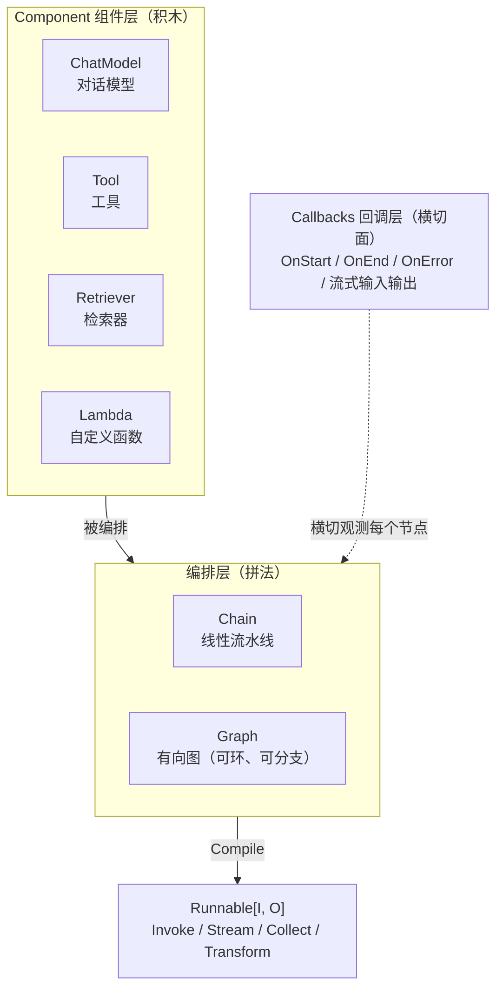

# Eino 全景图 — Go 语言的 LLM 应用编排框架

> 这篇讲什么：Eino 是什么、为什么 Go 生态需要它、核心概念有哪几个、15 行代码长什么样。
> 读完你能回答：**Eino 解决什么问题？Component / Chain / Graph / Callbacks 各管什么？和手写 goroutine + channel 编排相比，价值在哪？**

---

## 一句话定位

> **Eino = 用 Go 的类型系统把「LLM 应用编排」做成编译期安全的框架**：组件（Component）是积木，链与图（Chain / Graph）是拼法，回调（Callbacks）是横切观测面。CloudWeGo（字节跳动开源）出品。

基本信息（核实于 v0.9.18 / GitHub）：

| 维度 | 事实 |
|------|------|
| 出品 | CloudWeGo（与 Kitex、Hertz 同宗的字节开源生态） |
| 语言 | **Go**（大量运用泛型） |
| 规模 | GitHub 约 1.3 万 stars，最新稳定版 v0.9.18 |
| 定位 | "The ultimate LLM/AI application development framework in Go" |
| 扩展 | [eino-ext](https://github.com/cloudwego/eino-ext)：各家模型/工具组件、tracing 回调，独立 module 按需引入 |

---

## 没有它会怎样：手写 Go 编排 LLM 应用的三个坑

假设不用任何框架，自己用 Go 写一个「RAG + 多工具 Agent」服务，你会撞上：

1. **接口不统一**：OpenAI、Claude、豆包 Ark 各家 SDK 的请求/响应类型都不一样，换个模型要改一片代码；工具的调用方式也千奇百怪
2. **流式地狱**：LLM 输出是流（`StreamReader`），但你的检索节点是一次性返回的——流和非流混排时，每个接缝都要手写「收集完整结果」或「包装成流」的适配代码
3. **观测靠打补丁**：想加日志、trace、token 统计？只能往每个业务函数里塞埋点代码，业务逻辑和横切逻辑缠成一团

**方案**：Eino 用三层抽象一次性解决——**Component** 统一积木接口，**Chain/Graph** 统一编排与流式转换，**Callbacks** 统一横切注入。

**一句话记住**：*Eino 的价值 = 接口统一 + 流式自动拼 + 观测不侵入。*

---

## 核心概念一张图



四个概念，各管一件事：

| 概念 | 管什么 | 一句话记住 |
|------|--------|-----------|
| **Component** | 统一各类积木的接口：ChatModel、Tool、Retriever、Embedding、Lambda… | 所有积木长一个样，换供应商不改编排 |
| **Chain** | 线性编排：节点依次串联，`Append*` 链式调用 | 最简单的拼法：一条道走到黑 |
| **Graph** | 图编排：节点 + 边 + 分支，**允许环**，编译期类型检查 | Agent 的循环靠它表达 |
| **Callbacks** | 五个注入时机的横切回调，日志/trace/统计不碰业务代码 | 业务无感的观测面 |

> 与 [LangGraph 全景图](/主流agent拆解/langgraph/) 对照着看：两者都是「组件 + 图编排」，但 Eino 把**类型安全**做到了编译期（泛型 `[I, O]`），LangGraph 靠运行时 reducer 合并——这是两种语言哲学的分野，[核心机制](/主流agent拆解/eino/核心机制) 篇细讲。

---

## 15 行最小示例：一条会思考的链

一个「检索 → 拼提示词 → 调模型」的最小 Chain（API 经 v0.9.18 源码核实）：

```go
chain := compose.NewChain[map[string]any, *schema.Message]()

chain.AppendRetriever(retriever)                          // ① 检索相关文档
chain.AppendChatTemplate(template)                        // ② 把文档+问题拼成 prompt
chain.AppendChatModel(chatModel)                          // ③ 调 LLM 生成回答

runnable, err := chain.Compile(ctx)                       // 编译期校验类型衔接
if err != nil { return err }

answer, err := runnable.Invoke(ctx, map[string]any{       // 运行
    "query": "Eino 的流式转换怎么工作？",
})
```

注意三个设计直觉：

1. **泛型贯穿始终**——`NewChain[输入类型, 输出类型]`，相邻节点类型不匹配时 `Compile` 直接报错，错误暴露在运行之前
2. **先建图、再编译、后运行**——与 LangGraph 的 `compile()` 同一个三段式，但 Eino 的编译做的是**类型衔接校验**
3. **编译产物是 `Runnable[I, O]`**——统一暴露 Invoke / Stream / Collect / Transform 四种调用范式，[核心机制篇](/主流agent拆解/eino/核心机制)讲透它为什么需要四种

---

## 篇目导航

| 篇章 | 内容 | 面试价值 |
|------|------|---------|
| ① 全景图（本篇） | 定位、四个核心概念、最小 Chain 示例 | ★★★ 基础盘：讲清 Eino 是什么 |
| [② 核心机制](/主流agent拆解/eino/核心机制) | Component 类型安全、Graph 编排与 State、流式自动转换、Callbacks、ReAct 组装 | ★★★★★ Go 方向必考 |
| [③ 对照与面试](/主流agent拆解/eino/对照与面试) | vs pi vs LangGraph、字节技术栈关联、面试速答 | ★★★★★ 直接用于面试 |

---

## 速记卡

- **定位**：CloudWeGo 出品的 Go 语言 LLM 编排框架，字节开源生态（Kitex/Hertz 同宗）
- **解决的三个坑**：接口不统一 / 流式地狱 / 观测靠打补丁
- **四概念**：Component（积木）、Chain（线性拼）、Graph（可环的图）、Callbacks（横切面）
- **三段式**：`NewChain/NewGraph` → `Compile`（类型校验）→ `Runnable` 四范式调用
- **类型安全**：泛型 `[I, O]` 贯穿，衔接错误暴露在编译期而非运行期
