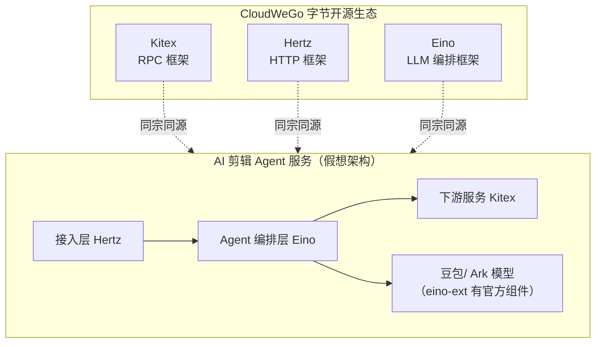

# Eino ③ 对照与面试 — 字节技术栈的直接对口

> 这篇讲什么：Eino 与 pi、LangGraph 的三方对照；Eino 在 CloudWeGo/字节技术栈中的位置；面试高频问题与速答。
> 读完你能回答：**三个框架怎么选？Eino 和目标岗位（剪映 AI 剪辑 Agent，Go 方向）有什么关系？被问「了解 Eino 吗」怎么答出深度？**

---

## 三框架对照表

| 维度 | **Eino** | **LangGraph** | **pi** |
|------|----------|---------------|--------|
| 语言生态 | **Go**（CloudWeGo） | Python（另有 JS 版） | TypeScript/Bun |
| 定位 | LLM 应用**编排框架** | Agent 编排**运行时库** | 完整**产品**（终端编码 Agent） |
| 编排范式 | Chain / Graph，**编译期类型检查**（泛型 [I, O]） | StateGraph，运行时路由 | Agent Loop 状态机 + 事件流 |
| 执行引擎 | Pregel 风格 super-step | Pregel（BSP super-step） | 双队列事件循环 |
| 状态管理 | 锁保护共享 State，**命令式读写，无 reducer** | Reducer **声明式字段合并** | 接口快照化 + 会话快照 |
| 类型安全 | ★★★（编译期校验编排接缝） | ★（运行时容错） | ★★（TS 类型 + 契约） |
| 流式 | **自动转换**（四范式 + 合包/流化） | stream 多模式 | EventStream 统一抽象 |
| 持久化 | 框架不管，业务自行落地 | Checkpointer 一拍一档 | JSONL 追加 + 重放 |
| 人机协作 | 业务层组合（可用 State+分支实现审批节点） | interrupt + resume 一等公民 | 权限确认钩子（扩展系统） |
| 观测 | **Callbacks 五时机横切** + 官方 tracing 生态 | LangSmith 生态 | 遥测契约包 |
| 适用场景 | **Go 生产服务**（高并发、强类型、字节栈） | Python 快速搭建复杂 Agent | 参照对象：完整 Harness 形态 |

**一句话记住三者关系**：*Eino 回答「用 Go 怎么落地」，LangGraph 回答「图编排怎么设计」，pi 回答「完整产品长什么样」。*

### Eino vs LangGraph：同与不同（面试高频追问）

| | 相同 | 不同 |
|---|------|------|
| 编排模型 | 都是「节点 + 边 + 分支 + 可环的图」，引擎都是 Pregel super-step | — |
| 状态哲学 | 都有跨节点共享 State | LangGraph 声明式 reducer 合并；Eino 互斥锁保护命令式读写 |
| 错误暴露 | — | Eino 类型错误在 Compile 期；LangGraph 在运行期 |
| 流式 | 都支持端到端流式 | Eino 框架**自动**拼接流/非流接缝；LangGraph 靠 stream 模式选择 |
| 成熟度取舍 | — | LangGraph 持久化/人机协作开箱即用；Eino 留给业务（Go 服务通常已有存储基建） |

---

## Eino 与字节技术栈的关联

对「剪映 CapCut · Agent 开发实习生（Go 方向）」这个目标岗位，Eino 不是「一个可选框架」，而是**技术栈版图的正中心**：

- **生态协同**：Eino 与 Kitex/Hertz 同属 CloudWeGo，字节内部 Go 微服务体系的标准件——面试提这层关联，说明你理解字节的 Go 技术选型逻辑
- **模型对接**：eino-ext 有火山引擎 Ark（豆包）官方 ChatModel 组件，与字节自研模型体系无缝
- **场景对口**：AI 剪辑 Agent（AutoCut）= 多工具编排 + 流式生成 + 高并发 Go 服务——正是 Eino 三个核心机制的用武之地
- **自研印证**：你的 [agent-harness 项目](/phase3/agent-harness/) 是手写版 Agent 运行时，Eino 是工业版——「我手写过一个简化版，再对照 Eino 理解了工业级设计的取舍」是极有说服力的叙事

---

## 面试速答

**Q1：Eino 是什么？解决了什么问题？**
CloudWeGo 出品的 Go 语言 LLM 应用编排框架。解决三个痛点：各模型/工具 SDK 接口不统一（Component 抽象）；流式与非流式节点混排的适配地狱（四范式 + 自动合包/流化）；观测埋点污染业务（Callbacks 五时机横切）。核心特色是用 Go 泛型把编排类型安全做到编译期。

**Q2：Eino 的 Graph 和 LangGraph 的图有什么区别？**
编排模型同源：节点 + 边 + 分支 + 可环，引擎都是 Pregel super-step。差异在哲学：类型安全上 Eino 编译期校验、LangGraph 运行时容错；状态上 Eino 是锁保护的命令式读写（无 reducer），LangGraph 是声明式 reducer 字段合并；开箱能力上 LangGraph 自带 Checkpointer 和 interrupt，Eino 把持久化留给业务。选型看语言栈：Go 服务选 Eino，Python 原型选 LangGraph。

**Q3：Eino 的流式自动转换怎么工作的？**
组件按输入/输出是否为流分四范式：Invoke、Stream、Collect、Transform，编译产物 Runnable 统一暴露四方法。上下游范式不匹配时框架自动做两个转换：合包（Concat，收齐 chunk 合成完整对象，自定义类型需注册 concat 函数）和流化（Streaming，完整对象装箱成单帧「假流」）。效果：写节点只关心最自然的范式，端到端流式由框架拼出来。

**Q4：Callbacks 机制用过吗？有什么坑？**
五个注入时机：OnStart/OnEnd/OnError + 流式输入输出两个。可全局注入（AppendGlobalHandlers）或请求级注入（WithCallbacks）。两个坑：流式回调收到的是帧复制副本，**必须 Close 否则管道泄漏**；回调里**禁止修改** input/output，不是深拷贝，并发图中会数据竞争。官方生态有 Langfuse/LangSmith handler 可直接接 tracing。

**Q5：用 Eino 怎么实现一个 ReAct Agent？**
官方 flow/agent/react 就是样板：ChatModel 节点 + ToolsNode + 一个分支（有 tool call 走 tools，否则走 END）+ tools 指回 model 的回边。`react.NewAgent` 配置 ToolCallingModel、ToolsConfig、MaxStep（默认 12）。我自己手写 [agent-harness](/phase3/agent-harness/) 时实现过同样的循环，对照后理解了工业版多做的事：流式 tool call 检测（StreamToolCallChecker）、消息改写钩子（MessageModifier/Rewriter）、幻觉工具处理（UnknownToolsHandler）。

**Q6：Eino 的 State 和 LangGraph 的 State 有什么不同？**
Eino 用 `WithGenLocalState` 注册每次运行的共享 state，节点通过 pre/post handler 或 `ProcessState` 读写，框架用互斥锁保证并发安全——命令式、无 reducer，合并逻辑自己写。LangGraph 是声明式的：字段标注 reducer，框架自动做确定性合并。前者贴近 Go 直觉、灵活；后者声明即所得、并行写语义清晰。（注：Eino 当前版本没有 NewStateGraph，那是历史文档残留。）

**Q7：Eino 有什么局限？**
v0.x 阶段 API 仍在演进（如 v0.9 引入 agentic 原语、v0.10 alpha 重构中）；持久化、人机协作没有开箱方案，要业务自建；生态厚度相比 Python 系（LangChain/LangGraph）还年轻。但在 Go 生态内，它是目前最完整、背后有字节生产验证的选择。

---

## 速记卡

- **三方定位**：Eino=Go 落地答案，LangGraph=图编排设计样本，pi=完整产品参照
- **对口叙事**：CloudWeGo 生态（Kitex/Hertz/Eino）+ 豆包 Ark 组件 + 自研 agent-harness 手写版对照
- **必答四题**：与 LangGraph 区别 / 流式自动转换 / Callbacks 两个坑 / ReAct 图构成
- **杀手锏一句**：「我手写过一个简化版 Agent 运行时，再对照 Eino 源码理解了工业级设计的取舍」

## 延伸阅读

- [LangGraph 拆解 · 对照与面试](/主流agent拆解/langgraph/对照与面试)：同一张对照表的 Python 视角 + Go 思维翻译
- [pi 拆解 · Go 落地与面试](/主流agent拆解/pi/Go落地与面试)：pi 模式到 Go/Eino 的完整映射表
- [模块首页 · 三框架对照总表](/主流agent拆解/)
