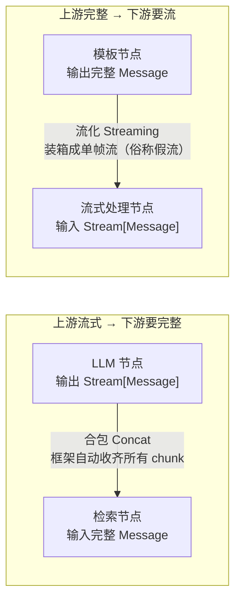
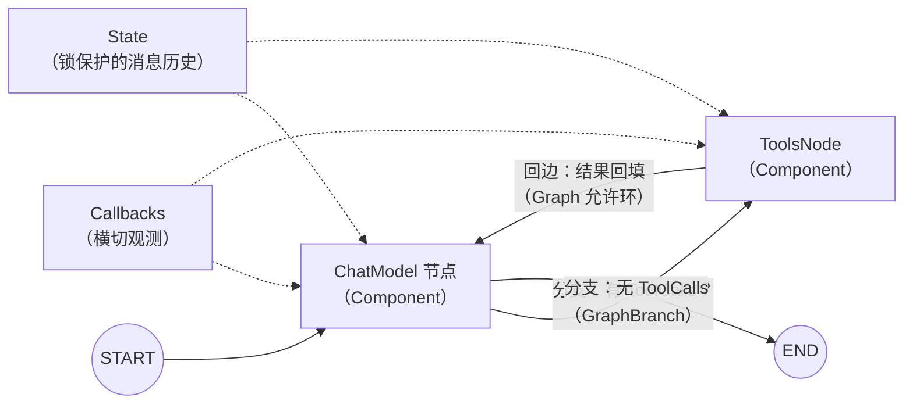

# Eino 核心机制 — 四个机制 + 一个 ReAct 是怎么拼出来的

> 这篇讲什么：Eino 底层四个关键机制——Component 类型安全、Graph 编排与 State、流式自动转换、Callbacks 横切；最后看官方 ReAct Agent 如何用这四块积木组装。
> 读完你能回答：**类型不匹配为什么在 Compile 就报错？图里的循环和共享状态怎么玩？流式和非流式节点怎么拼在一起？日志埋点为什么不碰业务代码？**

---

## 机制一：Component 抽象与编译期类型安全

**没有它会怎样**：多模型、多工具混用时，每个供应商 SDK 的输入输出类型都不同。接口不统一意味着：换模型改一片代码；节点接错类型时，Go 这种强类型语言居然要等到**运行时空指针/断言失败**才发现——因为所有接缝都是 `any`。

**方案**：Eino 给每类组件定义统一接口（`model.BaseChatModel`、`tool.BaseTool`、`Retriever`…），编排层用**泛型**把类型钉死：

```go
graph := compose.NewGraph[string, *schema.Message]()  // 图整体：string 进，Message 出

graph.AddChatModelNode("model", chatModel)            // 节点入参出参类型已知
graph.AddLambdaNode("format", lambda)
graph.AddEdge("format", "model")                      // 类型不匹配？Compile 时报错

runnable, err := graph.Compile(ctx)                   // 编译 = 类型衔接校验
```

关键规则：**`AddEdge` 要求上游出参类型等于下游入参类型**，`Compile` 时全图校验。类型不匹配的编排错误暴露在**编译期（图的 Compile）而非运行期**——这是 Go 泛型给 LLM 编排带来的独有红利，Python 框架（如 LangGraph）做不到这一层，只能靠运行时容错。

**一句话记住**：*泛型把编排接缝从 any 变成具体类型，错误左移到 Compile。*

---

## 机制二：Graph 编排与 State 共享

**没有它会怎样**：Chain 只能线性串联，而 Agent 需要「LLM → 工具 → 回 LLM」的循环、「按条件走不同分支」的路由、以及多个节点共享的运行期状态（比如消息历史）。手写这些，调度逻辑很快淹没业务代码。

**方案**：Graph = 节点 + 边 + 分支，**允许环**。三个要素：

**① 分支**：`AddBranch` 挂一个条件函数，运行时根据上游输出决定下一站：

```go
graph.AddBranch("model", compose.NewGraphBranch(
    func(ctx context.Context, msg *schema.Message) (string, error) {
        if len(msg.ToolCalls) > 0 { return "tools", nil }  // 有工具调用 → 工具节点
        return compose.END, nil                            // 否则 → 结束
    }, map[string]bool{"tools": true, compose.END: true}))
```

**② 循环**：边可以指回上游节点——Agent 的「再思考一轮」就是一条从 tools 指回 model 的边。执行引擎是 **Pregel 风格的 super-step**（与 [LangGraph 的 Pregel](/主流agent拆解/langgraph/核心机制) 同源！）：一拍内并行跑激活节点，拍间同步，回边只是「再排进下一拍」，不会爆栈。

**③ State**：多节点共享的运行期状态，用「建图注册 + 锁保护读写」实现（注意：**当前版本没有 `NewStateGraph`**，那是历史文档残留）：

```go
graph := compose.NewGraph[string, string](
    compose.WithGenLocalState(func(ctx context.Context) *MyState {
        return &MyState{}                                  // 每次运行新建
    }))

// 方式一：节点级 pre/post handler 读写 state
graph.AddLambdaNode("a", lambda,
    compose.WithStatePreHandler(func(ctx context.Context, in string, s *MyState) (string, error) {
        s.History = append(s.History, in)                  // 框架加锁保护
        return in, nil
    }))

// 方式二：Lambda 内部用 ProcessState（并发安全）
compose.ProcessState(ctx, func(ctx context.Context, s *MyState) error {
    s.Count++
    return nil
})
```

与 LangGraph 的哲学分野就在这里：LangGraph 用 **reducer 做字段级声明式合并**；Eino 用 **互斥锁保护的命令式读写**——`internalState{state, mu sync.Mutex}` 承载，嵌套图按词法作用域向父图查找。没有 reducer，合并逻辑你自己写，换来的是 Go 程序员最熟悉的直觉。

**一句话记住**：*分支定路由、回边表循环、State 靠锁保护共享；引擎是 Pregel 打拍子。*

---

## 机制三：流式自动转换 —— 流与非流的无缝拼接

**没有它会怎样**：编排中节点 A 流式输出（LLM 逐 token 吐字），节点 B 只接受完整输入（检索器需要完整 query）；反过来 B 输出完整结果，C 却要求流式输入。每个接缝你都得手写「收集所有 chunk 合成完整对象」或「把完整对象包装成一帧流」的适配代码，还得处理并发背压——这是 Go 手写 LLM 编排最痛的部分。

**方案**：Eino 把组件的输入/输出按「是否为流」两两组合，定义**四种流式编程范式**，编译产物 `Runnable[I, O]` 统一暴露这四个方法：

| 范式 | 输入 | 输出 | 交互类比 | 典型场景 |
|------|------|------|---------|---------|
| **Invoke** | 完整 T | 完整 O | Ping-Pong | 普通函数调用 |
| **Stream** | 完整 T | 流 Stream[O] | Server-Streaming | LLM 生成 |
| **Collect** | 流 Stream[I] | 完整 O | Client-Streaming | 聚合统计 |
| **Transform** | 流 Stream[I] | 流 Stream[O] | Bidirectional-Streaming | 流式加工 |

当上下游范式不匹配时，框架**自动**做两个转换（官方术语）：



- **合包（Concat）**：`Stream[T]` → 完整 `T`。框架收齐所有 chunk 后合并——自定义类型需注册合并函数 `compose.RegisterStreamChunkConcatFunc[T]`，`schema.Message` 已预注册
- **流化（Streaming）**：完整 `T` → 单帧 `Stream[T]`。俗称「假流」——只为满足接口签名，没有首包延迟优势

效果：**写节点时只关心自己最自然的范式，拼接交给框架**。整条链只要有一个真流式节点，端到端就能流式输出；其余节点被自动适配。

**一句话记住**：*四范式定契约，Concat 收流、Streaming 装箱，接缝转换框架包圆。*

---

## 机制四：Callbacks —— 业务无感的横切观测面

**没有它会怎样**：要加日志、trace、token 用量统计，只能在每个节点函数里插埋点代码；想去掉又得逐个删。观测逻辑和业务逻辑互相污染，而且流式场景下「在输出流中间插观测」极其容易写出泄漏 bug。

**方案**：定义五个注入时机的 `Handler` 接口，框架在每个节点的关键时刻自动回调——业务代码零感知：

```go
type Handler interface {
    OnStart(ctx, info, input) context.Context                    // 节点开始（非流式输入）
    OnEnd(ctx, info, output) context.Context                     // 节点成功返回
    OnError(ctx, info, err) context.Context                      // 节点出错
    OnStartWithStreamInput(ctx, info, streamIn) context.Context  // 流式输入到达
    OnEndWithStreamOutput(ctx, info, streamOut) context.Context  // 流式输出产生
}

// 两种注入方式：
callbacks.AppendGlobalHandlers(myHandler)              // 全局：进程级
runnable.Invoke(ctx, input, compose.WithCallbacks(h))  // 请求级：单次调用
```

三个必须知道的工程细节（面试加分项）：

1. **流式回调收到的是副本，必须 `Close`**——框架对流做了帧复制，handler 不 Close 会导致整条管道 goroutine/内存泄漏
2. **禁止修改 input/output 的值**——回调拿到的不是深拷贝，并发图中修改会引发数据竞争
3. **官方生态开箱即用**——eino-ext 提供 Langfuse、LangSmith、CozeLoop、APMPlus 等 tracing handler，接观测平台只要一行 `AppendGlobalHandlers`

**一句话记住**：*五时机回调横切全图；流副本记得 Close，观测千万别改数据。*

---

## 收尾：官方 ReAct Agent 是怎么拼出来的

四个机制合体的最佳示范是官方 `flow/agent/react`——它不是一个黑盒，就是一张**用上述积木拼的循环图**：



```go
agent, _ := react.NewAgent(ctx, &react.AgentConfig{
    ToolCallingModel: chatModel,              // 支持 tool calling 的模型
    ToolsConfig:      compose.ToolsNodeConfig{Tools: myTools},
    MaxStep:          12,                     // 最大循环步数（默认值）
    MessageModifier:  nil,                    // 可在此注入 system prompt
})
result, _ := agent.Generate(ctx, messages)   // Invoke 范式
stream, _ := agent.Stream(ctx, messages)     // Stream 范式
```

拆穿它：ChatModel 节点 + ToolsNode + 一个「有 tool call 走 tools、否则走 END」的分支 + tools 指回 model 的回边。**你在全景图学到的四个机制，一个不多一个不少**——这正是「吃透核心概念」的含义：看透之后，官方 Agent 只是积木的一种拼法。

> 对照 [pi 的 Agent Loop](/主流agent拆解/pi/核心机制)（响应 → 校验 → 执行 → 推回）与 [LangGraph 的 ReAct 循环](/主流agent拆解/langgraph/)——三个框架，同一个 ReAct 模式。**模式是相通的，API 只是方言。**

---

## 速记卡

| 机制 | 一句话 | 考点 |
|------|--------|------|
| 类型安全 | 泛型钉死接缝，错误左移到 Compile | Go vs Python 框架的本质差异 |
| Graph 编排 | 分支定路由、回边表循环、State 锁保护 | 与 LangGraph reducer 的哲学分野；无 NewStateGraph |
| 流式转换 | 四范式契约 + Concat 收流 + Streaming 装箱 | 「假流」是什么；自定义类型要注册 concat |
| Callbacks | 五时机横切，业务零感知 | 流副本必须 Close；禁止改数据 |
| ReAct 组装 | ChatModel + Tools + 分支 + 回边 | 说出 ReAct 图的构成 |

**总纲一句**：*Eino = 泛型保安全 + 图表循环 + 流式自动拼 + 回调做横切。*
