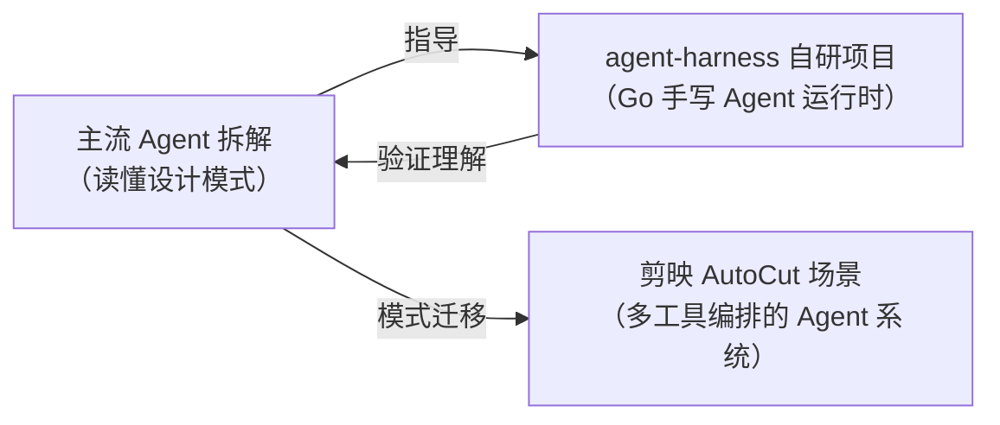

# 主流 Agent 拆解 — 读懂别人的设计，做好自己的系统

> 目标：通过深度拆解三个最具代表性的开源 Agent 框架/工具链，建立**语言无关的 Agent 系统设计直觉**。不是 API 教程，而是「这个机制为什么存在、解决什么问题、放到我的场景怎么用」。

---

## 为什么是这三个

三个拆解对象正好覆盖理解 Agent 系统的三个视角：

| 视角 | 框架 | 它回答的问题 |
|------|------|-------------|
| **产品形态** | [pi](/主流agent拆解/pi/)（85k+ stars 开源 Harness） | 一个日活百万级的 Agent **产品**，完整工程体系长什么样？ |
| **Go 落地** | [Eino](/主流agent拆解/eino/)（CloudWeGo 出品） | 用 **Go** 编排 LLM 应用，类型安全与流式怎么处理？ |
| **业界主流** | [LangGraph](/主流agent拆解/langgraph/)（约 4 万+ stars） | Python 生态最主流的**图编排**范式怎么设计？ |

三者的关系一句话：*pi 告诉你「完整产品长什么样」，LangGraph 告诉你「图编排怎么设计」，Eino 告诉你「用 Go 怎么落地」。*

---

## 三框架横向对照

| 维度 | **pi** | **Eino** | **LangGraph** |
|------|--------|----------|---------------|
| 语言 | TypeScript/Bun | **Go** | Python |
| 形态 | 完整产品（终端编码 Agent） | 编排框架（库） | 编排运行时（库） |
| 编排范式 | Agent Loop 状态机 + 事件流 + 双队列 | Chain / Graph，编译期类型检查 | StateGraph，Pregel super-step |
| 状态管理 | 接口快照化 + 会话快照 | 锁保护共享 State，命令式读写（无 reducer） | State + Reducer 增量合并 |
| 持久化 | JSONL 追加 + 重放（event-sourcing） | 框架不管，业务自行落地 | Checkpointer 一拍一档 |
| 流式 | EventStream 统一抽象 | 流式自动转换（四大场景拼接） | stream 多模式（values/updates/messages） |
| 人机协作 | 权限确认钩子（扩展系统） | 中断/审批由业务层组合 | interrupt + resume 一等公民 |
| 可扩展 | 五层扩展面（不 fork 改行为） | Callbacks 横切 + 组件可替换 | 节点/子图自由组合 |
| 面试定位 | 「完整 Harness 有哪些层」的样板答案 | 字节系技术栈直接对口 | 「了解业界 Agent 框架吗」的标准答案 |

---

## 拆解导航

### pi · 开源 Agent Harness（生产级落地形态）

| 篇章 | 内容 | 面试价值 |
|------|------|---------|
| [项目全景](/主流agent拆解/pi/) | 五层架构、包结构、五条设计哲学 | ★★★★ |
| [01 核心机制：Agent Loop](/主流agent拆解/pi/核心机制) | 双层循环、事件流、Tool Calling 全管线 | ★★★★★ 必考 |
| [02 LLM 抽象层](/主流agent拆解/pi/LLM抽象层) | StreamFn 契约、多供应商统一 | ★★★★ |
| [03 工程化落地](/主流agent拆解/pi/工程化落地) | 压缩、持久化、RPC、TUI、扩展系统 | ★★★★ |
| [04 Go 落地与面试](/主流agent拆解/pi/Go落地与面试) | Go/Eino 映射、面试话术 | ★★★★★ |

### Eino · Go 编排框架（目标岗位技术栈直接对口）

| 篇章 | 内容 | 面试价值 |
|------|------|---------|
| [① 全景图](/主流agent拆解/eino/) | 解决什么问题、核心概念一张图、最小示例 | ★★★ |
| [② 核心机制](/主流agent拆解/eino/核心机制) | Component 抽象、Graph 编排、流式自动转换、Callbacks | ★★★★★ Go 方向必考 |
| [③ 对照与面试](/主流agent拆解/eino/对照与面试) | 三方对照、字节技术栈关联、面试速答 | ★★★★★ |

### LangGraph · Python 编排框架（业界主流范式）

| 篇章 | 内容 | 面试价值 |
|------|------|---------|
| [① 全景图](/主流agent拆解/langgraph/) | 与 LangChain 的关系、五个核心概念 | ★★★ |
| [② 核心机制](/主流agent拆解/langgraph/核心机制) | Pregel super-step、Reducer、Checkpointer、Interrupt | ★★★★★ |
| [③ 对照与面试](/主流agent拆解/langgraph/对照与面试) | 用 Go 思维理解 LangGraph、面试速答 | ★★★★★ |

---

## 推荐阅读顺序

**完整路径（时间充裕，约 2-3 天）：**

1. **pi 全景 + 核心机制** → 先建立「一个完整 Agent Harness 有哪些部件」的全景
2. **Eino 三篇** → 把部件映射到 Go 的真实 API，与目标岗位技术栈挂钩
3. **LangGraph 三篇** → 用第二个框架验证你提炼的模式（真正的理解 = 能迁移）
4. **回头读 pi 03/04** → 此时压缩、持久化、扩展系统会有「原来如此」的感觉

**面试冲刺路径（只有半天）：**

pi 核心机制 → Eino ③ 对照与面试 → LangGraph ③ 对照与面试 → 各篇末尾速记卡过一遍

---

## 与实战项目的关系

拆解不是目的，落地才是。本模块与 [第三阶段实战项目](/phase3/) 互为表里：

- 拆解 **pi** → 自研项目的分层、事件流、持久化有了参照系
- 拆解 **Eino** → 自研项目的 Go 接口设计直接对齐工业标准
- 拆解 **LangGraph** → 面试被问业界框架时，能把自研项目「翻译」成对方熟悉的语言

> 每篇末尾都有**速记卡**，30 秒可复习；每篇核心概念都按「没有它会怎样 → 方案 → 图解 → 一句话记住」展开——先懂为什么，再看怎么做。
