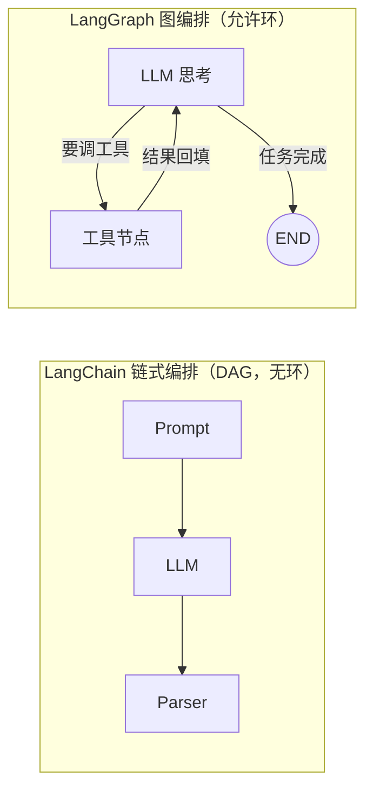
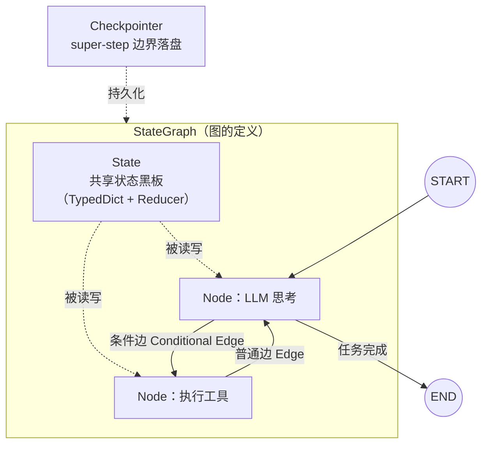

# LangGraph 全景图 — Python 生态最主流的 Agent 编排框架

> 这篇讲什么：LangGraph 是什么、为什么存在、核心概念有哪几个、15 行代码长什么样。
> 读完你能回答：**LangGraph 和 LangChain 是什么关系？为什么 Agent 编排需要「图」而不是「链」？StateGraph 的五个核心概念各自管什么？**

---

## 一句话定位

> **LangGraph = 把 Agent 的运行过程建模成「一张有状态的图」**：节点是动作（调 LLM、调工具），边是控制流（含循环），State 是共享黑板，由 Pregel 引擎按 super-step 驱动执行。

基本信息（核实于 langgraph 1.2.11 / PyPI）：

| 维度 | 事实 |
|------|------|
| 出品 | LangChain 官方（langchain-ai） |
| 语言 | Python（另有 JS 版） |
| 规模 | GitHub 约 4 万+ stars，v1.x 主版本线 |
| 定位 | 低层 Agent 编排运行时（不是开箱即用的 Agent 产品） |

---

## 没有它会怎样：从 LangChain 到 LangGraph

LangChain 早期的编排方式是 **LCEL（链式表达式）**：`prompt | model | parser`，本质是一条 **DAG 流水线**——数据从一头进、从一头出。

Agent 的核心循环是：**思考 → 调工具 → 看结果 → 再思考 → ……直到完成任务**。这是一个**带循环的、次数不确定的**流程。用 DAG 表达它，你会发现：

- 链是静态写死的，循环次数没法在运行时决定
- 「根据 LLM 输出决定下一步走哪」这种条件跳转，在链里要硬塞 if-else，很快失控
- 循环中累积的上下文（消息历史）没有统一的存放处，全靠手工传参

**方案**：把编排模型从「链」升级为「图」——允许环、允许条件边、有一份所有节点共享的 State。这就是 LangGraph 存在的理由。



**一句话记住**：*链是流水线，图是状态机；Agent 需要循环，所以需要图。*

---

## 核心概念一张图



五个概念，各管一件事：

| 概念 | 管什么 | 一句话记住 |
|------|--------|-----------|
| **State** | 所有节点共享的状态（消息历史、中间结果） | 一块大家都能读写的黑板 |
| **Node** | 一个动作单元（普通 Python 函数，读 State、返回增量） | 节点只做一件事，返回「要改什么」 |
| **Edge** | 控制流：普通边直连，条件边按函数返回值路由 | 边决定「接下来谁干」 |
| **START / END** | 图的入口与出口（特殊虚拟节点） | 每个图都从 START 出发、到 END 结束 |
| **Checkpointer** | 每个 super-step 边界把 State 落盘 | 图的「存档点」，崩溃能续跑 |

底层还有一个执行引擎 **Pregel**（按 super-step 驱动图运转），它是「图怎么跑起来」的答案，留到 [核心机制](/主流agent拆解/langgraph/核心机制) 篇细讲。

---

## 15 行最小 Agent 循环

一个「LLM 判断计数是否达标，不达标就加一再来」的最小循环图（API 经 langgraph 1.2.11 实测）：

```python
from typing import TypedDict
from langgraph.graph import StateGraph, START, END

class State(TypedDict):
    count: int

def add_one(state: State):
    return {"count": state["count"] + 1}          # 节点只返回「增量」

def route(state: State) -> str:
    return "done" if state["count"] >= 3 else "again"

builder = StateGraph(State)
builder.add_node("add", add_one)
builder.add_edge(START, "add")                     # 入口边
builder.add_conditional_edges("add", route, {"again": "add", "done": END})  # 循环！
graph = builder.compile()

graph.invoke({"count": 0})   # → {'count': 3}
```

注意三个设计直觉：

1. **节点返回的是增量，不是全量**——框架负责合并进 State（怎么合，由 Reducer 决定）
2. **循环就是一条指回自己的条件边**——Agent 的「再思考一轮」就这么朴素
3. **`compile()` 之前是定义，之后才是可执行的图**——类似「先建图、再编译、后运行」的三段式

---

## 篇目导航

| 篇章 | 内容 | 面试价值 |
|------|------|---------|
| ① 全景图（本篇） | 定位、与 LangChain 的关系、五个核心概念、最小示例 | ★★★ 基础盘：讲清 LangGraph 是什么 |
| [② 核心机制](/主流agent拆解/langgraph/核心机制) | Pregel super-step、Reducer 合并、Checkpointer 断点续跑、Interrupt 人机协作 | ★★★★★ 必考：图引擎怎么运转 |
| [③ 对照与面试](/主流agent拆解/langgraph/对照与面试) | vs Eino vs pi、用 Go 思维理解 LangGraph、面试速答 | ★★★★★ 直接用于面试 |

---

## 速记卡

- **定位**：LangGraph = 有状态的图编排运行时，LangChain 官方出品，Python 生态最主流
- **为什么存在**：链（DAG）表达不了 Agent 的循环 → 升级为图
- **五概念**：State（黑板）、Node（动作）、Edge（路由）、START/END（出入口）、Checkpointer（存档）
- **代码三段式**：`StateGraph(State)` 建图 → 加节点加边 → `compile()` 运行
- **节点哲学**：返回增量而非全量，合并交给 Reducer
- **循环本质**：一条指回上游的条件边
