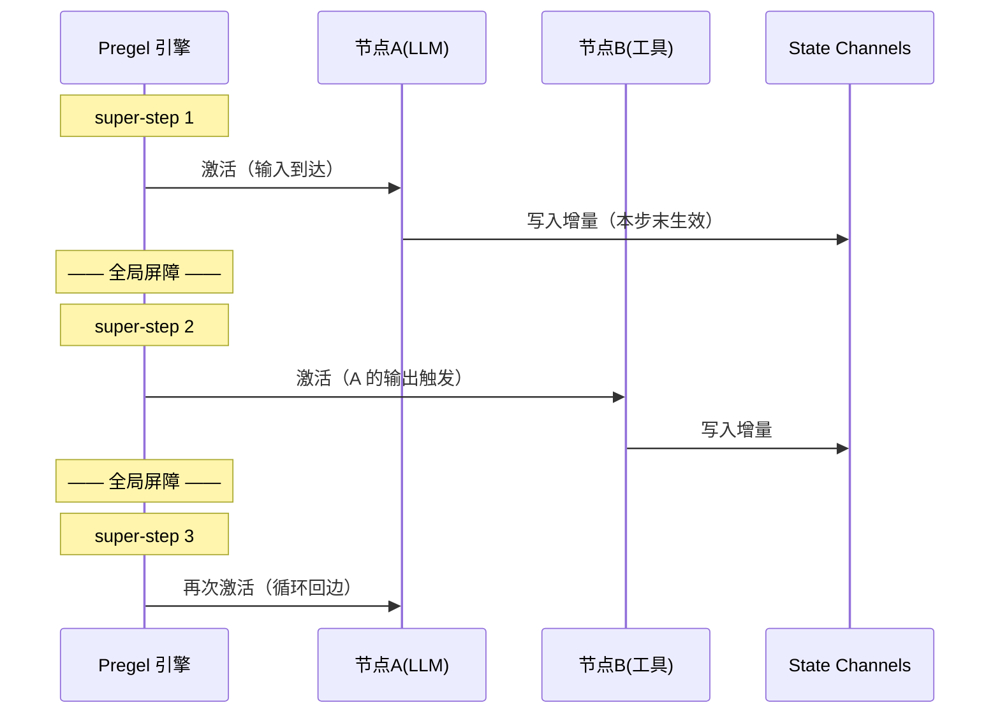

# LangGraph 核心机制 — 图引擎是怎么运转的

> 这篇讲什么：LangGraph 底层四个关键机制——Pregel 执行模型、State 与 Reducer、Checkpointer 持久化、Interrupt 人机协作。
> 读完你能回答：**图是「怎么跑起来」的？并行节点同时写状态怎么办？崩溃后凭什么能续跑？人工审批怎么插进自动流程？**

---

## 机制一：Pregel 执行模型 —— 图按「拍子」运转

**没有它会怎样**：图里有循环、有并行分支，「先执行谁、后执行谁、什么时候算一轮结束」如果没有一个明确的执行模型，每个框架使用者都要自己发明一套调度规则——并发 bug 和死循环会层出不穷。

**方案**：LangGraph 的运行时叫 **Pregel**（致敬 Google 同名论文），采用 **BSP（整体同步并行）** 模型，把执行切成一拍一拍的 **super-step（超级步）**：

1. 每个 super-step 内，所有「收到新消息」的节点**并行**执行
2. 节点执行时**只读输入、只写输出**，彼此不直接调用
3. 本步所有节点都跑完（全局屏障），写入生效，进入下一拍
4. 没有任何节点被激活时，图结束



两个推论很关键：

- **节点间靠消息传递，不靠函数调用**——节点在 super-step N 写入 channel，订阅它的节点在 super-step N+1 被「收件箱」触发。这就是循环边能安全存在的原因：回边不会栈溢出，只是「再排进下一拍」
- **屏障即存档点**——super-step 之间的全局屏障是天然的一致性时刻，Checkpointer（机制三）就挂在这里

**一句话记住**：*Pregel = 打拍子跑图：一拍内并行、拍间同步、靠收件箱触发下一拍。*

---

## 机制二：State 与 Reducer —— 并行写入怎么不打架

**没有它会怎样**：super-step 内多个节点并行跑，如果两个节点同时返回 `{"messages": [...]}`，State 里到底听谁的？直接覆盖会丢数据，直接追加又无法表达「修改某条消息」。

**方案**：给 State 的每个字段声明一个 **Reducer（合并函数）**。节点返回增量，框架用 reducer 把增量合并进旧值：

```python
from typing import Annotated, TypedDict
from langgraph.graph.message import add_messages

class State(TypedDict):
    messages: Annotated[list, add_messages]  # 有 reducer：合并
    user_id: str                             # 无 reducer：覆盖（默认）
```

- **无 reducer 的字段**：后写覆盖先写（适合状态标记类字段）
- **同一 super-step 内并行写同一字段**：由各字段的 reducer 合并出确定结果；字段没声明 reducer 又发生并行写，框架直接报 `InvalidUpdateError`——**宁可报错，不猜语义**
- **`add_messages` 的精妙设计**：默认追加（消息历史只增不减），但如果新消息与已有消息 **id 相同则原地更新**——这一条同时支持了「追加对话」和「修改/重试某条消息」两种场景

实测：两个并行节点分别返回 `{"vals": ["x"]}` 和 `{"vals": ["y"]}`，字段声明 `Annotated[list, operator.add]`，结果是 `['x', 'y']`——合并行为完全确定。

**一句话记住**：*节点只交增量，合并看 reducer；add_messages = 追加为主、同 id 更新。*

---

## 机制三：Checkpointer —— 崩溃续跑与多轮会话的根基

**没有它会怎样**：Agent 跑到第 10 轮崩了，所有上下文在内存里灰飞烟灭，只能从头再来；用户关掉页面明天再聊，Agent 完全失忆。没有持久化，Agent 只能是「一次性脚本」。

**方案**：在**每个 super-step 边界**（机制一的全局屏障处）把完整 State 落盘，称为 checkpoint。每次调用时带上 `thread_id`，同一个 thread 的历史 checkpoint 串成一条时间线：

```python
from langgraph.checkpoint.memory import InMemorySaver

graph = builder.compile(checkpointer=InMemorySaver())  # 编译时挂上存档器
config = {"configurable": {"thread_id": "user-123"}}   # 调用时带上会话 id

graph.invoke({"messages": [("user", "你好")]}, config)   # 第一轮
graph.invoke({"messages": [("user", "接着聊")]}, config)  # 自动恢复历史，记得"你好"
```

这套设计带来的能力远超「防丢数据」：

| 能力 | 怎么来的 |
|------|---------|
| **崩溃恢复** | 从最后一个 checkpoint 重放即可续跑 |
| **多轮会话记忆** | 同一 thread_id 自动加载历史 State |
| **时间旅行** | checkpoint 是一条历史链，可回到任意一步分叉重跑 |
| **人机协作** | interrupt 暂停的本质 = 在 checkpoint 上挂起等待（机制四） |

生产环境换存储后端即可，接口不变：`InMemorySaver`（开发）→ `SqliteSaver`（`langgraph-checkpoint-sqlite` 包）→ `PostgresSaver`（`langgraph-checkpoint-postgres` 包）。

> 是不是有 event-sourcing 的味道？对比 [pi 拆解 · 会话持久化](/主流agent拆解/pi/工程化落地) 的「JSONL 追加 + 重放重建」——不同语言生态，同一个思想：**状态可重放，系统就敢崩**。

**一句话记住**：*每拍边界存一次档，thread_id 串起一条时间线；能重放，就敢崩。*

---

## 机制四：Interrupt —— 把「人工审批」插进自动流程

**没有它会怎样**：Agent 要执行危险操作（删数据、发邮件、下单），你想让它「先问我一声」。没有框架支持，你得在节点里手写轮询、外部状态标记、人工回调……审批逻辑和业务逻辑缠成一团。

**方案**：在节点里调用一个函数 `interrupt()`——图当场暂停并把 State 存档（复用机制三的 checkpoint），等外部用 `Command(resume=...)` 送入人类的决定，图从暂停处接着跑：

```python
from langgraph.types import interrupt, Command

def approval_node(state):
    # 首次执行到这里：图暂停，payload 透传给调用方
    answer = interrupt({"question": "确认删除这 3 个文件吗？"})
    # 恢复后：interrupt() 的返回值就是人类传入的 resume 值
    return {"approved": answer == "yes"}
```

```python
config = {"configurable": {"thread_id": "t-1"}}
result = graph.invoke(input, config)          # 跑到 interrupt 停下，result 含 __interrupt__
# ……把问题展示给用户，拿到答复……
graph.invoke(Command(resume="yes"), config)   # 从暂停处继续
```

三个实现细节，面试常追问：

1. **暂停不是挂起线程**——是「抛异常 + 落盘 checkpoint」，进程可以退出，恢复时重新加载
2. **恢复后节点从头重跑**——`interrupt()` 之前的代码会再执行一遍，所以 interrupt 要放在节点开头、之前不要有副作用
3. **必须有 checkpointer**——没有存档就无从恢复，`compile(checkpointer=...)` 是 interrupt 的前提

> 另有静态断点 `interrupt_before`/`interrupt_after`（编译或调用时指定在哪些节点前/后暂停），定位是调试与环外审批，与动态 `interrupt()` 并存。

**一句话记住**：*interrupt = 抛异常存档等命令，resume = 从 checkpoint 原地复活。*

---

## 速记卡

| 机制 | 一句话 | 考点 |
|------|--------|------|
| Pregel | 打拍子跑图：拍内并行、拍间同步、收件箱触发 | super-step 是什么、循环为什么不爆栈 |
| Reducer | 节点交增量，合并看 reducer | 并行写冲突怎么办、add_messages 的 id 语义 |
| Checkpointer | 每拍存档，thread_id 串时间线 | 断点续跑原理、生产用什么后端 |
| Interrupt | 暂停=存档，恢复=Command(resume=) | 为什么恢复后节点重跑、为什么需要 checkpointer |

**总纲一句**：*LangGraph = Pregel 打拍子 + Reducer 管合并 + Checkpoint 敢崩溃 + Interrupt 能等人。*
