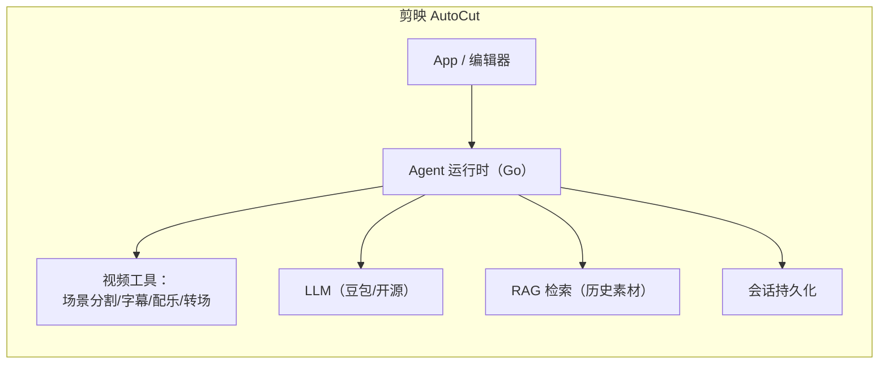

# 04 Go 落地与面试：把 pi 的模式变成你的面试答案

> 目标岗位：字节跳动剪映 CapCut「Agent 开发实习生（AI 剪辑）」，Go 语言。
> 本篇把 pi 的架构模式**翻译成 Go**、对照字节内部框架 **Eino**，并给出可直接背诵的面试话术与速记卡。

---

## 1. 为什么 TypeScript 项目对 Go 岗位有用

面试官问"你了解 agent 系统吗"，不是要你背 TS 代码，而是看你能不能讲清楚**架构模式**。pi 是当前最完整的开源样本，它的每个决策都可以用 Go 重新实现。本篇就是**翻译对照表**。

先建立大图景：字节 AI 剪辑（AutoCut）的 agent 系统 ≈ pi 的架构 + 视频剪辑工具集：



面试时把 pi 的每个模式映射到"如果做 AI 剪辑 agent，我怎么做"。

---

## 2. 核心模式 → Go 对照表（★ 面试核心）

### 2.1 Agent Loop

| pi（TS） | Go 实现 | 说明 |
|----------|---------|------|
| `Agent` 类（状态门面） | `type Agent struct` + 方法 | 持有 `messages []Message`、`tools []Tool`、`mu sync.RWMutex` |
| `runAgentLoop`（纯函数） | `func RunLoop(ctx context.Context, in Input, out chan<- Event) error` | 低层循环无状态，通过 channel 发事件 |
| 事件订阅 `subscribe()` | `type EventHandler func(Event)` 注册到 `[]EventHandler`，顺序调用 | 事件驱动 UI |
| steering/followUp 双队列 | 两个 `chan Message` + 队列模式控制 | 人类在环 |
| `AbortController` | `context.Context` + `cancel()` | Go 原生取消 |
| `EventStream` | `chan StreamEvent`（或 `<-chan` 只读） | 生产者 push、消费者 range |

**Go 版最小 Agent Loop 骨架**（面试可手写）：

```go
type Agent struct {
    mu       sync.Mutex
    messages []Message
    tools    map[string]Tool
    handlers []EventHandler
}

func (a *Agent) Run(ctx context.Context, prompt Message) error {
    a.messages = append(a.messages, prompt)
    for {
        // 1. 调 LLM（流式）——把增量发到事件 channel
        resp := a.stream(ctx, a.messages, a.tools)
        // 2. 响应里有没有 toolCall？
        if len(resp.ToolCalls) == 0 {
            break // 模型不想用工具了
        }
        // 3. 逐个执行工具，结果作为 toolResult 消息推回
        for _, tc := range resp.ToolCalls {
            result := a.execTool(ctx, tc)   // 校验 → before → exec → after
            a.messages = append(a.messages, ToolResultMessage(tc, result))
        }
        // 4. 回到 1（循环直到模型不再要工具）
    }
    return nil
}
```

**Go 要点**：
- 用 `context` 代替 AbortController；`<-chan` 做事件流。
- 工具执行并行用 `errgroup`（有 sequential 工具则串行）。
- 状态访问加锁（`sync.RWMutex`），或坚持"Agent 是唯一写者"用单 goroutine 串行处理。

### 2.2 Tool 系统

| pi | Go | 说明 |
|----|----|------|
| `AgentTool` + TypeBox schema | `type Tool struct { Name, Description string; Params any /* JSON Schema */ }` | schema 同时给模型看和本地校验 |
| `validateToolArguments` | `jsonschema.Validate`（如 `santhosh-tekuri/jsonschema`） | 参数校验 |
| `beforeToolCall`/`afterToolCall` 钩子 | `Before func(ctx, call) error` / `After func(ctx, call, result) error` | 权限/扩展插槽（= Eino 中间件） |
| `prepareArguments` | 参数归一化函数 | 兼容不同模型的参数风格 |

```go
type Tool struct {
    Name        string
    Description string
    Schema      map[string]any        // JSON Schema
    Execute     func(ctx context.Context, args map[string]any) (ToolResult, error)
    Before      func(ctx context.Context, call ToolCall) error  // 可选
    After       func(ctx context.Context, call ToolCall, r ToolResult) error // 可选
}
```

**面试映射（AI 剪辑）**：给视频工具建模——`SceneSplit`（场景分割）、`SubtitleGen`（字幕）、`BGMRecommend`（配乐）、`Trim`（裁剪）。每个都是 `Tool{Name, Schema, Execute}`，Agent 通过统一工具接口编排，新增剪辑能力 = 新增一个 Tool。

### 2.3 上下文管理

| 模式 | Go 落地 |
|------|---------|
| 截断 | 超限丢最早消息（简单但丢信息） |
| 摘要压缩 | 超阈值调 LLM 把旧历史总结成 summary 消息放回（pi 方案） |
| 滑动窗口 | 固定保留最近 N 轮 |
| 文件指纹 | 摘要里带 `<read-files>/<modified-files>`（pi 细节） |

### 2.4 会话持久化

pi 的 event-sourcing 风格 → Go 用 **JSONL 追加日志 + 启动时重放**：

```go
// 写入：先 append 落盘，再更新内存
func (s *Session) Append(entry Entry) error {
    line, _ := json.Marshal(entry)
    if err := s.appendToFile(line); err != nil { return err } // 先落盘
    s.memory = append(s.memory, entry)                        // 后更新内存
    return nil
}

// 恢复：重放日志重建状态（纯函数）
func Replay(reader io.Reader) (*Session, error) { /* 逐行解码 → 重建 */ }
```

生产级可换 SQLite（WAL + 事务 + writer lease fencing）。

### 2.5 LLM 抽象

pi 的 Models→Provider→API 三层 → Go：

```go
type Provider interface {
    Stream(ctx context.Context, model Model, req Request) (<-chan StreamEvent, error)
}

type Model struct {
    ID            string
    Provider      string
    ContextWindow int
    SupportsReasoning bool
}

// 一个 OpenAI 兼容 provider（豆包/DeepSeek 通用）
type OpenAICompatProvider struct{ BaseURL, APIKey string }
```

**字节场景**：豆包（火山引擎）是 OpenAI 兼容接口 → 一个 `OpenAICompatProvider` 即可接入；本地开源模型（如 llama.cpp）加一个 provider 即可。**换模型 = 换 provider，业务代码不动。**

---

## 3. 与字节 Eino 框架的对照（加分项）

字节内部用 [CloudWeGo Eino](https://github.com/cloudwego/eino)（Go LLM/Agent 框架）。了解 pi 后，Eino 的文档读起来会非常快，因为概念一一对应：

| pi 概念 | Eino 概念 | 说明 |
|---------|-----------|------|
| StreamFn | `ChatModel` / `Stream` 接口 | LLM 调用抽象 |
| Agent Loop | `ReActAgent`（`react_agent_manual`） | ReAct 循环 |
| Tool + 钩子 | `Tool` + `ToolCalling` + 中间件 | 工具注册与拦截 |
| transformContext | `PreHandle` / 消息处理器 | 上下文变换 |
| extensions 钩子 | 中间件（Middleware） | 请求/响应拦截 |
| compaction | 手动 `Compactor` 或 `transform` 节点 | 上下文压缩 |
| 事件流 | `StreamReader` | 流式事件 |

**面试用法**：*"我拆解过 pi 的架构，发现它和字节的 Eino 概念同构——Eino 的 ReActAgent 对应 pi 的 agent loop，中间件对应 pi 的 before/afterToolCall 钩子，ChatModel 对应 StreamFn 抽象。所以我对 Eino 上手会很快。"*

---

## 4. 把 pi 讲给面试官：30 分钟叙事脚本

### 开场（1 分钟）——讲清楚拆了什么

> "我深度拆解了 earendil-works/pi，一个 8.5 万 star 的开源 agent 工具链。它包含统一 LLM API、agent 运行时、编码 agent CLI、TUI 和远程会话协议五部分。我重点关注了 agent 运行时——也就是 Agent Harness 的核心。"

### 核心（5 分钟）——Agent Loop 与工具管线

> "它的核心是双层循环：内层在模型要工具时反复执行'响应→校验→执行→结果推回'，外层在 follow-up 队列有消息时续命。工具调用走 prepare→execute→finalize 管线，参数用 JSON Schema 校验，预期失败编码成错误结果返回给模型自愈，而不是抛异常。"

### 深化（5 分钟）——三个工程细节

> "有三个细节我印象很深：第一，错误哲学——StreamFn 同步返回流、绝不 throw，错误编码成流终止事件，循环里不需要 try/catch；第二，上下文压缩——超阈值把旧历史摘要成 summary 放回，保留最近 tail，摘要还带文件操作指纹；第三，会话持久化——追加式日志加纯函数重放，崩溃可恢复，先落盘后更新内存。"

### 关联岗位（3 分钟）——怎么用到 AI 剪辑

> "这些模式直接适用于 AI 剪辑场景：视频的每个剪辑能力（场景分割、字幕、配乐）建模成 Tool，Agent 循环编排它们；素材检索是 RAG Tool；多轮剪辑需求用会话持久化；每一步操作可审计（event-sourcing 日志），符合剪映对质量的要求。用 Go 实现的话，Provider 抽象让豆包和本地模型无缝切换。"

### 收尾（1 分钟）——留钩子

> "我还在自己用 Go 实现一个最小 harness 验证这些模式，比如并发工具执行用 errgroup、取消用 context。如果您感兴趣，我可以现场画一下我设计的工具接口。"

---

## 5. 面试高频问题速答（背下来）

**Q1：什么是 Agent Harness？**
> "LLM 之外的运行时基础设施——控制循环、工具编排、记忆、护栏、可观测。LLM 是最小的一部分，真正决定 agent 能力的是 harness。"

**Q2：Agent 循环怎么设计？**
> "ReAct 循环：模型返回要调的工具 → 校验参数 → 执行 → 结果推回上下文 → 再让模型决定下一步，直到模型不再要工具。pi 的实现是双层 while + 事件驱动。"

**Q3：上下文窗口满了怎么办？**
> "三种策略：截断（丢信息）、滑动窗口（丢更早）、摘要压缩（调 LLM 总结旧历史放回，保信息）。pi 用摘要压缩，还保留文件操作指纹。压缩要可重试、可配置阈值、避免切在超大单轮中间。"

**Q4：工具调用失败怎么处理？**
> "预期失败（参数错、工具不存在、执行报错）编码成错误 toolResult 返回给模型，让模型自己修正重新调用——不中断循环。只有非预期异常才中断。输出被 token 截断时整批工具调用作废重发，避免执行残缺参数。"

**Q5：怎么支持多个 LLM 供应商？**
> "三层抽象：Models 管认证和分派，Provider 管身份和模型目录，API 模块管协议翻译。业务代码只面对统一的 Model 和 Context。能力差异用 compat 开关描述，推理参数用语义化 ThinkingLevel 翻译。"

**Q6：Agent 怎么支持用户中途插话？**
> "双队列：steering 队列在运行中注入（用户补充指令），followUp 队列在 agent 快结束时注入（跑完再做 X）。人类在环是异步的，队列让 agent 不干等。"

**Q7：会话怎么持久化/恢复？**
> "追加式日志（event sourcing 风格），reducer 纯函数重放重建状态；先落盘后更新内存；崩溃恢复时校验日志完整性、修复 torn tail。生产环境可换 SQLite 加事务和 writer fencing。"

**Q8：怎么保证 agent 安全（不乱跑命令/改文件）？**
> "三层：工具层 schema 校验参数 + 权限标记；执行前 beforeToolCall 钩子做确认/拦截（危险命令弹确认）；执行环境层做沙箱/容器隔离（pi 的 FileSystem/Shell 抽象可换成受限实现）。"

---

## 6. 从 pi 到"我的项目"：Go 落地清单

对照自己的 [agent-harness 项目](/phase3/agent-harness/)，逐项自检：

| 能力 | pi 的做法 | 你项目的状态 | 差距 |
|------|-----------|-------------|------|
| Agent Loop | 双层 while + 事件流 | | |
| 工具注册/校验 | Tool + JSON Schema | | |
| 钩子/中间件 | before/afterToolCall | | |
| 上下文压缩 | 摘要 + 文件指纹 | | |
| 会话持久化 | JSONL 追加 + 重放 | | |
| 并发工具 | errgroup 并行 | | |
| 取消 | context | | |
| 多供应商 | Provider 接口 | | |
| 可观测 | 事件 + 遥测 | | |

> 把每个空填上，你的项目就是"用 Go 重写了一个 pi"——这是最有说服力的面试项目。

---

## 速记卡（最终版）

**一句话总纲**：*Agent Harness = 循环（怎么转）+ 工具（能干啥）+ 上下文（记得住）+ 状态（存得下）+ 护栏（敢不敢）*。

**pi 五层**：产品层 → 会话层 → 运行时 → LLM 层 → 基座。

**循环四步**：响应 → 校验 → 执行 → 推回。

**错误三不**：不 throw、不中断、不执行残缺参数。

**工程四件套**：压缩、持久化、协议、扩展。

**Go 五词**：context（取消）、channel（事件）、errgroup（并行）、jsonschema（校验）、JSONL+replay（持久化）。

**Eino 一句**：ReActAgent ≈ agent loop，中间件 ≈ 钩子，ChatModel ≈ StreamFn。

---

## 延伸阅读

- [Eino 拆解 · 全景图](/主流agent拆解/eino/)：把本篇的 Go 映射落到 CloudWeGo Eino 的真实 API 上
- [LangGraph 拆解 · 全景图](/主流agent拆解/langgraph/)：Python 生态最主流 Agent 编排框架，面试高频对照对象
