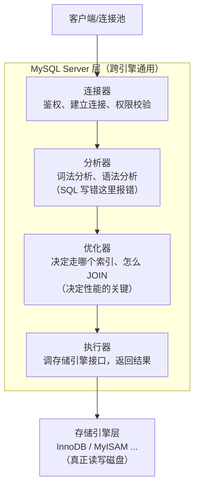

# 第一天用 MySQL，先把"库"和"表"这两件事玩明白 —— MySQL 入门与库表操作

> 属于 S1 MySQL 深入 · 基础篇第 1 章（先过一遍基础，再进深入篇）
> 下一篇：[SQL 语法详解](./基础-SQL语法详解)

很多同学第一次接触 MySQL 就直接被"存储引擎、隔离级别、索引"这些概念砸晕，结果 SQL 本身反而不熟。面试时问 `SELECT` 执行顺序、`ALTER TABLE` 注意事项，答得磕磕绊绊。这一篇先把地基打牢：MySQL 是什么、怎么连上去、库和表怎么建怎么改，以及最容易被忽略的字符集问题。

---

## MySQL 是什么，它长什么样

MySQL 是一个**关系型数据库管理系统**（RDBMS）：数据以"表"为单位组织，表里有行（记录）和列（字段），表之间通过外键或业务字段关联。它和"非关系型"的 Redis（键值）、MongoDB（文档）、Milvus（向量）是不同赛道的东西。

一次查询从你敲下 SQL 到拿到结果，中间经过了 MySQL 的**逻辑架构**。理解这个分层，后面看"慢查询""死锁"的排查思路就顺了：



记住一句话：**连接器管你是谁，分析器管 SQL 对不对，优化器管怎么查最快，执行器管真正干活，存储引擎管怎么存**。索引、事务、锁这些"高级话题"全在优化器和存储引擎这两层里，所以基础篇先认识它们的位置即可。

## 怎么连上 MySQL

```bash
# 命令行连接：-h 主机 -P 端口 -u 用户 -p 密码
mysql -h 127.0.0.1 -P 3306 -u root -p

# 连接后看当前有哪些库
SHOW DATABASES;
```

连接成功后，我们操作的最小单元是"库 → 表"。一个库里可以有多张表，不同项目/业务建议用不同的库隔离。

## 库操作：建库、删库、选库

```sql
-- 建库：指定字符集（后面细讲，先养成习惯）
CREATE DATABASE IF NOT EXISTS gocampus
  DEFAULT CHARACTER SET utf8mb4
  COLLATE utf8mb4_unicode_ci;

-- 使用某个库（后续语句都在这库里执行）
USE gocampus;

-- 看当前在哪个库
SELECT DATABASE();

-- 删库（生产环境慎用！删库跑路警告）
DROP DATABASE IF EXISTS gocampus;
```

## 表操作：建表、改表、删表

建表是最核心的操作。一个规范的最小建表语句长这样：

```sql
CREATE TABLE users (
  id          BIGINT UNSIGNED NOT NULL AUTO_INCREMENT COMMENT '主键',
  name        VARCHAR(64)     NOT NULL COMMENT '姓名',
  email       VARCHAR(128)    NOT NULL COMMENT '邮箱',
  age         TINYINT UNSIGNED DEFAULT NULL COMMENT '年龄',
  created_at  DATETIME        NOT NULL DEFAULT CURRENT_TIMESTAMP COMMENT '创建时间',
  updated_at  DATETIME        NOT NULL DEFAULT CURRENT_TIMESTAMP ON UPDATE CURRENT_TIMESTAMP COMMENT '更新时间',
  PRIMARY KEY (id),
  UNIQUE KEY uk_email (email)
) ENGINE=InnoDB DEFAULT CHARSET=utf8mb4 COMMENT='用户表';
```

逐行拆解你要注意的语法细节：

- `AUTO_INCREMENT`：自增主键，只能用于整数列；插入时不给值会自动 +1。
- `COMMENT`：字段/表注释。**生产规范强制要求**，不然三个月后没人知道这列是干嘛的。
- `DEFAULT CURRENT_TIMESTAMP`：插入时自动填当前时间；`ON UPDATE CURRENT_TIMESTAMP` 是更新时自动改时间——这就是很多表"更新时间自动变"的原理。
- `UNIQUE KEY uk_email (email)`：唯一索引，邮箱不能重复。命名规范 `uk_` 前缀（unique key），普通索引用 `idx_` 前缀。
- `ENGINE=InnoDB`：存储引擎。8.0 默认就是 InnoDB，建议显式写出（MySQL 5.7 里不写也行，但写出来更明确）。

**改表**的常用姿势（面试常问 `ALTER TABLE` 的两个坑）：

```sql
-- 加一列
ALTER TABLE users ADD COLUMN gender TINYINT NOT NULL DEFAULT 0 COMMENT '性别 0未知 1男 2女' AFTER age;

-- 加索引
ALTER TABLE users ADD INDEX idx_name (name);

-- 改列类型（注意：大表会锁表！）
ALTER TABLE users MODIFY COLUMN name VARCHAR(128) NOT NULL COMMENT '姓名';
```

> **坑 1：`ALTER TABLE` 在 8.0 之前会锁表**，大表加列/加索引会让线上写入卡死。8.0 里 `ADD COLUMN`（INSTANT 算法）可以秒级完成，但 `MODIFY COLUMN` 改类型等操作仍可能锁表。大表变更要走 `pt-online-schema-change` / `gh-ost`（见深入篇《慢查询优化实战》）。
> **坑 2：`DROP COLUMN` 删列不可恢复**，先备份再删。

`TRUNCATE` vs `DELETE` 的区别是高频面试题：

| 操作 | 作用 | 能不能回滚 | 会不会重置自增 | 速度 |
|------|------|-----------|--------------|------|
| `DELETE FROM t` | 逐行删除 | 事务内可回滚 | 不重置 | 慢（记录 binlog） |
| `TRUNCATE TABLE t` | 清空整表 | 不能回滚 | 重置 | 快（DDL，直接释放） |
| `DROP TABLE t` | 删表结构+数据 | 不能回滚 | — | 快 |

## 字符集：90% 中文乱码的根源

**字符集（charset）决定"字符怎么编码成字节"，排序规则（collation）决定"字符怎么比大小/排序"**。这两个概念必须分开。

```sql
-- 查看支持的字符集
SHOW CHARACTER SET;

-- 查看某库/表的字符集
SHOW CREATE TABLE users\G
```

- **utf8mb4**：真正完整的 UTF-8，4 字节，能存 emoji（😀）。**MySQL 的 `utf8` 是坑，它最多 3 字节，存 emoji 直接报错**——所以一律用 `utf8mb4`。
- **utf8mb4_unicode_ci**：基于 Unicode 的比较规则，排序更准确；`utf8mb4_general_ci` 更快但比较粗糙。`_ci` 结尾 = case insensitive（不区分大小写），`_bin` = 按二进制精确比较（区分大小写，且区分重音）。
- 字符集**三个层级**：库 → 表 → 列，列级优先。建表不指定会继承库的。

> **面试追问**：为什么用 utf8mb4 而不是 utf8？—— utf8 是 MySQL 历史包袱，实际是 utf8mb3，最多 3 字节，无法表示 emoji 和部分生僻字；utf8mb4 是真正的 UTF-8 全集。8.0 里 utf8mb4 已成为默认字符集。

## SQL 分为五大类

先建立一个总览，后面每一类都会展开：

| 分类 | 全称 | 作用 | 关键字 |
|------|------|------|--------|
| DDL | Data Definition | 定义结构 | CREATE / ALTER / DROP / TRUNCATE |
| DML | Data Manipulation | 操作数据 | INSERT / UPDATE / DELETE |
| DQL | Data Query | 查询数据 | SELECT |
| DCL | Data Control | 权限控制 | GRANT / REVOKE |
| TCL | Transaction Control | 事务控制 | COMMIT / ROLLBACK / SAVEPOINT |

基础篇的第一章先掌握 DDL（本篇文章）和 DML/DQL（下一篇），DCL 了解即可（`GRANT SELECT ON db.* TO 'user'@'host'`），TCL 在《事务与索引入门》里讲。

---

## 串起来

MySQL 把数据组织成"库 → 表 → 行/列"，查询请求经过 连接器→分析器→优化器→执行器→存储引擎 五层。这一篇你只需要带走三件事：**建表语法规范**（自增主键 + 注释 + 默认时间 + utf8mb4）、**ALTER 的锁表坑**、**TRUNCATE 与 DELETE 的区别**。这些是后面所有深入话题（索引、事务、优化）的"操作层面"地基。

下一篇进入 **SQL 语法详解**：`SELECT` 的执行顺序、JOIN、子查询、窗口函数，把查询这一关彻底打通。
