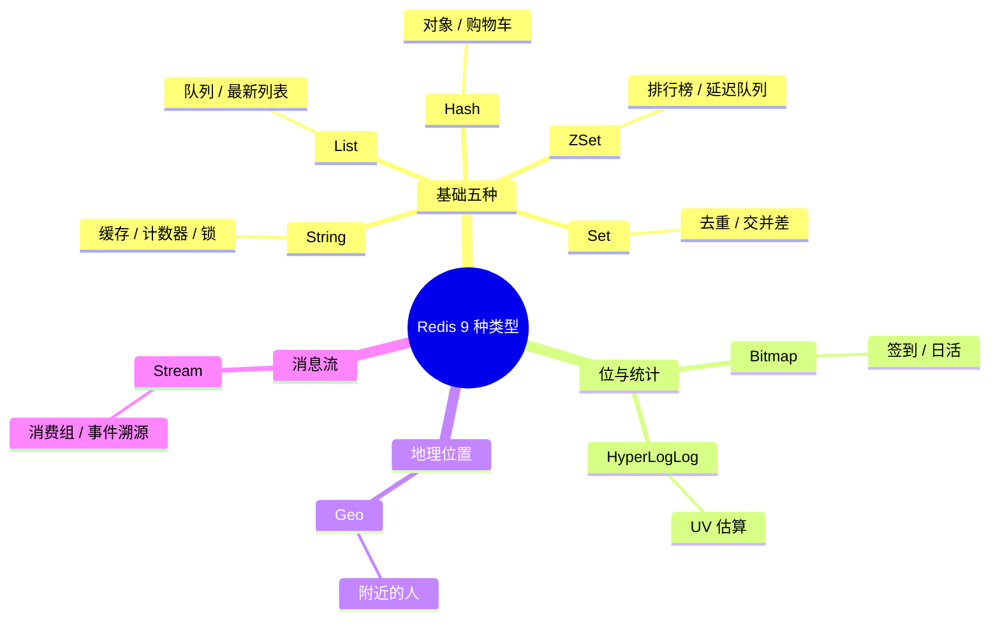
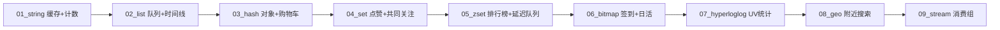

# Redis 9 种数据类型与常见用法

> 本篇是 Redis 学习的「地基」：先搞清楚**每种类型长什么样、解决什么问题、核心命令有哪些**，
> 再去 `code/backend/02-redis/05_types/` 里把每种类型的动手练习跑一遍。

## 总览：一张表记住 9 种类型

| # | 类型 | 底层编码（Redis 7） | 一句话理解 | 典型场景 |
|---|------|---------------------|-----------|---------|
| 1 | String | int / embstr / raw | 最基础的 KV，值可以是字符串、整数、JSON | 缓存对象、计数器、验证码、分布式锁 |
| 2 | List | listpack / quicklist | 有序可重复的字符串列表，双端操作 | 消息队列、最新动态、栈/队列 |
| 3 | Hash | listpack / hashtable | 字段-值对的 map，适合存对象 | 用户信息、购物车、部分字段更新 |
| 4 | Set | intset / listpack / hashtable | 无序去重集合，支持交并差 | 标签、点赞去重、共同好友、抽奖 |
| 5 | ZSet（Sorted Set） | listpack / skiplist | 每个成员带 score 的有序集合 | 排行榜、热搜、延迟队列、范围查找 |
| 6 | Bitmap | String 的位操作 | 一串 bit，省内存的布尔数组 | 签到、在线状态、日活统计 |
| 7 | HyperLogLog | 概率基数统计结构 | 12KB 估算 UV，误差 0.81% | 大规模 UV 统计、去重计数 |
| 8 | Geo | ZSet（GeoHash 编码 score） | 存经纬度 + 距离/范围查询 | 附近的人、附近门店 |
| 9 | Stream | radix tree + listpack | 持久化消息流，支持消费组 | 事件溯源、可靠消息队列、订单事件 |



---

## 1. String

**结构**：`key → value`，value 最大 512MB，可以是文本、整数或二进制（JSON/序列化字节）。

**核心命令**

| 命令 | 作用 |
|------|------|
| `SET k v EX 60 NX` | 写值，带过期时间；`NX` 不存在才写（分布式锁基础） |
| `GET k` / `MGET k1 k2` | 读值 / 批量读 |
| `INCR k` / `INCRBY k n` | 原子自增（计数器） |
| `SETEX k 60 v` / `TTL k` | 写值带 TTL / 查剩余过期时间 |

**常见用法**
- **缓存对象**：`SET user:1 '{"name":"Tom"}' EX 300`，配合 [缓存问题与一致性](./缓存问题与一致性.md) 的 Cache-Aside 模式
- **计数器**：文章阅读量 `INCR article:1001:views`，原子操作不怕并发
- **验证码**：`SET code:13800000000 5321 EX 300 NX`，5 分钟有效
- **分布式锁**：`SET lock:order 1 NX PX 30000`，见 [分布式锁与场景](./分布式锁与场景.md)

**练习**：`05_types/01_string` —— 缓存用户 JSON + 文章阅读计数器

---

## 2. List

**结构**：有序、可重复的字符串链表，支持双端 push/pop。Redis 7 小列表用 listpack，大列表用 quicklist。

**核心命令**

| 命令 | 作用 |
|------|------|
| `LPUSH k a b` / `RPUSH k a b` | 左/右端插入 |
| `LPOP k` / `RPOP k` | 左/右端弹出 |
| `BRPOP k 5` | 阻塞式右弹出，超时 5 秒（队列消费） |
| `LRANGE k 0 -1` | 范围读取 |
| `LTRIM k 0 99` | 只保留前 100 个（固定长度最新列表） |

**常见用法**
- **简单消息队列**：生产者 `LPUSH task:queue`，消费者 `BRPOP task:queue 0`
- **最新动态/时间线**：`LPUSH feed:1001 postID` + `LTRIM feed:1001 0 99` 永远只留最新 100 条
- **栈**：LPUSH + LPOP；**队列**：LPUSH + RPOP

**练习**：`05_types/02_list` —— 阻塞式任务队列 + 最新动态时间线

---

## 3. Hash

**结构**：`key → {field: value, ...}`，相当于嵌套一层 map。适合存「一个对象的多个字段」。

**核心命令**

| 命令 | 作用 |
|------|------|
| `HSET k f v` / `HMSET` | 写字段 |
| `HGET k f` / `HGETALL k` | 读单字段 / 读全部 |
| `HINCRBY k f n` | 字段原子自增 |
| `HDEL k f` / `HLEN k` | 删字段 / 字段数 |

**常见用法**
- **对象存储**：`HSET user:1 name Tom age 20`，可只更新 `age` 而不用读写整个 JSON
- **购物车**：`HSET cart:1001 sku:888 2`（key=用户，field=商品，value=数量）
- **和 String+JSON 的取舍**：需要部分更新/字段自增用 Hash；整体读写、结构复杂用 JSON

**练习**：`05_types/03_hash` —— 用户资料读写 + 购物车改数量

---

## 4. Set

**结构**：无序、自动去重的集合，支持集合运算。

**核心命令**

| 命令 | 作用 |
|------|------|
| `SADD k a b` / `SREM k a` | 加 / 删成员 |
| `SISMEMBER k a` / `SCARD k` | 是否成员 / 成员数 |
| `SINTER k1 k2` / `SUNION` / `SDIFF` | 交 / 并 / 差集 |
| `SPOP k n` / `SRANDMEMBER k n` | 弹出（抽奖）/ 随机看（不删） |

**常见用法**
- **点赞/收藏去重**：`SADD like:post1001 user1`，重复点不会重复计数
- **共同关注**：`SINTER follow:me follow:you`
- **抽奖**：`SRANDMEMBER pool 3`（参与奖，不中可再抽）或 `SPOP pool 1`（中奖即移除）

**练习**：`05_types/04_set` —— 点赞去重 + 共同关注

---

## 5. ZSet（Sorted Set）

**结构**：成员唯一，每个成员带一个 `score`，按 score 排序。小集合用 listpack，大集合用 **skiplist + hashtable**（面试高频，见 [数据结构底层](./数据结构底层.md)）。

**核心命令**

| 命令 | 作用 |
|------|------|
| `ZADD k 95 Tom` | 加成员带分数 |
| `ZINCRBY k 5 Tom` | 给成员加分 |
| `ZREVRANGE k 0 2 WITHSCORES` | 分数从高到低取 Top 3 |
| `ZRANGEBYSCORE k -inf 1699999999` | 按分数范围取（延迟队列） |
| `ZREM k Tom` | 删成员 |

**常见用法**
- **排行榜/热搜**：`ZINCRBY hot:search 1 "Redis"`，查 Top N 用 `ZREVRANGE`
- **延迟队列**：`ZADD delay:queue <到期时间戳> task`，轮询 `ZRANGEBYSCORE delay:queue -inf now` 取到期任务
- **成绩区间查询**：`ZRANGEBYSCORE scores 80 100`

**练习**：`05_types/05_zset` —— 热搜排行榜 + 延迟任务队列

---

## 6. Bitmap

**结构**：不是独立类型，是 String 的**位操作**。一个 key 就是一串 bit，第 N 位表示「ID 为 N 的布尔状态」。

**核心命令**

| 命令 | 作用 |
|------|------|
| `SETBIT k offset 1` | 把第 offset 位置为 1 |
| `GETBIT k offset` | 读某一位 |
| `BITCOUNT k` | 统计 1 的个数 |
| `BITOP AND dest k1 k2` | 位运算（交集） |

**常见用法**
- **签到**：`SETBIT sign:1001:202510 14 1`（10 月 15 日签到，offset=14），`BITCOUNT` 统计当月签到天数
- **日活**：`SETBIT active:2025-10-15 userID 1`，`BITCOUNT` 即当日 UV，1 亿用户只占 ~12MB
- **连续活跃**：`BITOP AND both active:d1 active:d2` + `BITCOUNT both`

**练习**：`05_types/06_bitmap` —— 用户签到统计 + 日活与连续活跃

---

## 7. HyperLogLog

**结构**：概率型基数（distinct count）统计结构。**每个 key 固定约 12KB**，无论统计多少元素，标准误差 0.81%。

**核心命令**

| 命令 | 作用 |
|------|------|
| `PFADD k a b c` | 加入元素 |
| `PFCOUNT k` | 估算去重后的数量 |
| `PFMERGE dest k1 k2` | 合并多个 HLL |

**常见用法**
- **页面 UV**：`PFADD uv:home userID`，百万 UV 也只占 12KB
- **跨天/跨页合并**：`PFMERGE uv:week uv:d1 uv:d2 ...`（注意：合并后仍自动去重）
- **取舍**：要精确数 → Set/Bitmap；只要估算且数据量巨大 → HLL

**练习**：`05_types/07_hyperloglog` —— 单页 UV + 多页 UV 合并去重

---

## 8. Geo

**结构**：基于 ZSet 实现，把经纬度用 GeoHash 编码成 score，所以能用 ZSet 的范围查询做「附近」搜索。

**核心命令**

| 命令 | 作用 |
|------|------|
| `GEOADD k 113.94 22.54 "shopA"` | 存坐标（经度在前） |
| `GEODIST k A B km` | 两点距离 |
| `GEOSEARCH k FROMLONLAT 113.94 22.54 BYRADIUS 5 km ASC COUNT 3` | 查附近 5km 内最近 3 个 |

**常见用法**
- **附近门店/骑手**：按半径搜 + 按距离排序
- **距离计算**：两个成员间的直线距离

**练习**：`05_types/08_geo` —— 附近门店搜索

---

## 9. Stream

**结构**：持久化的消息日志，每条消息有唯一 ID（`毫秒时间戳-序号`），支持**消费组**（Consumer Group）——这是它区别于 List 队列的核心能力。

**核心命令**

| 命令 | 作用 |
|------|------|
| `XADD k * f v` | 追加消息，`*` 自动生成 ID |
| `XRANGE k - +` | 按 ID 范围读 |
| `XGROUP CREATE k g1 0` | 创建消费组 |
| `XREADGROUP GROUP g1 c1 COUNT 1 STREAMS k >` | 组内消费（`>` 表示读新消息） |
| `XACK k g1 id` / `XPENDING k g1` | 确认消费 / 查未确认消息 |

**常见用法**
- **可靠消息队列**：消费组 + ACK + Pending 重试，消息不丢
- **事件溯源**：订单状态变更流 `XADD order:events * type created orderID 1001`
- **多消费者负载均衡**：同组消息只会被组内一个消费者读到

**练习**：`05_types/09_stream` —— 订单事件流 + 消费组消费与 ACK

---

## 动手练习路线



每个目录包含：

```
05_types/01_string/
├── README.md          # 题目描述 + 提示
├── solution.go        # TODO：在这里手写实现
├── solution_test.go   # 测试：写完跑 go test -v 验证
└── answer/answer.go   # 参考答案（先自己写，卡住再看）
```

**使用方法**：

```bash
cd code/backend && docker compose up -d redis   # 起 Redis 7
cd 02-redis/05_types/01_string
# 在 solution.go 里实现 TODO，然后：
go test -v
```

**学习顺序建议**：先刷 1-5（基础五种，面试必问），再刷 6-8（场景加分项），最后刷 9（Stream，消息队列方向重点）。

## 配套阅读

- [数据结构底层](./数据结构底层.md)：listpack / skiplist / intset 等编码的面试考点
- [缓存问题与一致性](./缓存问题与一致性.md)：String 缓存的穿透/击穿/雪崩
- [分布式锁与场景](./分布式锁与场景.md)：String NX/PX 的锁实现
- [面试题集](./面试题集.md)：数据类型相关高频问答
