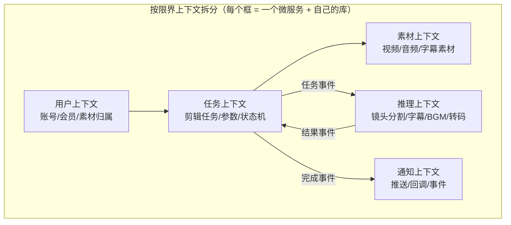
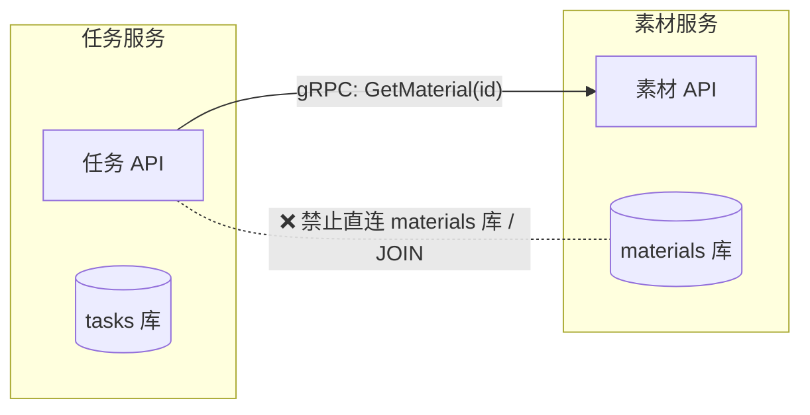
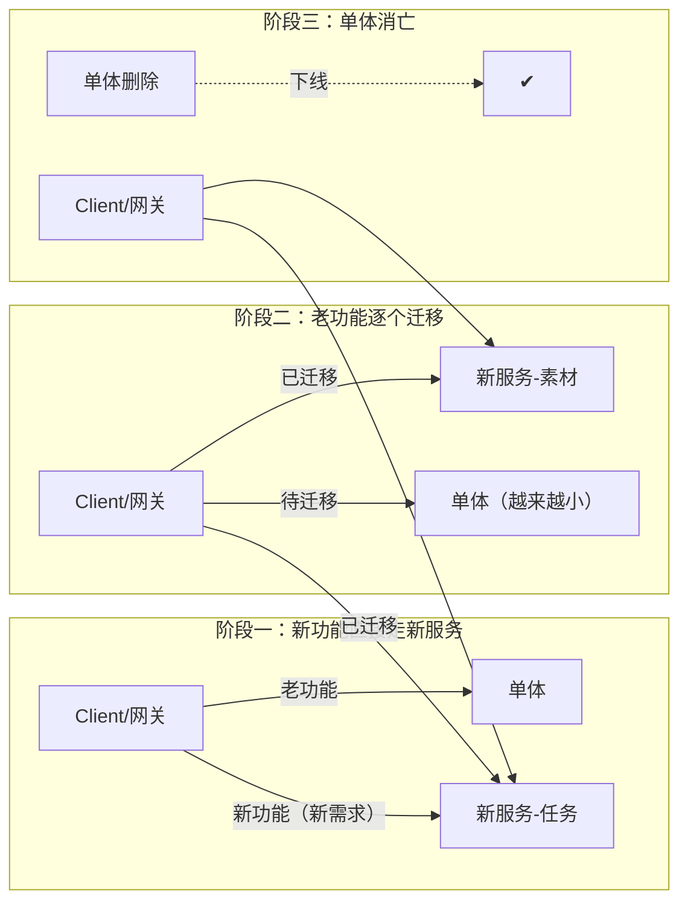
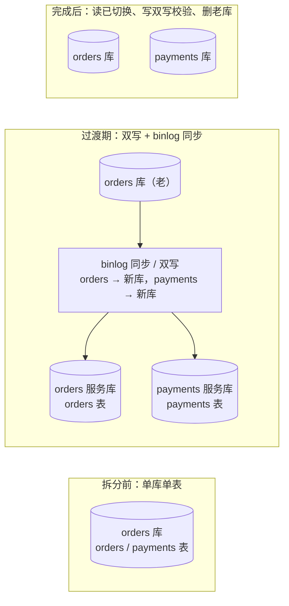
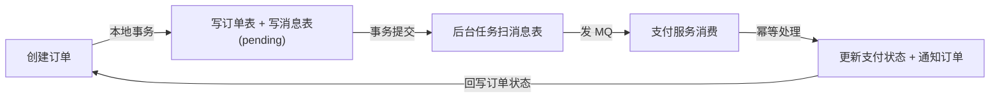
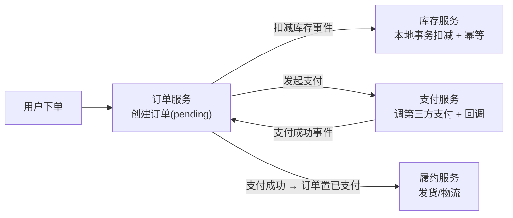

# 一个复杂的单体应用，大厂是怎么拆的？—— 单体拆分与边界设计

> 属于 S4 Go 微服务 · 第一篇
> 下一篇：[架构与gRPC](./架构与gRPC)

> **本篇文章解决三个问题**：① 什么时候该拆（动机与时机）；② 边界画在哪（第一性问题）；③ 怎么安全地拆（迁移方法论）。末尾带面试追问链。
>
> 配套训练：[路线专题 Day 9 综合实战](/路线专题/02-后端与计算机基础#day-9-综合实战日-单体拆微服务与生产级微服务骨架)（单体拆分重构练习 + 生产级微服务骨架代码）。

## 一、什么时候拆：动机与时机

### 1.1 先立共识：Monolith-first

**"先单体，后拆分"（Monolith-first）是业界共识**。大厂不会一上来就微服务——单体在业务早期是最高效的形态（没有网络开销、没有分布式一致性问题、改一处全量生效）。拆是一个**组织问题 + 技术问题**，动机不成立就拆，等于把复杂度从代码层搬到运维层。

### 1.2 拆的动机（4 条，出现 2 条以上才考虑拆）

| 动机 | 信号 | 拆了之后 |
| --- | --- | --- |
| ① 团队协作 | 多人同时改一个仓库频繁冲突；"改个需求要跟 3 个组对版本" | 每个服务独立仓库/独立发布，团队自治 |
| ② 发布频率 | 全量发布越来越慢、回滚波及面大；小改动要等整体排期 | 服务独立发布，发布频率解耦 |
| ③ 故障域隔离 | 一个模块 OOM/死锁拖垮整个应用（**故障爆炸半径**太大） | 故障只炸一个服务，靠熔断/降级隔离 |
| ④ 独立扩缩容 | 视频转码是 CPU/GPU 密集，用户服务是 IO 密集，资源需求完全不同 | 各服务按自己的瓶颈独立扩缩容 |

### 1.3 不该拆的反例（面试爱问"什么时候不拆"）

- 团队 1~2 个人、领域还没摸清（拆了没人维护，接口没人定）；
- 业务强一致要求极高、一次操作要改多个数据（拆了要引入分布式事务，更糟）；
- 调用链对延迟极其敏感、且没有缓存/异步可兜底（每多一跳 RPC 就是一次网络开销）。

### 1.4 拆的时机信号（可以讲成项目经历）

部署脚本越来越复杂 → 一次发布 40 分钟 → 线上事故回滚要全量 → 两个小组改同一个文件 → 这时候才开始拆。

## 二、边界怎么定：拆的第一性问题

> **一句话**：边界画在**业务能力/领域**上，不是画在**代码/技术**上。拆错边界是微服务失败的第一原因——拆出来的不是服务，是"分布式的单体"。

### 2.1 DDD 限界上下文（Bounded Context）——标准答案

**限界上下文**：一个业务子域就是一个上下文，它内部有自己的模型、语言、数据；**不同上下文之间同一个词含义可以不同**（"用户"在支付上下文里是"账户"，在推荐上下文里是"画像"）。服务边界 = 限界上下文边界。

**AI 剪辑的限界上下文划分**（对着这个例子背）：

**找边界的实操四步**（面试能讲步骤很加分）：
1. **画业务事件流**：把一次完整业务（提交剪辑 → 出片）的所有事件列出来，事件之间的"间隙"就是候选边界；
2. **找共享模型**：两个模块在争同一个实体（都想改 Task 表）→ 边界画错了，要么合并、要么把实体归属一个上下文；
3. **看变更频率**：一起变更的放一起（**共同变更原则**），各自独立演进的切开；
4. **看资源特征**：GPU 密集的推理单独拆（独立扩缩容），IO 密集的 API 单独拆。

### 2.2 康威定律（Conway's Law）

> "设计系统的组织，其产生的设计等价于组织之间的沟通结构。"

**面试用法**：系统结构会**镜像组织架构**。所以大厂拆服务之前先拆团队——一个服务 = 一个 2-pizza 团队（约 5-9 人）拥有，服务边界 = 团队职责边界。如果团队还是"前端组/后端组/数据组"的纵向结构，却想拆横向业务服务，必败。**先调组织，再拆代码。**

### 2.3 Database-per-service：数据所有权是边界的最终锚点

**规则（必背）**：每个服务**独占自己的数据库**，其他服务只能通过该服务的 API 访问数据，**禁止跨服务直接查表 / 禁止跨服务 JOIN**。

**为什么禁止共享表 / 跨服务 JOIN**：
- 共享表 = 两个服务在数据层耦合，改表结构互相炸，等于没拆；
- JOIN 跨库做不了（物理隔离）——**逼你把"查一次 JOIN"改成"两次 API 调用 + 应用层聚合"**，这就是边界的强制力；
- 数据所有权明确 → 每个服务能独立发布、独立回滚、独立扩缩容。

**代价（要主动讲）**：原来一个事务能保证的一致性，现在变成跨服务的最终一致（见 3.4）；原来一条 JOIN，现在两次 RPC（延迟变高，用缓存/批量/异步缓解）。

### 2.4 边界画错的信号（自检清单）

| 信号 | 根因 | 正确做法 |
| --- | --- | --- |
| 一个需求要改 3 个以上服务 | 按技术层拆的（controller/service/dao 各一个服务） | 按业务能力重新聚合 |
| 服务间循环依赖（A 调 B，B 调 A） | 边界重叠 | 引入事件/异步解耦，或合并成一个服务 |
| 跨服务 JOIN / 共享表越来越多 | 数据所有权没划清 | 明确库归属，API 化访问 |
| 分布式事务频发 | 强一致需求跨了边界 | 要么合并服务，要么接受最终一致（事件驱动） |
| 接口参数为了兼容两家疯狂加字段 | 契约设计失败 | 契约先行 + 版本管理（见 3.3） |

> **一句话总结边界**：先有团队边界（康威），再有业务边界（DDD 限界上下文），最后用数据边界（database-per-service）钉死；三者的交集就是服务边界。

## 三、拆的技巧：迁移方法论

> 已经决定拆了，怎么**安全地**从单体变成微服务？大厂从不"大爆炸式重写"（big-bang rewrite 必死），而是用下面的渐进式技巧。

### 3.1 绞杀者模式（Strangler Fig Pattern）

**思路**：不推翻重写，而是**在单体外面长出新服务**，逐步把功能搬走，最后单体被"绞杀"消亡。

**关键点**：
1. 路由层（网关/入口）负责"哪个功能走单体、哪个走新服务"——**先做路由抽象，再做迁移**；
2. 每次迁移一个**完整业务能力**（不是函数级），迁移完立刻灰度验证（见 3.6）；
3. 老代码删不干净 = 没迁移完（绞杀者模式最大的坑是"新老双写了两遍逻辑，老代码没人敢删"）。

### 3.2 防腐层（Anti-Corruption Layer，ACL）

**问题**：单体里的老模型很"脏"（字段混乱、语义含糊），新服务如果直接复用老模型，脏会传染到新领域。

**解法**：在单体和新服务之间加一层**翻译层**——新服务只认识自己的干净模型，ACL 负责"老模型 → 新模型"的转换，把老系统的坏味道挡在外面。

**面试用法**：拆库迁移时，老库字段 `status='2'`、新库 `status='failed'`，ACL 做映射；迁移完成后删掉 ACL，领域模型保持干净。

### 3.3 契约先行（Contract First）

**先定接口，再写实现**：两个团队并行开发时，先定义好 proto（gRPC，Protobuf 字段编号兼容）/ OpenAPI，双方按契约开发，用 **mock 联调**，最后对接。

**版本兼容铁律**：加字段向后兼容（客户端忽略未知字段）；删字段先废弃、预留编号；改语义要升版本（v2），新旧并存灰度。

### 3.4 数据拆分：最难的一步

**原则：先拆代码，后拆数据**——代码边界先立起来（接口化），数据最后动刀。

**一个"订单 + 支付"的例子（拆库过渡）**：

**步骤（背这个顺序）**：
1. **代码先拆**：order 服务 / payment 服务各自接口化，业务层不再直接 JOIN；
2. **数据双写**：新老库都写（老库为源），binlog/应用层双写同步新库，**对账**（定时比对，不一致告警修复）；
3. **读切换**：读流量逐步切到新库（先小流量灰度），老库只写不读；
4. **写切换 + 删除**：写流量切新库，观察无对账差异后删老库。

**最终一致 + 幂等（拆库后没有跨库事务了）**：跨服务状态同步靠**事件 + 幂等消费**（Kafka at-least-once + 状态机/唯一键），加一个**对账任务**兜底漏单。

### 3.5 避免分布式事务：本地消息表 / 事务消息 / SAGA

**核心观点（必背）**：**能用最终一致解决的，绝不用分布式事务**。2PC（两阶段提交）在互联网大厂基本不用——它要全局锁、协调者单点、阻塞式，性能和可用性都扛不住。

| 方案 | 原理 | 适用 | 优缺点 |
| --- | --- | --- | --- |
| 本地消息表 | 业务和发消息在**同一个本地事务**里：先写业务表 + 消息表（状态 pending），事务提交后后台扫消息表发 MQ，发成功置 done | 单体→微服务过渡期，通用 | 简单可靠；多一次本地表写入，消息表要清理 |
| 事务消息（RocketMQ） | 先发"半消息"（消费者不可见）→ 本地事务成功 → 确认提交，消息才可见 | 有 RocketMQ 的团队 | 消息中间件能力强；Kafka 没有原生事务消息 |
| SAGA 补偿 | 把长事务拆成一系列本地事务 + 反向补偿操作（订票成功 → 支付失败 → 取消订票） | 长流程、无强一致要求 | 要写补偿逻辑，要处理"补偿也失败"的兜底 |

**什么时候才考虑强一致**：资金类、对账必须精确的场景 → 但即便如此也是"单库本地事务 + 异步对账"，而不是跨服务 2PC。

### 3.6 灰度迁移：怎么安全上线

1. **按流量灰度**：网关/注册中心按权重把 x% 流量引到新服务（配合 S4 的注册中心 + 负载均衡）；
2. **按用户灰度**：白名单用户（内部员工、种子用户）先走新链路；
3. **影子流量（Shadow）**：把线上请求**复制一份**打到新服务，比对结果差异（只观测不承接，验证逻辑正确性）；
4. **全链路可观测**：日志、TraceID 贯穿、指标、告警齐了才敢切；
5. **快速回滚**：新服务出问题 → 网关把流量切回单体（路由抽象的价值就在这里）。

> 加分项：**服务网格（Service Mesh）**——把熔断/限流/灰度/可观测下沉到 Sidecar（istio），业务代码只写逻辑。面试提到"拆完的治理下沉到 mesh，业务无感"即可。

## 四、案例：大厂怎么拆

### 4.1 电商（订单 → 库存 → 支付）——经典拆分样板

**边界与可靠性要点**：
- 订单/库存/支付各自独立库，**库存扣减用"预占 + 超时释放"**（下单预占库存，超时未支付自动释放——Lease 思想在业务里的应用）；
- 支付回调是**异步 + 幂等**的（第三方回调可能重复，用支付单号做幂等键）；
- 订单状态机：pending → 已支付 → 已发货，每个状态迁移都是事件驱动，绝无跨库事务。

### 4.2 AI 剪辑（按资源特征 + 业务能力拆）

| 服务 | 边界（为什么这么切） | 关键设计 |
| --- | --- | --- |
| 任务服务 | 承接 API、任务状态机 | 幂等创建 |
| 素材服务 | 视频/音频/字幕的存取与预处理 | 对象存储 + 元数据 |
| 推理服务 | **GPU 密集，独立扩缩容**（业务峰值时推理是瓶颈） | 独立部署，Kafka 异步投喂任务，gRPC 流式回传 |
| 转码服务 | CPU 密集，与推理资源特征不同 | 独立队列 + 独立集群 |
| 通知服务 | 面向用户的推送/回调，频控 | 事件驱动，重试 + 幂等 |

**为什么推理服务必须独立拆**（结合岗位讲）：一次剪辑要调"镜头分割 → 智能字幕 → BGM 匹配"多个模型，单次推理几十秒、GPU 独占——如果和 API 服务混在一起，一个推理任务就把 API 协程占满，全站请求排队。拆开后：API 只负责"接单 + 落库 + 发 MQ"（毫秒级返回），推理 worker 异步消化——**这就是异步化削峰在微服务边界的体现**。

## 五、面试追问链（练到能自然接住）

**Q：什么时候拆？** 团队冲突 + 发布慢 + 故障爆炸半径大 + 独立扩缩容，出现 2 条以上；团队小/领域不清/强一致要求高时不拆（monolith-first）。
**追问：边界怎么定？** DDD 限界上下文（按业务能力，不按技术层）+ 康威定律（团队边界）+ database-per-service 钉死数据所有权。
**追问：为什么禁止跨服务 JOIN？** 共享表 = 数据层耦合没拆干净；跨库无法 JOIN，逼你 API 化 + 应用层聚合。
**追问：拆库后数据一致性怎么办？** 不用 2PC：本地消息表 / 事务消息 / SAGA + 消费幂等（状态机 + 唯一键）+ 对账任务兜底，最终一致。
**追问：怎么灰度迁移？** 绞杀者模式 + 防腐层 + 流量/用户灰度 + 影子流量对比 + 可观测 + 快速回滚。
**追问：拆完调用链变长变慢怎么办？** 异步化（MQ）+ 缓存（本地/Redis）+ 批量接口 + BFF 网关聚合，串行改并行。
**追问：怎么判断拆成功了？** 发布频率独立、故障只炸单个服务、需求变更只动一个服务、无跨服务事务、无循环依赖。
**追问：服务间通信怎么选？** 要结果用 gRPC（同步），不关心结果用 Kafka（异步）；**默认先异步，同步是显式选择**。

---

## 串起来

拆单体的完整方法论：**先判断动机（什么时候拆）→ 再定边界（DDD + 康威 + database-per-service）→ 最后安全迁移（绞杀者 + 防腐层 + 契约先行 + 数据双写 + 灰度）**。边界画在业务能力上、数据所有权钉死、最终一致 + 幂等兜底——这三句话就是微服务拆分的大厂答案。

下一篇讲**架构与 gRPC**：拆开之后，服务之间怎么高效通信。
