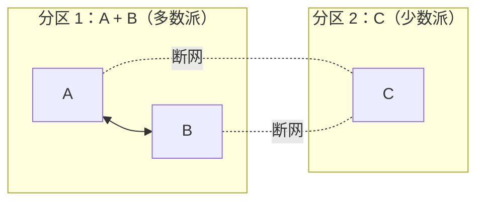
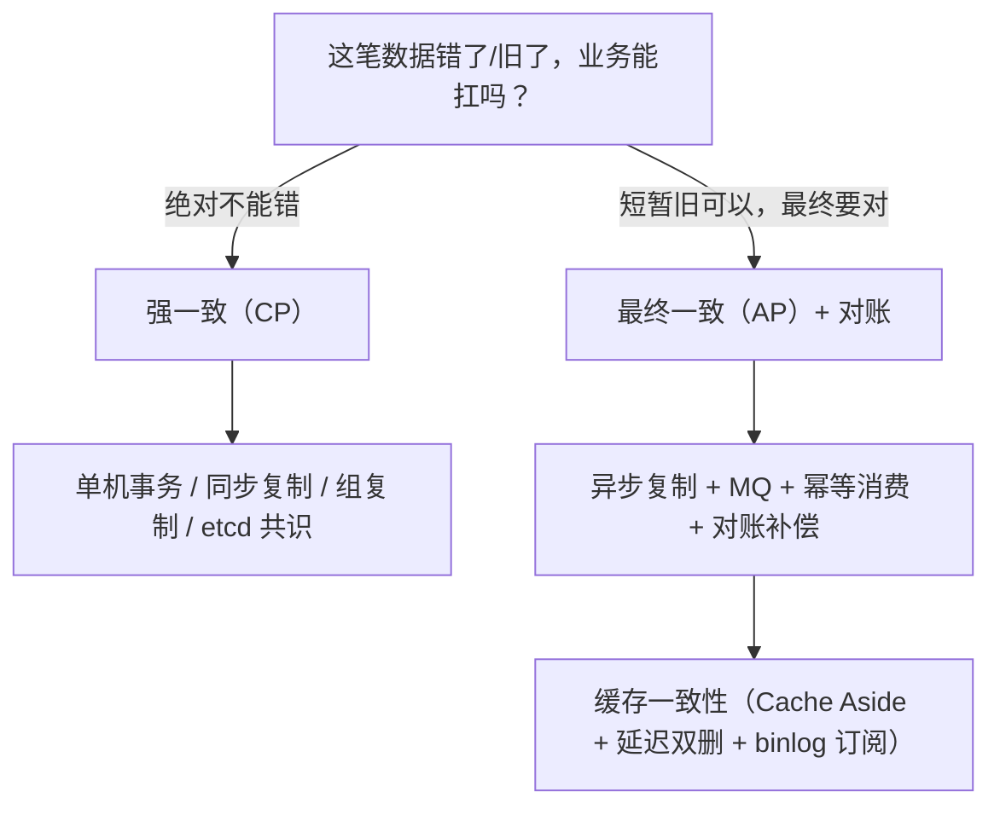

# AP 还是 CP？—— 一致性与故障边界深挖

> 属于 S5 高并发系统设计 · 第一篇
> 下一篇：[场景题（上）](./场景题-上)
> 关联：[S8 CAP 与 BASE 理论](./../08-distributed/CAP与BASE理论)（理论版）、[S3 Kafka 可靠性与积压](./../03-kafka/可靠性与积压)、[S7 K8s 高可用与故障排查](./../07-k8s/高可用与故障排查)

> **这篇解决什么问题**：面试官深挖时不会满足于"etcd 是 CP、Eureka 是 AP"这种结论。他真正问的是——**"某一个组件挂了，系统到底会发生什么？丢多少数据？多久恢复？怎么保证业务不崩？"**。本篇把一致性/故障的底层逻辑讲透：一致性强弱谱系 → 故障模型 → 分区下的 AP/CP 完整行为 → 每个组件逐层分析 → 最终一致 vs 强一致的实现边界 → 五条面试深挖追问链。

## 一、一致性强弱谱系：先把"一致"钉死

**核心认知：一致性不是一个开关，是一个谱系。** 从最强到最弱，每弱一档，就允许一种"异常"出现。面试讲不清楚"允许什么异常"，就没资格谈选型。

| 一致性 | 允许什么"异常" | 典型实现 | 代价 |
| --- | --- | --- | --- |
| **线性一致**（Linearizability，最强） | 任何异常都不允许：所有操作像在**单一时间点**原子发生，且顺序与真实时间一致；读一定能看到"之前已返回成功"的写 | Raft/quorum（etcd、ZK）、单机数据库、MGR 组复制、MySQL 半同步（近似） | 写要等多数派/同步确认，延迟高、分区时少数派拒绝服务 |
| **顺序一致** | 所有节点看到**相同的操作顺序**（但不要求与真实时间一致） | 单主复制（读写都走主） | 主节点单点、吞吐受限 |
| **因果一致** | 有因果关系的操作（A 发生所以 B）必须有序；无因果关系可乱序 | 分布式数据库（Cassandra 因果提示）、CRDT 部分实现 | 需要追踪因果依赖 |
| **读己之写 / 单调读** | 只保证"自己写的一定读得到" / "读到的值不回退" | 会话级路由（同一会话固定读同一副本） | 路由逻辑复杂 |
| **最终一致**（最弱） | **允许读旧值、允许短暂不一致**，只要"停止写入后，最终收敛到同一值" | 异步主从复制、MQ + 幂等消费、DNS | 收敛前可能读到旧数据，需要业务容忍 |

**关键点（必背）**：
- **CAP 里的 C 特指线性一致**——所以"CAP 三选二"谈的是"线性一致、可用、分区容错"三者的取舍，不是"所有一致性"；
- 面试说"我们系统是最终一致"时，要能接着说"**哪部分数据**最终一致、**多快**收敛、**不一致窗口内业务怎么处理**"——这才是深挖点；
- 强一致不是免费的：**每次写都要等确认**（多数派/同步从），延迟和可用性都打折。**选一致性强弱 = 选"这笔数据错了/旧了，业务能不能扛"**。

## 二、故障模型：先定义"挂了"是什么

面试官说"节点挂了"，你脑子里要立刻分成五种情况——**不同故障模型，答案完全不同**：

| 故障模型 | 含义 | 关键特征 |
| --- | --- | --- |
| **Fail-stop** | 进程停止且不恢复 | 最理想：所有人都知道它死了，好处理（现实中几乎不存在） |
| **Crash-recovery** | 进程崩溃后能重启恢复（从磁盘日志恢复） | **现实中最多的情况**：MySQL/Redis/etcd 进程重启，靠 WAL/binlog/AOF 恢复 |
| **网络分区（P）** | 部分节点之间不可达，但**各自都活着、各自都能服务** | **一切边界问题的根源**：节点不知道自己是"被分区了"还是"别人挂了"，会做出错误判断 |
| **脑裂（Split-brain）** | 分区后，两边都以为自己是主/都继续接受写 | 分区 + 错误判断的后果：**两边都写，数据分叉** |
| **时钟漂移** | 节点本地时钟不一致（NTP 抖动） | 让"基于时间的判断"（Lease、TTL、超时）全部不可靠 |

**一句话总结**：**"节点挂了"在工程上几乎总是 Crash-recovery 或网络分区**。而网络分区最阴险——因为"检测挂没挂"本身就是分布式系统最难的子问题（心跳超时怎么定？短了误判，长了恢复慢）。

## 三、分区下的 AP 与 CP：完整行为

### 3.1 Quorum：W + R > N 为什么能防读旧值

先立数学基础。N 个副本，写要 W 个确认，读要 R 个副本参与：

- **W + R > N**：读写集合必有交集 → 读一定能看到"最近一次已确认的写" → **线性一致的充分条件**（配合版本比较）；
- **W > N/2（多数派）**：任意两个写集合必相交 → **不会同时有两个写成功** → 防脑裂的数学基础；
- Raft/etcd/ZK 取 W=R=多数派：**读写都要过半数**，任何时刻最多一个"最新值"。

**追问：为什么 Raft 读也要多数派？** 因为如果不和多数派确认，读可能落在"日志落后的副本"上读到旧值（线性一致读用 ReadIndex 先和多数派确认身份，见 S8）。

### 3.2 分区下的 CP：多数派继续、少数派拒绝

以 3 节点 etcd 为例，网络分区成 {A,B} 和 {C}：

- **多数派（A+B）**：正常读写——写要 2/3 确认，能达成；**CP 的"可用性"只在这半边**；
- **少数派（C）**：拒绝读写（写凑不齐多数，读的 ReadIndex 也凑不齐多数）——**用"拒绝服务"换"绝不给出错误数据"**；
- 恢复后：C 通过快照 + 日志追赶（落后太多用 InstallSnapshot），追平后重新加入；
- 面试金句：**"CP 不是高可用，是'少数派宁可不可用也不给错数据'"**——这正是 K8s 要求 etcd 奇数节点、多数派存活的原因。

### 3.3 分区下的 AP：两边都写，恢复后合并

以 5 节点 Cassandra（AP）为例，分区成 {A,B} 和 {C,D,E}：**两边都接受写**（各自写自己那半边），分区解除后要做**冲突合并**：

| 合并策略 | 原理 | 边界条件（面试深挖点） |
| --- | --- | --- |
| **LWW（Last-Write-Wins）** | 以时间戳/版本号大的为准 | **时间戳可能相同或漂移** → 丢更新（两个客户端都"成功"了，一个被静默覆盖） |
| **版本向量（Version Vector）** | 每个节点维护"各节点写计数"向量，冲突时**检测出来不自动合并**，抛给业务 | 冲突检测有了，但**合并仍要业务写代码**（购物车合并就是业务合并） |
| **业务级合并** | 如购物车：两边加的商品都保留 | 最安全，但**不是所有数据都能业务合并**（账户余额能合并吗？） |

**核心洞察（必背，面试官最爱听这句）**：**AP 不是"没有一致性"，而是"把一致性从写入时推迟到合并时"**。分区期间数据分叉是必然的，**合并策略才是 AP 系统真正的难点**——所以选 AP 之前先回答："冲突能不能合并？合并规则是什么？合并错了业务能不能承受？"

### 3.4 脑裂的本质与防法

**脑裂 = 分区 + 两边都误以为自己可以当主/继续写**。防脑裂三板斧：

1. **多数派/Quorum**：只有拿到多数派"授权"的才能当主（Raft 选主、ZK 选主、MGR 组复制）；少数派无论如何不能写——从数学上排除"两个主"；
2. **Epoch / Term / Fencing Token**：每次选主产生一个递增的代际号；**旧代际的请求必须被拒绝**。经典案例：HDFS 的 fencing、Kafka 的 controller epoch、etcd 的 term；
3. **心跳仲裁 + 超时**：主通过"持续心跳"维持地位，丢心跳超过阈值自动让位（Redis 哨兵的主观/客观下线、etcd 的选举超时）。

**追问：只有多数派够吗？** 不够——多数派只能保证"同一时刻最多一个主"，**不能阻止"旧主在分区期间继续写"**（旧主可能不知道已被降级，它写的还是多数派外的节点？不——旧主写需要多数派 ACK，分区后它凑不齐多数，写会失败）。**所以 Raft/etcd 的脑裂防线是"旧主写不成功"**；而 Redis 主从（异步、无 quorum 写确认）才会出现"旧主继续写成功"的脑裂——见 4.2。

### 3.5 一张图记住 AP/CP 全貌

| 维度 | CP（etcd/ZK/MGR/半同步） | AP（Redis 主从/Eureka/Cassandra） |
| --- | --- | --- |
| 分区时少数派 | **拒绝读写**（宁不可用，不给错） | **继续读写**（宁给旧值，不拒绝） |
| 分区时多数派 | 正常服务 | 正常服务 |
| 恢复方式 | 少数派追日志/快照，追平加入 | 两边合并冲突（LWW/版本向量/业务合并） |
| 数据丢失风险 | 不丢已提交数据（崩溃恢复保证） | **可能丢"未同步的写"**（异步复制窗口） |
| 延迟代价 | 写要多数派确认（慢） | 写只要主确认（快） |
| 典型代价 | 少数派不可用、选举期不可写 | 合并复杂、可能丢更新 |

## 四、组件故障全景：每个组件"节点挂了"逐层分析

> 面试深挖的主战场。**每个组件都要能回答：① 挂的是什么角色；② 丢多少数据（数据窗口）；③ 多久恢复；④ 这个组件在 AP/CP 谱系的哪一档；⑤ 恢复的边界条件。**

### 4.1 MySQL 主从：主挂了，丢多少数据？（最常被深挖）

| 复制模式 | 主挂时的行为 | 丢数据窗口 | AP/CP 定性 |
| --- | --- | --- | --- |
| **异步复制** | 从库可能落后主（网络/负载），主挂 → 选从提升 | **丢"主已提交但 binlog 还没同步到从"的所有事务**——窗口 = 主从延迟，可能几秒到几分钟 | **AP**：可用性优先，**可能丢已提交数据** |
| **半同步复制**（semisync） | 主提交前**等至少一个从 ACK 收到 binlog** | 已提交事务**不丢**（有从持有 binlog）；丢的只是"主已执行未提交"的事务（本来就没提交）；**边界**：从全挂或 ACK 超时（`rpl_semi_sync_master_timeout`）降级回异步 → 降级窗口内回到 AP | 接近 **CP**（提交 = 至少一份远程确认） |
| **MGR 组复制**（多数派） | 写要**多数派节点确认**；少数派节点被隔离、自动踢出；主挂 → 多数派中选新主 | 已提交事务不丢（多数派都有）；**边界**：需要 ≥3 节点，挂到只剩 1 个就不可写 | **CP**（类 Raft 多数派） |

**深挖链（连问到底，见第六节链 1）**：异步主挂丢多少？→ 为什么半同步不丢？→ 半同步还有没有丢窗口（超时降级）？→ 选主怎么选到"最新的从"（GTID）？→ 异步复制选主为什么可能丢已提交事务？→ 所以金融/订单为什么必须半同步或组复制？

### 4.2 Redis：主从 + 哨兵 / Cluster——丢写窗口与脑裂（重灾区）

**① 主从 + 哨兵，主挂：**
- 流程：哨兵**主观下线**（单个哨兵心跳超时）→ **客观下线**（quorum 个哨兵确认）→ failover 选从提升 → 通知客户端；
- **丢写窗口**：主从是**异步复制**，主挂时"主上已写、从还没复制"的写**全部丢失**；
- **哨兵自己挂**：哨兵要奇数个（≥3），quorum 只是"判定下线"的阈值，**failover 执行权由多数哨兵选举产生**——少于半数哨兵活着时无法 failover（保 CP 的判断：宁可暂不切换，不乱切换）。

**② Cluster，主挂：** 16384 个 slot，主挂 → 从节点发起提升（需多数 master 授权）；`cluster-require-full-coverage`：`yes`（默认）→ 任何一个 slot 无主，**整个集群拒绝写**（CP 倾向）；`no` → 只影响该 slot（AP 倾向）。**这是"同一组件内 AP/CP 配置开关"的经典例子。**

**③ 脑裂（split-brain）——面试深挖最狠的点：**
- **怎么发生**：主 M 与从们网络分区，但 M 自己活着且**客户端还连得着 M**。哨兵以为 M 挂了要 failover（其实 M 没挂），客户端继续写 M → 分区恢复，M 降级为从，**分区期间写入 M 的数据全部丢失**（因为新主没有这些数据，M 会被清掉追新主）；
- **怎么防（必背两个参数）**：`min-replicas-to-write 1`（写前要求至少 1 个从确认）+ `min-replicas-max-lag`（从延迟超过阈值拒绝写）——**用"少数派不可写"换"不脑裂不丢写"**，代价是只有一个从且从挂时主不可写；
- **本质**：Redis 主从**写不要求 quorum**（只有主确认），所以"旧主在分区期间继续写成功"——这就是 3.4 说的"Raft 靠多数派写防脑裂，Redis 没有这个防线，必须用 min-replicas 补"。

### 4.3 etcd / ZooKeeper（Raft/ZAB）：CP 的代价与恢复

- **挂 1 个**（3 节点）：多数派存活，正常服务；挂 2 个：**只读不写**（多数派写失败，ReadIndex 读也要多数派确认）——这是"CP 少数派拒绝服务"的标准答案；
- **Leader 挂**：选举期（随机超时 150~300ms）内不可写 → **CP 的"可用性缺口"就是选举时间**；
- **恢复**：落后节点用快照（InstallSnapshot）+ 日志追赶，追平后加入；成员变更用单节点变更（S8 讲过）；
- **Pre-Vote**：被分区的少数派 term 会一直涨，恢复后可能用高 term 打断新 leader——Pre-Vote 先"预投票"确认能联系多数派才正式选举，防 term 暴涨和可用性抖动；
- **读一致性**：ReadIndex（默认，Leader 先与多数派确认身份再本地读）/ Lease 读（依赖时钟，省一次 RTT）。

### 4.4 Kafka：ISR 与"不丢"的边界

- **ISR（in-sync replicas）**：与 leader 保持同步的副本集合；leader 挂 → **只能从 ISR 中选新 leader**（非 ISR 副本可能落后，选它 = 丢数据）；
- **"不丢"的完整条件（必背）**：`acks=all`（等 ISR 全确认）+ `min.insync.replicas≥2`（写前要求 ISR 至少 2 个）。**边界**：如果 ISR 只剩 leader 自己（其他副本全挂），`acks=all` 也等于"只等自己"——leader 一挂，消息全丢；`min.insync.replicas=2` 则此时**拒绝写**（`NotEnoughReplicas`）——**用可用性换不丢，和 Redis min-replicas 是同一个 trade-off**；
- **恰好一次**：幂等 producer（PID + seq 去重）+ 事务（跨分区原子）+ **消费端幂等提交**（处理成功才提交 offset + 唯一键去重）——注意：**"恰好一次"需要端到端配合，Kafka 单方面保证不了"消费恰好一次"**（消费端崩溃重放是 at-least-once，要靠消费幂等收敛）；
- **Controller 挂**：重选 controller（epoch 递增防脑裂），期间分区 leader 选举暂停（可用性缺口）。

### 4.5 注册中心：AP vs CP 选型与降级链

- **为什么生产常选 AP（Eureka）**：注册中心"读到过期实例列表"的代价 = 一次失败请求 + 重试；"注册中心整体不可用"的代价 = 所有服务找不到彼此 = **全网瘫痪**。所以可用性 > 实时性；
- **etcd/ZK 做注册中心**（CP）：实例列表**永远准确**，但分区时少数派那半边**注册/发现都不可用** → 服务上线失败/调用失败；
- **降级链（注册中心挂了怎么办，必背）**：调用方**本地缓存实例列表**继续服务（不实时但可用）→ 缓存也失效 → 直连配置的兜底地址 → 再不行熔断降级。**这就是为什么"注册中心可以挂，服务不能挂"——客户端缓存是第一道防线**；
- **自我保护模式（Eureka）**：心跳大面积丢失时**不立即剔除实例**（可能是网络抖动而不是实例真挂），**用"宁可短暂保留僵尸实例"换"不误杀健康实例"**——典型的 AP 防御性设计。

### 4.6 分布式锁：故障边界（面试深挖最狠之二）

**① Redis 锁在主从切换时怎么失效：**
- A 拿到锁（写进 master）→ master 挂 → 从提升（**没有 A 的锁**）→ B 拿到锁 → **A、B 同时"持锁"**，互斥被破坏；
- **Redlock 为什么有争议**：试图用"多节点 + 多数派"解决，但依赖**时钟同步假设**（锁的 TTL 判断靠各节点本地时间），时钟漂移下依旧可能双持锁；且锁在 Redis 里没有 fencing token 机制；
- **结论（面试说这段最加分）**：Redis 锁 = **性能优先、可容忍极小概率互斥失效**的场景（防击穿、防重复提交这种"失效了重试一次就行"的）；**必须绝对互斥的场景（扣款、选主、任务调度去重）用 etcd/ZK 锁**。

**② etcd 锁为什么安全：** 租约（Lease）+ `Txn(CreateRevision==0)` 原子占坑 + 多数派写确认 → **锁不会因为主从切换丢失**（等锁的客户端只能等租约过期）。

**③ 锁过期了怎么办——真正的深挖点：**
- 问题：业务执行超过锁 TTL → 锁过期 → 第二个客户端拿到锁 → **双执行**；
- 解法一：**看门狗（watchdog）续租**——只缓解，**不能根治**（续租请求也可能晚到）；
- 解法二（根治）：**Fencing Token**——锁服务每次发锁附带**递增 token**，写数据时带上 token，**存储端拒绝旧 token 的写**（比如写库时校验"我手上的 token 是否还是最新的"）。**这才是"旧锁持有者不能写数据"的真正防线**，Redis 锁没这个能力，etcd 锁可以自己实现；
- 面试金句：**"续租解决'锁提前过期'，fencing token 解决'过期后旧持有者继续写'——后者才是安全性的关键。"**

### 4.7 分布式事务：2PC / TCC / SAGA 的边界

**① 2PC 为什么大厂不用（必背三个死法）：**
- **协调者挂** → 参与者**阻塞**（不知道 commit 还是 abort），必须等协调者恢复 + 查日志，期间资源锁不释放；
- **参与者挂** → 协调者超时 abort，但"参与者其实已 prepare 成功"的**状态不一致**要人工/日志处理；
- 本质：2PC 是**阻塞式协议**，把单点（协调者）和阻塞（锁资源）引入系统——在"节点一定会挂"的现实下不可接受。

**② TCC（try/confirm/cancel）边界：**
- confirm/cancel 必须**幂等**（网络重试）；
- **空回滚**：try 没执行成功，但 cancel 被调用了 → 要能识别并忽略；
- **悬挂**：try 超时后 cancel 执行了，之后 try 才到达 → 要拒绝"迟到 try"（防悬挂，用事务控制表）。

**③ SAGA 边界：** 正向操作 + 反向补偿；**补偿也可能失败** → 补偿重试 + 对账 + 人工兜底；**补偿的补偿**要设计终止条件（不能无限补偿下去）。

**④ 最终一致落地四件套（任何异步链路都必须有，背这个）：** ① MQ 投递（本地消息表/事务消息保证"发了"）→ ② 消费幂等（唯一键 + 状态机）→ ③ **对账任务**（定时比对两端，发现不一致）→ ④ 补偿动作（按对账结果修复）。**没有对账的最终一致 = 裸奔。**

## 五、最终一致 vs 强一致：实现图谱与选型

### 5.1 强一致怎么实现

| 手段 | 原理 | 适用 | 边界 |
| --- | --- | --- | --- |
| 单机事务 | 一个库一个事务 | 单机场景 | 单点、容量上限 |
| 同步复制 / 组复制 | 写等多数派/同步从确认 | MySQL MGR、半同步、etcd/ZK | 延迟高、少数派不可用 |
| Quorum 协议 | W+R>N，W>N/2 | 自研存储 | 要自己处理成员管理 |
| 2PC | prepare→commit | 理论上有，工程几乎不用 | 阻塞、协调者单点 |

**强一致的共性代价：写慢 + 故障时部分不可用。** 选它之前先回答：这笔数据"错一次"的代价，大于"慢一次 + 偶尔不可用"的代价吗？

### 5.2 最终一致怎么实现

| 手段 | 原理 | 收敛保证 | 边界 |
| --- | --- | --- | --- |
| 异步主从复制 | 主写、从追 | 从追平即一致 | 主挂丢未同步写；从延迟窗口 |
| MQ + 幂等消费 | 发消息 → 消费端幂等处理 | 消费端状态机收敛 | MQ 挂了要本地消息表兜底 |
| 本地消息表 | 业务 + 消息同事务，后台扫表发 MQ | 重试 + 对账 | 消息表要清理、要监控积压 |
| SAGA 补偿 | 正向 + 反向补偿 | 补偿成功即收敛 | 补偿失败要重试 + 人工 |
| 对账 + 补偿 | 定时比对两端 | 对账发现即修复 | 对账周期内的窗口仍在 |

### 5.3 选型决策树（面试画这个）

**一句话选型**：钱、库存、状态机选强一致（或"单点强一致 + 异步对账"）；计数、Feed、列表、通知选最终一致；**能最终一致就绝不引入跨服务强一致**（那是分布式事务，是麻烦之源）。

## 六、面试深挖模拟：五条追问链（连问到底）

**链 1：MySQL 主挂（从 4.1）**
> 你：我们主从异步复制……
> 追问：主挂了丢多少数据？→ 丢主从延迟窗口内未同步的已提交事务。
> 追问：半同步呢？→ 提交前等从 ACK，已提交事务不丢；但 ACK 超时会降级回异步，降级窗口内又可能丢。
> 追问：那怎么选新主？→ GTID 找最新的从；异步复制如果选到落后从，已提交事务就丢了（所以金融不用异步）。
> 追问：为什么不用异步+定期备份？→ 备份是"恢复手段"不是"高可用手段"，RPO（丢多少）和 RTO（多久恢复）都大。

**链 2：Redis 脑裂（从 4.2）**
> 你：Redis 主从 + 哨兵……
> 追问：主和从分区了会发生什么？→ 老主还在被客户端写，哨兵 failover 出新主，恢复后老主降从，分区期间写入全丢（脑裂）。
> 追问：怎么防？→ min-replicas-to-write + min-replicas-max-lag，写前要求从确认。
> 追问：配置了之后主挂了一个从，主还能写吗？→ 不能（凑不齐从确认）——用可用性换不丢，这正是 AP/CP 的取舍。
> 追问：那业务怎么接受？→ 接受短暂写不可用，但绝不允许"已成功的写丢失"。

**链 3：etcd 挂两个（从 4.3）**
> 你：etcd 三节点……
> 追问：挂一个会怎样？→ 多数派存活，正常服务。
> 追问：挂两个呢？→ 只读不写（写要多数派确认，ReadIndex 读也要）。
> 追问：恢复后落后节点怎么办？→ 快照 + 日志追赶，追平重新加入。
> 追问：为什么 K8s 必须保证 etcd 多数派存活？→ 挂超半数 → 控制面无法变更/自愈，整个集群"失忆"。

**链 4：分布式锁失效（从 4.6）**
> 你：用 Redis SETNX 做分布式锁……
> 追问：主从切换时锁会怎样？→ 主挂丢锁 → 两个客户端同时持锁。
> 追问：怎么防？→ 强一致场景换 etcd 锁；Redis 场景接受极小概率失效。
> 追问：锁过期了但业务没跑完呢？→ watchdog 续租（缓解）+ fencing token（根治，存储端拒绝旧 token 写）。
> 追问：Redlock 呢？→ 多节点仲裁，但依赖时钟，有争议；不能作为"绝对互斥"的保证。

**链 5：最终一致落地（从 4.7）**
> 你：我们用 MQ 做异步最终一致……
> 追问：MQ 挂了消息发不出去怎么办？→ 本地消息表（业务 + 消息同事务），后台扫表补发。
> 追问：消费端重复收到怎么办？→ 唯一键 + 状态机幂等。
> 追问：对账发现不一致怎么办？→ 按对账结果跑补偿；补偿也失败 → 告警 + 人工。
> 追问：怎么证明"最终一致"真的会收敛？→ 三个条件：消息不丢（重试+对账）、消费幂等（不重复生效）、补偿闭环（失败有兜底）。

---

## 串起来

**AP/CP 不是一道选择题，是一套边界条件分析**：先定义故障模型（分区还是崩溃）→ 明确"这数据错一次代价多大"→ 再选一致性档位 → 最后把"组件挂了怎么办"的每个窗口讲清楚（丢多少、多久恢复、怎么防、怎么合并）。面试官深挖的每一个"如果 X 挂了"，都能落到本篇四、的某一行——**把每个组件的故障行为背成"窗口 + 恢复 + 防线"三件套，深挖就扛得住**。

下一篇开始用这套底层逻辑，逐个场景实战：**秒杀、红包、缓存一致性**。
