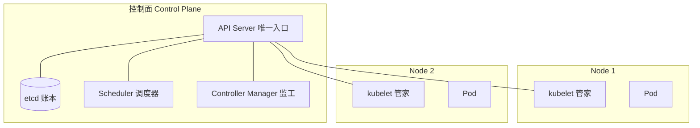

# 容器挂了谁帮你重启、流量往哪发？—— K8s 架构与核心对象

> 属于 S7 K8s 容器编排 · 第一篇
> 下一篇：[调度与控制器](./调度与控制器)

假设你已经会用 Docker：把 Go 服务打包成镜像，`docker run` 扔到一台服务器上跑。现在问题来了——进程崩溃了没人管；流量大了要手动开新容器；发新版本要停机。K8s 就是来解决这三件事的：**自愈（挂了自动重启）、编排（按声明调度多个实例）、服务发现（流量自动找到可用实例）**。它本质上是"容器的操作系统"：管的不再是单个进程，而是整个集群里成千上万个容器。

先补齐一个前提。容器本身靠三样东西实现：**namespace 隔离**（每个容器有自己的进程/网络/文件系统视图）、**cgroups 限额**（CPU/内存用多少）、**镜像打包**（代码 + 依赖一起分发）。K8s 不重新发明这些，它站在容器之上做"集群级"的调度和管理。

## 架构：谁在决策，谁在干活

一个集群分成两部分：**控制面（Control Plane）负责决策，Node（工作节点）负责干活**。把集群想象成一家公司：



- **API Server**：所有操作（kubectl、控制器、调度器）的唯一入口，相当于公司的"政务大厅"，一切请求都从这过。
- **etcd**：集群的"账本"，存所有状态，强一致（Raft）。账本丢了，公司就不知道自己有什么资产了。
- **Scheduler**：给新 Pod 找合适的 Node，相当于"房产中介"。
- **Controller Manager**：一堆控制器的集合，盯着"期望状态 vs 实际状态"，相当于"监工"。
- **kubelet**：每个 Node 上的"驻场管家"，负责启停本机的 Pod、向 API Server 上报状态。
- **kube-proxy**：Node 上的"交通警察"，管 Service 流量的转发规则（下一篇细讲）。

注意关系：**一切状态都只存在 etcd 里，其他组件都是"读账本 + 干活 + 写回账本"**。API Server 是唯一能读写 etcd 的组件，所以它是整个集群的枢纽。

## 最小调度单位：Pod

K8s 不直接管容器，而是管 **Pod**——Pod 才是最小调度单位。一个 Pod 里可以有一个或多个容器。为什么要多套一层？

- **同 Pod 的容器共享网络**（同一个 IP、同一套端口空间）和存储卷，适合"强耦合、要同生共死"的组合：主服务容器 + 日志采集边车（sidecar）、主服务 + 本地缓存代理。
- 调度、扩缩容、健康检查都以 Pod 为单位，Deployment 说"要 3 个副本"，指的是 3 个 Pod。

打个比方：容器是"进程"，Pod 是"进程组"——像合租的一套房，室友共享网络（同一 IP）和公共空间（存储卷），要么一起住，要么一起搬走。

## 声明式 API：你要的是"状态"，不是"操作"

K8s 最核心的设计思想：**你告诉它"我要什么"，而不是"你去做啥"**。传统运维是命令式——"启动 3 个容器，崩了再手动补"；K8s 是声明式——写一份 YAML 描述期望状态：

```yaml
apiVersion: apps/v1
kind: Deployment
metadata:
  name: go-app
spec:
  replicas: 3
  selector:
    matchLabels:
      app: go-app
  template:
    metadata:
      labels:
        app: go-app
    spec:
      containers:
        - name: app
          image: registry.example.com/go-app:v1
          ports:
            - containerPort: 8080
```

把这份 YAML `kubectl apply` 上去，剩下的（创建 Pod、崩溃补齐、版本更新）全部由控制器自动完成。声明式的好处是：**状态可描述、可审计、可回滚**——机器永远往"你写的样子"收敛，这就是 K8s 一切自愈能力的地基。

## 核心对象一张表

刚接触 K8s 会被一堆名词淹没，先记四个最核心的：

| 对象 | 作用 | 比喻 |
|------|------|------|
| **Pod** | 最小调度单位，一组共享网络的容器 | 一套房 |
| **Deployment** | 管理无状态应用：副本数、滚动更新、回滚 | 店长（管员工排班与换血） |
| **Service** | 稳定的访问入口，Pod IP 变了也不怕 | 前台总机 |
| **Namespace** | 逻辑隔离（按环境/团队分区） | 楼层或部门 |

后面的文章会再补上 Ingress（七层入口）、PV/PVC（持久化存储）、ConfigMap/Secret（配置）这几块拼图。

---

## 串起来

回到开头：容器时代你是个"个体户"，自己看着自己的进程；K8s 时代你开了家"公司"——控制面是管理层（决策），Node 是执行层（干活），Pod 是基层单元（最小调度单位），YAML 是给全公司下的"需求说明书"。而你只说了一句"我要 3 个副本"，剩下的谁来做？

下一篇讲**调度与控制器**：声明式 API 背后那台永不停机的"监工"是怎么工作的，新版本怎么做到发布不宕机。
