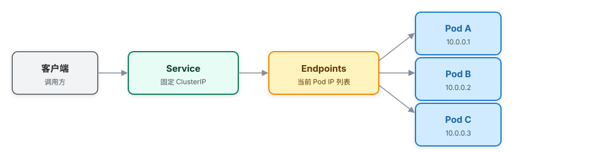

# Pod 的 IP 说变就变，流量怎么找得到它？—— 网络与存储

> 属于 S7 K8s 容器编排 · 第三篇
> 上一篇：[调度与控制器](./调度与控制器)　下一篇：[高可用与故障排查](./高可用与故障排查)

Pod 是"临时工"：被删了重建，IP 就换一个。客户端总不能每次重建都改配置。K8s 的答案是 **Service**——一个稳定的"门牌号"，它不管 Pod 怎么变，只管把流量送到"当前活着的 Pod"上。这一篇讲网络（Service/Ingress/DNS），再讲数据怎么在 Pod 消失后活下来（PV/PVC）。

## Service：稳定的门牌号

Service 有一个自己的虚拟 IP（ClusterIP），通过 **label selector** 选中一组 Pod，把它们的 IP 列表写进 Endpoints。客户端只跟 Service 的固定 IP 打交道：



> 图：客户端只认 Service 的固定 ClusterIP；Endpoints 维护"当前活着的 Pod"列表，Pod 挂了自动剔除、新 Pod 自动加入，转发由各 Node 的 kube-proxy 落地。

Pod 挂了被剔除、新的 Pod 加进来，Endpoints 自动更新，客户端无感。真正干活转发的是每个 Node 上的 **kube-proxy**：它把 Service 的规则转成 iptables/IPVS 规则，流量到达任意 Node 都能被转发到目标 Pod。

Service 有三种暴露方式，从内到外：

| 类型 | 作用 | 场景 |
|------|------|------|
| **ClusterIP** | 集群内虚拟 IP，外部访问不到 | 服务间调用（默认） |
| **NodePort** | 每个 Node 上开一个固定端口（30000-32767） | 简单对外暴露、测试 |
| **LoadBalancer** | 云厂商负载均衡器，背后挂 NodePort | 生产对外入口 |

## Ingress：七层入口

Service 是四层（IP + 端口），不管 HTTP 的域名和路径；**Ingress 是七层**，按域名/路径把请求路由到不同 Service——一个入口，多个服务的"前台接待"：

```yaml
apiVersion: networking.k8s.io/v1
kind: Ingress
metadata:
  name: api-ingress
spec:
  rules:
    - host: api.example.com
      http:
        paths:
          - path: /users
            pathType: Prefix
            backend:
              service:
                name: user-service
                port:
                  number: 8080
```

打个比方：**Service 是"前台总机"（只认电话号码），Ingress 是"前台接待"（听你报名字/部门再转接）**。

## 集群内 DNS：服务名即服务发现

K8s 内置 DNS（CoreDNS），每个 Service 自动获得一个域名：`服务名.命名空间.svc.cluster.local`。服务间调用直接写服务名，不用记 IP。回到 S4 微服务篇的注册发现——**在 K8s 里，Service + DNS 就是现成的注册发现**，服务实例的增删对调用方完全透明，这也是"K8s 天然适合微服务"的原因。

## 网络模型（CNI）

K8s 的硬性要求：**每个 Pod 有集群内唯一 IP，Pod 之间直接互通（不经过 NAT）**。这个网络怎么建，由 CNI 插件实现：

- **Flannel**：简单，VXLAN 隧道封装。
- **Calico**：BGP 路由，性能好，还支持 NetworkPolicy（网络策略，精细控制 Pod 间放行规则）。

## 存储：Pod 是临时工，数据得住进仓库

Pod 一删，容器里的数据全没。要持久化，用 PV/PVC 这套抽象：

- **PV（PersistentVolume）**：管理员预先准备好的存储（"仓库"），可以是云盘、NFS 等。
- **PVC（PersistentVolumeClaim）**：应用提交的"租用申请"，声明"我要 10Gi、可读写"。
- **StorageClass**：动态供给——PVC 一申请，按模板自动创建 PV（"自动盖仓库"），生产最常用。

```yaml
apiVersion: v1
kind: PersistentVolumeClaim
metadata:
  name: data-pvc
spec:
  accessModes:
    - ReadWriteOnce
  resources:
    requests:
      storage: 10Gi
```

配套还有 **ConfigMap**（普通配置）和 **Secret**（敏感信息，如密码、Token）。它们的意义是把配置从镜像里"抽出来"：同一个镜像，不同环境（开发/生产）挂不同的 ConfigMap，镜像本身不用重新构建。

---

## 串起来

网络这一层，K8s 的答案是一层套一层：**Pod 用唯一 IP 直连（CNI），Service 给易变的 Pod 一个固定门牌（kube-proxy 转发），Ingress 做七层路由，DNS 让服务名代替 IP**；存储这一层，PVC 申请、PV 提供、StorageClass 动态供给，让"临时工"Pod 的数据住进"仓库"。到这儿，正常流转讲完了——下一篇进入最实战的：**Pod 出问题了怎么破案？**
