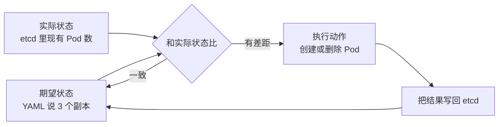
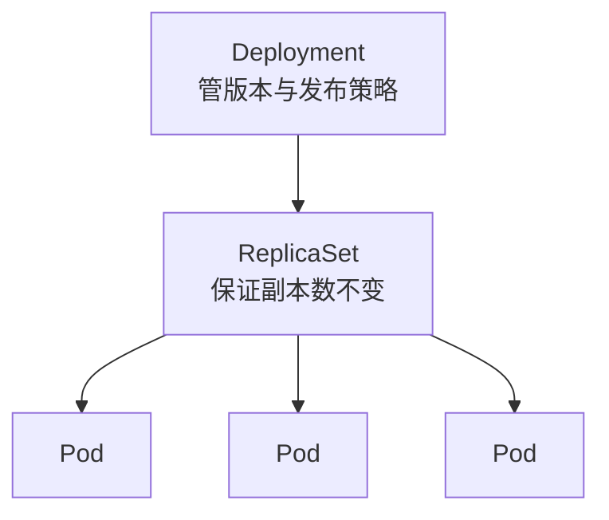
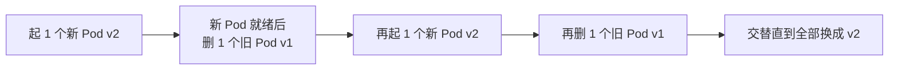

# 说一句"我要 3 个副本"，谁在替你盯着？—— 控制器与调度

> 属于 S7 K8s 容器编排 · 第二篇
> 上一篇：[架构与核心对象](./架构与核心对象)　下一篇：[网络与存储](./网络与存储)

上一篇你写了一份 YAML：`replicas: 3`，然后 `kubectl apply`，世界清净了。但你睡一觉醒来，有个 Pod 崩了——谁发现的？谁补上的？答案是**控制器（Controller）**。这一篇讲透控制器的核心机制，再讲一个新 Pod 诞生时"住哪台机器"由谁决定。

## 控制器模式：期望状态 vs 实际状态

所有控制器的内核是同一个循环，叫**控制循环（Reconcile Loop）**：



看明白这个循环，K8s 一半的自愈就懂了：**Pod 崩了 → 实际状态少一个 → 控制器发现差距 → 补一个 → 写回状态 → 继续盯着**。这个循环永不停机，就像"监工每隔几秒清点一次人数，少了就补"。

控制器之间还有层级：**Deployment 管 ReplicaSet，ReplicaSet 管 Pod**。



Deployment 每次发布新版本会生成一个新的 ReplicaSet，旧的保留着用于回滚。所以**生产环境不要直接用 ReplicaSet，一律用 Deployment**——它才有版本管理能力。

## 滚动更新：发布不宕机

发布新版本（v1 → v2），Deployment 的做法是"**先起新的、确认健康、再删旧的**"，交替进行：



两个参数控制节奏：`maxUnavailable`（更新过程中最多允许几个旧实例不可用）和 `maxSurge`（最多允许超出目标副本数几个新实例）。要保证"全程不宕机"，就设 `maxUnavailable: 0`（旧实例一个都不能先停）。

出问题要回滚，一条命令回到上一个 ReplicaSet：

```bash
kubectl rollout undo deployment/go-app
```

## 水平扩缩容：HPA

Deployment 管"数量恒定"，HPA（Horizontal Pod Autoscaler）管"数量随负载变化"。原理还是控制循环，只是期望值由指标算出来：盯 CPU 利用率等指标，超过阈值就加副本，低于阈值就减。流量洪峰来了不用人肉扩容：

```yaml
apiVersion: autoscaling/v2
kind: HorizontalPodAutoscaler
metadata:
  name: go-app-hpa
spec:
  scaleTargetRef:
    apiVersion: apps/v1
    kind: Deployment
    name: go-app
  minReplicas: 2
  maxReplicas: 10
  metrics:
    - type: Resource
      resource:
        name: cpu
        target:
          type: Utilization
          averageUtilization: 60
```

## 调度：新 Pod 住哪台机器

Scheduler 给新 Pod 找 Node，分两步：**先过滤（硬约束），再打分（软偏好）**。

- **过滤**：Node 剩余资源够不够 Pod 的 `requests`？端口有没有冲突？节点上的污点 Pod 能不能容忍？
- **打分**：节点亲和（nodeAffinity，想靠近某类节点）、Pod 亲和/反亲和（想和谁挨着 / 不想和谁挨着）、资源是否均衡。

这里有个必考概念：**requests 和 limits**。`requests` 是"最少要这么多"，是调度依据；`limits` 是"最多只能用这么多"，是使用上限。**requests 设高了浪费资源（调度时被高估），设低了可能被调度到挤爆的节点（运行时抢不到）**——调优这两个参数是 K8s 运维最常见的问题。

**污点与容忍**是一对配合：给节点打污点（taint，如"这台是 GPU 机器"），只有声明了对应容忍（toleration）的 Pod 才能调度上去——相当于"这台机器只给特定租户住"。

---

## 串起来

控制器保证"数量对、版本对"（ReplicaSet 盯数量，Deployment 管版本，HPA 让数量随负载自动变化），调度器决定"住哪台机器"（过滤 + 打分，requests 是入场券）。但还有最后一个问题没解决：**Pod 随时会重建、IP 每次都变，流量怎么找到它？** 下一篇讲网络与存储。
