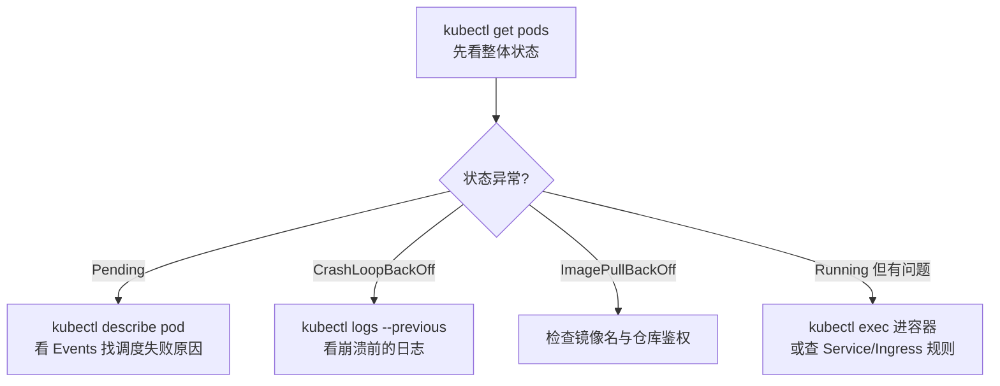

# Pod 一直 CrashLoopBackOff，怎么破案？—— 高可用与排障

> 属于 S7 K8s 容器编排 · 第四篇
> 上一篇：[网络与存储](./网络与存储)　下一篇：[面试题集](./面试题集)

K8s 号称"自愈"，但自愈的前提是"你告诉它什么叫健康"。这一篇先讲自愈的开关——探针和资源限制，再给一套排障方法论。面试最爱考的，恰恰是"Pod 坏了你怎么看"这种实战题。

## 自愈的前提：探针定义"健康"

控制器只认"健康"与"不健康"，而健康与否由**探针（Probe）**判定。三种探针各管一件事：

- **livenessProbe（存活探针）**：应用死了（如死锁、进程卡死），就重启容器。管"**活不活**"。
- **readinessProbe（就绪探针）**：应用暂时不能接流量（如正在加载模型、连不上下游），就把它从 Service 摘除，不重启。管"**能不能接客**"。
- **startupProbe（启动探针）**：给慢启动应用（JVM、加载大模型）宽限启动时间，避免还没起来就被 liveness 误杀。

```yaml
livenessProbe:
  httpGet:
    path: /healthz
    port: 8080
  initialDelaySeconds: 5
  periodSeconds: 10
readinessProbe:
  httpGet:
    path: /readyz
    port: 8080
```

有个经典坑：**滚动更新时如果只配 liveness 不配 readiness，新 Pod 还没就绪就被打流量，直接 502**。就绪探针失败把 Pod 从 Service 摘除，是"发布不宕机"的第二道保险（第一道是上一篇的 maxUnavailable/maxSurge）。

## 资源限制：OOM 是怎么发生的

`limits` 超了会怎样？分资源看：

- **CPU 超限**：被限速（throttle），不会杀进程——变慢但活着。
- **内存超限**：直接被杀（OOMKilled），这是 K8s 里最常见的"秒崩"原因。

Go 服务尤其要小心：**`GOMEMLIMIT` 必须小于容器内存 limits**（回顾第一阶段 Go GC 篇），否则 Go 运行时以为内存充足不触发 GC，内存一路涨破 limits 被 OOMKilled，kubelet 重启它，再崩再重启——就成了 CrashLoopBackOff。

## 排障方法论：get → describe → logs

Pod 常见的"坏状态"和排查第一步：

| 状态 | 含义 | 第一步 |
|------|------|--------|
| **Pending** | 调度不上去（资源不够/污点/亲和性不满足） | `kubectl describe pod` 看 Events |
| **ImagePullBackOff** | 镜像拉不下来（名字写错/私有仓库没鉴权） | 检查镜像名，`describe` 看事件 |
| **CrashLoopBackOff** | 容器启动即崩溃，反复重启 | `kubectl logs pod --previous` 看上次崩溃日志 |
| **OOMKilled** | 内存超 limits 被杀 | `describe` 看 exit code 137，查内存 |
| **ContainerCreating** | 拉镜像/挂卷中 | 等；挂不上卷看 Events |

整套流程串起来：



记住口诀：**`get` 看状态、`describe` 看事件、`logs` 看日志**，三步能定位 90% 的问题。

## 控制面高可用：Master 不能是单点

Node 挂了，Pod 会被调度到别的节点；但控制面（尤其 etcd）挂了，整个集群就"失忆"了。高可用三板斧：

- **多个 API Server** 前面挂负载均衡，请求打哪个都行。
- **etcd 集群**：3 或 5 个节点跑 Raft，奇数节点。**多数派才能写**：3 节点容忍挂 1 个，5 节点容忍挂 2 个——挂超过半数，集群就只读不写了。
- **Controller Manager / Scheduler 多副本**：同时只有一个在干活（leader 选举），其他待命。

关键认知：**数据面（Node）挂 = 业务挂；控制面短暂不可用 = 存量业务照跑，但无法变更、无法自愈**（控制器读不到状态就没法补 Pod）——所以 etcd 的备份和监控，是 K8s 运维的生命线。

---

## 串起来

自愈不是魔法，而是三件套的组合：**探针定义健康（readiness 摘流量、liveness 重启、startup 保护慢启动），控制器负责补齐（控制循环），资源限制兜底（limits 防内存失控）**。排障也别慌，`get → describe → logs` 三步走。面试高频题都在这了——下一篇是 S7 的面试题集，练到连续追问三层。
