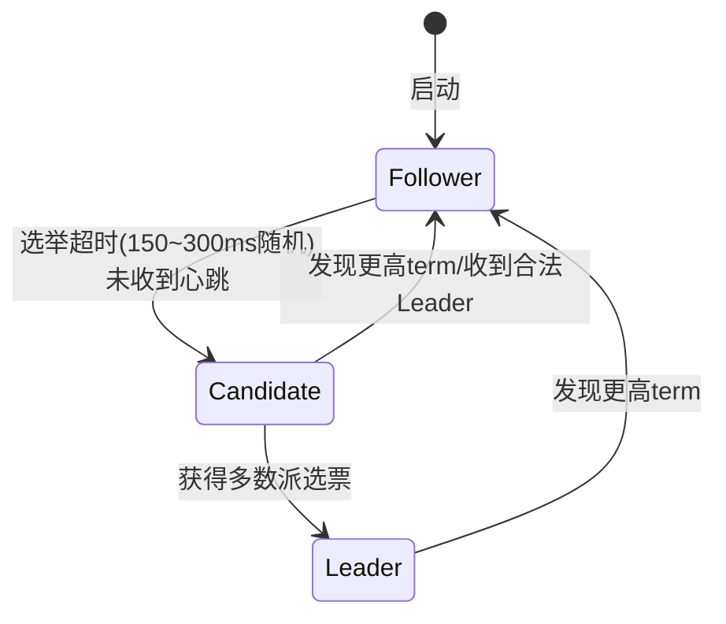
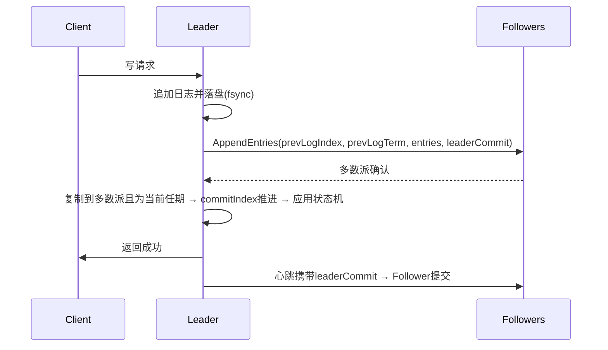

# Raft 算法详解：从协议到工程（etcd 视角）

> 属于 S8 分布式理论 · 第二篇
> 上一篇：[CAP 与 BASE](./CAP与BASE理论)　下一篇：[面试题集](./面试题集)

Raft 是当前工程界事实标准的共识算法（etcd、Consul、TiKV、MongoDB 副本集、CockroachDB 均基于它或其变体）。本篇按「定位 → 协议 → 选举 → 复制 → 安全 → 变更 → 快照 → 读优化 → 工程实现」展开，末尾带故障场景与面试追问。

## 一、定位：Raft 解决什么问题

**复制状态机（RSM）**：所有节点从相同初始状态出发，按相同顺序执行相同命令日志，得到相同状态。共识算法要保证的是**日志一致**——只要日志一致，状态机必然一致。

Raft 与 Paxos 的取舍：

| | Paxos | Raft |
|---|---|---|
| 目标 | 理论正确性 | **可理解 + 可工程实现** |
| 结构 | 对称、无强领导者 | **强领导者模型**：所有写走 Leader |
| 子问题 | 未分解（multi-paxos 无统一规范） | 分解为：**选举、日志复制、安全性** |
| 成员变更 | 论文未完整定义 | 单节点变更 / 联合共识，明确可落地 |
| 结论 | 学术奠基 | **工程事实标准** |

## 二、角色、任期与状态

### 2.1 三态转换



**任期（term）**：单调递增的逻辑时钟。每次 RPC 都携带 term；接收方若发现对方 term 更大，**立即转为 Follower 并更新自己的 term**——这是"旧 Leader 失效"的唯一判定机制。

### 2.2 状态变量

| 类别 | 变量 | 说明 |
|------|------|------|
| 持久化 | `currentTerm` | 防过期投票/过期请求 |
| 持久化 | `votedFor` | 本任期投给谁；**每任期一票** |
| 持久化 | `log[]` | 日志条目 `(term, index, command)` |
| 易失 | `commitIndex` | 已提交（可应用）的最大 index |
| 易失 | `lastApplied` | 已应用的最大 index |
| Leader 专属 | `nextIndex[]` / `matchIndex[]` | 每个 Follower 的复制进度 |

## 三、RPC 协议

| RPC | 参数 | 行为 |
|-----|------|------|
| **RequestVote** | `term, candidateId, lastLogIndex, lastLogTerm` | 投票：term 不落后、本任期未投、候选人日志不旧 → 赞成 |
| **AppendEntries** | `term, leaderId, prevLogIndex, prevLogTerm, entries[], leaderCommit` | 日志复制 + 心跳（`entries` 为空即心跳）；先做一致性检查再追加 |
| **InstallSnapshot** | `term, leaderId, lastIncludedIndex, lastIncludedTerm, data` | 日志差距过大时用快照追赶 |

### 3.1 一致性检查（Log Matching 的机制保证）

Follower 收到 AppendEntries：

1. `term < currentTerm` → 拒绝。
2. 本地 `prevLogIndex` 位置的日志 **term ≠ prevLogTerm** → 拒绝（返回冲突 term 与冲突 index，供 Leader 批量回退）。
3. 匹配 → 若已有冲突条目则**覆盖**，追加新条目，落盘。
4. `leaderCommit > commitIndex` → `commitIndex = min(leaderCommit, 最后一条匹配日志的 index)`，应用可提交日志。

## 四、Leader 选举

### 4.1 触发与流程

Follower 在**随机选举超时（150~300ms）**内未收到心跳 → `term+1`、转 Candidate、投自己、并行广播 RequestVote。获得**多数派（N/2+1）**选票 → 成为 Leader，**立即发送心跳**重置所有 Follower 的超时。

### 4.2 投票三规则（背）

1. **任期检查**：`RequestVote.term < currentTerm` 拒绝。
2. **每任期一票**：`votedFor` 已投他人则拒绝（多数派互斥的前提）。
3. **选举限制（日志新旧）**：候选人 `lastLogTerm` 大于本地，或相同 term 下 `lastLogIndex` 更大 → 才投。**保证当选 Leader 日志至少包含所有已提交日志**（Leader Completeness）。

### 4.3 为什么随机超时

多个 Candidate 同时发起 → 选票分裂，无人获多数 → 死循环。随机化使超时错开，几乎总有一个先发难并获胜，快速收敛。**心跳间隔必须远小于选举超时**（如 100ms vs 150~300ms），否则 Leader 会被频繁误判。

### 4.4 防脑裂（为什么不会有两个 Leader）

- 每任期一票 → 一个任期最多一个 Leader 能拿到多数。
- 被分区的旧 Leader 不足多数 → 其 AppendEntries 永远无法被多数确认 → **无法提交新日志**，即使自我感觉良好也造不成已提交日志分叉。
- 两个多数派必有交集 → 冲突日志在复制阶段被覆盖。

### 4.5 Pre-Vote（工程扩展，etcd 默认开启）

场景：被分区的节点 term 落后，恢复后以高 term 发起选举会打断正常 Leader。Pre-Vote：先发"预投票"（不 +1、不改 votedFor），确认自己与多数派可通信且日志不旧，才正式选举。避免**term 暴涨**与可用性抖动。

## 五、日志复制与提交规则

### 5.1 写路径时序



### 5.2 提交规则（全算法最易错的点）

> **条目被提交 ⟺ 复制到多数派（含 Leader 自己）且属于 Leader 当前任期。**

**为什么旧任期条目不能直接提交**（必考）：

场景：term 3 的 Leader 把 term 2 的条目 `x` 复制到了节点 A、B（多数），**还没复制任何自己任期的条目**就崩溃。此时 `x` 算提交吗？——**不算**。

term 4 的新 Leader 可能由 C、D 选出，而 C、D 上**没有 `x`**（选举限制只保证"新 Leader 日志不旧于投票者"，不保证包含所有条目）。若此时提交 `x`，新 Leader 日志缺 `x` → 状态机分叉。

**正确做法**：新 Leader 先提交**自己任期**的一条日志（可为空/业务日志），自己任期条目一旦提交，**之前所有条目连带提交**，之后才返回旧条目的执行结果。

### 5.3 冲突覆盖

Leader 从不删改自己的日志；Follower 冲突条目一律被 Leader 覆盖。回退优化：Follower 拒绝时返回「冲突 term + 该 term 的第一个 index」，Leader 直接回退到该 term 之前，避免逐条回退。

## 六、安全性：五个性质 + 证明思路

| 性质 | 内容 | 由什么保证 |
|------|------|-----------|
| Election Safety | 每任期最多一个 Leader | 每任期一票 + 多数派互斥 |
| Leader Append-Only | Leader 只追加不覆盖 | 协议设计 |
| Log Matching | index i 的 term 相同 → [1,i] 全部相同 | 一致性检查 + 覆盖 |
| **Leader Completeness** | **已提交日志必存在于未来所有 Leader** | 选举限制（投票时比日志新旧） |
| State Machine Safety | 同一 index 不会应用不同日志 | 前四条推出 |

**Leader Completeness 证明（矛盾法，背结构）**：假设 term T 的 Leader B 当选但缺已提交条目 `e`。`e` 已提交 → 存在含 `e` 的多数派 R₁；B 当选 → 存在投 B 的多数派 R₂。R₁ ∩ R₂ ≠ ∅，取节点 X：X 含 `e` 且投了 B。X 投票的前提是 **B 日志不旧于 X**（选举限制）→ B 必然也含 `e`，矛盾。故已提交日志不丢失。

## 七、成员变更

**直接切换配置的危险**：旧配置多数派 {A,B}、新配置多数派 {C,D} 不相交 → 双 Leader 同时提交。

| 方案 | 机制 | 采用者 |
|------|------|--------|
| **联合共识** | 过渡配置 `C_old ∪ C_new`，提交需**旧多数 + 新多数**同时确认 | Raft 论文 |
| **单节点变更** | 一次只增/减一个节点，新旧多数派必有交集 | **etcd 工程标准** |

**新节点加入流程**：新节点日志为空，直接参与投票会反复拒绝 AppendEntries 拖慢集群 → **先以无投票权身份追赶日志，追上后再加入配置**。

## 八、快照与日志压缩

- 日志无限增长 → 定期对状态机做快照，记录 `lastIncludedIndex/lastIncludedTerm`，之前的日志可删。
- 落后 Follower 用 **InstallSnapshot** 直接拿快照，避免逐条补日志。
- 收到快照：丢弃本地更早的冲突日志，应用快照，`lastApplied` 推进到 `lastIncludedIndex`。
- 边界注意：快照不含完整日志，**不能基于快照做 AppendEntries 连续性校验**。

## 九、线性一致读

| 方案 | 做法 | 代价 |
|------|------|------|
| 走日志读 | 读作为日志提交 | 正确但慢（一次 fsync + 多数派） |
| **ReadIndex** | Leader 与多数派确认身份 → 记录 commitIndex → 本地追平后读 | 无 fsync，etcd 默认 |
| **Lease 读** | 选举超时内视为租约有效，直接本地读 | 省 RTT，**依赖时钟同步**，漂移极端可能读旧 |

## 十、工程实现：etcd-raft（Go）

### 10.1 库与应用的边界

etcd-raft 把**网络、存储、状态机**完全交给应用，库只做共识决策。核心接口：

```go
// 应用侧循环（伪代码）
for {
    select {
    case <-ticker.C:
        n.Tick()                       // 驱动选举/心跳超时
    case prop := <-proposeC:
        n.Propose(ctx, prop)           // 提交提案（写请求）
    }
    rd := n.Ready()                    // 一次取回待处理项
    storage.Save(rd.HardState, rd.Entries) // ① 先落盘：term/vote/log
    for _, m := range rd.Messages {
        transport.Send(m)              // ② 后发送 RPC
    }
    if !raft.IsEmptySnap(rd.Snapshot) {
        storage.ApplySnapshot(rd.Snapshot)
    }
    for _, e := range rd.CommittedEntries {
        applyToStateMachine(e)         // ③ 应用已提交日志
    }
    n.Advance()                        // ④ 通知库继续
}
```

**持久化铁律：先落盘、后发送。** 若先把消息发出去而自己没 fsync，崩溃重启后"承诺过"的日志丢失，会破坏安全性质。

### 10.2 性能与故障

| 维度 | 要点 |
|------|------|
| 吞吐 | 受 fsync 频率限制 → **批量追加 + 组提交**（一次 fsync 多条） |
| 延迟 | 受**多数派中最慢节点**限制（等最慢的多数成员确认） |
| 网络 | 对 Follower 流水线/并行复制；心跳与选举超时参数配比（100ms vs 150~300ms） |
| 故障演练 | kill -9、网络分区、时钟跳变、磁盘 fsync 慢——验证不丢已提交日志、分区恢复收敛 |

### 10.3 etcd 全貌

- etcd = Raft 共识层（etcd-raft）+ 存储（bbolt 存快照与 KV）+ HTTP/gRPC 接口。
- **CP 系统**：写需多数派确认，分区时少数派拒绝服务。
- K8s 用它持久化全部集群状态（配置、Service/Deployment 元数据、选主），**etcd 高可用 = 奇数节点 + 多数派存活**（3 节点容忍 1 故障，5 节点容忍 2 故障）。

## 十一、故障场景（怎么排查、怎么答）

| 故障 | 现象 | 机制解释 | 处理 |
|------|------|---------|------|
| Leader 崩溃 | 集群短暂不可写 | Follower 超时 → 选举新 Leader | 等待一个选举周期（秒级），自动恢复 |
| 网络分区（少数派含旧 Leader） | 多数派继续服务；少数派拒绝写 | 旧 Leader 无法获得多数确认 | 恢复后少数派日志被覆盖，数据以多数派为准 |
| 选票分裂 | 长时间无 Leader（term 反复 +1） | 超时未随机化/心跳过密 | 检查选举超时参数；etcd 看 term 是否暴涨 |
| 新节点拖慢集群 | 写延迟升高 | 新节点日志空，反复拒绝 AppendEntries | 先追赶日志再入配置 |
| fsync 慢 | 写延迟飙升 | 组提交被拖慢 | 换 SSD、批量加大、检查磁盘 IO |
| 时钟跳变 | Lease 读返回旧数据 | Lease 依赖时钟同步假设 | 生产谨慎用 Lease 读；ReadIndex 更稳 |

---

## 面试追问

- **问：Raft 最多容忍几个节点故障？** N 节点容忍 (N-1)/2 故障：3 容忍 1、5 容忍 2。必须奇数节点。
- **问：Leader 收到更高 term 的 RequestVote 会怎样？** 立即转为 Follower、更新 term，并可能投票给该候选人（若日志够新）——旧 Leader 让位机制。
- **问：为什么 AppendEntries 要带 prevLogTerm 而不只是 prevLogIndex？** 防止"索引相同但 term 不同"的日志被误认为匹配（不同 Leader 可能在相同 index 写入不同 term 的条目），保证 Log Matching。
- **问：etcd 三节点挂两个会怎样？** 无法凑多数 → 不可写不可选主，只读可能也受限（ReadIndex 需多数派确认）。这就是 K8s 必须保证 etcd 多数存活的原因。
- **问：Go 里怎么基于 etcd-raft 写一个 Raft 服务？** 用 `raft.StartNode` + `MemoryStorage`/`wal`，按 Ready 循环实现"落盘→发消息→应用→Advance"，网络层用 gRPC 转发 `raftpb.Message`。
