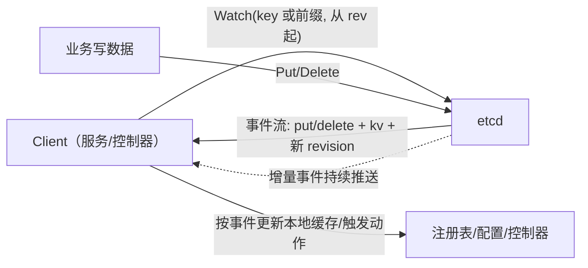
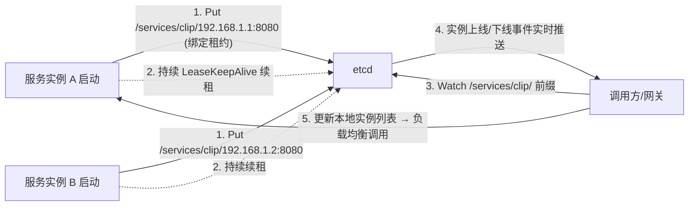

# etcd 详解与工程实践：MVCC / Watch / Lease / 事务 / 分布式锁 / 服务发现

> 属于 S8 分布式理论 · 承上启下篇（Raft 共识层 → etcd 应用层）
> 上一篇：[Raft 算法详解](./Raft算法详解)　下一篇：[选主机制详解](./选主机制详解)

> Raft 解决了"多个副本日志怎么一致"（共识层）；这一篇讲 etcd 在共识层之上**怎么组织成一个可用的分布式协调组件**：KV 存储怎么做版本（MVCC）、变化怎么通知（Watch）、资源怎么自动过期（Lease）、原子条件写怎么做（事务 CAS）——这四件套组合出分布式锁、服务注册发现、选主、配置下发。
>
> 配套训练：[路线专题 Day 8](/路线专题/02-后端与计算机基础#day-8-强化日-etcd-与-rpc-分布式协调与远程调用)（etcd 语义分布式锁练习 + RPC 治理练习）。

## 一、etcd 全景与选型

**一句话**：etcd 是**基于 Raft 共识的强一致分布式 KV 存储**（CP 系统），核心能力是 **KV 读写 + Watch 监听 + Lease 租约 + 事务 CAS**，四大能力组合出分布式锁、服务注册发现、选主、配置下发。K8s 用它持久化**全部集群状态**（API Server 是唯一读写入口）。

**架构全景**：etcd = Raft 共识层（etcd-raft 库：选举/日志复制，见 [Raft 算法详解](./Raft算法详解)）+ 存储层（bbolt 存快照与 KV）+ gRPC 接口（`clientv3` 客户端）。

**选型对比（面试必背）**：

| 维度 | etcd | ZooKeeper | Consul | Redis（锁/注册） |
| --- | --- | --- | --- | --- |
| 一致性 | **CP（Raft）** | CP（ZAB） | CP（Raft） | 偏 AP（主从异步复制） |
| 数据模型 | KV（带 revision 版本） | 树形 ZNode + Watcher | KV + 服务目录 | KV/集合 |
| 租约/会话 | Lease + KeepAlive | Session + 临时节点 | TTL + 健康检查 | TTL（无原生续租语义） |
| 强一致锁 | 原生（clientv3concurrency） | 原生（临时顺序节点） | 支持 | SETNX（有争议） |
| 健康检查 | 需自建（靠租约心跳） | 需自建 | **内置**（HTTP/gRPC 探活） | 无 |
| 适用 | K8s 底座、选主、配置、注册中心 | 老牌大数据协调（HBase/Hadoop） | 服务发现 + 健康检查 | 缓存、性能优先的锁 |

> **面试结论**：锁/选主/配置 → **CP**（etcd/ZK）；服务发现可容忍读到旧列表但不容忍整体不可用 → 生产常选 **AP**（Eureka/自建 + Redis），但用 etcd 做注册中心也完全成立（强一致换更准的列表，代价是 watch 压力，见三、7）。

## 二、四件套核心机制

### 1. MVCC 存储：revision 与历史版本

etcd 不是"覆盖写"，而是**追加写**：每个 key 的每次修改都产生一个新版本（全局单调递增的 **revision**，主版本+子版本），旧版本保留在 bbolt 里。读可以指定 revision 读到**历史快照**（`Get(ctx, key, clientv3.WithRev(n))`）。

- **为什么要 MVCC**：Watch 需要"从某个 revision 开始持续推送"；事务需要基于版本做 CAS（CreateRevision/ModRevision）；
- **代价与清理**：历史版本无限膨胀 → 用 `Compact(rev)` 压缩（删除 ≤ rev 的旧版本），K8s 定期 compact；压缩后太旧的 revision 读会报 ErrCompacted；
- **Delete 也是写**：产生一个 tombstone 版本，Watch 才能感知删除事件。

### 2. Watch 机制：变化通知的"推"模型



**要点（必背）**：
- Watch 是**长连接流式推送**（基于 gRPC 双向流），客户端发起 `Watch(key/前缀, WithPrefix, WithRev(rev))`，etcd 从 rev 开始把增量事件推给客户端；
- **事件类型**：PUT / DELETE（含 CreateRevision、ModRevision、版本号）；
- 断线重连：客户端用 **Last-Revision + 补偿**（`WithRev(上次最后 revision+1)`）续上，防止丢事件（漏了会错过注册变更！）；
- **watch 风暴**（真实高并发问题）：大量客户端 watch 同一个**大前缀**（如注册中心所有服务），任何服务上下线都会给所有 watcher 推事件 → 放大流量。解法见三、7。

### 3. Lease 租约：自动过期的核心

- `LeaseGrant(ttl)` 创建租约 → 拿到 leaseID；`Put(key, val, WithLease(leaseID))` 把 key 绑定租约；
- **租约到期 → 绑定的所有 key 自动删除**（etcd 通过心跳检测/时间驱动回收）；
- `LeaseKeepAlive(leaseID)` 持续续租（客户端周期性发 keepalive，ttl 刷新）；keepalive 是**客户端责任**——客户端死了，续租停，key 到期被删。

**这就是分布式锁/服务注册"防死锁"的全部秘密**：持有者崩溃 = 续租停止 = 租约过期 = 锁/注册项自动释放，不需要任何人"手动清理"。

### 4. 事务与 CAS：原子条件写

etcd `Txn` = 一组**条件（If）→ 成功分支（Then）/ 失败分支（Else）**，全部原子执行（线性一致）。条件可用：

- `Compare(Value(key), "=", v)`：当前值等于 v；
- `Compare(CreateRevision(key), "=", 0)`：key **不存在**（创建版本为 0）——分布式锁"原子占坑"的写法；
- `Compare(ModRevision(key), "=", n)`：自上次读没被改过（乐观锁）。

```go
// 分布式锁加锁（clientv3 真实写法，核心一行事务）
txn := cli.Txn(ctx).
    If(clientv3.Compare(clientv3.CreateRevision(lockKey), "=", 0)). // key 不存在
    Then(clientv3.OpPut(lockKey, token, clientv3.WithLease(leaseID))) // 原子写入
ok, err := txn.Commit() // 返回是否走了 Then 分支

// 释放锁（CAS 防误删：只有 token 匹配才删）
txn = cli.Txn(ctx).
    If(clientv3.Compare(clientv3.Value(lockKey), "=", token)).
    Then(clientv3.OpDelete(lockKey))
```

> **对比 Redis**：Redis 用 SETNX + Lua 脚本做同样的事；etcd 的优势是**强一致 + 租约原生续租 + 看得到锁持有者**，代价是吞吐低一个量级——"性能优先可容忍极小概率并发"用 Redis，"必须精确"用 etcd。

## 三、三大工程场景

### 5. 分布式锁：五个必须答对的点

1. **原子占坑**：`Txn(CreateRevision==0) → Put`（或 Redis SETNX），不能"先 Get 再 Set"（非原子，并发全过）；
2. **防误删**：value 存**唯一 token**，释放用 CAS（`Value==token` 才 Delete）——否则 A 超时释放锁，把 B 刚拿到的锁删了；
3. **防死锁**：租约 TTL + 后台 keepalive；持有者崩溃 → 续租停 → 锁自动过期；**注意**锁 TTL 必须大于业务最慢执行时间，否则业务没跑完锁先过期（双执行）——解法是续租看门狗（watchdog）或业务完成前强制续租；
4. **可重入**：同 goroutine 重复加锁要计数（etcd 的 mutex 支持；自研要小心）；
5. **公平性**：etcd 用 revision 排队实现**公平锁**（先到先得），简单"占坑式"锁不保证公平——"抢锁会有惊群（thundering herd），公平锁用排队 + watch 前一节点"。

**生产直接用封装好的 concurrency 包（原理就是上面这套）**：

```go
sess, _ := concurrency.NewSession(cli, concurrency.WithTTL(10)) // 内部：LeaseGrant + 后台 KeepAlive
m := concurrency.NewMutex(sess, "/locks/clip-task")             // 内部：Txn(CreateRevision) 抢锁
if err := m.Lock(ctx); err != nil { /* 处理 */ }
defer m.Unlock(ctx) // 内部：CAS 删除 + 撤销租约
```

### 6. 服务发现与注册中心：register → keepalive → watch



**三步注册 + 两步发现**（面试讲这个流程就够）：
1. **注册**：启动时 `Put(前缀+地址, 元数据, WithLease)`；
2. **续租**：后台 `LeaseKeepAlive`，崩溃/下线租约到期自动摘除（**先注销再停服务**，优雅下线主动 Delete 更快）；
3. **发现**：调用方 `Watch` 前缀维护本地实例列表（**拉取 + 订阅**：先 Get 全量，再 Watch 增量）；
4. **下线**：`Delete(key)` 或租约过期，Watch 收到 delete 事件 → 调用方剔除该实例；
5. 负载均衡在调用方做（见 S4 [治理与稳定性](./../04-microservice/治理与稳定性)）。

### 7. 注册中心的高并发与高可用（watch 风暴）

**场景**：剪辑服务拆成 20 个微服务、每服务 50 实例（共 1000 实例），每个实例启动注册 + 每 TTL 续租，调用方全部 Watch `/services/` 前缀——**实例上下线抖动会把事件放大 N 倍**（watch 风暴）。

**应对（讲 2~3 条即可）**：
1. **分级注册表**：客户端不 watch 全量前缀，而是 watch **自己依赖的那几个服务**的小前缀（粒度化，把事件量降几个量级）；
2. **本地缓存 + 事件补偿**：先 Get 全量快照建缓存，再 Watch 增量；断线重连用 revision 补偿，避免全量重拉；
3. **租约策略**：TTL 与 keepalive 频率权衡（太短 → 网络抖动误摘；太长 → 摘除慢）；实例数量大时提高 TTL、降低 keepalive 频率；
4. **AP 兜底**：注册中心整体不可用的降级——本地缓存列表继续服务 + 直连配置（这就是注册中心选 AP 的理由）；
5. **容量规划**：etcd 单集群建议实例/事件量有上限，超大集群拆多集群（按业务域隔离）。

### 8. K8s 场景与高可用

- K8s 用它持久化全部集群状态（配置、Service/Deployment 元数据、选主），**API Server 是唯一读写 etcd 的组件**，Controller/调度器通过 Watch 拿到期望状态与变更事件——这就是"控制器模式"的底层（RAG 服务做"配置热更新"也是这个套路：Watch 配置 key，变更即重载）；
- **etcd 高可用 = 奇数节点 + 多数派存活**：3 节点容忍挂 1 个，5 节点容忍挂 2 个；挂超半数集群只读不写。etcd 挂了 → 控制面无法变更/自愈（存量业务照跑）。备份 etcd = 集群生命线；
- 注意：**每个写操作都要等多数派落盘（fsync）**——用延迟换强一致（对照 Redis 主从异步复制：用一致换低延迟）。

## 四、面试追问链（etcd 十连问）

1. **etcd 是什么？和 Redis 区别？** 基于 Raft 的强一致 KV（CP），支持 Watch/Lease/事务 CAS；Redis 偏 AP、高性能缓存。etcd 用于选主/锁/配置/注册，Redis 用于缓存/计数器。
2. **Raft 怎么选 Leader？** 随机超时未收到心跳 → term+1 → Candidate 拉票；得多数派票且日志不旧 → Leader；随机超时防选票分裂。
3. **Raft 日志什么时候提交？** 复制到多数派且是当前任期；旧任期日志等新任期条目提交连带提交（防止"已提交日志丢失"）。
4. **etcd 怎么防止脑裂？** 多数派才能当 Leader + term 单调递增，旧 Leader 收到更高 term 立即降级；分区后只有含多数派的半边能提供服务（CP 的代价：少数派拒绝写）。
5. **Watch 是什么？watch 风暴怎么防？** 长连接流式推增量事件；防风暴：watch 小前缀、本地缓存 + revision 补偿、按需订阅。
6. **Lease 租约有什么用？** key 绑租约，到期自动删；keepalive 续租；是分布式锁/服务注册"持有者崩溃自动释放"的机制。
7. **分布式锁怎么实现？** 租约 + Txn(CreateRevision==0) 原子占 key + 后台续租 + 释放时 CAS(Value==token) 删除防误删；租约 TTL > 业务耗时或看门狗续租。
8. **etcd 和 ZooKeeper 区别？** 都 CP；etcd：KV + revision 版本 + Watch + Lease，协议 Raft，K8s 标配；ZK：树形 ZNode + Session 临时节点，协议 ZAB，老牌大数据生态。
9. **注册中心为什么常选 AP 而 etcd 是 CP？** 注册中心容忍读到过期列表（调用失败会重试/剔除）但不容忍整体不可用 → AP 保证可用性；锁/配置/选主必须精确 → CP。
10. **etcd 挂了会怎样？** 3 节点挂 1 没事，挂 2 只读不写；5 节点挂 2 没事，挂 3 挂；K8s 中 etcd 挂 → 控制面无法变更/自愈（存量业务照跑）。备份 etcd = 集群生命线。

---

## 串起来

etcd 的工程全貌 = **Raft 共识层（日志一致）+ 应用层四件套（MVCC 版本、Watch 通知、Lease 过期、事务 CAS）**，四件套组合出三大场景：**分布式锁（租约 + CAS 占坑/释放）、服务注册发现（注册 + 续租 + Watch）、选主（抢同一把带租约的锁）**。K8s 就是这四个能力最大的使用者。

下一篇进入能力强化篇：**选主机制详解**（把"抢带租约的锁"升级为通用选主能力，串起 K8s/Kafka/Milvus）。
