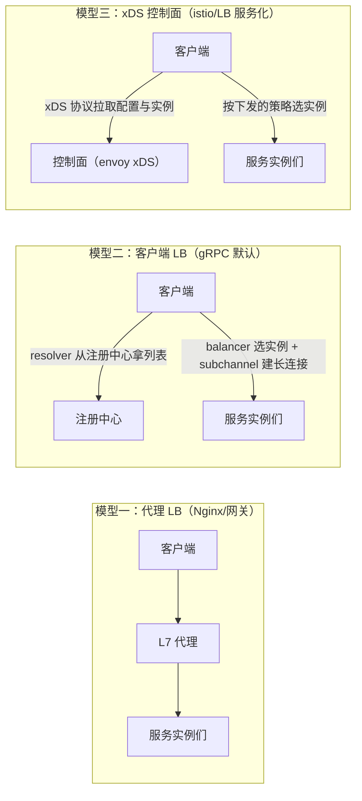
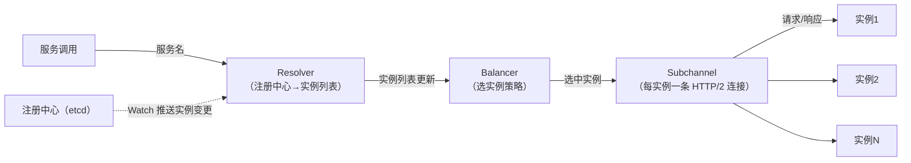

# gRPC 负载均衡详解：长连接时代怎么把流量"分匀"

> 属于 S8 分布式理论 · 能力强化 · 第四篇（导师清单：gRPC 的平衡性）
> 上一篇：[选主机制详解](./选主机制详解)　下一篇：[网络通信与降级方案](./网络通信与降级方案)

> **这篇解决什么问题**：导师清单里的"gRPC 的平衡性"就是**负载均衡**。但 gRPC 的负载均衡和 Nginx/HTTP 完全不同——**gRPC 走 HTTP/2 长连接 + 多路复用，一个连接能承载上千个并发请求，"连接数均衡"根本不等于"流量均衡"**。本篇讲透：为什么 gRPC 需要客户端负载均衡、resolver/balancer/subchannel 三件套怎么工作、每种策略的原理与适用场景、长连接带来的失衡问题（慢启动/粘性/健康检查）、以及 Go 里怎么实现。
>
> 配套训练：[路线专题 Day 8 · 负载均衡速记](/路线专题/02-后端与计算机基础#835-负载均衡) 与 [RPC 客户端治理练习（负载均衡+重试+熔断）](/习题集和答案/route/08_rpc_etcd/02_rpc_retry_balancer/)。

## 一、先立认知：HTTP/2 长连接如何改变负载均衡

### 1.1 传统 HTTP 负载均衡为什么"过时"

HTTP/1.1 时代：一个连接一个请求，**连接数 ≈ 并发请求数**，Nginx 按连接/请求分发就能把流量分匀。

HTTP/2 时代（gRPC 的底座）：**一条连接上多路复用无数请求（stream）**。于是：

- 客户端 A 与后端 X 建了 1 条连接，客户端 B 与后端 Y 建了 1 条连接——连接数一样，但 A 可能同时在发 500 个请求，B 只发 5 个 → **连接均衡 ≠ 流量均衡**；
- Nginx 这类**代理层 LB** 只看到"连接"看不到"连接里的 stream"（除非做 L7 解析，成本高），无法精细分配；
- 更关键：gRPC 客户端**长连接复用**，请求在客户端本地就直接多路复用发出去了，**根本没经过代理**——所以负载均衡必须**下沉到客户端做**。

### 1.2 一句话结论（面试先讲这句）

> **gRPC 的负载均衡在客户端做：每个调用方自己维护一份"可用实例列表"，自己选一个实例，自己维持与每个实例的 HTTP/2 长连接。** 好处是少一跳（不经过代理，延迟低）、无单点（代理挂了不影响）、实例变更实时感知（本地列表跟着注册中心 Watch 更新）。

## 二、三种负载均衡模型



| 模型 | 选路位置 | 优点 | 缺点 | 适用 |
| --- | --- | --- | --- | --- |
| **代理 LB**（Nginx/APISIX/网关） | 集中式代理 | 运维统一、可做限流/鉴权/灰度 | 多一跳延迟、代理是单点/瓶颈、L7 解析成本 | 入口流量（外部 → 内部） |
| **客户端 LB**（gRPC 默认） | 调用方本地 | 少一跳、无单点、实时感知 | 每个客户端都要实现；语言相关 | **服务间调用（内部流量）** |
| **xDS 控制面** | 控制面下发策略，数据面执行 | 策略集中管理 + 客户端执行，兼两者之长 | 引入控制面复杂度 | 服务网格（istio）、大规模治理 |

> **入口流量用代理 LB，内部流量用客户端 LB，规模再大上 xDS**——这是微服务负载均衡的标准答案（与 [S4 架构与 gRPC](./../04-microservice/架构与gRPC) 的服务拆分呼应）。

## 三、gRPC 客户端负载均衡的三件套（grpc-go 视角）

gRPC 把"找到实例"和"选实例"拆成两个可插拔组件：

| 组件 | 职责 | 例子 |
| --- | --- | --- |
| **Resolver**（解析器） | 把"服务名"解析成**实例地址列表**（静态列表 / 注册中心 / DNS） | etcd resolver、consul resolver、dns resolver |
| **Balancer**（均衡器） | 从列表里**选一个实例**处理这次 RPC | pick_first、round_robin、weighted、least_request、ring_hash |
| **Subchannel**（子通道） | 与每个实例的一条 **HTTP/2 连接**（连接池：可复用 + 健康管理） | 自动重连、连接状态上报 |



**工作流程（面试必背）**：

1. 客户端 `grpc.Dial(服务名)` → 触发 **resolver**：从注册中心 Get 全量实例列表 + **Watch 增量**（对应 [etcd 详解与工程实践](./etcd详解与工程实践) 的服务发现）；
2. resolver 把列表推给 **balancer**：balancer 按策略为每个实例建立一个 **subchannel**（HTTP/2 长连接）；
3. 每次 RPC：balancer 按策略选一个 subchannel 发送；
4. 实例上下线：resolver 收到 Watch 事件 → 更新列表 → 新建/销毁 subchannel；
5. 连接断开：subchannel 自动重连（`WaitForReady` 控制是否等待）。

## 四、负载均衡策略：原理、特点、适用场景（核心表）

| 策略 | 原理 | 特点 | 适用 |
| --- | --- | --- | --- |
| **pick_first** | 总是选列表第一个（其余做备胎） | 无均衡，但简单 | 单实例/主备切换 |
| **round_robin** | 轮流选 | 最简单；**不自适应**（慢实例照样分到流量） | 实例规格一致、无状态 |
| **weighted_round_robin** | 按权重轮询 | 按容量/规格分配 | **异构实例**（新老机器混布） |
| **least_request（P2C）** | 随机抽两个，选**当前负载低**的 | **自适应**，生产主流（gRPC 默认思路） | 请求时长不均（长任务/推理服务） |
| **ring_hash / 一致性哈希** | key 哈希到固定实例 | **同一 key 永远打同一实例** | **有状态服务**（会话粘性、缓存亲和） |
| **sticky / 会话亲和** | 同一来源固定同一实例 | 减少重复握手/状态丢失 | 需要会话态的服务 |

> **面试高频对比**：**round_robin vs P2C**——前者"公平但不聪明"，后者"不公平但聪明"：请求有长有短时（AI 推理服务尤其典型，一个视频生成任务可能跑几十秒），轮询会把长任务堆到同一台机器；P2C 随机抽两个比负载，把新请求发给**更闲**的那台，天然避免"慢实例吃更多请求"的恶性循环。

### 4.1 一致性哈希在 gRPC 里怎么用

- 有状态场景：同一 `user_id`/`task_id` 的请求必须打到同一实例（该实例缓存了会话/任务状态）→ 用 key 的哈希选实例；
- 与存储侧的一致性哈希（见 [底层存储与数据同步](./底层存储与数据同步) 5.1）同一思想：**节点增减只影响邻居 key**，粘性不被打乱太多；
- 代价：**热点 key 会打爆固定实例**；实例增减导致 key 迁移（会话要重建）→ 配合"迁移期双写"或"粘性 + 超时回退"。

## 五、长连接下的四大失衡问题（面试深挖点）

### 5.1 连接均衡 ≠ 流量均衡（已在第一节讲过）

同一实例的连接数一样，但每个连接上的 stream 数天差地别。**P2C/least_request 按"在途请求数"选实例，而不是按连接数**——这就是它比轮询更懂 gRPC 的原因。

### 5.2 慢启动（slow start）与预热

新实例刚上线（缓存冷、JIT 未热、连接刚建），如果立刻按全量流量分配，会被**打垮**。对策：

- **权重从 0 渐增**：新实例初始权重小，随着健康时间增长逐步加大（K8s 的 `startupProbe` + readiness 也是同一思路）；
- **优雅上线**：先预热缓存/连接再注册接流量（见 [S4 治理与稳定性](./../04-microservice/治理与稳定性)）。

### 5.3 健康检查：负载均衡的"名单维护"

- gRPC 内置 **health check**（`grpc.health.v1.Health`）：balancer 定期探测实例，**不健康实例从候选列表摘除**，恢复后重新加入；
- 与注册中心的关系：注册中心管"**注册/注销**"（进程级），health check 管"**实例是否真的能接流量**"（业务级）——**两层健康检查都要有**；
- 注意：**不能只看 TCP 通不通**，要检查业务就绪（readiness），否则出现"连接正常但请求全失败"。

### 5.4 死连接与 max connection age

- **死连接**：服务端重启后，客户端旧连接变成半死状态（TCP 层面还连着，但服务端已无处理协程）→ 客户端要能感知：**keepalive ping + 失败重连 + balancer 摘除**；
- **max connection age**：服务端定期**主动断开旧连接**（如每 30 分钟），逼客户端重建——解决"连接上的请求被长期累积导致负载不均/状态陈旧"；
- 面试金句："**长连接不等于永久连接：keepalive 探活 + 定期强制换连，是长连接健康的三板斧。**"

## 六、Go 实现：自定义 resolver 与 balancer

### 6.1 自定义 resolver（对接 etcd 注册中心）

```go
type etcdResolver struct {
    target resolver.Target
    cc     resolver.ClientConn
    wch    clientv3.WatchChan
}

// Build：grpc.Dial 时调用，开始解析
func (r *etcdResolver) Build(target resolver.Target, cc resolver.ClientConn, _ resolver.BuildOptions) (resolver.Resolver, error) {
    r.cc = cc
    // ① 先 Get 全量实例列表
    resp, _ := cli.Get(ctx, prefix, clientv3.WithPrefix())
    addrs := make([]resolver.Address, 0, len(resp.Kvs))
    for _, kv := range resp.Kvs {
        addrs = append(addrs, resolver.Address{Addr: string(kv.Value)})
    }
    cc.UpdateState(resolver.State{Addresses: addrs})
    // ② 再 Watch 增量，实例变更实时刷新
    go r.watch(prefix)
    return r, nil
}

func (r *etcdResolver) watch(prefix string) {
    r.wch = cli.Watch(ctx, prefix, clientv3.WithPrefix())
    for resp := range r.wch {
        for _, ev := range resp.Events {
            switch ev.Type {
            case mvccpb.PUT:    // 实例上线 → 加入列表
            case mvccpb.DELETE: // 实例下线 → 摘除
            }
            r.cc.UpdateState(resolver.State{Addresses: currentList()})
        }
    }
}
```

### 6.2 选择策略（P2C 简版）

```go
// Pick：从两个随机实例中选在途请求更少的一个
func (b *p2cBalancer) Pick(info balancer.PickInfo) (balancer.PickResult, error) {
    scs := b.getReadySubConns()
    if len(scs) == 0 {
        return balancer.PickResult{}, balancer.ErrNoSubConnAvailable
    }
    a, c := scs[rand.Intn(len(scs))], scs[rand.Intn(len(scs))]
    if a.inflight() <= c.inflight() { // 在途请求数少的胜出
        return balancer.PickResult{SubConn: a.sc}, nil
    }
    return balancer.PickResult{SubConn: c.sc}, nil
}
```

> 生产直接用 grpc-go 内置：`grpc.WithDefaultServiceConfig("{\"loadBalancingPolicy\":\"round_robin\"}")`；etcd 官方有 `etcd/clientv3/balancer` 与 `grpcresolver` 集成。**理解三件套 + 能讲 P2C 是面试重点，能手写 resolver 是加分项。**

## 七、与治理组合：负载均衡不是孤立的

负载均衡要和稳定性三件套配合才是完整方案（详见 [网络通信与降级方案](./网络通信与降级方案) 与 [限流与熔断](./限流与熔断)）：

| 治理手段 | 与负载均衡的关系 |
| --- | --- |
| **超时** | 选中的实例慢 → 超时取消，balancer 才知道它"慢"（统计进入 P2C 的负载） |
| **重试** | 选中的实例失败 → 重试时**换一个实例**（重试 ≠ 重打同一台） |
| **熔断** | 实例持续失败 → 熔断器把它从 balancer 候选里摘除（熔断优先于重试） |
| **健康检查** | 名单维护的底座，balancer 只从健康实例里选 |
| **限流** | 客户端侧限流保护下游实例不被重试/风暴打满 |

> 配套代码：[路线专题 Day 8 RPC 客户端治理练习](/习题集和答案/route/08_rpc_etcd/02_rpc_retry_balancer/)（负载均衡 + 重试 + 熔断的完整实现）。

---

## 面试追问

- **问：为什么 gRPC 用客户端负载均衡而 HTTP 用代理？** HTTP/2 长连接多路复用让连接数不代表流量；且 gRPC 请求在客户端本地多路复用，不经代理。客户端 LB 少一跳、无单点、实时感知实例变更。
- **问：round_robin 有什么问题？** 不自适应：慢实例/长任务照样分到流量，导致"慢的越慢"；请求时长不均的场景要用 P2C/least_request。
- **问：resolver 和 balancer 的区别？** resolver 负责"服务名 → 实例列表"（发现），balancer 负责"列表 → 选一个"（选择）；subchannel 负责"与实例的连接管理"。
- **问：长连接下怎么保证不把流量全打到同一台？** 按在途请求数（P2C）而非连接数选实例；配合慢启动（新实例权重渐增）、健康检查（摘除不健康实例）、max connection age（定期换连）。
- **问：一致性哈希策略适合什么？** 有状态服务（同一 key 固定实例）；代价是热点 key 打爆固定实例、节点增减导致 key 迁移。
- **问：服务端重启后客户端还往死连接发请求怎么办？** keepalive ping 探活 + 失败重连 + balancer 摘除 + 服务端 max connection age 主动换连。
