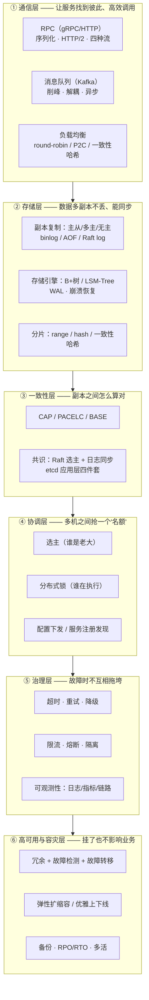

# 分布式系统能力全景：一个系统要"分布"起来，必须具备哪些能力

> 属于 S8 分布式理论 · 能力强化 · 第一篇（导师清单总纲）
> 下一篇：[CAP 与 BASE 理论](./CAP与BASE理论)

> **这篇解决什么问题**：导师给了一份分布式能力清单——**网络通信断了的降级方案、分布式能力、底层的存储、限流熔断、gRPC 的平衡性、底层的中间件、HA 的机制、选主、Raft 数据同步、容灾**。单独看每一条都懂，但面试官真正问的是"你的系统为什么需要这些能力、它们怎么咬合成一个整体"。本篇先把**能力地图**立起来：分布式的本质挑战 → 六大能力层 → 中间件地图 → "能力 × 故障"对照表，后续每一篇详解一个能力。这一篇是总纲，读完你能把清单上的每一项放到系统里该放的位置。

## 一、先想清楚：分布式到底难在哪

单机系统所有"理所当然"的东西，分布式下全都不成立：

| 单机理所当然 | 分布式下的真相 | 催生的能力 |
| --- | --- | --- |
| 内存就是共享的 | 每台机器只有自己的内存 | 通信（RPC/消息） |
| 函数调用不会断 | **网络会断、会慢、会乱序、会重复** | 超时/重试/降级（见[网络通信与降级方案](./网络通信与降级方案)） |
| 磁盘坏了机器就挂了 | 数据要多副本才能不丢 | 复制与底层存储（见[底层存储与数据同步](./底层存储与数据同步)） |
| 一个变量只有一个值 | 多个副本各有各的值 | 一致性（见[CAP 与 BASE](./CAP与BASE理论)） |
| 锁就是 `sync.Mutex` | 多机之间要抢同一个"名额" | 分布式锁/选主（见[选主机制详解](./选主机制详解)） |
| 机器数量固定 | 实例动态扩缩、随时上下线 | 注册发现 + 负载均衡（见[gRPC 负载均衡详解](./gRPC负载均衡详解)） |
| 流量来了硬扛 | 流量可能是 100 倍洪峰 | 限流/熔断/削峰（见[限流与熔断](./限流与熔断)） |
| 挂了就重启 | 重启有延迟，业务不能等 | 高可用（见[高可用机制全景](./高可用机制全景)） |
| 机房不会塌 | 机房会断电、地震、被挖断光缆 | 容灾（见[容灾与备份恢复](./容灾与备份恢复)） |

> **一句话**：分布式的本质是用**一群不可靠的机器（会挂、会慢、会断网）拼出一个可靠的系统**。清单上的每一条能力，都是"某个单机假设被打破"之后的补救。

## 二、能力地图：六大能力层

把导师清单落到一张图上，系统从下往上分六层：

**层次关系（面试怎么讲）**：通信层解决"**怎么连**"，存储层解决"**放哪、放几份**"，一致性层解决"**几份之间怎么算对**"，协调层解决"**多机抢同一个资源**"，治理层解决"**故障和洪峰下怎么活**"，高可用与容灾层解决"**挂了和塌了怎么恢复**"。每一层都依赖下层，面试从下往上推就能把清单串成体系。

## 三、逐层拆解：每一层在干什么、挂靠哪篇文章

### 3.1 通信层：RPC + 消息 + 负载均衡

- **同步调用**用 RPC（微服务默认 gRPC：Protobuf 二进制 + HTTP/2 多路复用，详见 [S4 架构与 gRPC](./../04-microservice/架构与gRPC)）；
- **异步解耦**用消息队列（Kafka：分区副本、ISR、顺序写，详见 [S3 Kafka](./../03-kafka/架构与存储)）；
- **选哪台机器**是负载均衡的活——**gRPC 长连接时代的客户端负载均衡**与 HTTP 时代完全不同，单独成篇：[gRPC 负载均衡详解](./gRPC负载均衡详解)。

### 3.2 存储层：副本 + 引擎 + 分片

- "数据要存多份"是分布式的起点：**复制模型（主从/多主/无主）+ 同步方式（同步/异步/半同步）**决定丢多少数据；
- "多份怎么同步"就是各组件自己的同步日志：MySQL 的 **binlog**、Redis 的 **AOF/RDB**、Kafka 的**分区副本拉取**、etcd 的 **Raft log**、Milvus 的 **WAL**；
- "一份数据怎么组织"是存储引擎：**B+ 树**（关系库）vs **LSM-Tree**（KV 库）；
- "数据太多单机放不下"要**分片**：range 分片、hash 分片、一致性哈希。
- 这一层单独成篇：[底层存储与数据同步](./底层存储与数据同步)。

### 3.3 一致性层：先定"对"的标准，再看共识

- **CAP/PACELC/BASE** 是理论基础：[CAP 与 BASE 理论](./CAP与BASE理论)；
- **Raft** 是工程事实标准的共识算法——**选主 + 日志复制 + 安全性**，[Raft 算法详解](./Raft算法详解)；
- **etcd** 把 Raft 变成可用的协调组件（MVCC/Watch/Lease/事务 CAS），[etcd 详解与工程实践](./etcd详解与工程实践)。

### 3.4 协调层：多机抢同一个"名额"

协调层是分布式里最"套路化"的一层，三个问题用同一套工具（etcd/Redis + 租约 + CAS）解决：

| 问题 | 本质 | 答案 |
| --- | --- | --- |
| **谁是老大**（选主） | 抢唯一 Leader 名额 | 抢同一把带租约的锁 + Watch 接任（[选主机制详解](./选主机制详解)） |
| **谁在执行**（分布式锁） | 抢互斥名额 | 租约 + `Txn(CreateRevision==0)` 占坑 + CAS 释放（[S5 场景题（中）](./../05-high-concurrency/场景题-中)） |
| **谁在哪、配置是什么** | 注册 + 发现 + 下发 | etcd 注册中心 + Watch + Lease（[etcd 详解与工程实践](./etcd详解与工程实践)） |

### 3.5 治理层：故障与洪峰下的生存术

治理层回答"**一个服务出问题，怎么不拖垮整个系统**"：

- **超时**：所有 RPC 必须设超时，否则慢服务拖死调用方；
- **重试**：瞬时故障自动恢复，但必须幂等 + 退避，防重试风暴；
- **降级**：依赖挂了返回兜底值/关非核心功能，保核心链路（[网络通信与降级方案](./网络通信与降级方案)）；
- **限流/熔断**：进不来（限流）和不让打（熔断）两道闸（[限流与熔断](./限流与熔断)）；
- **可观测性**：日志看单点、指标看全局、链路看路径（[S4 治理与稳定性](./../04-microservice/治理与稳定性)）。

### 3.6 高可用与容灾层：挂了、塌了怎么办

- **高可用**（节点级故障）：冗余 + 故障检测 + 故障转移，详见 [高可用机制全景](./高可用机制全景)；
- **容灾**（机房/地域级灾难）：备份 + 异地多活 + 恢复演练，详见 [容灾与备份恢复](./容灾与备份恢复)。

## 四、中间件地图：导师说的"底层的中间件"是哪些

"底层的中间件"不是某一个东西，而是**支撑分布式能力的那一层基础软件**。一个 AI 剪辑后端（Agent 决策系统，见 [S6 系统设计与串联](./../06-agent-backend/系统设计与串联)）里出现的中间件：

| 中间件 | 能力归属 | 在系统里干什么 | 对应章节 |
| --- | --- | --- | --- |
| **缓存**（Redis） | 存储层/性能 | 热点数据、分布式锁、限流计数、布隆过滤 | [S2 Redis](./../02-redis/数据结构底层) |
| **消息队列**（Kafka） | 通信层/异步 | 任务削峰（剪辑任务投递）、事件解耦、最终一致 | [S3 Kafka](./../03-kafka/架构与存储) |
| **注册中心/配置中心**（etcd/Consul/Nacos） | 协调层 | 服务发现、配置热更新、选主、分布式锁 | [S8 etcd](./etcd详解与工程实践) |
| **网关/API 层**（Nginx/APISIX/BFF） | 通信层入口 | 统一入口、鉴权、多级限流的第一级、灰度 | [S4 微服务](./../04-microservice/单体拆分与边界设计) |
| **调度/任务中间件** | 协调层 | 定时任务不重复执行（选主）、工作流编排 | [选主机制详解](./选主机制详解) |
| **数据库**（MySQL） | 存储层 | 业务强一致数据的最终落点 | [S1 MySQL](./../01-mysql/存储引擎与B+树) |
| **对象存储**（MinIO/S3） | 存储层 | 海量素材（视频/图片）的存放 | [S9 对象存储](./../09-object-storage/为什么需要对象存储) |
| **向量数据库**（Milvus） | 存储层 | AI 应用的语义检索底座 | [S10 Milvus](./../10-milvus/02-Milvus架构与核心概念) |

> **背中间件地图的口诀**：**Redis 管缓存与计数、Kafka 管削峰与异步、etcd 管协调（注册/选主/锁/配置）、MySQL 管强一致数据、对象存储管素材、Milvus 管向量**。面试被问"你们系统有哪些中间件、为什么"，按"每个中间件解决哪一层能力的哪个问题"答，而不是罗列名字。

## 五、能力 × 故障对照表：每种能力防什么

面试官深挖的口头禅是"**如果 X 挂了**"。把清单反过来——**每种故障由哪条能力兜底**：

| 故障 | 破坏了什么 | 靠什么能力兜底 | 详细篇目 |
| --- | --- | --- | --- |
| 网络分区/丢包/高延迟 | 调用失败、变慢 | 超时 + 重试 + 熔断 + 降级 | [网络通信与降级方案](./网络通信与降级方案) |
| 单机磁盘损坏 | 数据丢失 | 多副本复制 + WAL + 备份 | [底层存储与数据同步](./底层存储与数据同步)、[容灾与备份恢复](./容灾与备份恢复) |
| 主节点宕机 | 写入中断 | 选主 + 故障转移（HA） | [选主机制详解](./选主机制详解)、[高可用机制全景](./高可用机制全景) |
| 流量洪峰 | 系统被打垮 | 限流 + 削峰 + 弹性扩缩容 | [限流与熔断](./限流与熔断) |
| 下游持续故障 | 级联雪崩 | 熔断 + 隔离 + 降级 | [限流与熔断](./限流与熔断) |
| 实例动态上下线 | 调用打到死实例 | 注册发现 + 负载均衡 + 健康检查 | [gRPC 负载均衡详解](./gRPC负载均衡详解) |
| 机房断电/光缆被挖 | 整个机房不可用 | 容灾（异地备份/多活） | [容灾与备份恢复](./容灾与备份恢复) |
| 多副本数据分叉 | 读到错误数据 | 一致性协议（Raft/Quorum） | [CAP 与 BASE](./CAP与BASE理论)、[Raft 算法详解](./Raft算法详解) |

## 六、怎么用这张地图学习（学习路径）

1. **先立骨架**：记住六层能力 + 中间件地图（本篇）；
2. **再补理论**：CAP/BASE → Raft → etcd（已有三篇）；
3. **再攻能力**：底层存储 → 选主 → gRPC 负载均衡 → 网络降级 → 限流熔断 → 高可用 → 容灾（本篇之后的七篇）；
4. **最后收口**：S8 面试题集；
5. **对照训练**：[路线专题 Day 8](/路线专题/02-后端与计算机基础#day-8-强化日-etcd-与-rpc-分布式协调与远程调用) 的 etcd/RPC 强化日与本系列一一对应，[第二阶段 · 分布式系统面试详解](/第二阶段-知识详解/分布式系统面试详解) 是背诵版。

---

## 面试追问

- **问：分布式系统最核心的挑战是什么？** 网络不可靠（分区/延迟/丢失）+ 节点不可靠（宕机/慢）+ 时钟不可靠（漂移）。所有能力都是这三类不可靠性的补救。
- **问：你负责的系统用了哪些中间件，各自解决什么？** 按中间件地图答：Redis 缓存与计数、Kafka 削峰异步、etcd 注册/选主/锁/配置、MySQL 强一致、对象存储放素材、Milvus 做向量检索——每一样对应一层能力。
- **问：这些能力之间是什么关系？** 分层咬合：通信让服务连起来，存储让数据多份不丢，一致性让多份之间算对，协调让多机抢同一个名额，治理让故障不扩散，高可用与容灾让挂了塌了都能恢复。面试讲系统设计时按这个层次往上推，比零散列点更能体现体系感。
