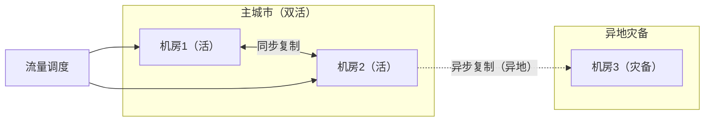

# 容灾与备份恢复：机房塌了，数据还在吗

> 属于 S8 分布式理论 · 能力强化 · 第八篇（导师清单：容灾，本系列收口篇）
> 上一篇：[高可用机制全景](./高可用机制全景)　下一篇：[面试题集](./面试题集)

> **这篇解决什么问题**：导师清单最后一条"容灾"——**高可用防"节点挂了"，容灾防"机房/城市级灾难"**（断电、火灾、地震、光缆被挖）。本篇讲清容灾的完整体系：**RPO/RTO 两个数字怎么定 → 备份体系（全量/增量、物理/逻辑、异地）→ 容灾架构（同城双活/两地三中心/三地五中心）→ 数据同步级别与 RPO 的对应 → 切换/回切/演练 → 案例推演**。面试里容灾问得少但问起来就是"你有没有全局观"——能讲出"高可用 vs 容灾"的分层和"RPO/RTO 权衡"就算过关。

## 一、先分清：高可用 vs 容灾（必背）

| 维度 | 高可用（HA） | 容灾（DR） |
| --- | --- | --- |
| 防什么 | **节点级故障**：机器挂、进程挂、磁盘坏 | **地域级灾难**：机房断电、火灾、光缆断 |
| 手段 | 冗余 + 故障检测 + 故障转移（[上一篇](./高可用机制全景)） | 备份 + 异地副本 + 多活 + 恢复演练 |
| 副本位置 | **同机房/同集群** | **跨机房/跨城市** |
| 恢复时间 | 秒~分钟级 | 分钟~小时级 |
| 关键指标 | MTTR（恢复快不快） | **RPO/RTO**（丢多少、多久恢复） |

> **面试金句**："**高可用是'机房内的故障转移'，容灾是'机房级别的逃生预案'。** 同机房多副本在高可用层面很强，但机房塌了所有副本一起没——所以容灾必须跨地域，而跨地域意味着数据同步距离变远、延迟变高，这就是 RPO/RTO 权衡的来源。"

## 二、两个数字：RPO 与 RTO（核心概念，必背）

| 指标 | 全称 | 含义 | 举例 |
| --- | --- | --- | --- |
| **RPO** | Recovery Point Objective | **允许丢多少数据**（回退到哪个时间点） | RPO=10 分钟：最多丢最近 10 分钟的写入 |
| **RTO** | Recovery Time Objective | **多久恢复服务** | RTO=1 小时：灾难后 1 小时内恢复对外服务 |


**权衡（面试重点）**：RPO 越小 → 数据同步越频繁/越实时 → 成本越高、跨地域同步延迟压力越大；RTO 越小 → 备用系统越"热" → 成本越高。**RPO/RTO 是花钱买来的，按业务定，不是技术指标而是商业指标**：

| 业务 | RPO | RTO | 方案 |
| --- | --- | --- | --- |
| 银行核心账务 | ≈0 | 分钟级 | 同城双活 + 同步复制 |
| 电商订单 | 秒~分钟级 | 分钟级 | 异步复制 + 快速切换 |
| 日志/分析 | 小时级 | 小时级 | 定期备份即可 |
| 素材库（AI 剪辑） | 分钟级 | 分钟级 | 对象存储跨区域复制（见 [S9 对象存储](./../09-object-storage/架构与核心机制)） |

## 三、备份体系：容灾的"底牌"

> **副本 ≠ 备份**：副本防"机器挂"（自动转移），备份防"逻辑灾难"——**误删、误更新、代码 bug 批量改数据、勒索病毒**。副本会把"错误"也复制过去，备份（带时间点的）能回滚到错误之前。**任何系统都要有备份，且备份要和副本分开存放。**

### 3.1 备份类型

| 维度 | 类型 | 说明 |
| --- | --- | --- |
| 数据范围 | **全量备份** / **增量备份**（自上次备份后的变化）/ **差异备份**（自上次全量后的变化） | 全量 + 增量是标配 |
| 备份方式 | **物理备份**（复制数据文件，如 MySQL 冷备、RDB）/ **逻辑备份**（导出 SQL/数据，如 mysqldump） | 物理快、恢复快；逻辑跨版本兼容 |
| 时间点 | 快照 / binlog/AOF 连续日志 | **全量 + 日志**可恢复到任意时间点（PITR） |

### 3.2 备份策略（生产标准）

```text
① 每天全量备份（低峰期）
② 持续/定期增量备份（binlog/AOF/WAL 归档）
③ 备份异地存放（不同机房/对象存储跨区域，见 S9）
④ 定期恢复演练（备份能不能用，只有"恢复过"才知道）
⑤ 备份加密 + 访问控制（防泄露/防勒索）
```

**PITR（Point-In-Time Recovery，按时间点恢复）**：全量备份 + 备份点之后的 binlog/AOF → 重放到指定时刻 → 把"误删的数据"找回来。这是容灾恢复里最值钱的能力。

### 3.3 备份的故障边界（面试深挖）

| 场景 | 问题 | 处理 |
| --- | --- | --- |
| **备份从未验证** | 恢复时才发现备份损坏/不完整 | **定期恢复演练**（在测试环境真实恢复一遍），容灾三件套之一 |
| 备份与副本同机房 | 机房塌了备份也没了 | **备份异地存放**（跨机房/跨区域） |
| 备份太频繁 | 成本高、影响主库性能 | 全量低频 + 日志高频；物理备份替代逻辑备份 |
| 误删数据窗口 | 全量备份之前的增量被覆盖 | 日志（binlog/AOF）保留周期 ≥ 全量周期 |

## 四、容灾架构：从同城双活到三地五中心

### 4.1 三种主流架构（必背对比表）

| 架构 | 布局 | 数据同步 | RPO/RTO | 成本 | 说明 |
| --- | --- | --- | --- | --- | --- |
| **同城双活** | 同一城市两个机房，都提供服务 | 同步/半同步复制 | RPO≈0，RTO 分钟级 | 中 | 防机房级故障（断电/光缆），**不防城市级** |
| **两地三中心** | 主城市 2 个机房（双活）+ 异地 1 个机房（灾备） | 主城同步，异地异步 | 主城故障 RPO≈0/RTO 分钟级；城市级灾难 RPO 分钟级/RTO 小时级 | 高 | **国内大厂标配**（字节/阿里/腾讯均此模型） |
| **三地五中心** | 三个城市五个机房，多活 | 跨地域同步 | 更低 RPO/RTO | 极高 | 银行/顶级互联网，防城市级灾难 |



### 4.2 数据同步级别决定 RPO（与高可用同源）

| 同步级别 | 距离 | RPO | 场景 |
| --- | --- | --- | --- |
| 同步复制 | 同城（延迟低） | ≈0 | 同城双活 |
| 半同步 | 同城 | 极小 | 同城双活/两地三中心主城 |
| **异步复制** | 跨地域（延迟高） | 秒~分钟级 | **异地灾备只能用异步**——跨地域同步复制延迟/带宽撑不住 |

> **面试必背一句**："**同步复制决定 RPO，但受距离限制——同城可以同步，异地只能异步，所以'两地三中心'的异地那台 RPO 天然大于 0（分钟级），这是物理定律不是工程缺陷。**"（对照 [S1 MySQL 主从复制](./../01-mysql/主从复制与高可用) 的同步方式）

### 4.3 应用层多活：不只是"数据在异地"

容灾 ≠ 只有数据备份，**应用要能切过去**：

- **流量调度**：DNS/GSLB（全局负载均衡）/ 网关按地域切流；
- **无状态应用**：多地域各部署一套，靠 LB 调度（无状态化红利，见[上一篇](./高可用机制全景)）；
- **有状态数据**：主数据在同步，应用切流后读写落到灾备库；
- **幂等与对账**：切换过程可能产生重复/乱序请求，靠幂等 + 对账兜底（[S5 一致性与故障边界](./../05-high-concurrency/一致性与故障边界)）。

## 五、容灾切换与回切：演练才是真容灾

### 5.1 切换流程（标准五步）

```text
① 决策：确认灾难范围（机房断电？城市级？）→ 按预案定 RPO/RTO 目标
② 拉起：灾备环境启动应用、加载数据（或直接切到双活的另一半）
③ 切流：DNS/网关把流量切到灾备
④ 验证：核心链路健康检查（读写、依赖、监控）
⑤ 公告：对外告知（降级/维护说明）
```

### 5.2 回切：最容易被忽视的坑

- **回切 ≠ 切回去就行**：灾备期间产生的新数据要**反向同步**回主站，否则回切丢数据；
- 流程：主站修复 → **增量反向追平** → 校验对账 → 切回 → 验证；
- 面试金句："**容灾演练不止练'切过去'，更要练'切回来'——回切的数据反向同步和一致性校验才是最容易翻车的地方。**"

### 5.3 混沌工程与演练（进阶加分项）

| 手段 | 做法 | 目的 |
| --- | --- | --- |
| **故障演练** | 定期在测试/预发环境 kill -9、断网、断电 | 验证 HA/容灾预案真的有效 |
| **混沌工程**（Chaos Engineering） | 在生产随机注入故障（延迟、丢包、杀进程） | 找出系统在真实故障下的薄弱点（Netflix Chaos Monkey） |
| **红蓝对抗/压测** | 模拟洪峰 + 故障同时发生 | 验证降级 + 容灾叠加场景 |

> **核心认知**："**容灾不是'写文档'，是'练出来的'——没演练过的容灾预案等于没有。**"

## 六、案例推演：机房断电（面试场景题模板）

**场景**：主机房突然断电，预计 4 小时恢复，系统为"同城双活 + 异地灾备"。

**推演**（按五步答）：
1. **确认**：监控告警 → 确认主城双机房全断（如果只有一个断，切另一个即可，RPO≈0）；
2. **决策**：城市级故障 → 启动异地灾备，接受 **RPO=分钟级**（异步复制的窗口）与 **RTO=小时级**；
3. **切流**：GSLB 把流量切到异地机房；应用启动、加载数据；
4. **降级配合**：容灾期间可降级非核心功能（[网络通信与降级方案](./网络通信与降级方案)），保核心读写；
5. **验证与公告**：核心链路跑通后放量，对外公告；
6. **回切**：主城恢复 → 数据**反向追平** → 对账校验 → 切回 → 演练复盘。

---

## 串起来（本系列收口）

**S8 能力强化系列至此闭环**：从[能力全景](./分布式系统能力全景)立骨架，到[存储](./底层存储与数据同步)、[选主](./选主机制详解)、[负载均衡](./gRPC负载均衡详解)、[网络降级](./网络通信与降级方案)、[限流熔断](./限流与熔断)、[高可用](./高可用机制全景)、[容灾](./容灾与备份恢复)——导师清单上的每一条都有归宿。**最后的格局一句话：通信让系统连起来（降级让断了也能活），存储让数据不丢（多副本 + 备份），一致性让多份算对（Raft），协调让多机有序（选主），治理让故障不扩散（限流熔断降级），高可用让挂了能换（冗余 + 转移），容灾让塌了能起（异地 + 恢复）**。下一篇是 S8 收口的[面试题集](./面试题集)。

---

## 面试追问

- **问：RPO 和 RTO 的区别？** RPO 允许丢多少数据（回退点），RTO 多久恢复（恢复时长）；一个管数据、一个管时间，都是花钱买来的商业指标。
- **问：副本能替代备份吗？** 不能——副本防机器故障，备份防逻辑灾难（误删/误改/bug 批量写）；副本会把错误复制走，备份能回到错误前。备份还要异地存放、定期演练。
- **问：为什么异地只能用异步复制？** 跨地域延迟高，同步复制会拖垮写路径；异步复制 RPO 分钟级是物理代价。
- **问：两地三中心怎么工作？** 主城双活同步复制（防机房级），异地灾备异步复制（防城市级）；主城故障切同城，城市级灾难切异地。
- **问：容灾演练为什么重要？** 没演练过的预案在真实灾难时会卡在"第一步都不知道怎么走"；演练验证备份可用性、切换流程、回切的反向同步与对账。
