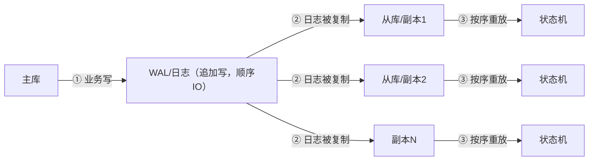
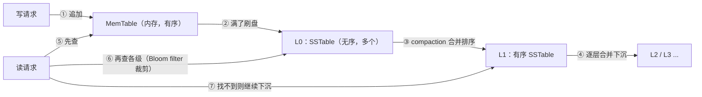
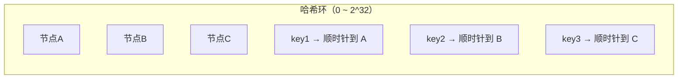

# 底层存储与数据同步：副本、日志与存储引擎

> 属于 S8 分布式理论 · 能力强化 · 第二篇（导师清单：底层的存储）
> 上一篇：[CAP 与 BASE 理论](./CAP与BASE理论)　下一篇：[Raft 算法详解](./Raft算法详解)

> **这篇解决什么问题**：导师清单里的"底层的存储"不是"怎么建表、怎么写 SQL"，而是**分布式数据落盘与同步的底层机制**：数据为什么要存多份、多份之间靠什么同步（binlog/AOF/Raft log）、崩溃了凭什么不丢（WAL）、数据在磁盘上长什么样（B+ 树 vs LSM-Tree）、单机放不下了怎么分片（一致性哈希）。这是理解 Raft、etcd、Kafka、Milvus 的**共同地基**——它们的数据同步都是"复制日志"，只是日志形态不同。

## 一、副本：分布式存储的第一性原理

### 1.1 为什么要副本

磁盘会坏、机器会挂、机房会断电。**单份数据 = 单点故障 = 数据必然可能丢**。所以分布式存储的第一条铁律：**数据至少存 N 份（副本）**。

但副本带来新问题：**多份之间怎么保持一致？** 这引出了复制模型和一致性（见 [CAP 与 BASE](./CAP与BASE理论)）。注意：副本解决的是"机器/磁盘故障不丢"，**解决不了"机房级灾难"**——那是[容灾](./容灾与备份恢复)的活（副本在同一个机房内，机房塌了副本一起没）。

### 1.2 三种复制模型

| 模型 | 谁可写 | 典型 | 优点 | 缺点 |
| --- | --- | --- | --- | --- |
| **主从（单主）** | 只有主可写，从只读 | MySQL 主从、Redis 主从、Kafka 分区 | 无写冲突，实现简单 | 主是写单点；主挂有切换窗口 |
| **多主** | 多个主都可写 | MySQL 双主、CouchDB | 写不集中 | **写冲突**：两边同时改同一行怎么合并 |
| **无主** | 任意副本可写 | Cassandra、Dynamo | 写可用性最高 | 冲突合并最复杂（LWW/版本向量，见 [S5 一致性与故障边界](./../05-high-concurrency/一致性与故障边界) 3.3） |

### 1.3 同步方式决定"丢多少数据"

| 同步方式 | 主写流程 | 主挂时丢多少 | 定性 |
| --- | --- | --- | --- |
| **异步复制** | 主写本地即返回，后台同步到从 | **丢"已返回成功但未同步"的所有写**，窗口 = 主从延迟 | AP |
| **半同步** | 主写本地 + 等**至少一个从**确认才返回 | 已提交写不丢（有从持有日志）；从全挂/超时会降级回异步 | 近 CP |
| **全同步（多数派）** | 主写本地 + 等**多数派**确认才返回 | 已提交写不丢 | CP（Raft 即此） |

> **一句话**：**同步粒度 = 一致性强度 = 写延迟 = 丢数据窗口**，四者绑定。Raft/etcd 选"多数派同步"（见 [Raft 算法详解](./Raft算法详解)），Kafka 用 ISR（`acks=all` + `min.insync.replicas`，见 [S3 Kafka 可靠性与积压](./../03-kafka/可靠性与积压)），MySQL 生产用半同步（见 [S1 主从复制与高可用](./../01-mysql/主从复制与高可用)）。

## 二、数据同步机制：一切同步的本质是"复制日志"

### 2.1 核心洞察（必背）

> **分布式数据同步的本质：不复制"数据本身"，而是复制"产生数据的日志"。** 从库拿到日志，按相同顺序重放，就能得到相同的数据。

为什么复制日志而不是复制数据？① 日志是**追加写**，顺序 IO，快；② 日志带**顺序号**，能断点续传、能对账；③ 主从只要重放同一份日志，**状态机必然收敛**（这就是 Raft 复制状态机思想的通用版本，见 [Raft 算法详解](./Raft算法详解)）。

### 2.2 各组件"同步什么"对照表（面试直接背）

| 组件 | 同步的日志 | 日志内容 | 重放效果 |
| --- | --- | --- | --- |
| MySQL 主从 | **binlog** | 行变更/语句 | 从库重放得到相同数据 |
| MySQL InnoDB 崩溃恢复 | **redo log（WAL）** | 物理页变更 | 崩溃后重放恢复已提交事务 |
| Redis 持久化 | **AOF** | 写命令序列 | 重启重放恢复数据 |
| Kafka 分区副本 | **分区日志（segment）** | 消息序列 | Follower 从 leader 拉取追平 |
| etcd/MongoDB/TiKV | **Raft log** | 状态机命令序列 | 所有节点按序执行得到相同状态 |
| Milvus | **WAL + 消息日志** | 写入操作 | 存算分离下数据节点同步（见 [S10 写入链路](./../10-milvus/03-Collection设计与数据写入)） |



### 2.3 同步链路的可靠性

复制日志的链路同样会断：**断点续传（从库记 position/offset）、校验（日志有 CRC）、对账（比对主从数据）**。这三个词就是 [S5 一致性与故障边界](./../05-high-concurrency/一致性与故障边界) 里"最终一致四件套"的存储侧版本。面试金句：**"任何同步链路都必须有对账，否则静默丢数据没人知道。"**

## 三、WAL：崩溃恢复的命根子

### 3.1 为什么先写日志（Write-Ahead Logging）

**问题**：修改内存/数据页时机器崩溃，改了一半怎么办？

**WAL 的思想**：**数据落盘之前，先把"我要做什么"追加写到日志并 fsync**。崩溃后重放日志即可恢复，不需要把数据页刷盘作为提交前提。

```text
① 事务修改内存页
② 先追加写 redo log 并 fsync（此时事务算"提交"）
③ 之后内存页再刷盘（可以慢慢来，由后台线程做）
④ 崩溃恢复：扫描 redo log，重放未刷盘的修改
```

**收益**：① 提交只等一次顺序写日志（快），数据页刷盘是随机写（慢）——**用"先记日志"把提交延迟从随机写降到顺序写**；② 崩溃后不丢已提交数据。

> 对比记忆：MySQL 的 **redo log**（物理页变更，崩溃恢复用）、**binlog**（逻辑变更，主从复制用）是两个东西，两阶段提交保证二者一致（见 [S1 存储引擎与 B+ 树](./../01-mysql/存储引擎与B+树)）。etcd-raft 的"先落盘 HardState/Entries、后发送消息"也是同一逻辑（见 [Raft 算法详解](./Raft算法详解) 10.1）。

### 3.2 fsync 与组提交

- **fsync** 是让日志真正落盘的系统调用，代价昂贵（一次 fsync 约 1~10ms 量级）；
- **组提交（group commit）**：把多个事务的日志**攒一批一起 fsync**，一次 fsync 服务 N 个事务，吞吐翻倍——MySQL、etcd-raft、RocksDB 都有；
- 面试点：**"Raft 吞吐为什么受 fsync 限制？→ 每个日志都要落盘确认；解法是批量 + 组提交。"**

## 四、存储引擎：数据在磁盘上长什么样

> 导师清单的"底层的存储"还有一半是**引擎**：同一份数据，用不同结构组织，读写下限完全不同。两种主流：**B+ 树**（关系库）与 **LSM-Tree**（KV 库）。

### 4.1 B+ 树 vs LSM-Tree（必背对比表）

| 维度 | B+ 树（InnoDB） | LSM-Tree（RocksDB/LevelDB/bbolt 变体） |
| --- | --- | --- |
| 写路径 | 就地更新页（随机写） | **只追加 MemTable → 刷成 SSTable（顺序写）** |
| 写放大 | 低（就地改） | 高（compaction 反复合并） |
| 读路径 | 树查找，路径短 | 多级 SSTable 都要查（读放大）→ 靠 Bloom filter + 层级裁剪 |
| 空间放大 | 低 | 中（旧版本未合并完） |
| 适合 | **读多写少、事务性强**（关系库） | **写多读少、KV 场景**（日志型/时序/缓存落盘） |
| 典型 | MySQL InnoDB | RocksDB（TiKV/CockroachDB）、LevelDB、etcd bbolt（B+树变体） |

> **一句话**：**B+ 树牺牲写换读，LSM 牺牲读换写**。生产选型看读写比：账务系统选 B+ 树（强事务），写入密集的日志/时序/KV 选 LSM。

### 4.2 LSM 的分层合并（mermaid）



- **MemTable**：内存里的有序结构（跳表），写直接进内存；
- **SSTable**：落盘的有序文件，**不可变**，只能合并；
- **compaction**：后台把多层 SSTable 合并去重——代价是**写放大**（一份数据被反复写多次），收益是读路径变短；
- **Bloom filter**：先过滤"肯定不存在"的层，避免每层都查（空间换时间）。

### 4.3 三个放大（面试高频）

| 放大 | 定义 | 谁更严重 |
| --- | --- | --- |
| **写放大** | 实际写盘量 / 逻辑写入量 | LSM 严重（compaction 反复重写） |
| **读放大** | 实际读盘次数 / 逻辑读次数 | LSM 严重（多级都要查） |
| **空间放大** | 磁盘占用 / 有效数据量 | LSM 中等（旧版本未清） |

> 面试回答模板：**"我们用了 RocksDB 是因为写多读少；代价是写放大，靠分层 compaction 参数（level 数、每层大小比）权衡；读路径用 Bloom filter 裁剪。"**

## 五、分片：单机放不下了怎么办

副本解决"不丢"，**分片（sharding）解决"放不下/扛不住"**。两种基本分片：

| 分片方式 | 规则 | 优点 | 缺点 |
| --- | --- | --- | --- |
| **Range 分片** | 按 key 区间（如 user_id 0~1000 去节点 A） | 范围查询友好、天然有序 | **热点**（如最新的 user_id 全打到一个节点） |
| **Hash 分片** | `hash(key) % N` | 数据均匀、无热点 | 范围查询要广播；扩容要全量重哈希 |

### 5.1 一致性哈希：扩容不搬全量

**问题**：`hash(key) % N` 在节点数 N 变化时，**几乎所有 key 的映射都变了** → 全量数据迁移。

**一致性哈希**：把节点和 key 都 hash 到**同一个环**上，key 顺时针找第一个节点：



- 增删节点时，**只有该节点顺时针方向的邻居 key 需要迁移**，其他不动；
- **问题**：节点少时分布不均（一个节点占一大段）→ 引入**虚拟节点**：每个物理节点映射多个虚拟位置，分布更均匀；
- 应用：Redis Cluster 的 16384 个 slot（hash 分片 + slot 迁移）、Cassandra 的 token ring、对象存储的元数据路由（见 [S9 对象存储](./../09-object-storage/架构与核心机制)）。

### 5.2 分片的三大联动问题（面试深挖）

1. **跨片查询**：分片后 JOIN/聚合变难 → 设计时按"查询维度"选分片键（同 user 的数据进同片）；
2. **热点**：hash 分片下"单个爆款 key"仍可能打爆一个节点 → 热点 key 加随机后缀拆散；
3. **扩容**：一致性哈希只解决"迁移量"，迁移本身要**双写 + 校验 + 切流**（先追平再切，见 [S5 场景题（下）](./../05-high-concurrency/场景题-下) 海量数据扩容）。

---

## 串起来

**底层的存储 = 三个问题的答案**：**存几份**（副本模型 + 同步方式）→ **怎么同步**（复制日志 + WAL）→ **怎么组织**（B+ 树 / LSM-Tree / 分片）。这套东西是所有存储型中间件的公共底座：**etcd 的 Raft log 是"日志同步"的极致形态（多数派确认），Kafka 的分区副本是"日志复制"的吞吐形态（ISR 追平），Milvus 的 WAL 是"日志先行"的存算分离形态**。下一篇讲日志同步的**共识版**——Raft 怎么保证多副本日志完全一致。

---

## 面试追问

- **问：数据同步为什么不直接复制数据，而要复制日志？** 日志是追加写（顺序 IO 快）、带顺序号（可断点续传/对账）、重放即收敛（复制状态机思想）。直接复制数据做不到"增量 + 断点 + 校验"。
- **问：WAL 为什么能防数据丢失？** 提交前先把日志 fsync 落盘；崩溃后重放日志恢复。代价是提交延迟 = 一次顺序写 fsync，用组提交摊薄。
- **问：B+ 树和 LSM-Tree 怎么选？** 读多写少、强事务 → B+ 树；写多读少、KV → LSM。权衡写放大/读放大/空间放大三个指标。
- **问：一致性哈希解决什么问题？有什么缺点？** 解决扩容时"全量重哈希"；缺点是小节点数分布不均 → 虚拟节点；仍要处理热点 key 和迁移期双写。
- **问：主从异步复制挂主丢多少数据？半同步呢？多数派呢？** 异步丢"延迟窗口内未同步的已提交写"；半同步丢"从确认前的写"（正常不丢，降级时丢）；多数派确认不丢已提交写（见 [S5 一致性与故障边界](./../05-high-concurrency/一致性与故障边界) 4.1）。
