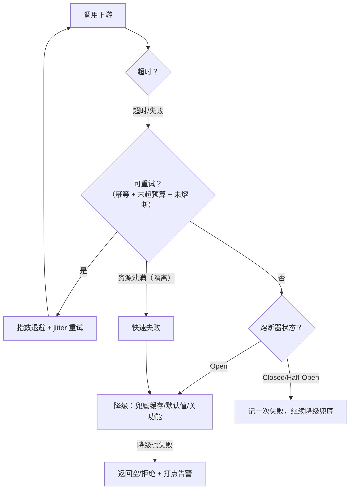

# 网络通信与降级方案：断网、慢网下，系统怎么活下去

> 属于 S8 分布式理论 · 能力强化 · 第五篇（导师清单：网络通信断了的降级方案）
> 上一篇：[gRPC 负载均衡详解](./gRPC负载均衡详解)　下一篇：[限流与熔断](./限流与熔断)

> **这篇解决什么问题**：导师清单里最实战的一条——**"网络通信断了"怎么办**。网络是分布式系统里最不可靠的组件：会断、会慢、会乱序、会重复。本篇把降级方案讲成一个**完整的防御体系**：先看清网络故障长什么样（故障模型）→ 第一道防线超时（不让故障扩散）→ 第二道防线重试（自动恢复瞬时故障）→ 第三道防线降级（依赖挂了给兜底）→ 第四道防线隔离（舱壁，不让一个依赖拖垮全局）→ 最后与熔断配合（[下一篇](./限流与熔断)专讲）。核心认知：**降级不是"出事后救火"，而是"设计时就预留的逃生通道"。**

## 一、网络故障模型：先定义"断了"是什么

| 故障 | 表现 | 特征 |
| --- | --- | --- |
| **延迟升高** | 请求变慢但能通 | 最常见；比"断"更难处理（超时判断难） |
| **丢包/超时** | 请求无响应 | 可能重发后成功（**瞬时故障**，重试有效） |
| **乱序/重复** | 响应顺序错、请求被重发 | 靠幂等 + 序列号解决 |
| **连接挂起**（半开） | TCP 连着但无响应 | 靠 keepalive 探活（见 [gRPC 负载均衡详解](./gRPC负载均衡详解) 5.4） |
| **网络分区** | 部分节点互相不可达，各自活着 | 最阴险：**节点分不清"自己断网了"还是"别人挂了"**（见 [S5 一致性与故障边界](./../05-high-concurrency/一致性与故障边界) 二） |

> **面试必背一句**："**网络故障的可怕之处在于：'挂没挂'本身就不可知。** 你只能通过超时和心跳去猜，而猜测必然有误差——所以防御体系必须容忍'猜错'（误判熔断、误判下线），而不是追求'猜准'。"

## 二、第一道防线：超时（没有超时的调用 = 定时炸弹）

### 2.1 为什么必须设超时

一个慢下游会**占满调用方的连接/线程/goroutine**：假设下游从 50ms 变 5s，调用方 1000 个并发槽位全被占住 → 新请求进不来 → 调用方自己"被拖死" → 它的调用方再被拖死 → **级联雪崩**。超时是切断这条链的**第一刀**。

### 2.2 三层超时（背这个结构）

| 层 | 超时 | 作用 |
| --- | --- | --- |
| 连接超时 | `DialTimeout` | 建连不无限等 |
| 请求超时 | `PerRPCTimeout` | 单次调用不无限等 |
| **总超时（deadline）** | 整个调用链的**预算** | 上游定总预算，逐层递减 |

### 2.3 全链路超时传播（gRPC/Go 的正确姿势）

**核心原则：父超时 - 已耗时 = 剩余，不足即放弃。** 用 Context 从入口一路传下去，任何一层都能感知"总预算还剩多少"：

```go
// 入口：用户请求分配 2s 总预算
ctx, cancel := context.WithTimeout(r.Context(), 2*time.Second)
defer cancel()

// 第一跳：gRPC 自动把 deadline 传播给下游（grpc-timeout 头）
resp, err := clipClient.Generate(ctx, req) // 下游看到还剩 2s

// 下游处理到 800ms 后调再下游：
//   ctx 剩余 = 2s - 800ms = 1.2s，gRPC 自动透传剩余预算
//   再下游即使没有自己的超时设置，也会在总预算到期时被取消
```

- gRPC 的 deadline 传播是**协议级**的（`grpc-timeout` 元数据头），Java 的 `propagate`、Go 的 `context` 同理；
- **不要每层都设独立超时然后加起来**（每层 500ms × 5 层 = 2.5s 失控）；要**单一总预算逐层递减**；
- 超时怎么定：看下游的 **P99 延迟**（不是平均值）——`超时 ≈ 下游 P99 × 系数（如 3~5 倍）`，既覆盖绝大多数慢请求，又不让异常慢请求拖住系统。

## 三、第二道防线：重试（自动恢复瞬时故障）

### 3.1 重试的前提：只重试幂等请求

**重试会把"执行一次"变成"执行多次"**：下单接口重试 = 重复下单。所以铁律：**只对幂等请求重试**（查询、幂等键保护的写）。非幂等请求的重试要带幂等键（见 [S5 场景题（中）](./../05-high-concurrency/场景题-中) 接口幂等）。

### 3.2 退避策略：指数退避 + jitter（必背）

**问题**：失败时所有客户端同时重试 → 重试风暴（羊群效应）。

```text
① 简单重试：失败后立刻重试 N 次 —— 风暴（全都在同一时刻打）
② 指数退避：第 n 次重试等 base × 2^n（1s、2s、4s……）—— 错开但仍可能同步
③ 指数退避 + jitter：等 (base × 2^n) ± 随机抖动 —— 打散，生产标准
```

```go
// 指数退避 + 抖动（gRPC 默认策略的简化版）
delay := base * time.Duration(1<<attempt) // 1s, 2s, 4s...
delay += time.Duration(rand.Int63n(int64(delay))) // 加 jitter 打散
time.Sleep(delay)
```

### 3.3 重试风暴：最典型的事故（背这个数字案例）

> **场景**：QPS 10 万，下游 1% 超时，每个请求重试 3 次 → 下游实际承受 ≈ 10 万 × (1 + 3×1%) ≈ **10.3 万 → 算上重试放大甚至 40 万 QPS**（如果退避不当全挤在同一时刻）→ 下游被打挂 → 更多人重试 → 雪崩。

**防重试风暴五条（背）**：① 只重试幂等；② 指数退避 + jitter；③ 限总次数（如最多 3 次）；④ **熔断优先于重试**（Open 了就别再打，见[下一篇](./限流与熔断)）；⑤ 全链路超时预算（总预算快用完就不重试）。

### 3.4 重试预算（retry budget，进阶）

服务网格（istio）里的成熟做法：**重试次数受"总请求的百分比"限制**（如重试流量 ≤ 总流量的 20%），从机制上防止重试流量反噬。面试提这一句是加分项。

## 四、第三道防线：降级（核心，导师清单点题）

### 4.1 降级的定义与分类

> **降级 = 依赖故障/压力过大时，主动放弃一部分功能或精度，保住核心链路。** 和熔断的区别：熔断是"**不让打**"（被动防护），降级是"**换一种方式服务**"（主动取舍）——通常熔断触发后，接住请求的就是降级逻辑。

| 分类维度 | 类型 | 例子 |
| --- | --- | --- |
| 按触发方式 | **静态降级**（写死兜底）/ **动态降级**（开关控制） | 开关在配置中心下发，可随时开/关 |
| 按降级对象 | **读降级**（返回缓存/默认值）/ **写降级**（拦截写、进 MQ 缓冲） | 详情页读缓存、下单改异步 |
| 按范围 | **功能降级**（关非核心功能）/ **数据降级**（用旧数据） | 推荐位关掉、用昨日数据 |

### 4.2 降级手段清单（面试能说出 5 种以上）

| 手段 | 做法 | 适用 |
| --- | --- | --- |
| **返回兜底缓存** | 依赖挂了 → 读本地/Redis 缓存（哪怕是旧数据） | 读多场景（详情页、Feed） |
| **返回默认值** | 依赖挂了 → 返回空列表/默认配置 | 非关键数据（推荐、榜单） |
| **关闭非核心功能** | 把推荐、热搜、个性化降掉，只留搜索/下单 | 大促、洪峰 |
| **异步化/削峰** | 写请求进 MQ，慢慢消费（牺牲实时性） | 写高峰（秒杀下单） |
| **Mock/桩服务** | 依赖故障时切到桩实现（返回固定结果） | 联调环境、依赖开发中 |
| **拒绝对非核心调用方**（限流变体） | 保核心调用方，拒绝低优先级 | 多租户、多调用方 |
| **降级数据源** | MySQL 挂了切只读从库/本地文件 | 读路径 |

### 4.3 降级开关：动态降级的工程实现

**降级必须是可开关的，不能只靠代码里写死**（改代码发版太慢）。标准做法：


- 关键点：**开关状态放本地缓存**（不能每次都查配置中心，否则配置中心挂了全挂——这也是 [etcd 详解与工程实践](./etcd详解与工程实践) watch 风暴那节的实践）；
- 降级要有**分级**：一级降级（关推荐）、二级降级（关个性化）、三级降级（只保留读）——从轻到重，逐级触发；
- **降级要能自动恢复**：依赖恢复后自动切回（健康检查 + 开关联动）。

### 4.4 降级的故障边界（面试深挖）

| 场景 | 现象 | 处理 |
| --- | --- | --- |
| 兜底缓存也没了 | 无数据可返回 | 返回空 + 打点告警（宁可空，不阻塞） |
| 配置中心挂了 | 降级开关状态无法更新 | **本地缓存最后一份配置**继续生效；配置中心恢复后补偿（AP 兜底，见 [S5 一致性与故障边界](./../05-high-concurrency/一致性与故障边界) 4.5） |
| 降级误触发 | 好好的功能被降了 | 降级要打**详细日志 + 指标**（降级次数、降级时长），可观测才能复盘 |
| 降级后流量转移 | 核心链路被降级流量打爆 | 降级接口也要限流（见[下一篇](./限流与熔断)） |

## 五、第四道防线：隔离（舱壁模式 Bulkhead）

**问题**：一个慢依赖占满所有资源，其他依赖也跟着遭殃。

**舱壁思想**（来自船舶：船舱分隔，一处进水不沉船）：**给每个依赖/下游分配独立的资源池**（线程池/信号量/连接池），A 依赖吃光自己的池子，不影响 B 依赖。

| 隔离方式 | 原理 | 例子 |
| --- | --- | --- |
| **线程池隔离** | 每个下游一组线程 | 经典 Hystrix 思路：clip-service 一组线程，auth-service 一组 |
| **信号量隔离** | 不占线程，只限制并发数 | 轻量：请求进来先抢信号量，抢不到快速失败 |
| **连接池隔离** | 每个下游独立连接池 | gRPC subchannel 天然按实例隔离连接（见 [gRPC 负载均衡详解](./gRPC负载均衡详解)） |
| **故障域隔离** | 物理/逻辑上分隔（不同机房、不同集群） | 核心链路与旁路分集群（见[高可用机制全景](./高可用机制全景)） |

> **面试金句**："**线程池隔离用资源换隔离，信号量隔离用快速失败换轻量。** 高并发下信号量 + 超时 + 快速失败是性价比最高的组合（不消耗线程，失败立即返回）。"

## 六、四道防线如何配合（完整链路图）



**一句话总结**：**超时定上限 → 重试救瞬时 → 熔断止放大（下一篇）→ 降级给兜底 → 隔离防扩散**。五件事是一个整体，单独上任何一个都不够。

---

## 串起来

网络降级的本质是**把"不可靠的网络"变成"可预期的行为"**：超时把"无限等待"变成"有限等待"，重试把"瞬时失败"变成"自动恢复"，降级把"依赖故障"变成"保底服务"，隔离把"一个依赖的故障"变成"局部故障"。下一篇讲防雪崩的另一半——**限流与熔断**：不让流量进来（限流）和不让请求打向下游（熔断）。

---

## 面试追问

- **问：超时时间怎么定？** 看下游 P99 延迟 × 系数（3~5 倍），而不是平均值；且必须全链路单一预算逐层递减，不能每层独立超时简单相加。
- **问：重试会放大故障吗？** 会——重试风暴。必须：只重试幂等、指数退避 + jitter、限次数、熔断优先、全链路预算。
- **问：降级和熔断什么区别？** 熔断是"不让打下游"（被动，保护下游），降级是"换一种方式服务"（主动，保护自己）；通常熔断触发后由降级逻辑接住请求。
- **问：降级开关放哪？怎么下发？** 配置中心（etcd）下发 + 服务本地缓存 + Watch 更新；分级降级（从轻到重）；自动恢复。
- **问：网络分区时怎么判断"是自己断网还是对方挂了"？** 无法确定——只能靠超时 + 多数派/租约等外部仲裁。这就是为什么 CP 系统要多数派（见 [Raft 算法详解](./Raft算法详解)），注册中心要 AP 兜底（见 [S5 一致性与故障边界](./../05-high-concurrency/一致性与故障边界)）。
